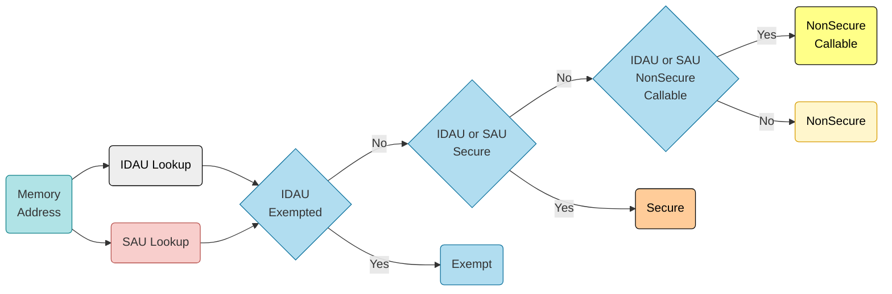
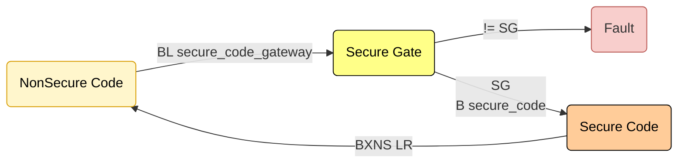
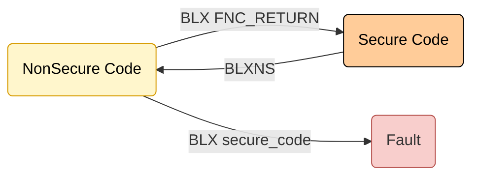
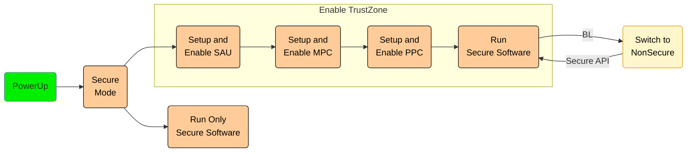

# Security Extension
ARM TrustZone

---
---
# Bibliography
for this section

**Joseph Yiu**, *The Definitive Guide to ARM® Cortex®-M23 and Cortex-M33 Processors* 
   - Chapter 7 - *TrustZone support in the memory system*
     - Section 7.1 - *Overview*
     - Section 7.2 - *SAU and IDAU*
     - Section 7.5 - *Memory protection controller and peripheral protection controller*

**Raspberry Pi Ltd**, *[RP2350 Datasheet](https://datasheets.raspberrypi.com/rp2350/rp2350-datasheet.pdf)*
   - Chapter 10 - *Security*
     - Section 10.2 - *Processor Security Features (Arm)*

---
layout: two-cols-header
---
# Secure Execution Mode

<style>
.two-cols-header {
    grid-template-columns: 2fr 5fr;
}
</style>

::left::

*two execution modes*
- **Secure**
  - unprivileged (user)
  - privileged (supervisor)
- **NonSecure**
  - unprivileged (user)
  - privileged (supervisor)

*memory attributes*
- each bus transfer has an attribute label

*secure gates*

::right::


---
---
# Memory Attributes
each memory region is labeled with one of the attributes

| Type | Symbol | Description | *Transfer* Attribute |
|-|-|-|-|
| *Secure* | **S** | can be accessed only by code running in **secure mode** | secure |
| *Non Secure Callable* | **NSC** | code running in **non-secure mode** can make function calls into it with some restrictions | non-secure |
| *NonSecure* | **NS** | any code running in **any mode** can access it | non-secure |
| *Exempt* | **E** | any code running in **any mode** can access it (with no execution)| *executing code mode* |

> bus transfers are labeled base upon the execution mode and memory attribute

---
---
# Implementation Defined Attribution Unit (IDAU)
hard wired by the microcontroller's manufacturer

<style>
  table {
    font-size: 1em;
    border-collapse: collapse;
  }
  th {
    font-weight: bold;
  }
  td, th {
    padding: 4px; /* Reduce padding */
  }
</style>    

RP2350's IDAU setup

| Start Address | End Address | Region          | Access                                             |
|---------------|-------------|------------------|----------------------------------------------------|
| `0x00000000`  | `0x000042ff`| Arm boot         | Exempt                                             |
| `0x00004300`  | `0x00007dff`| USB/RISC-V boot  | Non-secure (instruction fetch), Exempt (load/store) |
| `0x00007e00`  | `0x00007fff`| BootROM SGs     | Secure and Non-secure-Callable                    |
| `0x10000000`  | `0x1fffffff`| XIP              | Non-secure                                        |
| `0x20000000`  | `0x20081fff`| SRAM             | Non-secure                                        |
| `0x40000000`  | `0x4fffffff`| APB              | Exempt                                             |
| `0x50000000`  | `0x5fffffff`| AHB              | Exempt                                             |
| `0xd0000000`  | `0xdfffffff`| SIO              | Exempt                                             |


---
layout: two-cols
---
# Security Attribution Unit (SAU)
software defined

<style>
.two-columns {
    grid-template-columns: 3fr 2fr;
}
</style>


- allows the definition of maximum 8 *memory regions*
- regions <span v-mark.underline.red>cannot overlap</span>
- regions have access permissions (similar to rwx)

$$ region\_size = 32 \times N $$
$$ base\_address = 32 \times N $$

:: right ::


---
---
# Address Attribute Resolution



Attributes from IDAU and SAU are merged, using the most restrictive.

---
layout: two-cols
---

# The Bus
secured

<style>
.two-columns {
    grid-template-columns: 2fr 5fr;
}
</style>

<v-clicks>

1. **Memory Controller** asks for data transfer or instruction fetch
2. **IDAU** and **SAU** determine the access attributes
3. **External Bus Routes** the request
   1. **MPC** for RAM or Flash
   2. Secure Aware Peripheral
   3. **PPC** for Non Secure Aware peripherals


</v-clicks>

:: right ::


---
layout: two-cols-header
---
# Memory Protection Controller (MPC)

::left::

**optional** - depends on vendor

<v-clicks>

RAM and Flash are aliased - they both appear at two different addresses
- one alias defined (in IDAU and SAU) as **NonSecure**
- one alias defined as **Secure**

RAM and Flash are split in pages
- usually 256 B or 512 B
- each page is defined as **NonSecure** or **Secure**

The two aliases have <span v-mark.underline.red>page holes</span> in them.

</v-clicks>

::right::


---
---
# Peripheral Protection Unit
protects peripherals that are not *secure aware*

**optional** - depends on vendor

Each peripheral is marked as **NonSecure** or **Secure**.
- this includes interrupts that are fired

*may be implemented similar to the MPC*

<div align="right">

</div>

---
---
# Switching modes
Calling *Secure API* from Non Secure code

<v-clicks>

- **Secure** code's compiler defines a *secure gateway entry* point in **NonSecure Callable** memory for every function that can be called from **Non Secure**
- **NonSecure** code calls the *secure gateway entry* point for the API
  - the instruction there has to be `SG`
  - the next instruction is the call to the actual API function
- **Secure** code returns using the `BXNS` instruction

</v-clicks>



---
---
# Switching modes
Calling *NonSecure functions* from Secure code

<v-clicks>

- **Secure** code calls the **Non Secure** function using `BLXNS`
  - the processor stacks the return address (linked address) and jumps to the function
- **NonSecure** code returns using the `BX FNC_RETURN` instruction
  - `FNC_RETURN` is a value in `LR` when the function starts

</v-clicks>


  
---
---
# Secure Execution in Rust
unstable feature, use nightly version

Define a function that can be called from **Non Secure** code

```rust {1|3|4|3,4,5,7|all}
#![feature(cmse_nonsecure_entry)]

#[no_mangle]
#[cmse_nonsecure_entry]
pub extern "C" fn entry_function(v: u32) -> u32 {
    v + 6
}
```

Limitations
- parameters can only be sent via registers, non secure code has no access to the secure stack
- uses C ABI

---
---
# Secure Execution in Rust
unstable feature, use nightly version

Call a **Non Secure** function

```rust {1|4|6,7,8|all}
#![feature(abi_c_cmse_nonsecure_call)]
#![no_std]

unsafe extern "C-cmse-nonsecure-call" non_secure_function(u8, u16, u32) -> f32;

fn run() {
  unsafe { non_secure_function(1, 100, 300) };
}
```

Limitations
- parameters should only be sent via registers, secure code should not access the non-secure stack
- uses C ABI

---
---
# Boot



The processor starts in **Secure** mode

If it enables *SAU* it can switch to **NonSecure** mode