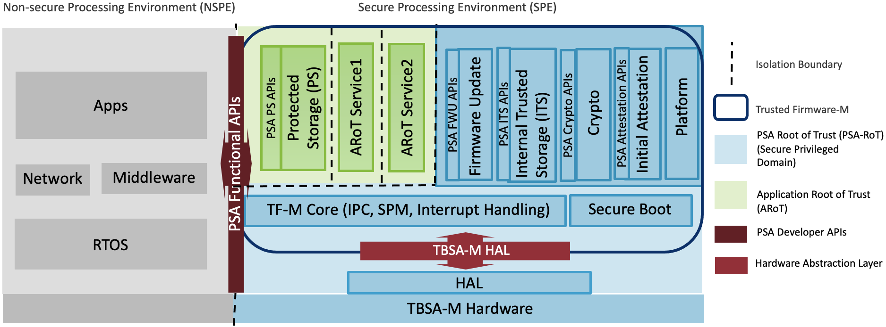
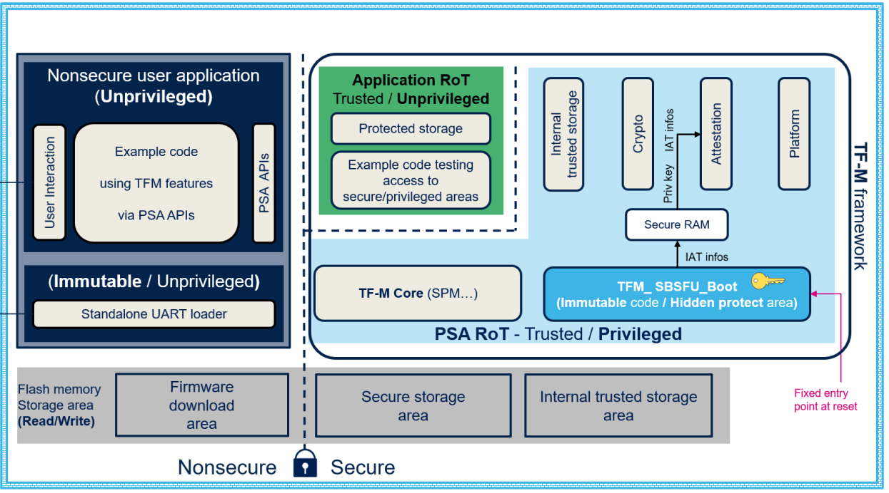
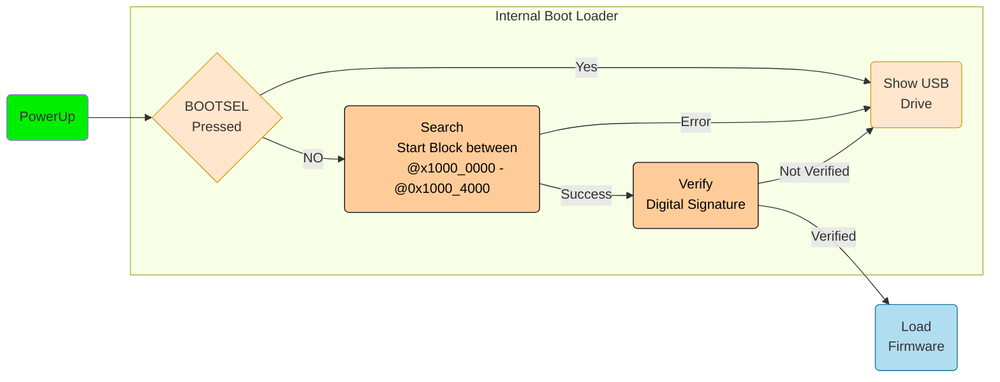
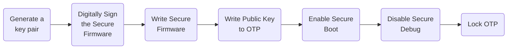

# Trusted Firmware

---
---
# Bibliography
for this section

**Raspberry Pi Ltd**, *[RP2350 Datasheet](https://datasheets.raspberrypi.com/rp2350/rp2350-datasheet.pdf)*
   - Chapter 10 - *Security*
     - Section 10.1 - *Overview (Arm)*
   - Chapter 13 - *OTP*

**ARM**, *[Trusted Firmware-M Documentation](https://trustedfirmware-m.readthedocs.io/en/latest/index.html#)*
  - *Introduction*
  - *Getting Started*
  - *Security*

---
---
# Trusted Firmware-M
what it does

- Secure Boot
- Secure Update
- Secure API

Requires
- ARM microcontrollers that provide TrustZone
- Examples
  - STM32L5, STM32U5
  - RP2350

---
---
# Secure Firmware / Bootloader
provided by the vendor

Depends on the MCU

- implements the TF-M standard (Trusted Firmware - Cortex M)
- certification levels 1 - 3
  - **Level 1**: Software-based isolation; foundational crypto, attestation, and secure boot.
  - **Level 2**: Adds protection against non-invasive attacks.
  - **Level 3**: Adds protection against side-channel and invasive attacks; often requires hardware features like tamper detection and secure key storage.

---
---
# ARM TF-M Reference Implementation
open source

---
---
# STM32 Implementation
Provided in SDK

---
---
# RP2350

- provides a ROM bootloader:
  - Secure Boot
  - Secure Update
  - Try-before-you-by
  - A/B partitioning
  - Rollback

---
layout: two-cols-header
---
# Public Key Infrastructure

::left::

*key pair*
- private key 🔐
- public key 🔓

- algorithms
  - Rivest–Shamir–Adleman (*RSA*)
  - Elliptic Curves (*ECS*)

- hashing function
  - SHA 256

::right::

---
layout: two-cols-header
---
# Digital Signatures
needs a *key pair* (RSA or ECS) and a *hashing algorithm*

::left::

Signing
1. data is **hashed**
2. the **hash** is **encrypted** using the **private key**
3. the **encrypted hash** is added to the data

Verifying
1. data is **hashed**
2. the **encrypted hash** is decrypted using the **public key**
3. hashes are compared

::right::

---
layout: two-cols
---
# Signed Firmware

The firmware contains a digital signature

- `.vector_table`
- `.start_block` and `.end_block`
- `.text` and `.data`

> RP2350 has a bootloader that knows how to securely boot, other chips need custom secure firmware

::right::

---
layout: section
---
# OTP
one time programmable

---
---
# OTP
flash memory that can be programmed only once

- Usually has three lock levels
  - Read/Write - works as normal flash
  - Read Only - works as ROM
  - Inaccessible - cannot be accessed
- The lock is not reversible
- Different vendors have different naming for these levels

---
layout: two-cols-header
---
# Information in OTP

Stores information that:
- should not be modifiable
- should not be read *from the outside* using a debugger or using **Non Secure** software that reads and sends the information

::left::

- Secure Boot Enabled
- Debug in **Secure** mode Enabled
- Debug in **NonSecure** mode Enabled
- Bootloader's public keys
- Bootloader's public keys
- OTP's Pages Lock Level
- OTP's (read) key
- Debug key
- Secure Access Permissions

::right::

---
---
# Provisioning Devices
how to securely provision a new device for production

- Generate a different key pair for every device
   - store the private key securely
- Disabling debugging in secure mode will prevent any debugger from reading the OTP with the stored key
- Locking the OTP will prevent any writes to the key
- Enabling Secure Boot will prevent any unsigned Secure Firmware update
- **NonSecure** debug is still available, but it cannot replace the **Secure** Firmware
- Flashing **NonSecure** firmware is still possible

---
---
# Decommissioning Devices

- Add the capability to the **Secure** firmware to increase the Lock Level to OTP
  - this will render OTP unusable
  - the system will not boot anymore as it cannot read the public keys

- Some OTP memories allow reversing locks:
  - they erase all the OTP
  - they erase the whole Flash

> This prevents reading the keys and secure firmware as secure debug becomes available

---
---
# Use Cases

- POS devices
  - payment software should not be tempered with
- Smart Cards
  - keys should never be read from the device
  - software in these devices should not be tampered with
  - JavaCard (applets are uploadable)