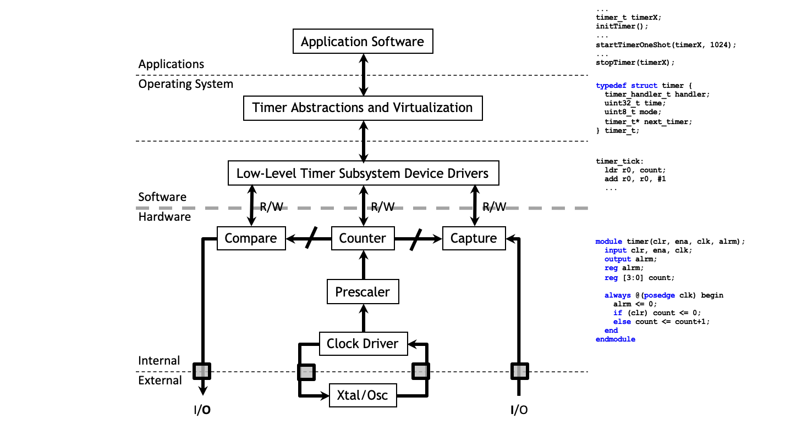
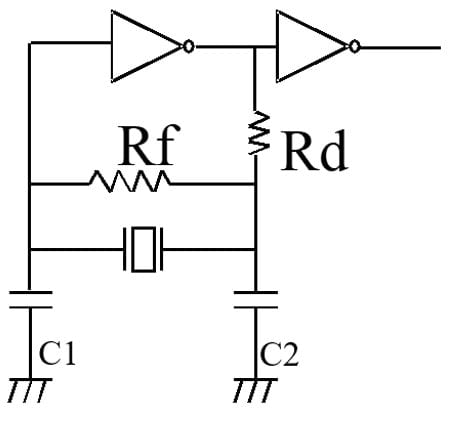
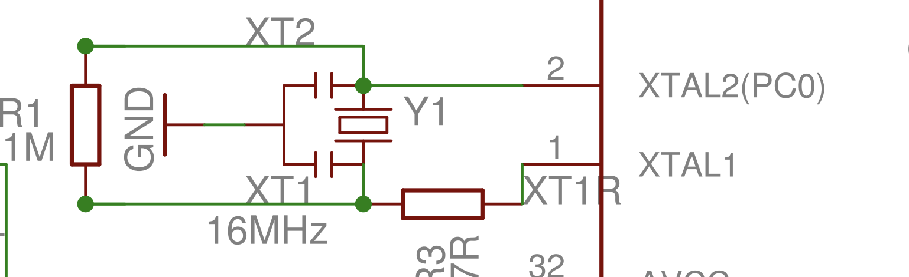
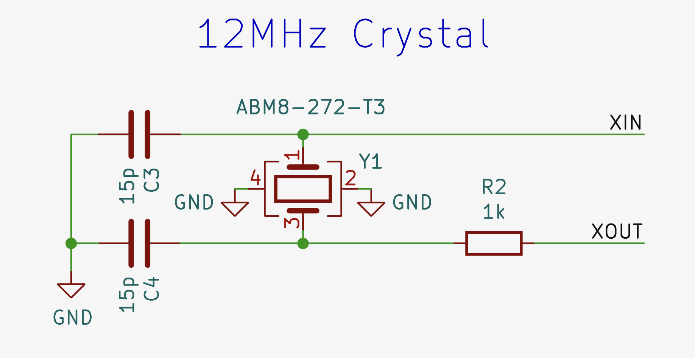
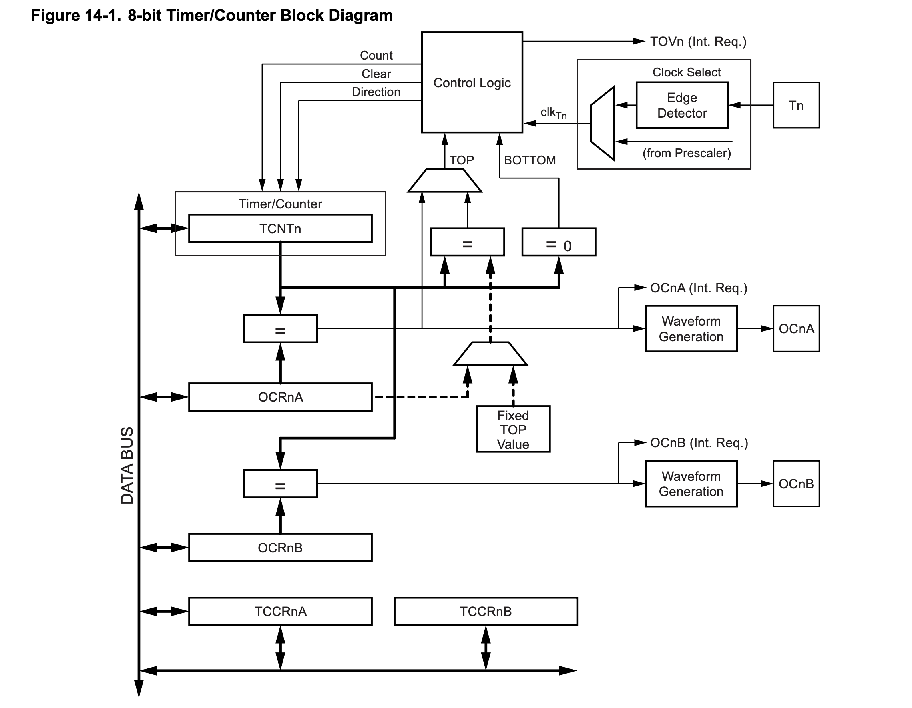
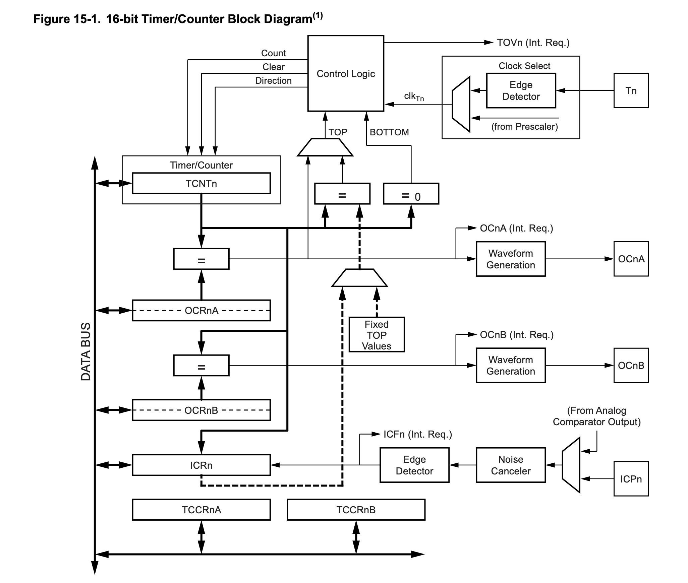

# Intro into Timers


---

# Why timers? Why do we need the precision? (1)


A few Examples:

- Alarm clock (need to measure the exact time)
- Watchdog (need a fixed max interval between system check-up)
- Sensor measurement for automatic control (e.g.: PID) (need fixed sampling interval for best control results).

-- Digital filters (low-pass, high-pass, etc.) assume a constant sampling frequency 

-- Automatic controllers (especially digital ones like PID controllers in microcontrollers) are designed assuming a known, fixed update rate 

-- Some real-time systems require that the next sensor reading time is fixed - thus deterministic timing is essential

> Note: These slides contain materials from Prabal Dutta, Mark Brehob and Thomas Schmid (UMich), Dan Tudose (ACS)

---
---
# Why timers? Why do we need the precision? (2)
- Time-based control - e.g.: for a led based display (need to time the exact time for each command)

- PWM based control for anything from LEDs to DC or servo motors (needs timers to meintain precise signal)
- Timeouts in communication protocols (e.g.: protocol defined time-out intervals for fings like colision mitigation)
- Timers for sleep modes (e.g. - for puting a low power sytem in sleep for a defined period of time between senors readings and data transmission intervals)Adic

---
---

# General overview of a timer system

<div align="center">


</div>

---
layout: two-cols
---

# Where do we get the clock from?

<div align="center">


</div>

<br> 

> Copyright: <br> 
https://www.renesas.com/en/blogs/creating-reliable-crystal-oscillators-circuits-your-mcu-design 
<br> https://www.arduino.cc/en/uploads/Main/arduino-uno-schematic.pdf
<br> https://datasheets.raspberrypi.com/rp2350/hardware-design-with-rp2350.pdf 

:: right ::

<br>
<br>
<br>
<br>

<div align="center">


</div>

<br> 

<div align="center">


</div>

<br>

<br>

---
layout: two-cols
---

# Example - 8 bit timer on Atmega 328P

## Modes:
-- Overflow (rest at 0xFF) <br>
-- Capture (CTC) <br>
-- Fast PWM <br>
-- Phase-correct PWM

:: right :: 

<br> 
<br> 
<br> 

<div align="center">


</div>

---
layout: two-cols
---

# Example - 16 bit timer on Atmega 328P

## Modes:
-- Overflow (reset at 0xFFFF)

-- Capture 
> CTC / ICR

-- Fast PWM
> 5 modes / 8 to 16-bit resolution

-- Phase-correct PWM
> 7 modes / 8 to 16-bit resolution


:: right :: 

<br> 
<br> 
<br> 

<div align="center">


</div>

---

# Example on 328P

### We want to implement a real-time clock in code for the ATmega324P. Assumptions:
> We need to initialize a timer to generate one interrupt per second.
Minutes, hours, etc., will be incremented in code.

## Problem(s):
- No single timer has the necessary resolution to time long intervals.
- If we set the prescaler to 1024 and use an 8-bit timer, then we can time at most 12 MHz / 1024 / 256 = 45.77 Hz (about 0.02 s).

## Solution:
- We use Timer1 (16 bits) with a 256 prescaler, so we need to count up to 12 MHz / 256 = 46.875 to reach 1 Hz.

---

# The code

``` c
#define F_CPU 12000000UL //the default f for 328P - we need this for the below computation
#include <avr/io.h>
#include <avr/interrupt.h>

volatile uint32_t seconds = 0;

ISR(TIMER1_COMPA_vect) { seconds++; } //the actual handler

int main()
{
    // Calculate the value for OCR1A to get a 1-second period (the compare value)
    OCR1A = (F_CPU / 256) - 1;  /* 46.875 for the dedefault 12 MHz clock */

    // 1) Set prescaler to 256
    // 2) Set CTC mode with TOP = OCR1A (CTC means Clear Time on Compare)
    TCCR1B = (1 << CS12) | (1 << WGM12);

    // Enable Timer1 Compare Match A interrupt
    TIMSK = (1 << OCIE1A);

    sei();        // Enable global interrupts
    while(1);     
    return 0;
}

```

---

# Time for watchdogs

## Why?

Sometimes the code loops and that is bad - as it will typically result in a freezer system.

## Types of watchdogs
- software, on the controller
- hardware, outside the controller (actually hard + soft)

## Example

We will assume we have a code that might freeze and can accept a maximum of 4 seconds for the system to be stuck.

---

# The code

``` c
#define F_CPU 12000000UL
#include <avr/io.h>
#include <avr/wdt.h>
#include <avr/interrupt.h>
volatile uint32_t seconds = 0;

ISR(WDT_vect) {
    save_stuff();    // save usually - save debug info to EEPROM
   //NOTE: on exit from the ISR, the controller will reset
}

int main(){
    WDTCSR = (1 << WDTON) | (1 << WDE) | (1 << WDIE);    // Configure Watchdog to Interrupt and System Reset Mode
    WDTCSR |= (1 << WDP3); //4s delay

    sei(); 
    while (1)
    {
        wdt_reset(); //if the code gets stuck in do_stuff and wdt_reset() does not get called 
                     //the timer for the watchdog reaches 4s, the above ISR gets called and on exit the watchdog 
                    //resets the controller through a software reset
        do_stuff();
    }
    return 0; 
}

```
