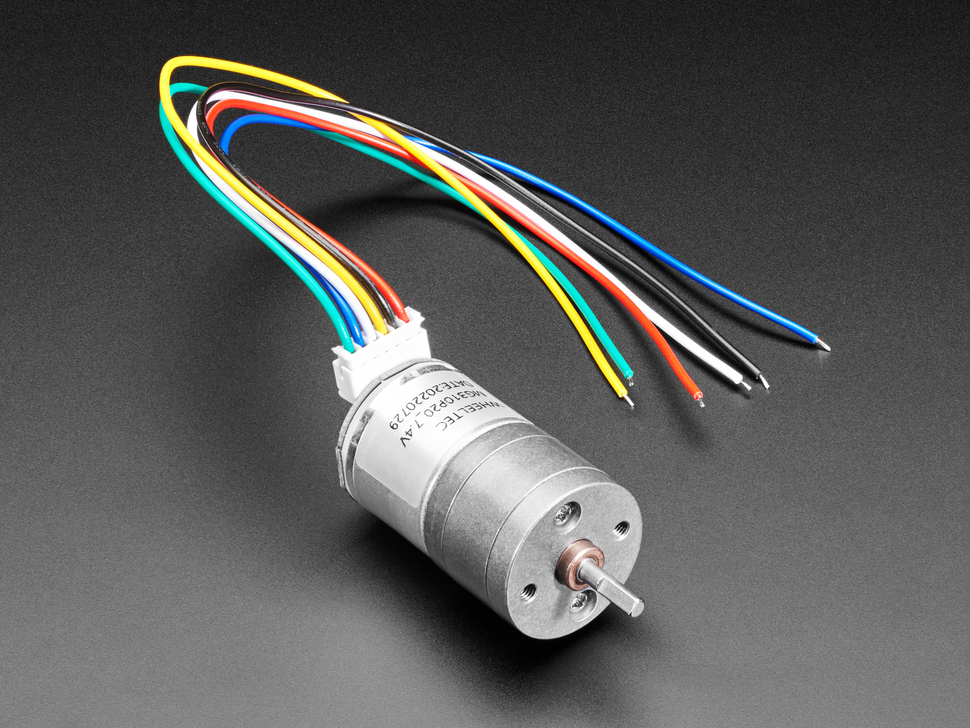
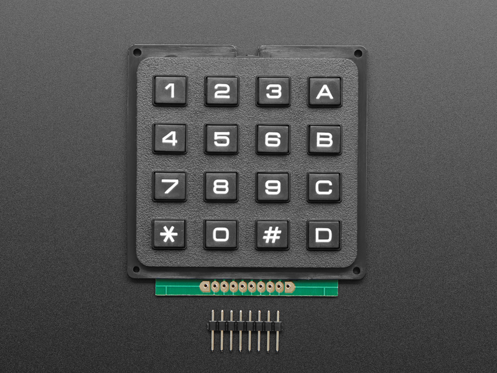
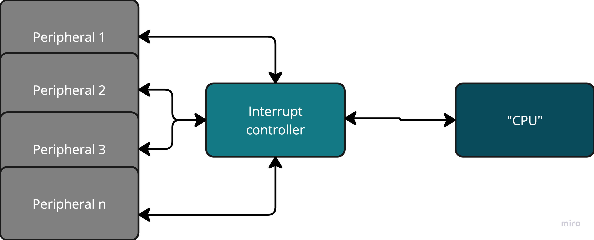
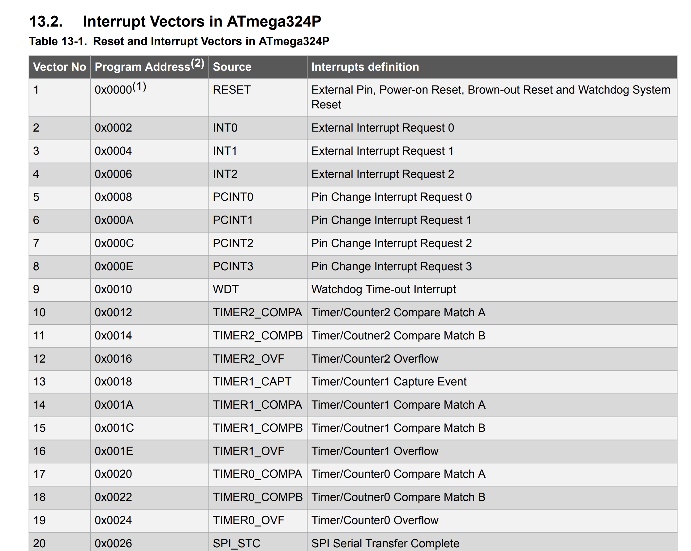

# Intro into interupts and a look at a simple arhitecture (328P)

---

# Why interupts?


- Computer systems typically have many external peripherals—keyboard, mouse, display, memory units, scanner, printer, sound card, webcam, etc. All these devices occasionally need to interact with the processor, but we can’t know in advance when that will happen. 
> We want to keep the CPU busy (or in sleep mode) between events (no busy waiting). 

> Therefore, there must be a mechanism that allows the CPU to determine which peripheral requires attention.

<style>
table {
  width: 100%;
  border-collapse: collapse;
  table-layout: fixed;
}
td {
  width: 33.33%;
  text-align: center;
  vertical-align: middle;
  border: 1px solid #ccc;
}
.img-responsive {
  width: 100%;
  height: auto;
  max-height: 300px;
  display: block;
}
</style>


<table>
  <tr>
    <td>
      
    </td>
    <td>
      
    </td>
    <td>
      
    </td>
  </tr>
</table>

> Img copyright - https://www.adafruit.com/ & https://www.theengineer.co.uk/

---

# What is the alternative?

## Pooling 

- The CPU periodically checks whether a peripheral needs attention. 
> Polling is like looking at your phone every second to see if someone is calling.

<br> 

## Pro: 
- It can be efficient if events occur in rapid succession.
- Simple to implement
## Con: 
- It keeps the processor busy even when no event is taking place.
- Prevents sleep (thus it is a power hungry method)

---
layout: two-cols
---

# Interrupts with an interrupt controller

- Each peripheral has a dedicated line to signal it needs attention 
- The Interrupt controller receives interrupt requests, while the processor "does its thing" (either busy with computation, orsleep mode for power conservation)
- The Interrupt controller sets interrupt flags (that the processor can poll and decide when to handle)
- The Interrupt controller can handle numerous peripherals without needing dedicated lines for the processor 


:: right ::

<br> 
<br> 
<br> 
<br> 

<div align="center">


</div>

---

# General interrupt set-up

1.  The processor initializes the peripheral and enables the interrupts it wants to receive from that peripheral.
> The processor (or microcontroller) configures the peripheral’s registers (e.g., control registers, data direction settings) so the peripheral is in the correct operating mode.

> It then enables one or more interrupts in the peripheral’s interrupt‐enable register. This tells the peripheral to generate interrupt signals under specific conditions (e.g., data ready, error, end of conversion).

2.  The processor initializes the interrupt controller with a list of priorities for each enabled interrupt.
3. There needs to be an interrupt service routine developed and placed in the program memory so the processor can execute it when needed.
4. Note: After the interrupt service routine finishes, the processor returns to normal code execution.
> This also means that the processor restores the previous program context (registers, program counter) and resumes running the main program or whatever task it was executing prior to the interrupt.

---

# General flow for an interrup event

1. Wait for the current instruction to complete
2. Save the Program Counter (PC) onto the stack
3. Save all active registers onto the stack
4. Jump to the address of the interrupt service routine (ISR) specified in the interrupt vector table
> Note: depending on the architecture, the ISR might or might not be interruptable 
5. Upon returning from the ISR, restore the saved registers and PC from the stack

---

# Interrupts on AVR - 324P (similar to AVR - 328P)



---

# Interrupt handling mechanism on the ATmega324P

1. Complete the current instruction
2. Push (PC + 2) onto the stack
3. Push the SREG (Status Register) and any other general-purpose registers used in the main loop
4. Jump to the address in the interrupt vector table corresponding to the type of interrupt that occurred
5. In the table, there must be a jump to the Interrupt Service Routine (ISR)
6. Execute the ISR instruction
7. On return from ISR, pop the used general-purpose registers and then pop the SREG
8. Finally, pop (PC + 2) and resume execution in the main() loop

---

# Example

```c
#include <avr/io.h>
#include <avr/interrupt.h>

ISR(INT0_vect)
{
    PORTC ^= (1 << PC0);  // Toggle PC0 each time INT0 interrupt is triggered
}

int main()
{
    DDRC |= (1 << PC0);   //configure PC0 (pin C0) as an output
    EIMSK |= (1 << INT0); //enable the INT0 external interrupt
//note: by default, PD2 is tied to INT0 and the default settings is for falling edge detection

    sei();

    while(1) 
{
    //do useful stuff with the MCU
}
}

```

---

# Behind the scene (1/4)

```c
00000000 <__vectors>: 
__vectors(): 
0: 0c 94 3e 00 jmp 0x7c  ; 0x7c <__ctors_end> //RESET 
4: 0c 94 48 00 jmp 0x94  ; 0x94 <__vector_1> //INT0 
8: 0c 94 48 00 jmp 0x90  ; 0x90 <__bad_interrupt> 
c: 0c 94 48 00 jmp 0x90  ; 0x90 <__bad_interrupt> 
10: 0c 94 48 00 jmp 0x90 ; 0x90 <__bad_interrupt> 
14: 0c 94 48 00 jmp 0x90 ; 0x90 <__bad_interrupt> 
18: 0c 94 48 00 jmp 0x90 ; 0x90 <__bad_interrupt> 
1c: 0c 94 48 00 jmp 0x90 ; 0x90 <__bad_interrupt> 
20: 0c 94 48 00 jmp 0x90 ; 0x90 <__bad_interrupt> 
24: 0c 94 48 00 jmp 0x90 ; 0x90 <__bad_interrupt> 
28: 0c 94 48 00 jmp 0x90 ; 0x90 <__bad_interrupt> 

................................................

60: 0c 94 48 00 jmp 0x90 ; 0x90 <__bad_interrupt> 
64: 0c 94 48 00 jmp 0x90 ; 0x90 <__bad_interrupt> 
68: 0c 94 48 00 jmp 0x90 ; 0x90 <__bad_interrupt> 
6c: 0c 94 48 00 jmp 0x90 ; 0x90 <__bad_interrupt> 
70: 0c 94 48 00 jmp 0x90 ; 0x90 <__bad_interrupt> 
74: 0c 94 48 00 jmp 0x90 ; 0x90 <__bad_interrupt> 
78: 0c 94 48 00 jmp 0x90 ; 0x90 <__bad_interrupt>
0000007c <__ctors_end>:

```

---

# Behind the scene (2/4)

```c
__trampolines_start(): 
   7c: 11 24 	eor r1, r1    //r1 = 0 //this is where the program jumps at RESET
   7e: 1f be 	out 0x3f, r1  //SREG = r1 
   80: cf ef 	ldi r28, 0xFF  
   82: d8 e0 	ldi r29, 0x08  
   84: de bf 	out 0x3e, r29 //init stack pointer
   86: cd bf 	out 0x3d, r28 //init stack pointer
   88: 0e 94 4a 00 	call 0xb8 //call main 
   8c: 0c 94 59 00 	jmp 0xc0  //0xc0 <_exit> 

<__bad_interrupt>: __vector_22(): 
   90: 0c 94 00 00 	jmp 0 ; 0x0 <__vectors> //any undefined interrupt jumps to the RESET interrupt, essentially triggering a REST

```

---

# Behind the scene (3/4)

```c
__vector_1(): 
  94: 1f 92 push r1       // context save
  96: 0f 92 push r0 
  98: 0f b6 in r0, 0x3f   // r0 = SREG 
  9a: 0f 92 push r0       // SREG save (on stack)
  9c: 11 24 eor r1, r1 
  9e: 8f 93 push r24 
  a0: 9f 93 push r25 
 
  a2: 88 b1 in r24, 0x08  // r24 = PORTC //ISR
  a4: 91 e0 ldi r25, 0x01                //ISR  
  a6: 89 27 eor r24, r25                 //ISR
  a8: 88 b9 out 0x08, r24 // PORTC = r24 //ISR
 
  aa: 9f 91 pop r25       // context rebuild
  ac: 8f 91 pop r24 
  ae: 0f 90 pop r0 
  b0: 0f be out 0x3f, r0  // SREG = r0
  b2: 0f 90 pop r0 
  b4: 1f 90 pop r1 
  b6: 18 95 reti          // return from interrupt


```

---

# Behind the scene (4/4)

```c

b8: 38 9a sbi 0x07, 0    //DDRC |= (1 << PC0); 
ba: e8 9a sbi 0x1d, 0    //EIMSK |= (1 << INT0);  
bc: 78 94 sei            //sei();
be: ff cf rjmp .-2       // jumps back (while(1))

c0: f8 94 cli             //Clear global interrupt flag

c2: ff cf rjmp .-2       // 0xc2 <__stop_program>

```
