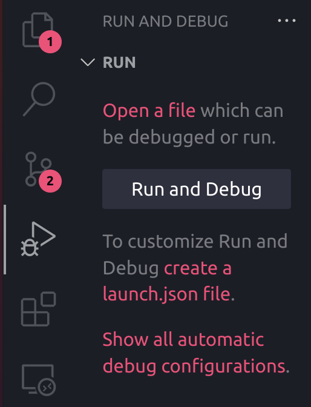
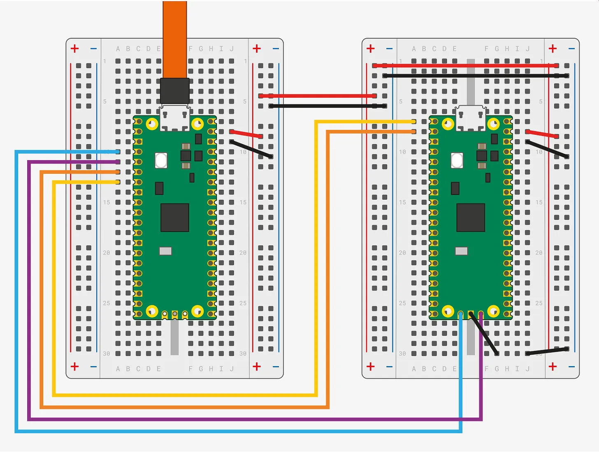

import Tabs from '@theme/Tabs';
import TabItem from '@theme/TabItem';

# Embassy-rs Setup

Here, we will cover the steps needed in order to be able to compile and flash Rust applications for the **RP2350**, the MCU (Microcontroller Unit) found in our **Raspberry Pi Pico 2 W**s, as well as the **RP2040**, found in the original **Pi Pico**.

## Prerequisites

### Rust Toolchain

In order to install the tools needed to compile Rust code, follow the next steps, depending on your operating system.

<Tabs>
    <TabItem value="linux_rustup" label="Linux" default>

Run the this command in terminal:

```shell
curl --proto '=https' --tlsv1.2 -sSf https://sh.rustup.rs | sh
```

This downloads and runs `rustup-init.sh`, which in turn downloads and runs the correct version of the `rustup-init` executable for your platform.
    </TabItem>
    <TabItem value="windows_rustup" label="Windows" default>

Download the respective executable:

* [RUSTUP-INIT.exe - 64bit](https://static.rust-lang.org/rustup/dist/x86_64-pc-windows-msvc/rustup-init.exe)
* [RUSTUP-INIT.exe - 32bit](https://static.rust-lang.org/rustup/dist/i686-pc-windows-msvc/rustup-init.exe)

:::note
You may be prompted to install [Visual Studio C++ Build tools](https://visualstudio.microsoft.com/visual-cpp-build-tools/). If so, follow the instructions from the previous link.
:::


    </TabItem>
</Tabs>

The last step is to run `rustup --version` in terminal. If everything went well, you should see an output similar to this:

```shell
rustup 1.27.1 (54dd3d00f 2024-04-24)
info: This is the version for the rustup toolchain manager, not the rustc compiler.
info: The currently active `rustc` version is `rustc 1.83.0 (90b35a623 2024-11-26)`
```
:::note
The command might not be recognised unless you restart VSCode if you're using the integrated PowerShell terminal on Windows. Simply killing the terminal and opening a new one is not always enough.
:::

### `picotool`
This tool can be used to work with binaries built for both the **RP2350** and the **RP2040** MCU's. It can also interact with Pico boards while in `BOOTSEL` mode, which you'll learn about later in this tutorial.

If you're using a **Raspbery Pi Pico 1 (W)**, you can also use [`elf2uf2-rs`](#elf2uf2-rs-rp2040-only), which is much easier to set up. For `picotool`, you will need to clone the GitHub repository and build the executable yourself.

First, you will need to clone the `pico-sdk` repository:

```shell
git clone https://github.com/raspberrypi/pico-sdk.git
``` 

Make sure you remember the path to this new directory, as you will have to export it as an environment variable later. Next, you can clone the `picotool` repository:

```shell
git clone https://github.com/raspberrypi/picotool.git
``` 

<Tabs>
    <TabItem value="linux_picotool" label="Linux" default>
        
        :::info
            Before building `picotool`, you need to install a few dependencies. You can run the following command in your terminal in order to get them:

            ```shell
            sudo apt install build-essential pkg-config libusb-1.0-0-dev cmake
            ```
        :::

        In order to run `picotool` without `sudo`, you can add the provided udev rules. While in the `picotool/` directory, run this command in your terminal:

        ```shell
        sudo cp udev/99-picotool.rules /etc/udev/rules.d/
        ```

        Then, run

        ```shell
        udevadm control --reload # to ensure the new rules are used
        udevadm trigger # to ensure the new rules are applied to already added devices
        ```
        
        Next, use the following commands to build the binary:

        ```shell
        export PICO_SDK_PATH=path/to/pico-sdk
        mkdir build
        cd build
        cmake ../
        make
        ```

        You should now be able to find a `picotool` command-line binary in the `picotool/build/` directory. Try running

        ```shell
        picotool version
        ```

        while in this directory to make sure that `picotool` was built correctly. You should see an output similar to this:

        ```shell
        ~/PM/picotool/build$ picotool version
        picotool v2.1.1 (Linux, GNU-9.4.0, Release)
        ```

        :::info
        At this point, you can only run the executable in the terminal from the `build/` directory, or by specifying the full (or relative) path to the binary. This isn't very convenient, so a recommended step is to add this directory to your `PATH` variable. You can use this command:

        ```shell
        echo `export PATH=$PATH:/full/path/to/picotool/build` >> ~/.bashrc
        ```

        This will add the `export PATH` command to the `.bashrc` script, which runs every time a new Bash session is initiated. Make sure you use the **full path**, as in `/home/$USER/picotool/build`, and not `~/picotool/build`! To check that everything went well, restart your terminal or run

        ```shell
        source ~/.bashrc
        ```

        in order to rerun the script for this Bash session. Now run

        ```shell
        cd
        picotool version
        ```

        and you should receive the same output as earlier.
        :::


    </TabItem>
    <TabItem value="windows_picotool" label="Windows" default>
        WIP Windows
    </TabItem>
</Tabs>

:::note
If you want to learn more about `picotool` or are having any trouble with your setup, you can check out the [GitHub page](https://github.com/raspberrypi/picotool) and the **Appendix B: Picotool** section of [Getting started with Raspberry Pi Pico-series](https://datasheets.raspberrypi.com/pico/getting-started-with-pico.pdf).
:::

### `elf2uf2-rs` (**RP2040** only)

This is another tool that we can use in order to program an **RP2040** based board over USB. In order to install it, run the following in your terminal:

```shell
cargo install elf2uf2-rs
```

Then, run `elf2uf2-rs --help`. If it was correctly installed, you should see something similar to this in your terminal:

```shell
Usage: elf2uf2-rs [OPTIONS] <INPUT> [OUTPUT]

Arguments:
  <INPUT>   Input file
  [OUTPUT]  Output file

Options:
  -v, --verbose  Verbose
  -d, --deploy   Deploy to any connected pico
  -s, --serial   Connect to serial after deploy
  -h, --help     Print help
```

:::warning

If you try to flash a Pico 2 (W) using the `elf2uf2-rs` tool, the program will not run on the board. The **RP2350** requires a different binary structure that `elf2uf2-rs` can't generate properly. You will have to use [`picotool`](#picotool-for-rp2350) instead.

:::

### `probe-rs`

This tool is an embedded debugging and target interaction toolkit. It enables its user to program and debug microcontrollers via a debug probe.

<Tabs>
    <TabItem value="linux_probe-rs" label="Linux" default>
            
        :::info 

        Before installing probe-rs, you need to install  `pkg-config`, `libudev`, `cmake` and `git`. You can get them by running the following in your terminal. If any of these programs are already installed on your machine, you can omit them from the command.
        ```shell
        sudo apt-get install pkg-config libudev-dev cmake git
        ```

        :::

        ```shell
        cargo install probe-rs-tools --locked
        ```

        You will also need to add this [`udev`](https://probe.rs/files/69-probe-rs.rules) file in `/etc/udev/rules.d`. Then, run:

        ```shell
        udevadm control --reload
        udevadm trigger
        ```

    </TabItem>
    <TabItem value="windows_probe-rs" label="Windows" default>

        :::info
        You will have to make sure that [`cmake`](https://cmake.org/download/) is installed and that it is added to your `$PATH`. Make sure you choose the latest **stable** version, under the Latest Release section.
        :::

        Once `cmake` is set up, you can run
        ```shell
        cargo install probe-rs-tools --locked
        ```
        and no further configuration is required.

    </TabItem>
</Tabs>

### VSCode Extension

For a better experience, go ahead and install the **Debugger for probe-rs** extension in the Microsoft Extension Marketplace. This will allow us to build and upload a program to the RP2350 directly from VSCode and it will make debugging the program while running on the MCU as easy as debugging a Rust program running on your host machine.

## Flashing over USB

This section demonstrates some of the various ways you can build your code and flash it to the board. If you wish to try them out and see how they work, you should first head over to the [Building your first Embassy-rs project](#building-your-first-embassy-rs-project) section, follow the instructions and then come back. You will also find an [example](#mainrs) of code that you can use as your `main.rs` file. Note that you will not be able to use `cargo run` just yet.

### Configuring Cargo

You will notice that some of the options will suggest creating and modifying a `config.toml` file. It is not strictly necessary for flashing, but it is highly recommended, especially since you will need it for debugging anyway.

In order to add the configuration file, you will first have to create a `.cargo/` directory in your project's root folder. Inside it, create the `config.toml` file. You cand find a complete configuration example below. For more information on this type of file, follow the official [Cargo Book](https://doc.rust-lang.org/cargo/reference/config.html).

##### config.toml

<Tabs>
    <TabItem value="pico2_config_toml" label="Raspberry Pi Pico 2" default>

        ```toml
        [target.'cfg(all(target_arch = "arm", target_os = "none"))']
        runner = "probe-rs run --chip RP235x"

        [build]
        target = "thumbv8m.main-none-eabihf"

        [env]
        DEFMT_LOG = "debug"
        ```
    
    </TabItem>
    <TabItem value="pico_config_toml" label="Raspberry Pi Pico" default>

        ```toml
        [target.'cfg(all(target_arch = "arm", target_os = "none"))']
        runner = "probe-rs run --chip RP2040"

        [build]
        target = "thumbv6m-none-eabi"

        [env]
        DEFMT_LOG = "debug"
        ```

    </TabItem>
</Tabs>
### Compiling

You will need to compile your executable specifically for the **RP2350** or the **RP2040** chips. The former is based on the **ARM Cortex M33** architecture, while the latter uses **ARM Cortex M0+**, so we will need to specify our target when compiling. We can do that in multiple ways, but first we will need to install the appropriate Rust ARM target:

<Tabs>
    <TabItem value="pico2_target" label="Raspberry Pi Pico 2">
    
        ARMv8-M for the **RP235x**
        ```shell
        rustup target add thumbv8m.main-none-eabihf
        ```
        :::warning

        This is a very important step, so make sure you follow it and choose the right target. Compiling for the wrong architecture, such as x86 (Intel and AMD processors) instead of Arm will lead to a number of compilation errors.

        :::

        Now you can build by:

        #### 1. Passing the target as a parameter to Cargo:

        ```shell
        cargo build --release --target thumbv8m.main-none-eabihf
        ```

        :::info

        You can also use `build` without the `--release` option. This way, the rust compiler will not apply any optimisations to your code and a `debug` build will be generated. 

        :::

        #### 2. Using the `.cargo/config.toml` file:

        ```toml
        [build]
        target = "thumbv8m.main-none-eabihf"
        ```

        This allows us to simply run

        ```shell
        cargo build
        ```

        without having to specify the target every time. 

    </TabItem>
    <TabItem value="pico_target" label="Raspberry Pi Pico">
        ARMv6-M for the **RP2040**
        ```shell
        rustup target add thumbv6m-none-eabi
        ```
        :::warning

        This is a very important step, so make sure you follow it and choose the right target. Compiling for the wrong architecture, such as x86 (Intel and AMD processors) instead of Arm will lead to a number of compilation errors.

        :::

        Now you can build by:

        #### 1. Passing the target as a parameter to Cargo:

        ```shell
        cargo build --release --target thumbv6m-none-eabi
        ```

        :::info

        You can also use `build` without the `--release` option. This way, the rust compiler will not apply any optimisations to your code and a `debug` build will be generated. 

        :::

        #### 2. Using the `.cargo/config.toml` file:

        ```toml
        [build]
        target = "thumbv6m-none-eabi"
        ```

        This allows us to simply run

        ```shell
        cargo build
        ```

        without having to specify the target every time. 

    </TabItem>
</Tabs>

### Flashing

There are multiple ways to flash a program to the Raspberry Pi Pico. Even though we will present some methods which do not require a debugger, we highly recommend using one, be it the official Raspberry Pi Debug Probe or a secondary Pi Pico.

:::warning

The team will only privde you with support for your project if you are using a debugger!

:::

After your program is compiled, you will have to identify the path to the binary, which can vary depending on your target architecture and build flags. For example, the binary for a debug build compiled for the RP2350 will be located in `target/thumbv8m.main-none-eabihf/debug/`, while a release build for the RP2040 will generate a binary in `target/thumbv6m-none-eabi/release/`.

<Tabs>
    <TabItem value="flashing_pico2" label="Raspberry Pi Pico 2" default>

        #### 1. Using `probe-rs`:

        You can run

        ```shell
        probe-rs run --chip RP235x /path/to/your/binary
        ```

        This will flash the board without starting `probe-rs`' debugging functionality.

        #### 2. Configuring Cargo to do it

        If you've already created a `.cargo/config.toml` with a build target, you can add these lines to the file:

        ```toml
        [target.'cfg(all(target_arch = "arm", target_os = "none"))']
        runner = "probe-rs run --chip RP235x"
        ```

        Now, 

        ```shell
        cargo run 
        ```

        will automatically call the command from option 1, without having to specify the path to the binary. Also, `cargo run` compiles your code first if you've made any changes to it.

        :::tip
        As it will be required later in the tutorial, you should also add

        ```toml
        [env]
        DEFMT_LOG = "debug"
        ```

        which tells cargo that your program will use **deferred formatting** to more efficiently send logs to the host machine via a serial interface. You can learn more about `defmt` [here](https://defmt.ferrous-systems.com/). At this point, your configuration file should look like this:
        ##### config.toml
        ```toml
        [target.'cfg(all(target_arch = "arm", target_os = "none"))']
        runner = "probe-rs run --chip RP235x"

        [build]
        target = "thumbv8m.main-none-eabihf"

        [env]
        DEFMT_LOG = "debug"
        ```
        :::

        #### 3. Using the **Debugger for probe-rs** extension

        This method can be used from VSCode's **Run and Debug** view. The binary will be flashed to the board by `probe-rs` and the debugging mode will be running by default. However, this option requires further configuration of the project which will be detailed in the next section of this tutorial. 

        #### 4. Using `picotool` (no debugger)

        Your board will have to be in **USB Mass Storage Device mode**. To put it in this mode, you need to **hold the `BOOTSEL` button down** while connecting it to your PC. Your system should now see the Pico as a storage device.

        :::warning
        
        Frequently connecting and disconnecting the USB could damage the port on the board, as well as the one on your computer! You can add a reset button to avoid this issue. Check out this [short tutorial](https://www.raspberrypi.com/news/how-to-add-a-reset-button-to-your-raspberry-pi-pico/) for more details.

        :::

        Use this command to flash the board:

        ```shell
        picotool load -x path/to/binary -t elf
        ```
        * `-x` to reset the Pico and start executing the program after flashing
        * `-t elf` to specify the binary's type (`picotool` will convert it to uf2)

        Alternatively, you can use

        ```shell
        picotool uf2 convert path/to/binary -t elf out.uf2
        ```

        to convert the existing binary to a `uf2` file and save it in the project's root directory. You can then drag and drop the `out.uf2` file to the mounted Pico. If everything goes well, the Pico should reset on its own and start running your program.

    </TabItem>
    <TabItem value="flashing_pico" label="Raspberry Pi Pico" default>

        #### 1. Using `probe-rs`:

        You can run

        ```shell
        probe-rs run --chip RP2040 /path/to/your/binary
        ```

        This will flash the board without starting `probe-rs`' debugging functionality.

        #### 2. Configuring Cargo to do it (recommended)

        If you've already created a `.cargo/config.toml` with a build target, you can add these lines to the file:

        ```toml
        [target.'cfg(all(target_arch = "arm", target_os = "none"))']
        runner = "probe-rs run --chip RP2040"
        ```

        Now, 

        ```shell
        cargo run 
        ```

        will automatically call the command from option 1, without having to specify the path to the binary. Also, `cargo run` compiles your code first if you've made any changes to it.

        :::tip
        As it will be required later in the tutorial, you should also add

        ```toml
        [env]
        DEFMT_LOG = "debug"
        ```

        which tells cargo that your program will use **deferred formatting** to more efficiently send logs to the host machine via a serial interface. You can learn more about `defmt` [here](https://defmt.ferrous-systems.com/). At this point, your configuration file should look like this:
        ##### config.toml
        ```toml
        [target.'cfg(all(target_arch = "arm", target_os = "none"))']
        runner = "probe-rs run --chip RP2040"

        [build]
        target = "thumbv6m-none-eabi"

        [env]
        DEFMT_LOG = "debug"
        ```
        :::

        #### 3. Using the **Debugger for probe-rs** extension

        This method can be used from VSCode's **Run and Debug** view. The binary will be flashed to the board by `probe-rs` and the debugging mode will be running by default. However, this option requires further configuration of the project which will be detailed in the next section of this tutorial. 

        #### 4. Using `picotool` (no debugger)

        Your board will have to be in **USB Mass Storage Device mode**. To put it in this mode, you need to **hold the `BOOTSEL` button down** while connecting it to your PC. Your system should now see the Pico as a storage device.

        :::warning
        
        Frequently connecting and disconnecting the USB could damage the port on the board, as well as the one on your computer! You can add a reset button to avoid this issue. Check out this [short tutorial](https://www.raspberrypi.com/news/how-to-add-a-reset-button-to-your-raspberry-pi-pico/) for more details.

        :::

        Use this command to flash the board:

        ```shell
        picotool load -x path/to/binary -t elf
        ```
        * `-x` to reset the Pico and start executing the program after flashing
        * `-t elf` to specify the binary's type (`picotool` will convert it to uf2)

        Alternatively, you can use

        ```shell
        picotool uf2 convert path/to/binary -t elf out.uf2
        ```

        to convert the existing binary to a `uf2` file and save it in the project's root directory. You can then drag and drop the `out.uf2` file to the mounted Pico. If everything goes well, the Pico should reset on its own and start running your program.

        #### 5. Using `elf2uf2-rs` (no debugger, only for RP2040):

        Connect the Pico to your PC and put it in **USB Mass Storage Device mode**. To flash the board use:

        ```shell
        elf2uf2-rs -d /path/to/your/binary
        ```

        * `-d` to automatically deploy to a mounted Pico
        
        :::note
        On `Windows`, you may need to run this command in a terminal that has **Admin Privileges**.
        :::

        You can also use the command without the `-d` option to generate a `uf2` file next to your binary. Open the Pico storage device and simply drag and drop the `uf2` file. The board should disconnect, reset and start running your program if everything went well.

    </TabItem>
</Tabs>

## Debugging
### With the Raspberry Pi Debug Probe

In order to be able to debug the program running on the board, we will need to connect the **Raspberry Pi Debug Probe** to our **Raspberry Pi Pico 2 W**. Below, you have a picture of the debug kit provided:


To connect them, we will use the **3-pin debug to 0.1-inch header (female)** cable. First, carefully insert the **3-pin debug** head in the **right side** connector (marked D). Then you will also need to connect it to the Raspberry Pi Pico 2 W. You can find the pinout attached, take a closer look at the bottom of the image.

:::info

The pinout is identical on the Raspberry Pi Pico W. Pico boards without the wireless connectivity chip also have the same pinout, save for the built-in LED.

:::


The connections must be:

| Wire | Raspberry Pi Pico 2 W |
|-|-|
|TX (Orange)|SWCLK|
|GND (Black)|GND|
|RX (Yellow)|SWDIO|

:::warning
Do not forget to connect both the Debug Probe and Pico to your PC.
:::

The simplest way to start debugging is to use the **Run and Debug** view in Visual Studio Code. If you already have a `.cargo/config.toml` file, make sure the following lines are included. If this file doesn't exist yet, create it and add these lines: 

```toml
[env]
DEFMT_LOG = "debug"
```

Then, you will need to create `.vscode/launch.json`. VSCode should give you this option when entering the **Run and Debug** menu:



Below you will find an example of such a file. Make sure you choose the one appropriate for your board.

##### launch.json

<Tabs>
    <TabItem value="pico2_launch.json" label="Raspberry Pi Pico 2" default>
        ```json
        {
            // Use IntelliSense to learn about possible attributes.
            // Hover to view descriptions of existing attributes.
            // For more information, visit: https://go.microsoft.com/fwlink/?linkid=830387
            "version": "0.2.0",
            "configurations": [
                {
                    "preLaunchTask": "rust: cargo build",
                    "type": "probe-rs-debug",
                    "request": "launch",
                    "name": "Pico 2W",
                    "cwd": "${workspaceFolder}",
                    "connectUnderReset": false,
                    "chip": "RP235x",
                    "flashingConfig": {
                        "flashingEnabled": true,
                        "haltAfterReset": false,
                    },
                    "coreConfigs": [
                        {
                            "coreIndex": 0,
                            "programBinary": "./target/thumbv8m.main-none-eabihf/debug/${workspaceFolderBasename}",
                            "svdFile": "./.vscode/rp2350.svd",
                            "rttEnabled": true,
                        }
                    ],
                }
            ]
        }
        ```    

    </TabItem>
    
    <TabItem value="pico_launch.json" label="Raspberry Pi Pico">
        ```json
        {
            // Use IntelliSense to learn about possible attributes.
            // Hover to view descriptions of existing attributes.
            // For more information, visit: https://go.microsoft.com/fwlink/?linkid=830387
            "version": "0.2.0",
            "configurations": [
                {
                    "preLaunchTask": "rust: cargo build",
                    "type": "probe-rs-debug",
                    "request": "launch",
                    "name": "Pico W",
                    "cwd": "${workspaceFolder}",
                    "connectUnderReset": false,
                    "chip": "RP2040",
                    "flashingConfig": {
                        "flashingEnabled": true,
                        "haltAfterReset": false,
                    },
                    "coreConfigs": [
                        {
                            "coreIndex": 0,
                            "programBinary": "./target/thumbv6m-none-eabi/debug/${workspaceFolderBasename}",
                            "svdFile": "./.vscode/rp2040.svd",
                            "rttEnabled": true,
                        }
                    ],
                }
            ]
        }
        ```

    </TabItem>
</Tabs>


:::warning
If you're not using the `workspaceFolderBasename` variable, remember to modify the path provided to the `"programBinary"` attribute so that it matches with the one you want to debug. The binary will have the same name you gave to the project when running `cargo new` and it might be located in `release/` instead of `debug/` depending on your build options.
:::

A recommended step is to download the **System View Description** file for the MCU on your board ([`rp2350.svd`](https://raw.githubusercontent.com/raspberrypi/pico-sdk/refs/heads/master/src/rp2350/hardware_regs/RP2350.svd), [`rp2040.svd`](https://raw.githubusercontent.com/raspberrypi/pico-sdk/refs/heads/master/src/rp2040/hardware_regs/RP2040.svd)) and place it in the `.vscode/` directory, as it gives `probe-rs` and VSCode additional information on the registers and memory regions used by the MCU. If you aren't using this file, the `"svdFile"` attribute should be commented out or removed from `launch.json`.

You can find out more about this configuration file and available options, as well as the debugging process itself from the official [probe-rs documentation](https://probe.rs/docs/tools/debugger/).

**On Windows**, you may also have to create a `tasks.json` file in the `.vscode/` folder in order to define the `rust: cargo build` task, in case it is not recognized. Here is what it should contain:

##### tasks.json

```json
{
    "version": "2.0.0",
    "tasks": [
        {
            "label": "rust: cargo build",
            "type": "shell",
            "command": "cargo build"
        }
    ]
}
```


### With another Raspberry Pi Pico

Another interesting way to debug programs running on the board is to use a second Raspberry Pi Pico. In fact, the Raspberry Pi Debug Probe itself is based on the RP2040 MCU, found in the first iteration of the Pico, running custom firmware. The custom boards in the labs also use an RP2040 as a debugger and you can, as well, since the firmware is freely available.

The first step is to connect the two boards together. We will use a normal Pico (without WiFi) as a debugger for this tutorial, but you can essentially use any version of the Pico (1 or 2, with or without wireless connectivity).


We will refer to our boards as Pico A (the debugger) and Pico B (the one running our program). These are the connections you need to make:

| Pico A | Pico B |
|-|-|
| GND | GND |
| GP2 (Pin 4) | SWCLK |
| GP3 (Pin 5) | SWDIO |
| GP4/UART1 TX (Pin 6) | GP1/UART0 RX (Pin 2) |
| GP5/UART1 RX (Pin 7) | GP0/UART0 TX (Pin 1) |
| VSYS (Pin 39) | VSYS (Pin 39) |

You can also try to follow the wiring diagram below if you're using a breadboard. Pico A is on the left (and connected to a host machine via USB) and Pico B is on the right.



:::note
You will be using the Pico 2 W as the second board for the lab, unlike the one depicted here.
:::

The next step is flashing the firmware to the debugging board. Download the [`debugprobe_on_pico.uf2`](https://github.com/raspberrypi/debugprobe/releases/tag/debugprobe-v2.2.1) file (or `debugprobe_on_pico2.uf2` if you're using a Pico 2). Hold the `BOOTSEL` button down while connecting the board you want to use as a debugger to your PC. It should show up as a USB drive named `RPI-RP2` (`RP2350` if you're using a Pico 2). Next, simply copy the `.uf2.` file to the board to flash it. You should now be able to use the Pico you just flashed as a debugger for the Pico 2 W.

:::info
Only the board you are using as a debugger should be plugged into the USB port on your machine, since the other one is powered through the `VSYS` pin and the two Pico's communicate through the debugging interface.
:::

## Building your first Embassy-rs project

In this section, we will briefly go over the steps you need to take in order to get your first project using **Rust** and **Embassy-rs** going.

### Creating your crate

The first step is to create your cargo package by running the following command in your terminal:

```shell
cargo new --vcs none embassy
```

* `--vcs none` because at the moment we do not want to use any code versioning (they are useful, but this is not the purpose of this tutorial)

Next, open the `cargo.toml` file that was just generated and check the `edition` field. It will most likely be set to 2024, but we will use the 2021 edition of Rust.

```toml
[package]
name = "embassy"
version = "0.1.0"
edition = "2021"
```

### Crate settings

Because we are running in an embedded environment, our code needs to be *"tailored"* specifically for the microcontroller we intend to use. In our case, it is either the **RP2350** or the **RP2040**, but these general steps apply for any chip, produced by any manufacturer.

#### No standard library

Due to the size constraints imposed on us (in our case, `2MB` of flash memory), the standard library has to go. We specify that by adding the `#![no_std]` attribute to the beginning of our `src/mains.rs` file.

#### No `main` function

Because we are using the **Embassy-rs** framework, we want to let it take care of the entry point of our program (because it has to do some complex operations, like allocating the `task-arena` and `executor` structures). For the moment, all we will need to do is add the `#![no_main]` attribute to `src/main.rs`.

#### VSCode settings

The rust-analyzer extention might give you an error after you add the two attributes previously mentioned. To get rid of said error, you can add a `settings.json` file to your `.vscode/` directory.

##### settings.json

```json
{
    "rust-analyzer.cargo.allTargets": false,
    "[rust]": {
        "editor.defaultFormatter": "rust-lang.rust-analyzer",
        "editor.formatOnSave": true,
        "editor.formatOnSaveMode": "file",
    },
}
```

The provided configuration will also help you by enabling automatic formatting each time you save your work.

#### Toolchain setting

:::info
The three files mentioned below (`rust-toolchain.toml`,`memory.x` and `build.rs`) should be found in the root folder of your project (same directory as `Cargo.toml`).
:::

<Tabs>
    <TabItem value="pico2_toolchain" label="Raspberry Pi Pico 2" default>

        The RP2350 is based on a a **Cortex-M33** that uses the **ThumbV8-M** architecture so we will need to specify the target triple we are compiling for. We will do that using a `rust-toolchain.toml` file, as it allows us to also set the **toolchain release channel** we will use, and the components we require.

        An example of such file is this:

        ##### rust-toolchain.toml

        ```Toml
        # This file is used to specify the version of the Rust toolchain that 
        # should be used for your project.

        [toolchain]
        # The release to be used.
        channel = "1.83"
        # The targets for compilation that need to be added. This is used for 
        # cross-compilation, as the executables we are producing need to be
        # run on our boards.
        targets = ["thumbv8m.main-none-eabihf"]
        # The additional componets to be installed along the Rust toolchain
        components = ["rust-src", "rustfmt", "llvm-tools", "clippy"]
        ```

        :::tip

        Please make sure that you install the Rust ARMv8-M target (thumbv8m.main-none-eabihf).

        ```bash
        rustup target add thumbv8m.main-none-eabihf
        ```

        :::

        #### Memory layout

        We also need to take care of the memory layout of our program when writing code for a microcontroller. These can be found in the datasheet of all the microcontrollers. Bellow, you can find the memory layout for the **RP2350**:

        ##### `memory.x`

        ```linker-script
        MEMORY {
            /*
            * The RP2350 has either external or internal flash.
            *
            * 2 MiB is a safe default here, although a Pico 2 has 4 MiB.
            */
            FLASH : ORIGIN = 0x10000000, LENGTH = 2048K
            /*
            * RAM consists of 8 banks, SRAM0-SRAM7, with a striped mapping.
            * This is usually good for performance, as it distributes load on
            * those banks evenly.
            */
            RAM : ORIGIN = 0x20000000, LENGTH = 512K
            /*
            * RAM banks 8 and 9 use a direct mapping. They can be used to have
            * memory areas dedicated for some specific job, improving predictability
            * of access times.
            * Example: Separate stacks for core0 and core1.
            */
            SRAM4 : ORIGIN = 0x20080000, LENGTH = 4K
            SRAM5 : ORIGIN = 0x20081000, LENGTH = 4K
        }

        SECTIONS {
            /* ### Boot ROM info
            *
            * Goes after .vector_table, to keep it in the first 4K of flash
            * where the Boot ROM (and picotool) can find it
            */
            .start_block : ALIGN(4)
            {
                __start_block_addr = .;
                KEEP(*(.start_block));
                KEEP(*(.boot_info));
            } > FLASH

        } INSERT AFTER .vector_table;

        /* move .text to start /after/ the boot info */
        _stext = ADDR(.start_block) + SIZEOF(.start_block);

        SECTIONS {
            /* ### Picotool 'Binary Info' Entries
            *
            * Picotool looks through this block (as we have pointers to it in our
            * header) to find interesting information.
            */
            .bi_entries : ALIGN(4)
            {
                /* We put this in the header */
                __bi_entries_start = .;
                /* Here are the entries */
                KEEP(*(.bi_entries));
                /* Keep this block a nice round size */
                . = ALIGN(4);
                /* We put this in the header */
                __bi_entries_end = .;
            } > FLASH
        } INSERT AFTER .text;

        SECTIONS {
            /* ### Boot ROM extra info
            *
            * Goes after everything in our program, so it can contain a signature.
            */
            .end_block : ALIGN(4)
            {
                __end_block_addr = .;
                KEEP(*(.end_block));
            } > FLASH

        } INSERT AFTER .uninit;

        PROVIDE(start_to_end = __end_block_addr - __start_block_addr);
        PROVIDE(end_to_start = __start_block_addr - __end_block_addr);
        ```

        To use the `memory.x` layout file, we will also need to use a build script. Rust facilitates that through the `build.rs` file. Bellow you will find an explained build script you can use.

        ##### `build.rs`

        ```rust
        //! This build script copies the `memory.x` file from the crate root into
        //! a directory where the linker can always find it at build time.
        //! For many projects this is optional, as the linker always searches the
        //! project root directory -- wherever `Cargo.toml` is. However, if you
        //! are using a workspace or have a more complicated build setup, this
        //! build script becomes required. Additionally, by requesting that
        //! Cargo re-run the build script whenever `memory.x` is changed,
        //! updating `memory.x` ensures a rebuild of the application with the
        //! new memory settings.

        use std::env;
        use std::fs::File;
        use std::io::Write;
        use std::path::PathBuf;

        fn main() {
            // Put `memory.x` in our output directory and ensure it's
            // on the linker search path.
            let out = &PathBuf::from(env::var_os("OUT_DIR").unwrap());
            File::create(out.join("memory.x"))
                .unwrap()
                .write_all(include_bytes!("memory.x"))
                .unwrap();
            println!("cargo:rustc-link-search={}", out.display());

            // By default, Cargo will re-run a build script whenever
            // any file in the project changes. By specifying `memory.x`
            // here, we ensure the build script is only re-run when
            // `memory.x` is changed.
            println!("cargo:rerun-if-changed=memory.x");

            println!("cargo:rustc-link-arg-bins=--nmagic");
            println!("cargo:rustc-link-arg-bins=-Tlink.x");
            println!("cargo:rustc-link-arg-bins=-Tdefmt.x");
        }
        ```

    </TabItem>
    <TabItem value="pico_toolchain" label="Raspberry Pi Pico" default>

        The RP2040is based on a a **Cortex-M0+** that uses the **ThumbV6-M** architecture so we will need to specify the target triple we are compiling for. We will do that using a `rust-toolchain.toml` file, as it allows us to also set the **toolchain release channel** we will use, and the components we require.

        An example of such file is this:

        ##### rust-toolchain.toml

        ```Toml
        # This file is used to specify the version of the Rust toolchain that 
        # should be used for your project.

        [toolchain]
        # The release to be used.
        channel = "1.83"
        # The targets for compilation that need to be added. This is used for 
        # cross-compilation, as the executables we are producing need to be
        # run on our boards.
        targets = ["thumbv6m-none-eabi"]
        # The additional componets to be installed along the Rust toolchain
        components = ["rust-src", "rustfmt", "llvm-tools", "clippy"]
        ```

        :::tip

        Please make sure that you install the Rust ARMv6-M target (thumbv6m-none-eabi).

        ```bash
        rustup target add thumbv6m-none-eabi
        ```

        :::

        #### Memory layout

        We also need to take care of the memory layout of our program when writing code for a microcontroller. These can be found in the datasheet of all the microcontrollers. Bellow, you can find the memory layout for the **RP2040**:

        ##### `memory.x`

        ```linker-script
        /* Memory regions for the linker script */
        /* Address map provided by datasheet: https://datasheets.raspberrypi.com/rp2040/rp2040-datasheet.pdf */
        MEMORY {
            /* Define the memory region for the second stage bootloader */
            BOOT2 : ORIGIN = 0x10000000, LENGTH = 0x100

            /* Define the memory region for the application to be loaded next */
            FLASH : ORIGIN = 0x10000100, LENGTH = 2048K - 0x100

            /* Define the memory region for SRAM */
            RAM   : ORIGIN = 0x20000000, LENGTH = 264K
        }
        ```

        To use the `memory.x` layout file, we will also need to use a build script. Rust facilitates that through the `build.rs` file. Bellow you will find an explained build script you can use.

        ##### `build.rs`

        ```rust
        //! This build script copies the `memory.x` file from the crate root into
        //! a directory where the linker can always find it at build time.
        //! For many projects this is optional, as the linker always searches the
        //! project root directory -- wherever `Cargo.toml` is. However, if you
        //! are using a workspace or have a more complicated build setup, this
        //! build script becomes required. Additionally, by requesting that
        //! Cargo re-run the build script whenever `memory.x` is changed,
        //! updating `memory.x` ensures a rebuild of the application with the
        //! new memory settings.

        use std::env;
        use std::fs::File;
        use std::io::Write;
        use std::path::PathBuf;

        fn main() {
            // Put `memory.x` in our output directory and ensure it's
            // on the linker search path.
            let out = &PathBuf::from(env::var_os("OUT_DIR").unwrap());
            File::create(out.join("memory.x"))
                .unwrap()
                .write_all(include_bytes!("./memory.x"))
                .unwrap();
            println!("cargo:rustc-link-search={}", out.display());
            println!("cargo:rerun-if-changed={{layout}}");

            // `--nmagic` is required if memory section addresses are not aligned to 0x10000,
            // for example the FLASH and RAM sections in your `memory.x`.
            println!("cargo:rustc-link-arg=--nmagic");

            // The `link.x` linker script provided by `cortex_m_rt` (minimal runtime for
            // Cortex-M microcontrollers used by embassy) will include our `memory.x` memory layout.
            println!("cargo:rustc-link-arg=-Tlink.x");

            // The `link-rp.x` linker script provided by `embassy_rp` that defines the
            // BOOT2 section.
            println!("cargo:rustc-link-arg-bins=-Tlink-rp.x");

            // The `defmt.x` linker script provided by `defmt`.
            println!("cargo:rustc-link-arg-bins=-Tdefmt.x");
        }
        ```

    </TabItem>
</Tabs>

#### Adding the Dependencies

At this step, we must add the dependencies we will use for our project. Bellow you will find the basics you will need for a minimal application. 

<Tabs>
    <TabItem value="pico2_deps" label="Raspberry Pi Pico 2" default>

    We have to specify the git version for the `embassy` crates, since the ones on `crates.io` don't work with the `RP2350`.

    ##### `embassy-executor`

    This is an `async/await` executor designed for embedded. To add it as a dependency to your project, run:

    ```shell
    cargo add embassy-executor --git https://github.com/embassy-rs/embassy.git --rev 2e7a2b6 --features task-arena-size-98304,arch-cortex-m,executor-thread,executor-interrupt,defmt
    ```

    * `task-arena-size-X` - sets the task arena size
    * `arch-cortex-m` - feature to specify we are running on the cortex M architecture
    * `executor-thread` - enable the thread-mode executor (using WFE/SEV in Cortex-M, WFI in other embedded archs)
    * `executor-interrupt` - enable the interrupt-mode executor (available in Cortex-M only)
    * `defmt` - use deferred formatting for logs

    We will also need to add the `cortex-m` and `cortex-m-rt` crates as dependencies, as the `#[executor::main]` attribute depends on the minimal startup code for the Cortex M microcontrollers found in this crates. To do that, run:

    ```shell
    cargo add cortex-m
    cargo add cortex-m-rt
    ```

    ##### `embassy-time`

    This crate enables timekeeping, timeouts and delays. Add it by running:

    ```shell
    cargo add embassy-time --git https://github.com/embassy-rs/embassy.git --rev 2e7a2b6 --features defmt,defmt-timestamp-uptime
    ```

    * `defmt` - use deferred formatting for logs
    * `defmt-timestamp-uptime` will also print a timestamp for each log message

    #### `embassy-rp`

    This crate is a **Hardware Abstraction Layer** for the **RP2350**. You can add it to your project like so:

    ```shell
    cargo add embassy-rp --git https://github.com/embassy-rs/embassy.git --rev 2e7a2b6 --features time-driver,critical-section-impl,rp235xa,defmt
    ```

    * `time-driver` - enable the timer for use with `embassy-time` with a `1MHz` tick rate.
    * `critical-section-impl` - configure the critical section crate to use an implementation that is safe for multicore use on RP2350
    * `rp235xa` - this crate also works for other Raspberry MCU's,
    so we need to specify the one we are using
    * `defmt` - use deferred formatting for logs

    #### `probe-panic`

    This crate adds a panic handler for the microchip that prints panic messages over **SWD**, and in order to add it, run:

    ```shell
    cargo add panic-probe --features print-defmt
    ```
    * `print-defmt` - allows panic messages to be printed in the terminal

    Finally, we should add the `defmt` and `defmt-rtt` crates, as we will be using some of the macros defined by the former to send logs back to our host. The latter crate transmits the log messages over the RTT (Real-Time Transfer) protocol.

    ```shell
    cargo add defmt
    cargo add defmt-rtt
    ```

    </TabItem>
    <TabItem value="pico_deps" label="Raspberry Pi Pico">

    ##### `embassy-executor`

    This is an `async/await` executor designed for embedded. To add it as a dependency to your project, run:

    ```shell
    cargo add embassy-executor --features task-arena-size-98304,arch-cortex-m,executor-thread,executor-interrupt,defmt
    ```

    * `task-arena-size-X` - sets the task arena size
    * `arch-cortex-m` - feature to specify we are running on the cortex M architecture
    * `executor-thread` - enable the thread-mode executor (using WFE/SEV in Cortex-M, WFI in other embedded archs)
    * `executor-interrupt` - enable the interrupt-mode executor (available in Cortex-M only)
    * `defmt` - use deferred formatting for logs

    We will also need to add the `cortex-m` and `cortex-m-rt` crates as dependencies, as the `#[executor::main]` attribute depends on the minimal startup code for the Cortex M microcontrollers found in this crates. To do that, run:

    ```shell
    cargo add cortex-m
    cargo add cortex-m-rt
    ```

    ##### `embassy-time`

    This crate enables timekeeping, timeouts and delays. Add it by running:

    ```shell
    cargo add embassy-time --features defmt,defmt-timestamp-uptime
    ```

    * `defmt` - use deferred formatting for logs
    * `defmt-timestamp-uptime` will also print a timestamp for each log message

    #### `embassy-rp`

    This crate is a **Hardware Abstraction Layer** for the **RP2040**. You can add it to your project like so:

    ```shell
    cargo add embassy-rp --features time-driver,critical-section-impl,rp2040,defmt
    ```

    * `time-driver` - enable the timer for use with `embassy-time` with a `1MHz` tick rate.
    * `critical-section-impl` - configure the critical section crate to use an implementation that is safe for multicore use on RP2040
    * `rp2040` - this crate also works for other Raspberry MCU's,
    so we need to specify the one we are using
    * `defmt` - use deferred formatting for logs

    #### `probe-panic`

    This crate adds a panic handler for the microchip that prints panic messages over **SWD**, and in order to add it, run:

    ```shell
    cargo add panic-probe --features print-defmt
    ```
    * `print-defmt` - allows panic messages to be printed in the terminal

    Finally, we should add the `defmt` and `defmt-rtt` crates, as we will be using some of the macros defined by the former to send logs back to our host. The latter crate transmits the log messages over the RTT (Real-Time Transfer) protocol.

    ```shell
    cargo add defmt
    cargo add defmt-rtt
    ```

    </TabItem>
</Tabs>

### The code

Here you can find a minimally explained code that prints `"Hello World!"` through the debugger and demonstrates how two different tasks can be run concurrently. 

:::warning

This code will not work without a debugger. If you don't have one available to you, you can try building or adapting one of the example programs included in the Embassy repository for the [Pi Pico](https://github.com/embassy-rs/embassy/tree/main/examples/rp) and the [Pi Pico 2](https://github.com/embassy-rs/embassy/tree/main/examples/rp235x). You can then flash the board using `picotool` or `elf2uf2-rs` as described in the [Flashing](#flashing) section.

:::

#### `main.rs`

<Tabs>
    <TabItem value="pico2_code" label="Raspberry Pi Pico 2" default>

    ```rust
    #![no_std]
    #![no_main]

    use defmt::*;
    use embassy_executor::Spawner;
    use embassy_time::{Duration, Timer};
    use embassy_rp::block::ImageDef;
    use {defmt_rtt as _, panic_probe as _};

    // ImageDef is only needed for the RP2350, not the RP2040
    #[link_section = ".start_block"]
    #[used]
    pub static IMAGE_DEF: ImageDef = ImageDef::secure_exe();

    // Async task to send a log message
    #[embassy_executor::task]
    async fn print_task() {
        loop {
            info!("Print task");
            Timer::after(Duration::from_secs(2)).await;
        }
    }

    #[embassy_executor::main]
    async fn main(spawner: Spawner) {
        // Initialize peripherals
        let _p = embassy_rp::init(Default::default());

        Timer::after(Duration::from_secs(1)).await;
        info!("Hello world!");

        // Spawn the print task
        Timer::after(Duration::from_secs(1)).await; 
        spawner.spawn(print_task()).unwrap();

        loop {
            // Print a message from the main task as well
            info!("Main task");
            Timer::after(Duration::from_secs(3)).await;
        }
    }
    ```

    </TabItem>
    <TabItem value="pico_code" label="Raspberry Pi Pico">

    ```rust
    #![no_std]
    #![no_main]

    use defmt::*;
    use embassy_executor::Spawner;
    use embassy_time::{Duration, Timer};
    use {defmt_rtt as _, panic_probe as _};

    // Async task to send a log message
    #[embassy_executor::task]
    async fn print_task() {
        loop {
            info!("Print task");
            Timer::after(Duration::from_secs(2)).await;
        }
    }

    #[embassy_executor::main]
    async fn main(spawner: Spawner) {
        // Initialize peripherals
        let _p = embassy_rp::init(Default::default());

        Timer::after(Duration::from_secs(1)).await;
        info!("Hello world!");

        // Spawn the print task
        Timer::after(Duration::from_secs(1)).await; 
        spawner.spawn(print_task()).unwrap();

        loop {
            // Print a message from the main task as well
            info!("Main task");
            Timer::after(Duration::from_secs(3)).await;
        }
    }
    ```

    </TabItem>
</Tabs>


If you came here from the [Flashing over USB](#flashing-over-usb) section, you can now go back and continue the tutorial.

If you've completed all the steps in this tutorial, you can run this by using

```shell
cargo run
```

or by starting the `Pico 2W` (or `Pico W`) task at the top of the **Run and Debug** menu to also start a debugging session.
