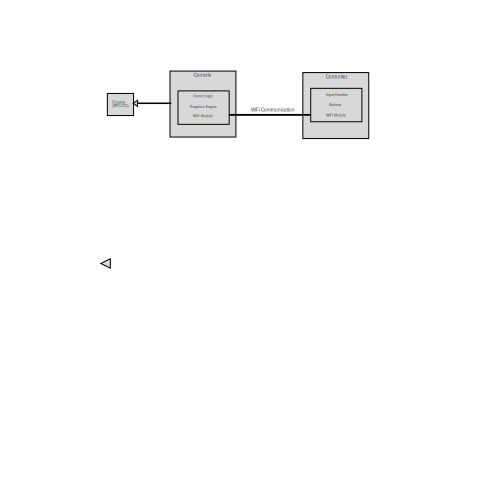
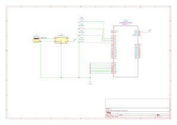

# Game Console
A custom-built gaming system with a WiFi-connected console and controller

:::info

**Author**: Alexandru Grecu \
**GitHub Project Link**: https://github.com/UPB-PMRust-Students/proiect-GrecuAlexandru

:::

## Description

The project is similar to a PlayStation or an Xbox. It has:
 - a console that runs a game by itself and displays it on a screen
 - a controller with buttons that runs separate from the console and transmits user input through WiFi

## Motivation

The motivation behind this project is to explore the fundamental principles of gaming systems by building a simplified, custom console-controller setup using the Raspberry Pi Pico 2W. By separating the console and controller and connecting them via WiFi, the project mimics real-world designs like PlayStation and Xbox, offering insights into wireless communication, embedded systems and real-time game processing. It also provides an opportunity to develop practical skills in hardware integration and also 3D modeling for building the plastic cases of the 2 components.

## Architecture

The system architecture consists of two main components: the Console and the Controller.

 - The Console includes the Raspberry Pi Pico W running the game logic, rendering 2D graphics (such as a Snake-like game) on an attached LCD display.

 - The Controller is a separate device, also based on a Raspberry Pi Pico W, equipped with tactile buttons to capture user inputs.

 - Communication between the Controller and the Console happens over WiFi. The Controller sends input data, and the Console processes it to update the game state and display it accordingly.

## Log

<!-- write your progress here every week -->

### Week 5 - 11 May
Started the project by setting up the Raspberry Pi Pico 2W and the LCD display. I managed to display a simple "Hello World" message on the screen. I also started working on the controller, connecting the buttons and testing their functionality.

### Week 12 - 18 May
I finished the whole harware setup, including drawing power from the 9V batteries. I also managed to send button presses from the controller to the console over WiFi. The console receives the input and displays the pressed button on the screen.

### Week 19 - 25 May

## Hardware

The project uses the following hardware components:

#### Console:
 - Raspberry Pi Pico 2W
 - 2.4 inch LCD IPS Display 240x320
 - DC-DC Step Down Module
 - 9V Battery Support
 - 9V Battery
 - Breadboard, Required wiring and connectors
 - Plastic Case (3D printed)

#### Controller:
 - Raspberry Pi Pico 2W
 - Tactile Buttons
 - 9V Battery Support
 - 9V Battery
 - Breadboard, Required wiring and connectors
 - Plastic Case (3D printed)

### Schematics

### Bill of Materials

| Device | Usage | Price |
|--------|--------|-------|
| [3x Raspberry Pi Pico 2W](https://www.raspberrypi.com/documentation/microcontrollers/pico-series.html#pico2w-technical-specification) | 2x microcontroller + 1x debugger | [117 RON](https://www.optimusdigital.ro/ro/placi-raspberry-pi/13327-raspberry-pi-pico-2-w.html?search_query=Raspberry+Pi+Pico+2W&results=26) |
| [Waveshare 2.4 inch LCD IPS Display 240x320](https://www.waveshare.com/wiki/2.4inch_LCD_Module) | Screen | [52 RON](https://www.tme.eu/en/details/wsh-18366/lcd-graphic-displays/waveshare/18366/) |
| 2x DC-DC Step Down Module LM2596S | DC-DC Step Down Module | [26 RON](https://www.optimusdigital.ro/ro/surse-coboratoare-reglabile/1108-modul-dc-dc-step-down-lm2596hv.html?search_query=Modul+DC-DC+Step+Down+LM2596S&results=2) |
| 2x 9V Battery Support | 9V Battery Support | [2,60 RON](https://www.optimusdigital.ro/ro/suporturi-de-baterii/20-conector-pentru-baterie-de-9-v.html?search_query=%09Suport+pentru+baterie+de+9+V&results=56) |
| 2x 9V Battery | 9V Battery | 20 RON |
| 4 Tactile Buttons | Tactile Buttons | 5 RON |
| Breadboard, Required wiring and connectors | Breadboard, Required wiring and connectors | 30 RON
| 3D Printed Plastic Cases | 3D Printed Plastic Cases | TBA |
| Total | | 252.6 RON |

## Software

| Library | Description | Usage |
|---------|-------------|-------|
| [ili9341](https://crates.io/crates/ili9341) | Display driver for ILI9341 | Used for the SPI LCD display |
| [embedded-graphics](https://github.com/embedded-graphics/embedded-graphics) | 2D graphics library | Used for rendering simple 2D graphics on the display |
| [cyw43](https://docs.rs/cyw43/latest/cyw43/) | WiFi driver for Raspberry Pi Pico 2W | Used to manage WiFi connections between the Controller and Console |

## Links