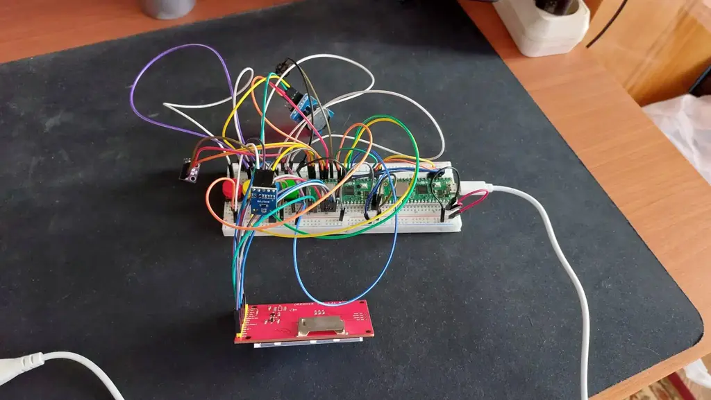
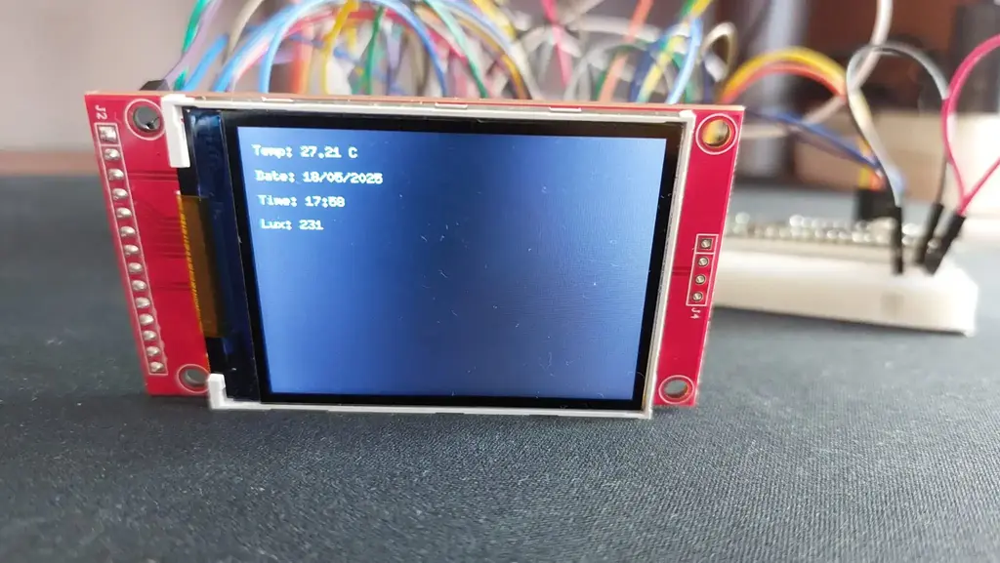
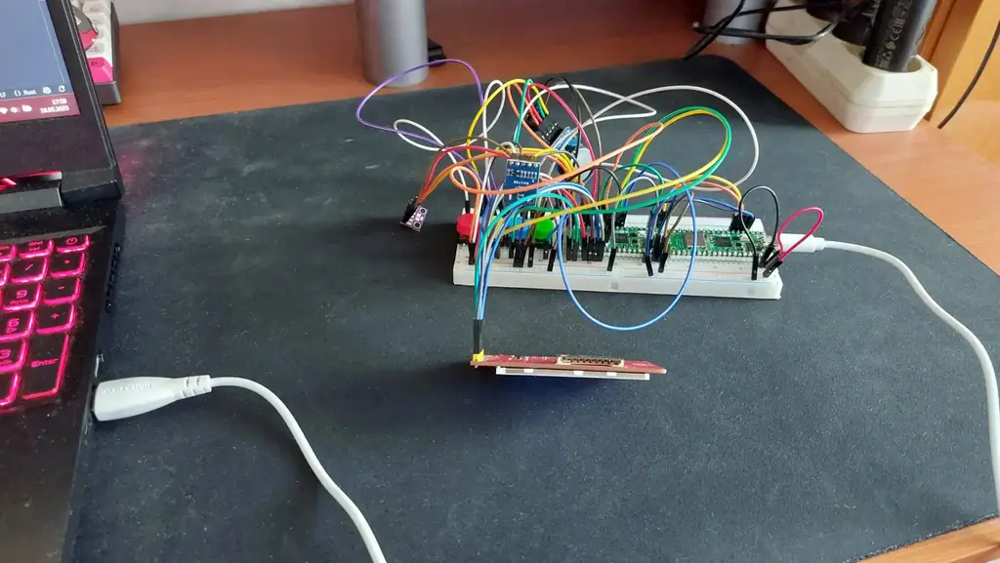
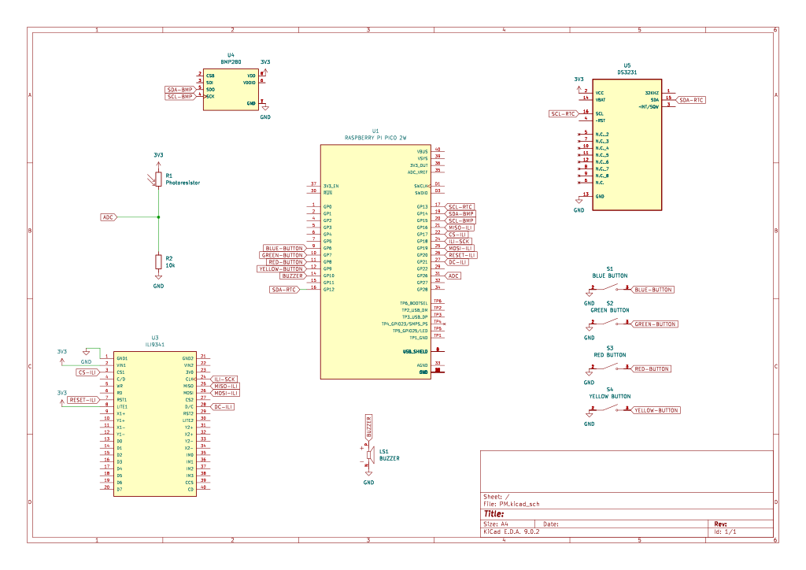

# PiBuzz
A multifunctional device which serves as a custom alarm clock, equipped with environmental sensors.

:::info 

**Author**: Samson Alexandru-Valentin \
**GitHub Project Link**: https://github.com/UPB-PMRust-Students/proiect-sammsonn

:::

## Description

A device that has the main functionality of a digital clock displayed on a screen with an alarm function, operated by physical buttons. The alarm is manually set by the user and would emit sound via the buzzer. The product is also equipped with a pressure and temperature sensor to observe the environmental conditions surrounding it. Aditionally, a photoresistor is used in order to automatically adjust the brightness of the display.


## Motivation

This project is inspired by a real world problem of mine, and it probably affects a lot of the current population, especially teenagers and young adults. When going to bed, I always take my phone with me and end up scrolling mindlessly for 1-2 hours. This has a very negative impact on my sleep, which is way more important than most think. But the main reason why I have my phone next to me in bed is because I use it as an alarm in order to wake up. This is also bad because the phone can overheat under the pillow, causing potential damage, and there is also the concern of EMF radiation exposure when keeping your cell phone close to the head for extended periods of time. So, building this clock by hand I can get rid of all these problems, removing the need of my smartphone at night.

## Architecture 


## Log

<!-- write your progress here every week -->

### Week 5 - 11 May

Soldered the pins to the microcontrollers and the sensors, reviewed all of the laboratories and inspected the data sheets of the hardware components used.

### Week 12 - 18 May

Wired the pieces to the raspberry pi pico, started working on the software, wrote code in order to test each component individually, then succesfully confirmed that all of them work together.

### Week 19 - 25 May

Completed the code, soldered all of the hardware on a perfo board and built the case for the clock.

## Hardware

The main hardware is the Raspberry Pi Pico 2W microcontroller, which provides processing and Wi-Fi connectivity. A DS3231 RTC module is used for precise timekeeping. Environmental sensors include a BMP280 (temperature, pressure) and a photoresistor (ambient light, for automatic display adjustment). The user interface consists of an ILI9341 (2.4 inch) color LCD for display and touch buttons for control. The audio alarm is handled by a buzzer. The components are interconnected on a perfo board using jumper wires and well powered.





### Schematics



### Bill of Materials

<!-- Fill out this table with all the hardware components that you might need.

The format is 
```
| [Device](link://to/device) | This is used ... | [price](link://to/store) |

```

-->

| Device | Usage | Price |
|--------|--------|-------|
| [Raspberry Pi Pico 2W](https://www.raspberrypi.com/documentation/microcontrollers/raspberry-pi-pico.html) | The microcontroller | [40 RON x 2](https://www.optimusdigital.ro/en/raspberry-pi-boards/13327-raspberry-pi-pico-2-w.html) |
| [ILI9341](https://cdn-shop.adafruit.com/datasheets/ILI9341.pdf) | Display | [67 RON](https://www.bitmi.ro/module-electronice/ecran-lcd-ili9341-cu-touch-si-slot-pentru-card-sd-2-4-10797-bitmi-ro.html) |
| [DS3231](https://www.analog.com/media/en/technical-documentation/data-sheets/ds3231.pdf) | RTC module | [19 RON](https://www.optimusdigital.ro/ro/altele/1102-modul-cu-ceas-in-timp-real-ds3231.html?search_query=ds3231&results=6) |
| [BMP280](https://www.bosch-sensortec.com/products/environmental-sensors/pressure-sensors/bmp280/) | Pressure and temperature sensor | [8.5 RON](https://www.optimusdigital.ro/en/pressure-sensors/1666-modul-senzor-de-presiune-barometric-bmp280.html) |
| Photoresistor | Photoresistor (type 5528) | [1.49 RON](https://www.optimusdigital.ro/en/others/1863-fotorezistor-tip-5528.html?search_query=photoresistor&results=19) |
| Buzzer | Active buzzer | [1 RON](https://www.optimusdigital.ro/en/buzzers/635-3v-active-buzzer.html) |
| Button | 12x12x7.3 button | [1.31 RON x 4](https://sigmanortec.ro/Buton-12x12x7-3-p160373654) |
| Button Cap | 12x12x7.3 button cap, multiple colors | [0.4 RON x 4](https://sigmanortec.ro/capac-buton-12x12x73-albastru) |
| Breadboard HQ | Breadboard with 830 slots | [10 RON](https://www.optimusdigital.ro/en/breadboards/8-breadboard-hq-830-points.html) |
| Pin Header | 2.54mm (40p) pin header | [1 RON x 3](https://www.optimusdigital.ro/ro/componente-electronice-headere-de-pini/463-header-de-pini-alb-254-mm-40p.html?search_query=header+de+pini+40&results=313) |
| Male-Male Wire Set | 10p, 10cm male-male wires | [2.85 RON](https://www.optimusdigital.ro/ro/fire-fire-mufate/885-set-fire-tata-tata-10p-10-cm.html?search_query=fire+tata-tata&results=73) |
| Male-Male Wire Set | 10p, 30cm male-male wires | [5 RON](https://www.optimusdigital.ro/ro/fire-fire-mufate/891-set-fire-tata-tata-10p-30-cm.html?search_query=tata-tata&results=692) |
| Female-Male Wire Set | 40p, 10cm female-male wires | [6 RON](https://www.optimusdigital.ro/ro/fire-fire-mufate/653-fire-colorate-mama-tata-40p-10-cm.html?search_query=fire+mama-tata&results=35) |
| Female-Male Wire Set | 40p, 15cm female-male wires | [8 RON](https://www.optimusdigital.ro/ro/toate-produsele/877-set-fire-mama-tata-40p-15-cm.html?search_query=fire+mama-tata&results=35) |


## Software

| Library (Crate)                                                              | Description                                                                                                | Usage in Project                                                                                                                               |
| :--------------------------------------------------------------------------- | :--------------------------------------------------------------------------------------------------------- | :--------------------------------------------------------------------------------------------------------------------------------------------- |
| **Core Embassy & HAL**                                                       |                                                                                                            |                                                                                                                                                |
| [`embassy-rp`](https://github.com/embassy-rs/embassy/tree/main/embassy-rp)     | Asynchronous Hardware Abstraction Layer (HAL) for the RP2350 microcontroller (Pico W).                      | Provides fundamental access to peripherals: GPIO (Buttons, Buzzer, Display Control), I2C (RTC, BMP280), SPI (Display), ADC (LDR), DMA, Timers. |
| [`embassy-executor`](https://github.com/embassy-rs/embassy/tree/main/embassy-executor) | Asynchronous runtime executor for the Embassy framework.                                                     | Managing and running concurrent asynchronous tasks (`main` task, `button_and_buzzer_task`).                                                    |
| [`embassy-time`](https://github.com/embassy-rs/embassy/tree/main/embassy-time)   | Timekeeping utilities, timers, and delays for asynchronous tasks within the Embassy framework.             | Used for `Timer::after()` for periodic operations, and `EmbassyDelay` for blocking delays needed by display initialization.                    |
| [`embassy-sync`](https://github.com/embassy-rs/embassy/tree/main/embassy-sync)   | Synchronization primitives (like Mutex) for safe concurrent access to shared data in async environments. | Used for `Mutex<NoopRawMutex, _>` to share the SPI bus for the display and potentially other SPI devices (though IMU part was commented out). |
| [`embassy-embedded-hal`](https://github.com/embassy-rs/embassy/tree/main/embassy-embedded-hal) | Provides adapter types to use `embedded-hal` blocking traits with Embassy's async SPI/I2C.         | Used for `SpiDevice` to wrap the shared SPI bus for the display, providing a blocking-like interface.                                        |
| **Low-Level & Panic Handling**                                               |                                                                                                            |                                                                                                                                                |
| [`cortex-m`](https://crates.io/crates/cortex-m)                              | Low-level access to ARM Cortex-M processor core peripherals and intrinsics.                                | (Often used indirectly by HALs and runtime, e.g., for critical sections). Not explicitly used for peripherals in your `main` but foundational.   |
| [`cortex-m-rt`](https://crates.io/crates/cortex-m-rt)                          | Minimal runtime for Cortex-M microcontrollers, handles startup and interrupt vector setup.                 | Provides the `#[entry]` macro for the main function (though `#[embassy_executor::main]` is used now). Foundational.                             |
| [`panic-probe`](https://crates.io/crates/panic-probe)                          | A panic handler that prints panic messages via a debug probe (e.g., RTT using `probe-rs`).                 | Defines the behavior when the program panics, sending details to the debugger.                                                                 |
| **Logging**                                                                  |                                                                                                            |                                                                                                                                                |
| [`defmt`](https://crates.io/crates/defmt)                                    | Highly efficient deferred formatting logger for embedded systems.                                          | Used for all logging output (`info!`, `error!`, `warn!`).                                                                                        |
| [`defmt-rtt`](https://crates.io/crates/defmt-rtt)                              | Implements a `defmt` global logger that sends log data over RTT (Real-Time Transfer) to a debug probe.     | Enables viewing `defmt` logs via `probe-rs`.                                                                                                   |
| **Display & Graphics**                                                       |                                                                                                            |                                                                                                                                                |
| [`mipidsi`](https://crates.io/crates/mipidsi)                                  | Generic driver for MIPI Display Serial Interface (DSI) compatible displays, including ILI9341.            | Used to initialize and control the ILI9341 display (clear, set orientation).                                                                   |
| [`display-interface-spi`](https://crates.io/crates/display-interface-spi)      | Provides an SPI-based communication interface for display drivers like `mipidsi`.                          | Bridges the `mipidsi` driver with the underlying SPI HAL.                                                                                        |
| [`display-interface`](https://crates.io/crates/display-interface)              | Defines traits for display communication interfaces.                                                       | (Dependency of `display-interface-spi`).                                                                                                       |
| [`embedded-graphics`](https://crates.io/crates/embedded-graphics)              | A 2D graphics library for drawing shapes, text, and images on embedded displays.                           | Used for defining text styles, drawing text (`Text`), and shapes (`Rectangle`) on the ILI9341 display.                                      |
| **Utilities**                                                                |                                                                                                            |                                                                                                                                                |
| [`heapless`](https://crates.io/crates/heapless)                                | Provides data structures (like `String`) that do not require dynamic memory allocation (`std`'s `alloc`).    | Used for `HString` to create fixed-size string buffers for formatting text to be shown on the display.                                       |
| [`embedded-hal-async`](https://crates.io/crates/embedded-hal-async)            | Asynchronous hardware abstraction traits for embedded systems (e.g., async I2C).                           | The `I2c` trait from this is used to enable methods like `.read()`, `.write()`, `.write_read()` on `embassy_rp::i2c::I2c`.                    |
| `core::fmt::Write`                                                           | Standard library trait for formatting into a writer (available in `no_std` through `core`).              | Used with `heapless::String` and the `write!` macro to format variables into displayable strings.                                             |



## Links

<!-- Add a few links that inspired you and that you think you will use for your project -->

1. [Raspberry Pi Pico - Alarm Clock Project](https://www.youtube.com/watch?v=EOMcPAKL6RM)
2. [pico-alarm-clock](https://github.com/wahlencraft/pico-alarm-clock)
3. [Raspberry Pi Pico - Alarm Clock](https://www.instructables.com/Raspberry-Pi-Pico-Alarm-Clock/)

