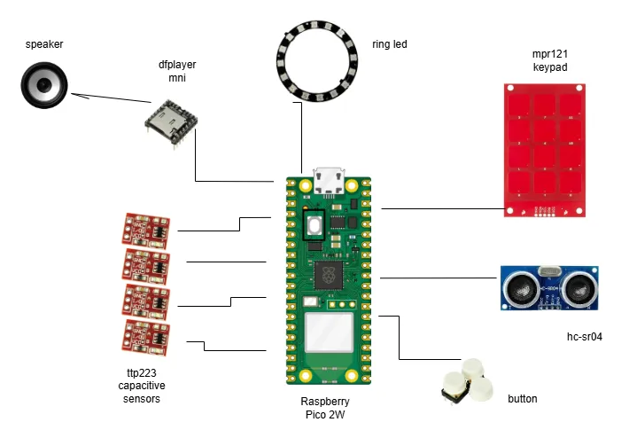
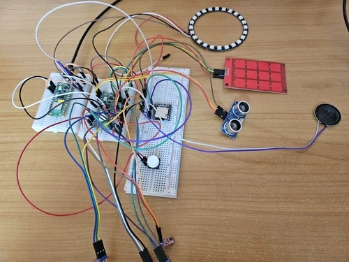
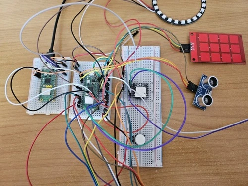
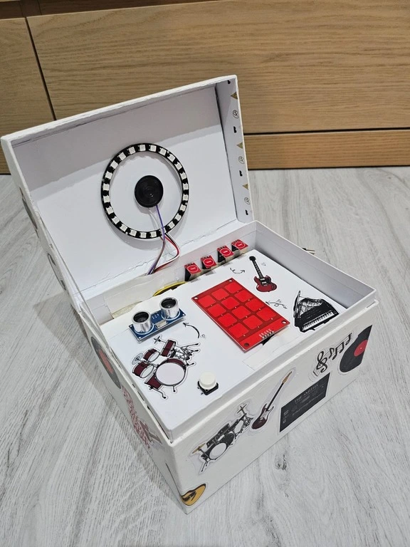
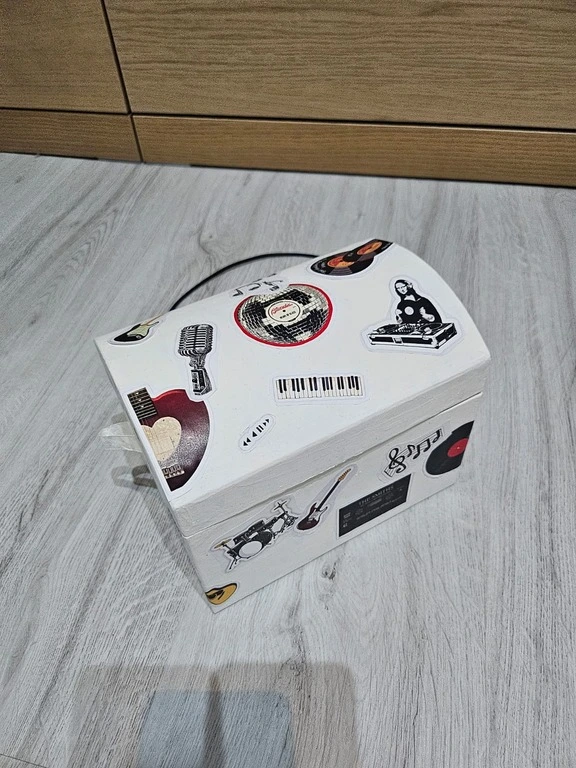
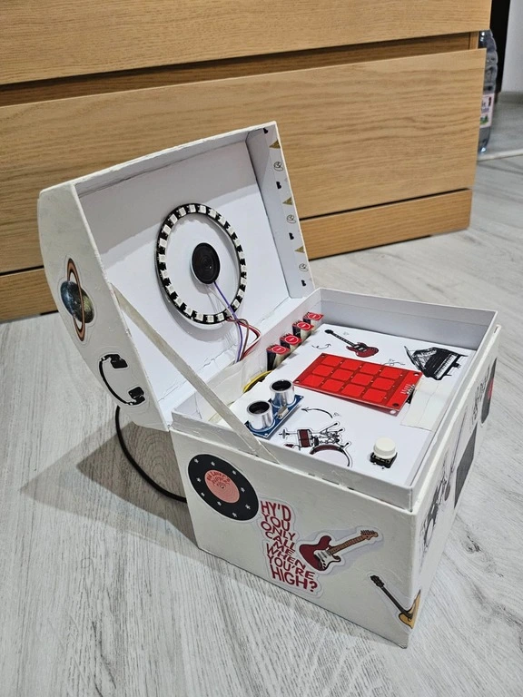
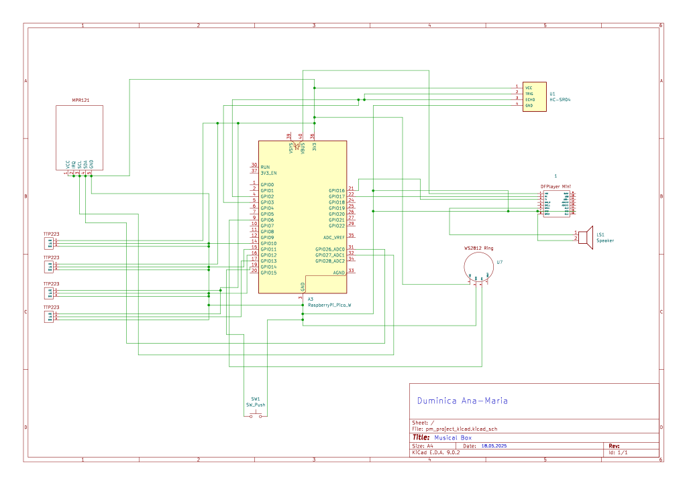

# Musical Box
A multi-instrument musical interaction system using gesture and touch.

:::info
    
**Author:** Duminica Ana-Maria \
    **GitHub Repository:** [github.com/UPB-PMRust-Students/proiect-Ana-MariaDuminica](https://github.com/UPB-PMRust-Students/proiect-Ana-MariaDuminica)

:::

## Description
Musical Box is an interactive embedded system that simulates a compact music instrument station, allowing users to trigger piano notes, drum beats, or guitar-like sounds through capacitive touch or hand gestures. The system is powered by a Raspberry Pi Pico 2W and includes capacitive touch sensors, an ultrasonic distance sensor, a WS2812B RGB LED ring for visual feedback, and a DFPlayer Mini audio module connected to a speaker for high-quality sound output. Together, these components create a synchronized audio-visual experience that is both engaging and responsive.

## Motivation
Being passionate about music, I wanted to incorporate this personal interest into a technical project that would allow me to explore creativity through embedded systems.
This project offered the opportunity to design an interactive musical device by combining sensor input, real-time audio feedback and visual effects. It represents a blend of artistic expression and engineering and allowed me to apply and deepen my knowledge of embedded programming while creating something both functional and engaging.

## Architecture

The system continuously monitors user interaction through various input methods. A single physical button is used to trigger the playback of a predefined melody. When pressed, it sends a command to the audio module to begin playback, while visual feedback is displayed on the RGB LED ring to indicate that AutoPlay mode is active.

Outside of this playback mode, the system responds in real time to sensor input. Capacitive touch sensors (both TTP223 and MPR121) are used to simulate piano or guitar-like interactions. Each touch triggers a distinct sound and corresponding lighting effect. Additionally, the ultrasonic sensor detects hand proximity and is used to simulate drum-like sounds based on the measured distance.

Each interaction is translated into sound by sending commands to the DFPlayer Mini, and the LED ring lights up in different colors or patterns depending on which input was triggered. This creates an engaging audio-visual experience where every touch or gesture results in immediate feedback.

The logic is designed to keep these input-output flows independent but coordinated—only the button triggers the melody playback, while all other inputs directly play individual sounds. This ensures both interactive and automatic playback coexist within the same system, offering users multiple ways to explore sound.

## Log

### Week 5 - 11 May
During this week, I focused on gathering and organizing all the hardware components required for the project. I purchased the necessary sensors and modules, including the capacitive touch sensors (TTP223), the capacitive keypad (MPR121), an ultrasonic distance sensor (HC-SR04), a WS2812B RGB LED ring, and the DFPlayer Mini audio module. 

After identifying each component, I began connecting them to the breadboard. I carefully checked the datasheets to understand the correct wiring for each module. I connected power lines (VCC and GND) to the 3.3V and 5V rails as needed, taking into account the logic level requirements of each device. Special attention was paid to ensuring that each sensor shared a common ground and that the Raspberry Pi Pico provided consistent voltage.

I double-checked the wiring for each device to make sure the pin mappings matched the hardware configuration I was planning to use in the code later. At the end of the week, all the sensors were connected individually and powered, with initial checks confirming that no short circuits or connection issues were present.

### Week 12 - 18 May
In this week, I assembled the full hardware setup by wiring all the sensors and modules together. This included connecting the MPR121 keypad via the I2C interface, the ultrasonic sensor with its TRIG and ECHO pins, and the WS2812B LED ring using a data pin from the Pico. 

I also connected the DFPlayer Mini audio module using UART communication pins (TX and RX). While the module powers on and the microSD card is detected, I am still working on getting audio playback to work. I suspect the issue may be related to voltage levels or incorrect communication timing, so I will continue troubleshooting. I also plan to add a 1k ohms resistor or level shifter between the TX (Pico) and RX (DFPlayer) for protection.

### Week 19 - 25 May
This week marked the completion of the project. I successfully resolved the communication with the DFPlayer Mini, which now works reliably with all types of input. The code was finalized to correctly map each sensor to a corresponding sound—whether it's a piano note, drum beat, or guitar strum—and the DFPlayer responds without delay or error.

All audio tracks were loaded onto the microSD card, and each sensor interaction was tested to ensure accurate and synchronized audio-visual feedback. The four modes—Piano, Guitar, Drums, and AutoPlay—are now fully functional and polished.

I also completed the physical assembly of the musical box. I built a cardboard enclosure to organize and protect the internal components, with clean cutouts for all sensors and visible LEDs. The layout was optimized for accessibility and aesthetics, and all wiring was secured inside the box to ensure stability during use.

## Hardware
**Raspberry Pi Pico 2W**
This microcontroller was chosen for its performance, USB connectivity, and compatibility with Rust (via the Embassy framework). One Pico is used as the main controller, while a second one served as a debug probe during development.

**Capacitive Touch Sensors – TTP223**
These sensors provide a simple and responsive way to detect touch input without mechanical buttons. I used four of them to trigger sound or lighting effects independently. They are easy to interface via GPIO.

**Capacitive Keypad – MPR121**
The MPR121 module offers up to 12 capacitive touch inputs over I2C, ideal for implementing piano-style input. Its high sensitivity and compact form factor allowed for a more advanced interaction mode without using many GPIOs.

**Ultrasonic Sensor – HC-SR04**
This sensor detects hand gestures or proximity, especially useful in "drum" mode. It was chosen for its simplicity, affordability, and compatibility with the 3.3V logic of the Pico. Distance readings are averaged for stability.

**WS2812B RGB LED Ring**
The LED ring creates real-time visual feedback by lighting up in different colors depending on sensor input or active mode. It consists of 24 addressable LEDs and is controlled over a single GPIO pin using the smart-leds crate.

**DFPlayer Mini + Speaker**
For audio output, I used the DFPlayer Mini module connected to an external 8 ohms speaker. It plays .mp3 files directly from a microSD card. I chose it because it offloads audio playback from the microcontroller and supports UART commands.

**Push Button**
A standard push-button was used to toggle between lighting patterns. It is connected to a GPIO pin with pull-up configuration and used to demonstrate simple mechanical input.

All components were assembled across three connected breadboards in a single compact layout. The design prioritizes accessibility and minimization of wire length.
All components share a common GND rail, and power lines are distributed using the breadboard rails (3.3V or 5V depending on the device). Color-coded jumper wires were used where possible, although the complexity of the layout led to inevitable overlap between wires.
This configuration allowed for fast prototyping and iterative testing of each module.

### Schematics 

### Bill of Materials
| Device                                       | Usage                                            | Price |
|---------------------------------------------|--------------------------------------------------|-------|
| [Raspberry Pi Pico 2W (x2)](https://www.optimusdigital.ro/ro/placi-raspberry-pi/13327-raspberry-pi-pico-2-w.html?search_query=raspberry+pico+2w&results=26)       | The microcontroller (main logic & debug probe)   | 80 RON |
| [Breadboard (x3)](https://www.optimusdigital.ro/ro/prototipare-breadboard-uri/44-breadboard-400-points.html?search_query=breadboard&results=126)                 | Prototyping area for each Pico                   | 14 RON |
| [Capacitive Touch Sensor TTP223 (x4)](https://www.optimusdigital.ro/ro/senzori-senzori-de-atingere/861-modul-cu-senzor-capacitiv-ttp223.html?search_query=ttp223&results=3)  | Detecting touch for interaction                  | 12 RON  |
| [Push Button](https://www.optimusdigital.ro/ro/butoane-i-comutatoare/1115-buton-cu-capac-rotund-alb.html?search_query=buton&results=212)               | Manual input | 3 RON  |
| [WS2812B RGB LED Ring (24 LEDs)](https://www.optimusdigital.ro/ro/optoelectronice-altele/12342-inel-de-led-uri-rgb-ws2812-cu-16-led-uri.html?search_query=ring+led&results=40)  | Visual feedback and lighting effects             | 29 RON |
| [HC-SR04 Ultrasonic Sensor](https://www.optimusdigital.ro/ro/senzori-senzori-ultrasonici/2328-senzor-ultrasonic-de-distana-hc-sr04-compatibil-33-v-i-5-v.html?search_query=senzor+hc-sr04&results=31)       | Gesture-based distance control (drums)     | 15 RON |
| [MPR121 Touch Keypad Module](https://www.optimusdigital.ro/ro/senzori-senzori-de-atingere/5693-modul-senzor-de-atingere-capacitiv-mpr121-cu-tastatura.html?search_query=mpr121&results=6)      | Piano input (capacitive keys)                    | 30 RON |
| [Jumper Wires M-M](https://www.optimusdigital.ro/ro/fire-fire-mufate/890-set-fire-tata-tata-40p-30-cm.html?search_query=fire+tata+tata&results=73)                | Connecting components on breadboards             | 8 RON |
| [Jumper Wires F-M](https://www.optimusdigital.ro/ro/fire-fire-mufate/878-set-fire-mama-tata-40p-30-cm.html?search_query=fire+mama+tata&results=35)   | For sensors/modules requiring different headers  | 10 RON |
| [Speaker 8 ohmi 0.5W](https://sigmanortec.ro/Boxa-ultra-subtire-40mm-8-ohms-0-5W-p136285784?SubmitCurrency=1&id_currency=2&gad_source=1&gad_campaignid=22174019478&gbraid=0AAAAAC3W72Mtzy7jY3q2IvRJJL2399kKi&gclid=CjwKCAjw_pDBBhBMEiwAmY02NtPnIqkxNg4ZmK26p9i91u8T5bgbV81AuKmux0baOhhTvrygPK2iSxoCPTIQAvD_BwE)             | Audio output with DFPlayer for richer playback   | 2.75 RON  |
| [DFPlayer Mini](https://ardushop.ro/ro/module/1473-modul-mp3-player-dfplayer-mini-6427854021755.html?gad_source=1&gad_campaignid=22058879462&gbraid=0AAAAADlKU-7PEV5lsPU-XVtSXtrR2XUkh&gclid=CjwKCAjw_pDBBhBMEiwAmY02NpyiElR6CSrAJdoje164x_wAbPqWHRvNSTUe2EFWum29UA_8CqHcbxoCiJwQAvD_BwE)                   | MP3 playback module with microSD support         | 16 RON |

## Software
| Library              | Description                                      | Usage                                                |
|----------------------|--------------------------------------------------|------------------------------------------------------|
| [embassy-rp](https://github.com/embassy-rs/embassy/tree/main/embassy-rp)           | HAL for Raspberry Pi Pico                        | Access to hardware peripherals (GPIO, PWM, I²C, etc.)|
| [embassy-time](https://github.com/embassy-rs/embassy/tree/main/embassy-time)         | Async delays & timers                            | Used for non-blocking delays and timing              |
| [defmt + defmt-rtt](https://github.com/knurling-rs/defmt)           | Embedded logging via RTT                         | Sending debug messages to the host                   |
| [panic-probe](https://docs.rs/panic-probe/latest/panic_probe/)        | Minimal panic handler with logging               | Displays panic messages through RTT                  |
| [embedded-hal](https://github.com/rust-embedded/embedded-hal)         | Hardware Abstraction Layer traits                | Interface for I²C, PWM, and other peripheral drivers |
| [smart-leds](https://github.com/smart-leds-rs/smart-leds)             | WS2812 RGB LED control                           | Controls the RGB LED ring                            |
| [embassy-executor](https://github.com/embassy-rs/embassy/tree/main/embassy-executor) | Async task executor                              | Runs `async` tasks concurrently on the microcontroller |

### Software Design
The software is developed in Rust using the Embassy async embedded framework, providing non-blocking execution across tasks. Each input method (touch sensors, ultrasonic sensor, push button) is processed independently using asynchronous tasks and delays. Based on the input type, the system triggers audio playback through the DFPlayer Mini (via UART) and visual feedback via WS2812B LEDs (controlled using PIO).

The architecture ensures responsive handling of all user interactions:
Touch inputs are polled via GPIO or I2C and immediately mapped to audio tracks and LED colors.
Ultrasonic sensor is used for gesture-based control with debounced logic using distance stability over time.
Push button toggles a separate AutoPlay mode, triggering continuous playback and an animated rainbow LED pattern.
All logic is designed to run on a single Raspberry Pi Pico using Embassy’s async executor and Rust’s no_std environment.

## Links
[Raspberry Pi Pico Documentation](https://www.raspberrypi.com/documentation/microcontrollers/)  
[DFPlayer Mini Audio Module](https://wiki.dfrobot.com/DFPlayer_Mini_SKU_DFR0299)  
[WS2812B RGB LED Ring Guide](https://learn.adafruit.com/adafruit-neopixel-uberguide)  
[Embassy Framework for Embedded Rust](https://github.com/embassy-rs/embassy)  