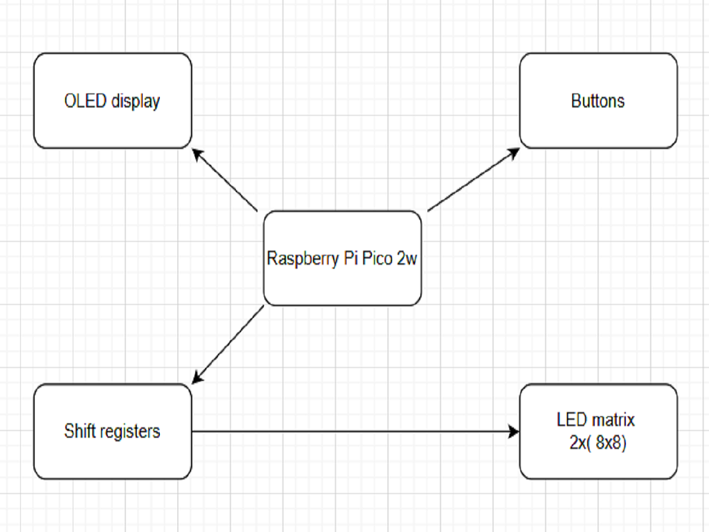
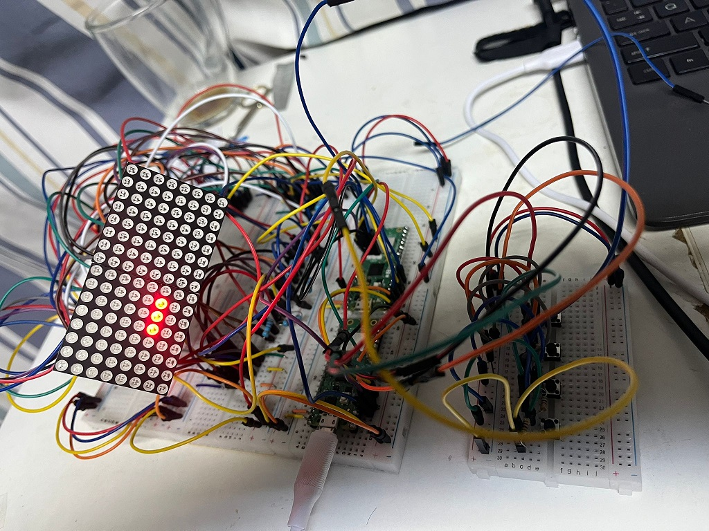
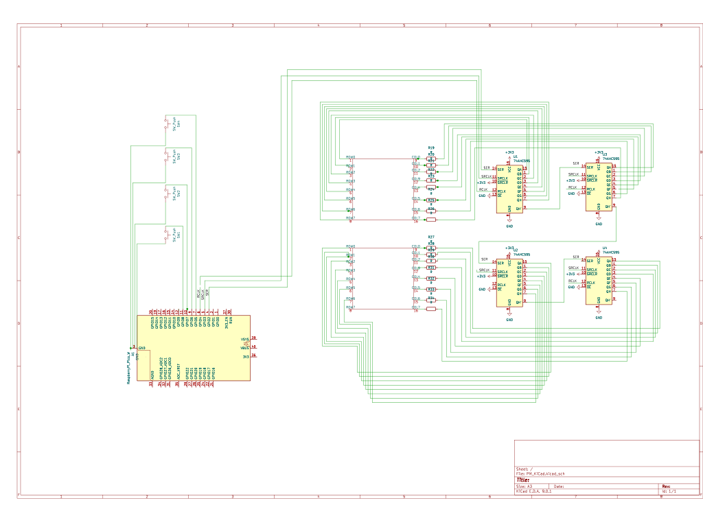

# Glow Worm

A game implemented on the Raspberry Pi Pico 2W using Rust and displayed on an LED matrix, where a led-worm eats apples and earns points.

:::info

**Author**: Andrei Anca-Teodora \
**GitHub Project Link**: [link_to_github](https://github.com/UPB-PMRust-Students/proiect-Ancaa8)

:::

## Description

The project consists of implementing the game on an embedded Raspberry Pi Pico 2W platform. The visual output is handled by a 16x8 LED matrix, which is assembled from two 8x8 modules arranged in a square grid. These modules are driven using a series of 74HC595 shift registers that allow efficient control of each individual LED through serial communication. User input is managed through four push buttons, each corresponding to a movement direction (up, down, left, right), and an oled display is included to provide the score during gameplay. The game logic, input handling, and LED display updates are all implemented in the Rust programming language. The game is about a worm formed from 3 leds that eats apples and earns points.

## Motivation

I chose this project because it combines embedded programming in Rust with hands-on experience in hardware design and control. It offers a practical and engaging way to explore how low-level code interacts with physical components like LEDs, buttons, and buzzers. Developing a visual and interactive game makes the learning process more intuitive and rewarding. Additionally, using the Raspberry Pi Pico 2W provides a modern and affordable platform for experimenting with GPIOs, timing mechanisms, and shift registers, all within a real-time embedded environment.

## Architecture

### Raspberry Pi Pico 2W  
**Role**: Main microcontroller responsible for game logic, managing input from buttons, sending data to the LED matrix through shift registers, and generating visual feedback with the oled display.
**Connections**:  
- Shift Registers (data, latch, clock pins via GPIO)  
- Buttons (4 directional input pins via GPIO)  
- Oled display(I2C interface)
- Shared GND and power lines  

---

### LED Matrix 16x8 (composed of 2x 8x8 modules)  
**Role**: Visual output for displaying the game.  
**Connections**:  
- Driven by 4 x 74HC595 shift registers connected in daisy-chain  
- Common power and ground  
- Controlled via serial data sent by the microcontroller  

---

### Shift Registers (74HC595, x4)  
**Role**: Serial-to-parallel conversion; extends GPIOs to control multiple LEDs across the matrix.  
**Connections**:  
- Connected in series (Q7' to DS of next register)  
- Data, Latch, and Clock lines connected to Pico GPIO pins  
- Outputs connected to LED matrix rows/columns  

---

### Buttons (x4)  
**Role**: User input for controlling the direction of the Worm (Up, Down, Left, Right).  
**Connections**:  
- One pin each to a dedicated GPIO on the Pico  
- Connected with 5.1kΩ pull-down resistors to ensure stable logic levels  

---

### OLED Display  
**Role**: Displays game information such as score or status updates, enhancing user interaction.  
**Connections**:  
- Connected via I2C interface (typically GPIO4 – SDA, GPIO5 – SCL)  
- Shared ground and power lines

## Log

### Week 5 - 11 May  
Completed the initial documentation and connected the main board and the debugging module.

### Week 12 - 18 May  
Placed all hardware components onto the breadboard.

### Week 19 - 25 May
Implemented the full game logic, button input handling, and LED matrix display updates using async Rust with Embassy.

## Hardware

The project uses the Raspberry Pi Pico 2W as the main microcontroller responsible for handling all game logic, input processing, and LED matrix control. Two 8x8 LED matrix modules are combined to form a 16x8 display, providing a visual interface for the Glow Worm game. These matrices are driven using 74HC595 shift registers, which allow serial-to-parallel conversion and enable control of a large number of LEDs using limited GPIO pins. Four buttons are connected to GPIO pins to allow directional input from the user, enabling gameplay interaction. Additionally, an oled display is used to provide basic visual feedback for scoring.

## Schematics

## Bill of Materials

| Device                  | Usage                              | Price     |
|-------------------------|------------------------------------|-----------|
| Raspberry Pi Pico 2W    | The microcontroller                | 35 RON    |
| LED Matrix 8x8 (x2)     | Game display                       | 30 RON    |
| Shift Register 74HC595  | Parallel control for LEDs          | 12 RON    |
| Buttons (x4)            | Direction control                  | 4 RON     |
| Oled display            | Visual feedback                    | 17 RON    |
| Resistors (220Ω, 5.1kΩ) | Current limiting, pull-down        | 10 RON    |
| Breadboard (x4)         | Rapid prototyping                  | 72 RON    |
| Connection wires        | GPIO wiring                        | 15 RON    |

## Software

## Software

| Library                                                                 | Description                                 | Usage                                                   |
|-------------------------------------------------------------------------|---------------------------------------------|---------------------------------------------------------|
| [embassy-rp](https://github.com/embassy-rs/embassy)                     | HAL pentru Raspberry Pi Pico cu async/await | Control GPIO, SPI și alte periferice                    |
| [embassy-executor](https://github.com/embassy-rs/embassy)               | Async task executor pentru embedded         | Rulează loop-ul principal al jocului                    |
| [embassy-time](https://github.com/embassy-rs/embassy)                   | Temporizatoare și delay-uri async           | Realizează pauze și sincronizare afișaj                 |
| [defmt](https://github.com/knurling-rs/defmt) & [defmt-rtt](https://github.com/knurling-rs/defmt) | Logging eficient pentru embedded | Debug output și mesaje în timp real                     |
| [panic-probe](https://crates.io/crates/panic-probe)                     | Gestionare panic                            | Afișare erori și oprire controlată în caz de panică     |

## Links

1. [link ...](https://ocw.cs.pub.ro/courses/pm/prj2023/drtranca/snake)
