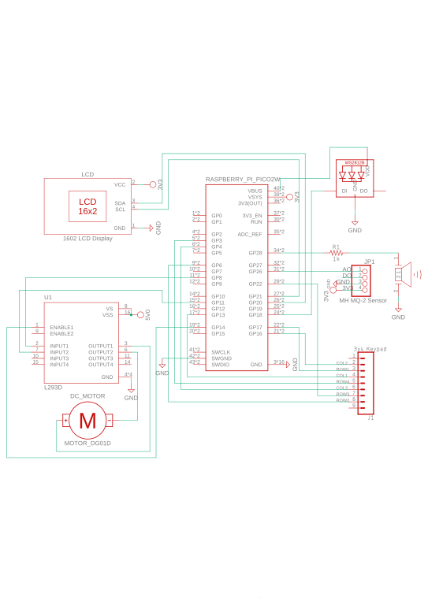
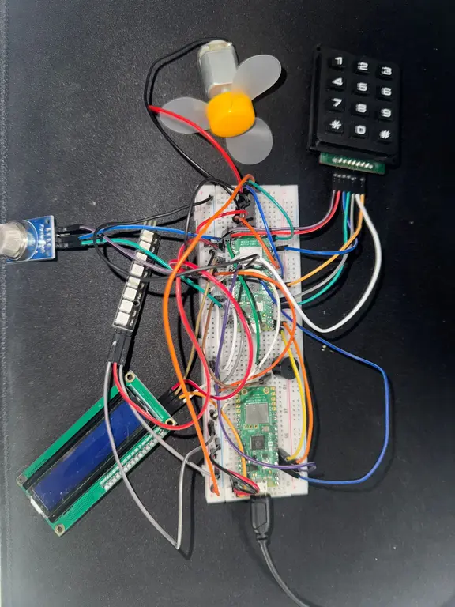
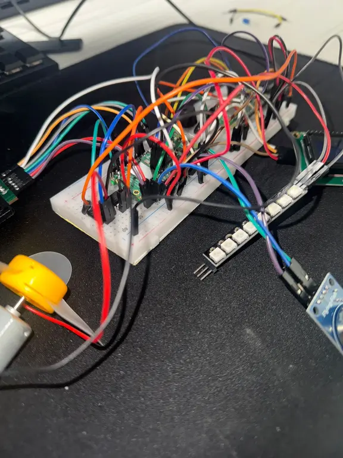

# Smoke Detector 
A smart smoke detector with visual, auditory, and remote alerting capabilities.

:::info
**Author:** Ureche Andreea-Maria 

**GitHub Project Link:** https://github.com/UPB-PMRust-Students/proiect-urecheandreea
:::

## Description
<!-- Describe in a few words your project idea. -->
This project consists of building a smoke detector using a Raspberry Pi Pico 2W. The device detects the presence of smoke and notifies the user via email. A visual indicator (LED strip), a buzzer, and a fan are also included to provide immediate feedback and ventilation. The alarm can be turned off by entering a verification code received through email on a keyboard module.

## Motivation

<!-- Why did you choose this project? -->
The project was chosen to address the need for affordable, customizable, and connected safety systems for smoke detection. It aims to provide a cost-effective, open-source alternative that not only detects smoke but also alerts users in real time via email, allowing for faster reaction in emergency situations.
From a learning perspective, this project also provides an opportunity for me to lear and deepen my understanding of embedded systems and to gain practical experience with Rust programming in a real-world context.
Overall, this is both a learning journey and a way to build something useful.

## Architecture

<!-- Add here the schematics with the architecture of your project. Make sure to include:
what are the main components (architecture components, not hardware components)
how they connect with each other -->
The architecture consists of the following main components:

- **Sensor Module**: Smoke detection using MH MQ-2 sensor.
- **Microcontroller**: Raspberry Pi Pico 2W acts as the main controller.
- **Network Stack**: Provides email notifications via SMTP over WiFi.
- **User Interface**: 3x4 Keyboard module for disabling the alarm with code verification.
- **Feedback Systems**:
  - WS2812 RGB LED strip for smoke level indication.
  - Buzzer for audible alert.
  - L293D H-Bridge Motor Driver because the board isn't powerful enough alone to power a motor 
  - DC Motor with fan for smoke evacuation.
  - LCD to provide an interface for displaying information.

## Log
<!-- 
Week 5 - 11 May
Week 12 - 18 May
Week 19 - 25 May -->
| Week        | Activity                                  |
|-------------|-------------------------------------------|
| Week 5  - 11 May    | Finished the project documentation and started working on the initial wiring as well as some part of the software.    |
| Week 12 - 18 May   | Updated the project documentation, uploaded the pictures with the hardware and the Schematics. |
| Week 19  - 25 May  ||

## Hardware 

<!-- Detail in a few words the hardware used. -->
The smoke detector system is built around the Raspberry Pi Pico 2W, a Wi-Fi enabled microcontroller that serves as the core of the project. 
To detect the presence of smoke, the project uses an MH MQ-2 gas sensor, which provides analog readings corresponding to the level of smoke in the air. These readings are processed by the Pico through its ADC (analog-to-digital converter), and if a dangerous threshold is crossed, an alert is initiated.
As part of the feedback mechanism, the system includes a WS2812 RGB LED Bar, which visually indicates the current smoke level using different color patterns.
Additionally, a buzzer is used to provide a loud audio alert when smoke is detected. It is connected via a PWM-capable GPIO pin for tone control.
For active smoke evacuation, a small DC motor with propeller (fan) is activated during high smoke levels. I also used a L293D H-Bridge Motor Driver between the MCU and the motor that enables a voltage to be applied across a load in opposite direction as the MCU isn't powerful enough alone to power the DC motor.
User interaction is facilitated by a 3x4 keyboard module, which allows users to input a verification code received by email to stop the alert. 
A 1602 LCD is also included in the system to display useful information when smoke is detected and to enter the code provided.  
 
#### Schematics
<!-- Place your KiCAD schematics here. -->

#### Bill Of Materials

| Device                                                                    | Usage                        | Price                                                              |
|---------------------------------------------------------------------------|------------------------------|--------------------------------------------------------------------|
| [Raspberry Pi Pico 2W](https://datasheets.raspberrypi.com/picow/pico-2-w-datasheet.pdf)       | The microcontroller          | [40 RON](https://www.optimusdigital.ro/en/raspberry-pi-boards/13327-raspberry-pi-pico-2-w.html?search_query=raspberry+pi+pico+2w&results=36)                    |
| [MQ-4 Gas Sensor](https://cdn.sparkfun.com/assets/e/f/c/7/d/MQ-4.pdf) | Smoke detection              | [10 RON](https://www.optimusdigital.ro/en/gas-sensors/1130-modul-senzor-de-gaz-mq-4.html) |
| [DC Motor with Propeller Fan](https://www.electronicwings.com/components/propeller-fan-for-dc-motor/1/datasheet)  | Smoke evacuation             | [8 RON](https://protosupplies.com/product/3v-dc-hobby-motor-with-fan/)|
| [Keyboard Module](https://mm.digikey.com/Volume0/opasdata/d220001/medias/docus/794/3845_Web.pdf)      | User input (code entry)      | [19 RON](https://www.optimusdigital.ro/en/others/5825-keyboard-module.html?search_query=keyboard+module&results=19)    |
| [WS2812 RGB LED Bar](https://cdn-shop.adafruit.com/datasheets/WS2812.pdf)                    | Visual feedback              | [7 RON](https://www.optimusdigital.ro/en/led-bars/753-bara-de-led-uri-rgb-ws2812-cu-8-led-uri.html?search_query=Led+bar&results=173)             |
| [1602 LCD](https://docs.sunfounder.com/projects/ultimate-sensor-kit/en/latest/components_basic/21-component_i2c_lcd1602.html)                     | Information display          | [17 RON](https://www.optimusdigital.ro/en/lcds/2057-1602-5-v-lcd-with-yellow-green-backlight-module-and-pines.html?search_query=lcd&results=259)                  |
| [Passive Buzzer](https://docs.sunfounder.com/projects/ultimate-sensor-kit/en/latest/components_basic/26-component_buzzer.html)        | Audio alert                  | [1.40 RON](https://www.optimusdigital.ro/en/buzzers/634-5v-passive-buzzer.html?search_query=BUZZER&results=87)                      |
| [L293D Motor Driver](https://storage.googleapis.com/etystorage/DataSheet/l293-l293d-datasheet.pdf) |  Control the direction and speed of DC motor | [3 RON](https://www.ardumarket.ro/ro/product/l293d-motor-driver-ic?gad_source=1&gad_campaignid=22143406947&gbraid=0AAAAA-sic2TXGO4ckq7TMNGct-V4kJetp&gclid=Cj0KCQjwiqbBBhCAARIsAJSfZka9epqkGVk_MUX0QJo-nNCkiekhZLs0nj97msk1QUcpYIDuDqLZ4jgaAnrBEALw_wcB)
| Breadboard & Wires    | Board     | [22 RON](https://www.optimusdigital.ro/ro/kituri/2222-kit-breadboard-hq-830-p.html?search_query=breadboard&results=127)                      |
## Software

| Library                                                                                         | Description                                                 | Usage                                                             |
|-------------------------------------------------------------------------------------------------|-------------------------------------------------------------|-------------------------------------------------------------------|
|    |                     |
| [embassy-net](https://github.com/embassy-rs/embassy/tree/main/embassy-net)                                        | Networking stack on top of Embassy                          | Wi-Fi setup, TCP/IP sockets, DNS, SMTP transport                  |
| [embassy-rp](https://github.com/embassy-rs/embassy/tree/main/embassy-rp)                                                    | RP2040 Peripherals     | GPIO, ADC, PWM, PIO, I²C on RP2040                                |
| [embedded-hal](https://github.com/rust-embedded/embedded-hal)                                    | Standard traits for embedded hardware abstraction           | Abstract ADC, GPIO, SPI, I²C in drivers                           |
| [lcd1602-diver](https://github.com/imrank03/lcd1602-driver)                                              | Display Library           | Allows text display on LCD1602 screens via I2C interface        |     
| [heapless](https://github.com/japaric/heapless)                                                 | Fixed-size data structures without dynamic allocation       | Buffers for messages, queues, and heapless strings                |
| [defmt](https://github.com/knurling-rs/defmt)                                                    | Logging framework optimized for embedded Rust               | Compact, efficient logs over UART for debugging                   |
| [probe-rs](https://github.com/probe-rs/probe-rs)                                                | Flashing and debugging tools for ARM microcontrollers       | Flash firmware, debug live over SWD                               |
|[smart-leds](https://github.com/smart-leds-rs/smart-leds) | Crate for controlling addressable LEDs such as WS2812 |Allows control of colors and effects for LED strips|
| [embassy-time](https://github.com/embassy-rs/embassy/tree/main/embassy-time)                                    | Time Library     | Timers and delays       |

### Links
1. [Plusivo Guide](https://www.scribd.com/document/529336470/PLUSIVO-Guide-English)

2. [Wi-Fi Lab](https://pmrust.pages.upb.ro/docs/acs_cc/lab/07)

3. [PWM & ADC Lab](https://pmrust.pages.upb.ro/docs/acs_cc/lab/03)

4. [I2C Lab](https://pmrust.pages.upb.ro/docs/acs_cc/lab/06)

5. [Interfacing WS2812B Neopixel LED Strip](https://theorycircuit.com/raspberry-pi-pico-projects/interfacing-ws2812b-neopixel-led-strip-with-raspberry-pi-pico/#google_vignette)
