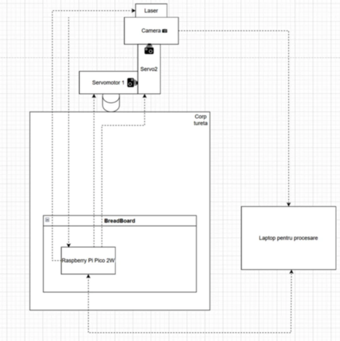

# Focalizare Unificata cu Tintire Autonomata Inteligenta  
A turret that tracks and targets people using computer vision and a laser.

:::info 

**Author**: Andrei-Valerian Andreescu \
**GitHub Project Link**: [Github](https://github.com/UPB-PMRust-Students/proiect-DrescoAV.git)

:::

## Description

This project is about building a simple automated turret that can detect and follow people with a camera and aim a laser at them in real-time. The user will be able to set a target (for example a red circle or a yellow t-shirt), and the turret will lock onto it and track it.

## Motivation

I got the idea from the game *Rust*, where you can build autoturrets that shoot at players who get too close to your base. I thought it would be cool to try and make something similar in real life, but just using a laser for now.

## Architecture 

The system has two main parts:

- **Vision + Targeting (Python)**: A Python script runs object detection (YOLO) on a laptop and identifies the target based on color or shape. It sends coordinates to the turret controller.
- **Control (Rust)**: A Raspberry Pi 2W runs a Rust program that controls two servo motors — one for horizontal rotation, one for vertical — and points the camera and laser to track the target.
- The camera and laser are mounted on the same platform, so they move together.



## Log

<!-- write your progress here every week -->

### Week 5 - 11 May
Researched similar turret systems for inspiration and finalized the design plan. Ordered all necessary hardware components based on system requirements and constraints.

### Week 12 - 18 May
Received the components and assembled the mechanical structure, including the servo mounts, camera bracket, and laser holder. Verified that all parts fit together and are functional.

### Week 19 - 25 May
TBD

## Hardware

A list of the main hardware components used in the project:

- **Raspberry Pi Pico 2W** – Acts as the main controller for servo movement and USB communication.
- **2x SG90 Servo Motors** – Control the pan and tilt movement of the turret.
- **USB Camera** – Captures video feed for real-time object detection.
- **Laser Pointer** – Visually highlights the target being tracked.
- **Breadboard + Jumper Wires** – For quick and modular connections.
- **5V Power Supply** – Powers the servo motors reliably.

### Schematics


### Bill of Materials

<!-- Fill out this table with all the hardware components that you might need.

The format is 
```
| [Device](link://to/device) | This is used ... | [price](link://to/store) |

```

-->

| Device | Usage | Price |
|--------|--------|-------|
TBD


## Software

| Library | Description | Usage |
|---------|-------------|-------|
TBD


## Links

<!-- Add a few links that inspired you and that you think you will use for your project -->
TBD
