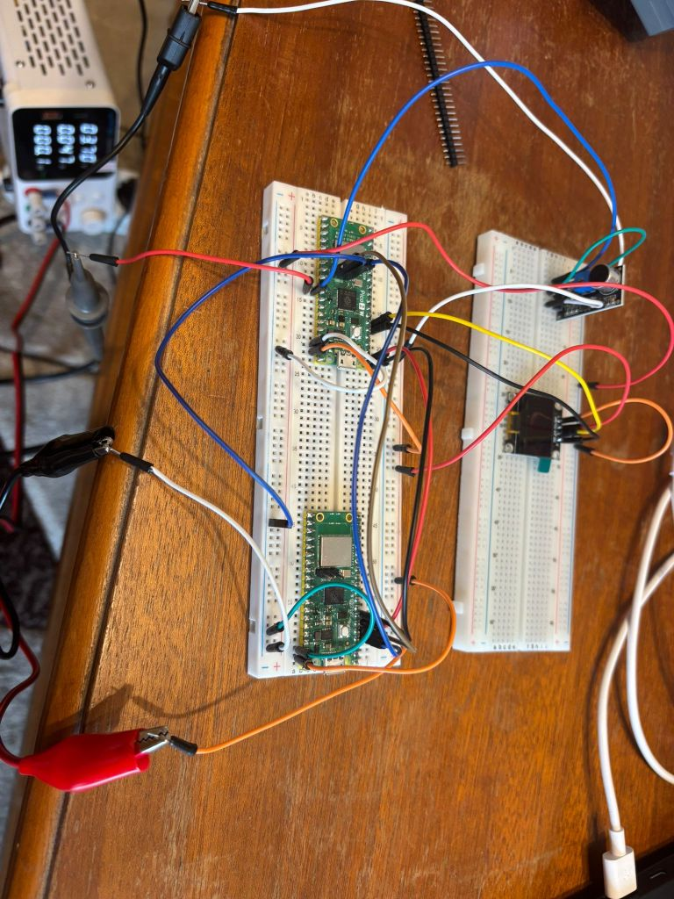
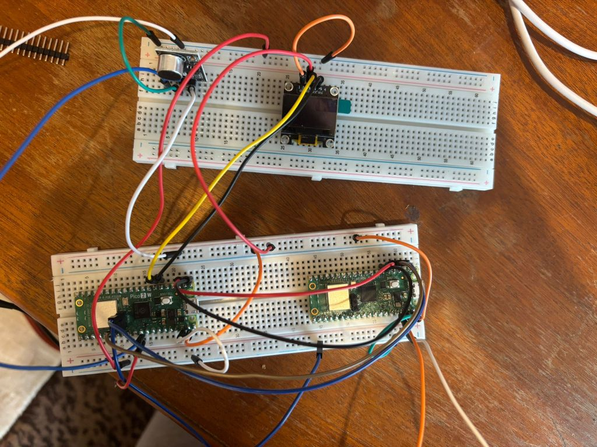
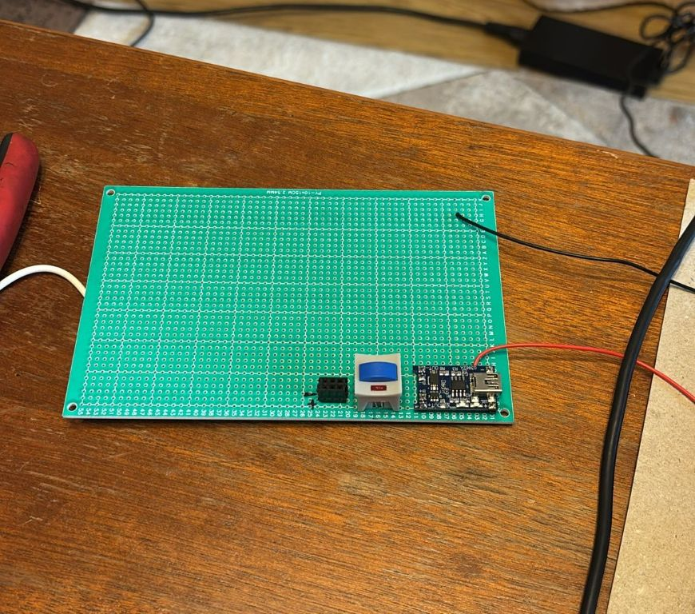
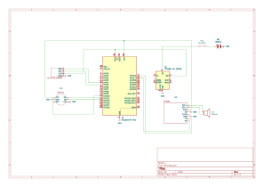

# EmotiBuddy
Your Pocket AI Companion

:::info 

**Author**: Braniste Andrei-Cristian \
**GitHub Project Link**: https://github.com/UPB-PMRust-Students/proiect-branistecristian

:::

## Description

EmotiBuddy is a pocket-sized AI emotional companion that listens to simple voice commands or sound triggers and responds with voice messages, animated OLED expressions, and motivational phrases. It connects via WiFi to cloud APIs for enhanced AI interactions.

## Motivation

I chose this project because I wanted to build a device that provides emotional support and interactive companionship, especially during moments when it's most needed. The idea of having an AI "buddy" that can lift your mood, respond to your thoughts, or simply engage in meaningful interaction is both exciting and impactful. I believe such an instrument could enhance daily life by offering a sense of connection and comfort through technology.

## Architecture 

- User Interaction: Captures audio input (voice / clap / whistle) via microphone.
- Processing Core: Raspberry Pi Pico W handles sound detection, AI message requests, and control flow.
- Cloud Interaction: Sends API requests (e.g., OpenAI) via WiFi when needed.
- Audio Output: Plays back AI-generated responses through a UART-based TTS module.
- Visual Output: Displays emotional faces (happy, sad, excited) on the OLED screen based on interaction.
- Power Supply: A rechargeable Li-ion battery powers the device through a TP4056 charging and protection module, allowing full portability.


## Log

<!-- write your progress here every week -->

### Week 5 - 11 May

This week I received all the components including the TTS module and I've successfully tested all of them for a better understanding of their behavior. More precisely, I debugged the analog microphone using an oscilloscope and noticed that there were some interferences with the input signal and to solve this I added a capacitor and a resistor. However, this problem won't arise if I were to switch to a digital microphone. Also I've tested the display and the charging functionality to ensure the system's portability.




### Week 12 - 18 May

This week I successfully completed the initial communication pipeline with the ChatGPT API. I can now send text-only requests from the pico and retrieve the responses directly from the API. In addition, I implemented the TTS (text-to-speech) module, enabling audio playback of ChatGPT’s responses through the speaker, making interactions audible for the first time.

[Demo1 Video](https://www.youtube.com/watch?v=kSItIN3lMy4&ab_channel=Nightmare123)

On the hardware side, I began placing key components on the PCB. I’ve focused on positioning the battery and the charging module, where I tried to properly align the powering system for future placement considerations.




### Week 19 - 25 May

## Hardware (not final!)

### Raspberry Pi Pico W

- Purpose: Main controller
- Function: Handles all logic, controls modules, reads inputs, and sends/receives API data via WiFi (OpenAI API). It coordinates voice input, playback, emotional state rendering, and user interactions.

### MAX9814 Microphone (with optional INMP441 I2S mic)

- Purpose: Captures voice input
- Function: Currently, the MAX9814 provides analog audio signals read via ADC. In the future, the INMP441 I2S digital microphone may be used if I2S functionality is implemented manually using PIO on the Pico.

### DTS33A TTS Module

- Purpose: Voice response output
- Function: Converts text to natural-sounding speech in real-time. Connected via UART to the Pico W, it enables dynamic voice responses from AI-generated text without requiring pre-recorded audio files. Supports multiple languages and adjustable speech parameters.

### 3W Speaker

- Purpose: Outputs audio
- Function: Connected to the DFPlayer Mini, it plays the responses from the AI output.

### I2C OLED Display (0.96")

- Purpose: Visual emotion feedback
- Function: Displays expressive facial animations (emojis) that reflect the AI’s current mood or response, enhancing emotional interaction with the user.

### Push Button

- Purpose: Triggers interaction
- Function: Allows the user to wake up the AI Companion.

### TP4056 Charging Module + 18650 Battery

- Purpose: Portable power system
- Function: Powers the entire system with a 2500mAh rechargeable Li-ion battery. The TP4056 module allows safe USB charging and voltage regulation.

### Schematics



### Bill of Materials

<!-- Fill out this table with all the hardware components that you might need.

The format is 
```
| [Device](link://to/device) | This is used ... | [price](link://to/store) |

```

-->

| Device | Usage | Price |
|--------|--------|-------|
| [Raspberry Pi Pico W (RP2350)](https://www.optimusdigital.ro/ro/placi-raspberry-pi/13327-raspberry-pi-pico-2-w.html?gad_source=1&gad_campaignid=19615979487&gbraid=0AAAAADv-p3AcTGZShwGGGHyKb6hmiamUi&gclid=Cj0KCQjwt8zABhDKARIsAHXuD7bRaFkoivDwDjO8mJROErsIad_UwRPk2iXsDzBulHCu4bi6QBcqg-0aAu0XEALw_wcB) | Main controller with WiFi | ~40 RON |
| [MAX9814 Microphone Module](https://ardushop.ro/ro/module/601-modul-microfon-senzor-sunet-6427854007254.html?gad_source=1&gad_campaignid=17003133061&gbraid=0AAAAADlKU-6dUy4bFkxt93_6LRYiF24yY&gclid=Cj0KCQjwt8zABhDKARIsAHXuD7bi2AkmYQHCuLjP_W8XvRjMRwqjIHp8yg2ZJOOyiBG5y2f0xSR2J1EaAvOBEALw_wcB) | Voice input via analog signal | ~12 RON |
| [Speaker 3W 4Ω 40mm](https://sigmanortec.ro/Speaker-40mm-3W-p134573662?SubmitCurrency=1&id_currency=2&gad_source=1&gad_campaignid=22174019478&gbraid=0AAAAAC3W72OQeyuMV4-b9r8HXwBJWWOfH&gclid=Cj0KCQjwt8zABhDKARIsAHXuD7ahLy71FJfw-ll6iyHTz54D-rAtNsxlZ9egZMBTpF9MC77nPe0JzEkaAqPSEALw_wcB) | Audio output from DFPlayer | ~10 RON |
| [OLED Display 0.96'' I2C](https://ardushop.ro/ro/display-uri-si-led-uri/1577-display-oled-096-i2c-albastru-jmd096d-1-6427854023469.html?gad_source=1&gad_campaignid=17003133061&gbraid=0AAAAADlKU-6dUy4bFkxt93_6LRYiF24yY&gclid=Cj0KCQjwt8zABhDKARIsAHXuD7ZPsF_3bJQ6rUO03LQC0yYZ7RaE0vP9STmpNRlYhaSvvUHSLFqUq10aAp6OEALw_wcB) | Visual display for AI face and emotions | ~21 RON |
| [TP4056 Charging Module](https://www.optimusdigital.ro/en/chargers/80-tp4056-1-cell-lipo-charger-micro-usb.html?srsltid=AfmBOood1RMJS56U4bPANxpaVkFXFt8HYHQ3OXuXBJ0Jsw0ji7xknsEr) | Battery charging and protection | ~6 RON |
| [Samsung 18650 25R 2500mAh Battery](https://www.emag.ro/acumulator-18650-li-ion-samsung-inr-2500mah-3-7v-25r-20a-186502600/pd/D1TJ2VBBM/) | Power source | ~26 RON |
| [Push Button](https://www.optimusdigital.ro/en/buttons-and-switches/1119-6x6x6-push-button.html?search_query=button&results=491) | Triggers interaction or startup | ~1–2 RON |
| [DTS33A TTS Module](https://www.dfrobot.com/product-2337.html) | Text-to-Speech synthesis | ~30 RON |
| Breadboard + jumpers | Wiring and prototyping | ~40 RON |


## Software (not final!)

| Library | Description | Usage |
|---------|-------------|-------|
| [rp2040-hal](https://github.com/rp-rs/rp-hal) | Low-level hardware abstraction layer for the RP2040/RP2350 microcontroller | Used to control GPIOs, ADC, I2C, UART, and peripherals |
| [embedded-hal](https://github.com/rust-embedded/embedded-hal) | Generic hardware abstraction traits for embedded systems | Used by drivers like OLED and DFPlayer for hardware access |
| [ssd1306](https://github.com/eldruin/ssd1306) | OLED display driver over I2C/SPI | Used to control the 0.96" I2C OLED for rendering the AI face |
| [embedded-graphics](https://github.com/embedded-graphics/embedded-graphics) | 2D graphics library for embedded devices | Used to draw faces, text, and icons on the OLED screen |
| [ufmt](https://github.com/jamesmunns/ufmt) | Minimal `core::fmt`-like formatting for `no_std` | Used for lightweight logging and debugging |
| [heapless](https://github.com/japaric/heapless) | Fixed-size `no_std` data structures like `Vec` and `String` | Used for storing incoming/outgoing messages efficiently |
| [defmt](https://github.com/knurling-rs/defmt) | Highly efficient logging framework for embedded Rust | Used to debug easily without panicking the board |
| [probe-rs](https://github.com/probe-rs/probe-rs) | Flash, debug, and trace embedded devices | Used for uploading code and flashing the Pico W |
| [embassy](https://github.com/embassy-rs/embassy) | Async embedded framework | Optional: used if multitasking (like WiFi + display + sound) is needed |


## Links

<!-- Add a few links that inspired you and that you think you will use for your project -->

1. [Initial idea](https://www.youtube.com/shorts/vJadseagIUQ)
2. [To be continued..](https://example3.com)
...
