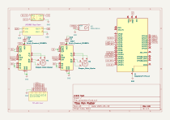
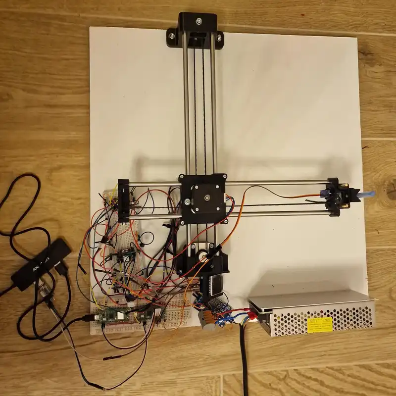
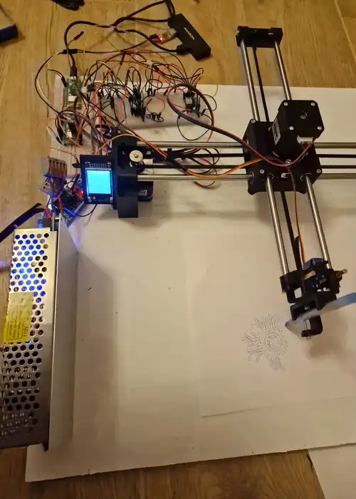

# Pen Plotter
A machine that draws an user defined image using a pen.

:::info 

**Author**: Andrei Stan \
**GitHub Project Link**: https://github.com/UPB-PMRust-Students/proiect-andreistan26

:::

## Description

A pen plotter is similar to any 2.5-3 axis machine like a CNC or a 3D printer, it works by moving
a pen in cartesian coordiantes in order draw something on a piece of paper.

## Motivation

I thought this would be a challenging, yet fun project that requires different skills to pull of,
it has software, electrical and mechanical complexities. It would also make me do more CAD work.

## Architecture 

## Log

### Week 20 - 27 April

* started making the CAD and looking for online resources
* started to order the mechanical components and 3D printed some prototypes
* tested the electronic components like the power supply, voltage regulator and stepper motors

### Week 28 - 4 May

* tested the 3D printed parts and iterated on them
* finished the documentation

### Week 5 - 11 May

* assembled the mechanical parts
* made some more 3D prints (display mount, improved pen holder)
* finished prototyped electrical wiring

### Week 12 - 18 May

* finished final assembly
* base software for moving to coordinates, parsing GCode, uart communications and optimizations for line plotting
* got a fully working version capable of plotting streamed Gcode

### Week 19 - 25 May

* added a progress bar to the display and also modified the UART client to send M73 commands for updating the progress bar
* improved the code for better plotting performance

## Hardware

* Mechanical:
    * Steel 8mm rods
    * Brass 4mm rods
    * GT2 Timing belt
    * Tooth timing pulleys and idler pulleys
    * 3D printed parts

* Electronics:
    * AC-DC Power Supply 12v 10A
    * DC-DC Voltage regulator 12v-5v
    * SG90 Servo Motor
    * 2 x Nema-17 Stepper motor
    * 2 x DRV8825 Stepper Motor Driver
    * R-PI Pico 2
    * LCD Display
    * 2 x 100uF capacitors
    * Other small components (wires, breadboards, etc.)

### Schematics

### Pictures

### Bill of Materials

| Device | Usage | Price/Unit |
|--------|--------|-------|
| Raspberry Pi Pico 2W | Microcontroller | [39.66](link:https://www.optimusdigital.ro/en/raspberry-pi-boards/13327-raspberry-pi-pico-2-w.html?search_query=pico+2&results=52) |
| 2 x DRV8825 Stepper Motor Driver | Driver for the stepper motor | [14.49](link:https://www.optimusdigital.ro/en/stepper-motor-drivers/154-drv8825-stepper-motor-driver-module.html?search_query=drv88&results=29) |
| 2 x Stepper Motor 17HS8401S | Stepper motor driving each axis linear system | [34.99](https://www.optimusdigital.ro/en/stepper-motors/5097-17hs8401s-stepper-motor-17-a-059-nm.html?search_query=17HS8401S&results=2) |
| LM2596 Voltage Regulator | Converting the ouput of the power supply (12V) to 5V | [16.49](https://www.optimusdigital.ro/en/adjustable-step-down-power-supplies/805-lm2596-dc-dc-module-with-voltage-display.html?search_query=LM2596&results=12) |
| TFT-LCD Display 1.44" | LCD Display for displaying information about the plotter | [29.99](https://www.optimusdigital.ro/en/lcds/3552-modul-lcd-de-144-cu-spi-i-controller-st7735-128x128-px.html?search_query=128x128&results=12) |
| SG90 Servo | Servo that lifts the pen on the Z axis | [11.99](https://www.optimusdigital.ro/en/servomotors/2261-micro-servo-motor-sg90-180.html?search_query=sg90&results=11)
| Power Supply 12V 10A | Power supply for the porject | [41.6](https://www.emag.ro/sursa-de-alimentare-in-comutatie-12v-10a-pentru-led-uri-sau-camere-supraveghere-ee-srs-1210/pd/DL9722BBM/?ref=history-shopping_420518923_7230_1) |
| 8 x Linear Bearing 8mm | Linear bearings for sliding the gantry | [4.07](https://ardushop.ro/ro/sisteme-liniare/814-rulment-liniar-lm8uu-6427854010551.html) |
| 2 x GT2 Timing Belt | Belt for moving the gantry | [3.96](https://ardushop.ro/ro/componente/1695-curea-gt2-1-metru-6427854025548.html) |
| 2 x Tooth timing pulley | Transmits power from the motor shaft to the belt | [4.50](https://ardushop.ro/ro/componente/1744-fulie-gt2-pentru-ax-de-5mm-20-dinti-6427854026217.html) |
| 2 x Smooth pulley | Guides the timing belt and keeps tension on the timing belt | [9.32](https://ardushop.ro/ro/printare-3d/523-fulie-fara-dinti-pentru-curea-gt2-latime-6mm-ax-5mm-6427854006103.html) |
| 1.5 x 8mm Steel Rod | The gantry will slide on it | [49.00](https://ardushop.ro/ro/sisteme-liniare/2445-axa-de-precizie-rectificata-si-calita-cu-diametru-8mm-6427854034748.html) |
| 2 x 4mm Brass Rod | For sliding the pen holder | [19.99](https://www.hornbach.ro/p/bara-alama-rotunda-alberts-o4mm-lungime-1m/799417/?srsltid=AfmBOorlNSMET06xd1ZTqd-YkQTfC0qhwD924zoVavLV-j7HDaeqMJaW) |
| 2 x Breadboard 830p | For wiring stuff up | 9.99 |
## Software

| Library | Description | Usage |
|---------|-------------|-------|
| [embassy-*](https://github.com/embassy-rs/embassy) | Async framework for embedded systems in Rust | Framework used for the whole system including rp235x specific drivers |
| [mipidsi](https://github.com/almindor/mipidsi) | Display driver for ST7735 | Used for the display for the Pico Explorer Base |
| [embedded-graphics](https://github.com/embedded-graphics/embedded-graphics) | 2D graphics library | Used for drawing to the display |
| [defmt](https://github.com/knurling-rs/defmt) | Deffered logging | Logging for the plotter during testing |
| [heapless](https://github.com/rust-embedded/heapless) | Static allocated containers | Allocate data structures for holding GCode commands |
| [format_no_std](https://crates.io/crates/format_no_std) | Formatting library for no_std environments | Used for formatting the progress bar text |
| [display_interface_spi](https://crates.io/crates/display-interface-spi) | SPI interface for displays | Used for communicating with the display |

### Software Design

The software that runs on the pico was designed using the embassy framework. Thus I've separated all the hardware subsystems into **tasks** that are run on the default executor.

These tasks communicate via channels, simply, tasks produce values for other tasks to consume. For example the **command manager task** produces coordinates for the stepper and servo tasks.

The tasks running are:
* servo task
* stepper x and y task
* display task
* command manager task
* UART task

When the plotter starts reciving data the following steps are usually performed:

1. The plotter is initialized and all the tasks are spawned.
1. Data from an UART connection in the form of G-code commands.
1. G-code commands are parsed and sent to the *command manager*.
1. The *command manager* plans the path of the plotter.
    * Lines are drawn using Bresenham's algorithm in order to avoid hockey stick lines.
    * The plotter then sends positions to the stepper and servos and waits for them to finish before sending new ones.
1. Once we receive M73 commands, the plotter updates the progress bar on the display.
1. This is repeated until all uart commands are processed.

Brasenham's line drawing algorithm helps us sample the line in the correct pixels that need to be drawn.
The idea is that when we need to write a line at a 20 degree angle, the X component is bigger than the Y component.
If we sent the commands to the X and Y components at the same time, we would get a 45 degree line then a straigt line.
By using Bresenham's line drawing algorithm, we limit the number of pixels drawn at a time by the plotter thus making the line more precise.
This could have been done by just modifying the RPM of each stepper, but this solution has been unsuccessful empirically.

For streaming GCode to the plotter I am using a python client that also preprocesses the plotter commands before sending them via UART.
The GCode is generated by [Lightburn](https://lightburnsoftware.com/), [inkscape](https://inkscape.org/) or [vpype](https://github.com/abey79/vpype).

## Links

1. [Where I took the starting 3D models](https://andrewsleigh.github.io/plotter/)
2. [Lab resources](https://pmrust.pages.upb.ro/docs/acs_cc/category/lab)
