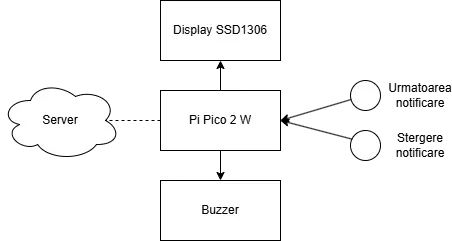
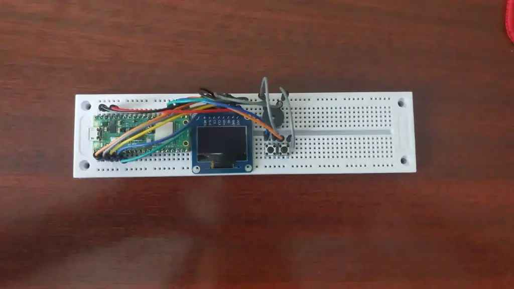
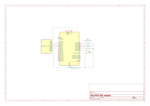

# Smart Desk Assistant
A small device to display and manage notifications from an external server.

:::info

**Author**: Andrei-George Zdrali \
**GitHub Project Link**:https://github.com/UPB-PMRust-Students/proiect-AndreiZdrali

:::

## Description

The Smart Desk Assistant is an embedded notification display and management system. The device fetches notifications from the server and displays them on an OLED screen. Users can delete notifications, which also removes them from the server. Timed notifications are supported as well, triggering an alarm when their timer expires.

## Motivation

I wanted a simple and useful device to help manage my tasks without being distracted by my laptop or phone. Also, seems like a good project to practice networking in embedded programming.

## Architecture

**Main components**:
- **Server**: Hosts the notifications and sends them on request.
- **Raspberry Pi Pico W 2**: Connects to the server over WiFi, manages notifications, updates the display, and handles button inputs.
- **OLED Display (SSD1306 I2C)**: Displays the notifications.
- **Buttons**: Navigate through and delete notifications.
- **Buzzer**: Alerts when timer notifications trigger.

**Connections**:
- WiFi connects the Pico W 2 to the Server.
- SPI connects Pico W 2 to the OLED Display.
- GPIOs connect Pico W 2 to the Buttons and Buzzer.

## Log

<!-- write your progress here every week -->

### Week 5 - 11 May
Am planificat proiectul si mi-am ales piesele.

### Week 12 - 18 May
Am asamblat hardware-ul si am inceput implementarea software-ului.

### Week 19 - 25 May

## Hardware

- **Raspberry Pi Pico W 2** for networking and control.
- **SSD1306 I2C OLED Display** for showing notifications.
- **Buzzer** for sound alerts.
- **Three Push Buttons** for user input.

### Schematics

| Device | Usage | Price |
|--------|--------|-------|
| [2x Raspberry Pi Pico W 2](https://www.optimusdigital.ro/ro/placi-raspberry-pi/13327-raspberry-pi-pico-2-w.html) | Main microcontroller | 80 RON |
| [SSD1306 SPI OLED Display](https://www.optimusdigital.ro/ro/optoelectronice-altele/12657-display-oled-096-.html) | Display notifications | 40 RON |
| [Buzzer](https://www.optimusdigital.ro/ro/audio-buzzere/12247-buzzer-pasiv-de-33v-sau-3v.html) | Sound alert for timers | 1 RON |
| [3x Push Buttons](https://www.optimusdigital.ro/ro/butoane-i-comutatoare/1119-buton-6x6x6.html) | Navigate/delete notifications | 1 RON |
| [2x Breadboard](https://www.optimusdigital.ro/ro/prototipare-breadboard-uri/44-breadboard-400-points.html) | Aid development | 5 RON |
| [Jumper Wires](https://www.optimusdigital.ro/ro/fire-fire-mufate/12-set-de-cabluri-pentru-breadboard.html) | Connect components | 8 RON |git

## Software

| Library | Description | Usage |
|---------|-------------|-------|
| [embassy](https://github.com/embassy-rs/embassy) | Async embedded framework | Main async runtime |
| [defmt](https://github.com/knurling-rs/defmt) | Logging for embedded | Debugging output |
| [embedded-hal](https://github.com/rust-embedded/embedded-hal) | Hardware abstraction layer | Interfaces for GPIO, I2C, etc |
| [embassy-net](https://github.com/embassy-rs/embassy/tree/main/embassy-net) | Async network stack | Connect to server over WiFi |
| [ssd1306](https://github.com/rust-embedded-community/ssd1306) | Driver for SSD1306 displays | Simplify display communication |
| [embedded-graphics](https://github.com/embedded-graphics/embedded-graphics) | Graphics library | Handle graphics primitives |
| [serde-json-core](https://github.com/rust-embedded-community/serde-json-core) | no_std JSON library | Parse JSON messages |

## Links

<!-- Add a few links that inspired you and that you think you will use for your project -->

1. [link](https://example.com)
2. [link](https://example3.com)
...