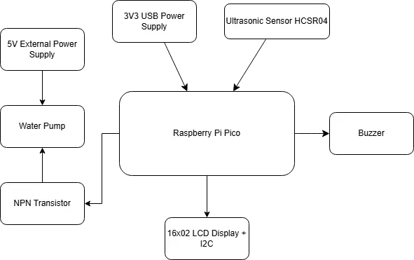
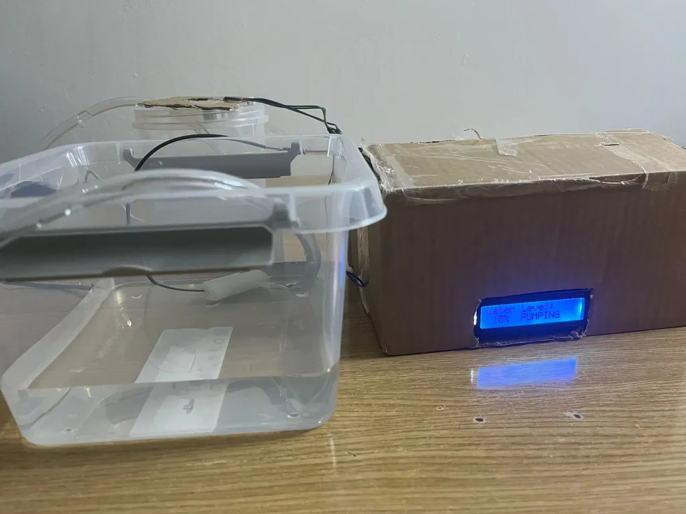
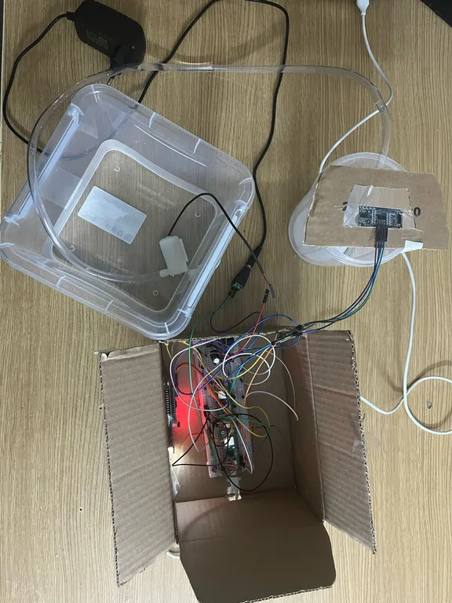
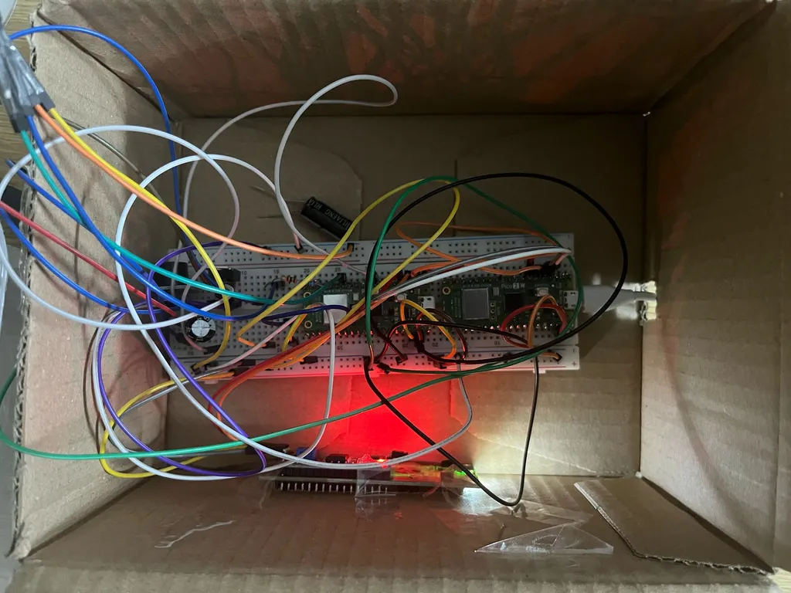
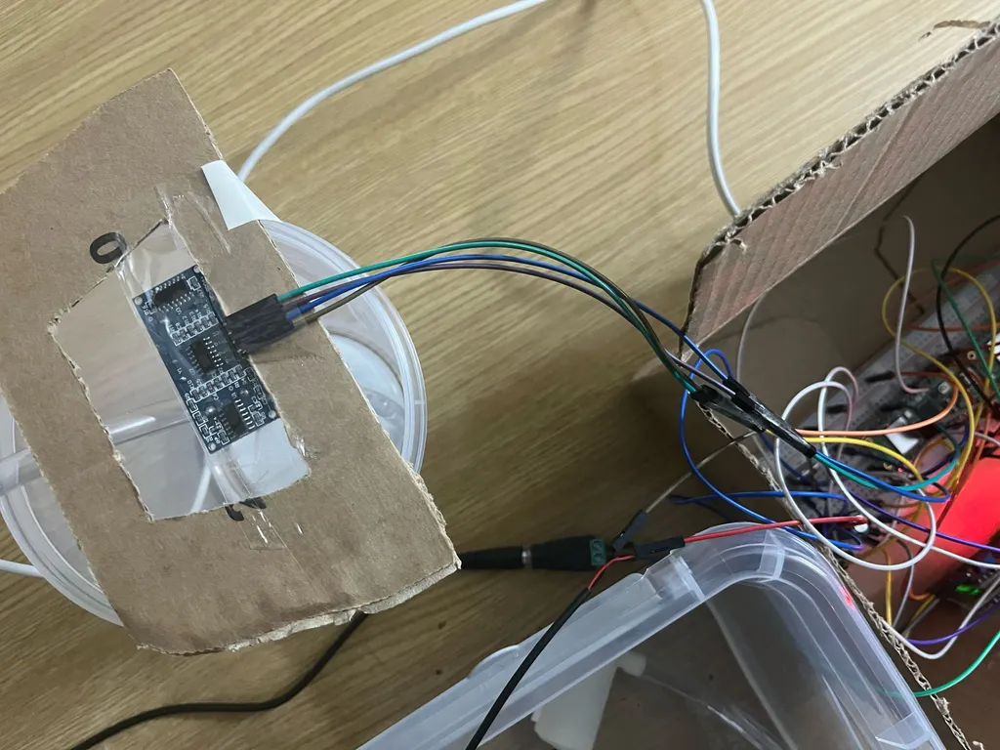
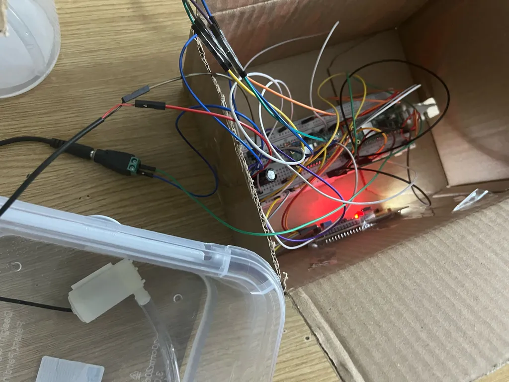
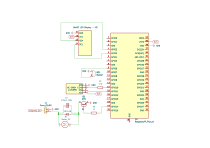

# Water Level Monitoring System
Maintains the water level in a container using an ultrasonic sensor and automatic refill via a water pump.

:::info 

**Author**: Calu Andrei-Daniel \
**GitHub Project Link**: https://github.com/UPB-PMRust-Students/proiect-andreic13

:::

## Description

The project aims to measure and mantain the water level in real time using a Raspberry Pi Pico board, an **ultrasonic sensor** and a **water pump**. The sensor detects the water level by calculating the time it takes for sound waves to travel to the water surface and back, the result is displayed on an **LCD** and alerts are triggered via a **buzzer** when the water level is too high. If the water level drops below a defined threshold, the system automatically activates the water pump to refill the container from an external tank. This allows the system to maintain a stable water level.

## Motivation

**The idea for this project** came from a conversation with a friend who explained how his dad uses a water tank to estimate recent rainfall. This inspired me to create a simple and practical system to automatically measure and manage water levels using a Raspberry Pi Pico. In agriculture, depending on the amount of rainfall collected in an initially empty tank, the farmer can decide which type of fieldwork is most suitable. With the addition of the water pump, the system can now not only monitor but also **correct** the water level, making it a more complete and autonomous tool for rural or smart farming applications.

## Architecture

*Main Components used in the Water Level Monitoring System project:*

**1 - Raspberry Pi Pico**: Microcontroller unit that processes data from the sensor and controls outputs.

**2 - Ultrasonic Sensor HC-SR04**: Measures the distance to the water surface to determine the water level.

**3 - LCD Display**: Displays the measured water level in real time. Also, prints appropiate messages based on the water level.

**4 - Buzzer**: Emits a sound alert if the water level is too high.

**5 - Water Pump**: Refills the container automatically if the water level is too low.

**6 - Power Supply** – USB (for logic) and 5V adapter with DC connector (for pump).

**7 - NPN Transistor (TIP31)** – Allows the Raspberry Pi Pico to safely switch the 5V pump using GPIO control.

## Log

### Week 5 - 11 May
Planned the project hardware setup and decided which components to buy (Raspberry Pi Pico W, HC-SR04 sensor, LCD 16x2 with I2C backpack, buzzer, pump, etc.). Started assembling the system on a breadboard. Soldered and connected the Raspberry Pi Pico W.

### Week 12 - 18 May
Tested early connections and realized some missing components (resistor, diode, power adapter) — placed a second order to complete the setup. Developed the core logic for measuring water level with the ultrasonic sensor. Displayed readings on the LCD via I2C. Added the buzzer and programmed alerts for high water levels. Tested pump activation with a transistor switch. Improved electrical stability with a flyback diode and capacitor.

### Week 19 - 25 May

## Hardware

The Raspberry Pi Pico W acts as the central controller and is powered directly from a laptop via USB. It reads distance data from the HC-SR04 ultrasonic sensor and updates the LCD screen using the I2C protocol. Alerts are provided through a buzzer when water is too high. When the water level drops too low, the system triggers a submersible 5V water pump using a NPN power transistor (TIP31), which acts as a switch. This allows the low-power GPIO pin to control the higher-current pump safely. The pump runs off a dedicated 5V power adapter (HLK-PM01-like), connected through a DC barrel jack adapter for better current handling.
Here are some pictures of my project:

### Schematics

### Bill of Materials

| Device                            | Usage                        | Price       |
|-----------------------------------|------------------------------|-------------|
| [Raspberry Pi Pico W](https://datasheets.raspberrypi.com/pico/pico-2-datasheet.pdf)           | The microcontroller          | [34,50 RON](https://www.optimusdigital.ro/en/raspberry-pi-boards/13327-raspberry-pi-pico-2-w.html?search_query=raspberry+pi+pico+2&results=36) | 
| [HC-SR04+ Ultrasonic Sensor](https://cdn.sparkfun.com/datasheets/Sensors/Proximity/HCSR04.pdf)        | Measures distance            | [14,99 RON](https://www.optimusdigital.ro/ro/senzori-senzori-ultrasonici/2328-senzor-ultrasonic-de-distana-hc-sr04-compatibil-33-v-i-5-v.html?search_query=senzor+ultrasonic&results=42) |
| [I2C LCD Display (16x2)](https://www.handsontec.com/dataspecs/module/I2C_1602_LCD.pdf)            | Displays water level         | [11,00 RON](https://sigmanortec.ro/LCD-1602-p125700685) |
| [Active Buzzer Module](https://www.handsontec.com/dataspecs/module/active%20buzzer%20module.pdf)              | Sound Alert                  | [4,98 RON](https://www.optimusdigital.ro/en/buzzers/12513-pcb-mounted-active-buzzer-module.html?gad_source=1&gad_campaignid=19615979487&gclid=CjwKCAjw56DBBhAkEiwAaFsG-vXNJhgBEvZX5LWkAEUmauH2CZ2dnM7SDTmkbxsKoKJyGBkhti8R-BoC-JMQAvD_BwE)  |
| [Breadboard HQ (830 Points)](https://components101.com/sites/default/files/component_datasheet/Breadboard%20Datasheet.pdf)        | Prototyping board            | [9,98 RON](https://www.optimusdigital.ro/ro/prototipare-breadboard-uri/8-breadboard-830-points.html)  |
| [Jumper Wires M-F (15 cm, 40p)](https://www.farnell.com/datasheets/3178883.pdf)     | Connecting components        | [7,99 RON](https://www.optimusdigital.ro/ro/toate-produsele/877-set-fire-mama-tata-40p-15-cm.html)  |
| [Jumper Wires M-M (10 cm, 40p)](https://www.farnell.com/datasheets/3178883.pdf)     | Connecting components        | [12,40 RON](https://www.optimusdigital.ro/en/wires-with-connectors/885-wires-male-male-10p-10cm.html?gad_source=1&gad_campaignid=19615979487&gclid=CjwKCAjw56DBBhAkEiwAaFsG-qHJKzo42IOzSP1d30HfmI0cgx-gau9xEfyK-IN1zCScOfJxQTPSdxoCUEMQAvD_BwE)  |
| [Resistors (330Ω x10)](https://components101.com/resistors/resistor)              | LCD Backlight, Pull-ups, etc | [0,15 RON](https://www.optimusdigital.ro/ro/componente-electronice-rezistoare/7794-rezistor-3-w-033-.html?gad_source=1&gclid=Cj0KCQjw2tHABhCiARIsANZzDWqnykDpLlPpah0CTaAy0VjRNIQ4zMaC14ScpLXnBJU6PH_bIniU5ZYaAkaeEALw_wcB)  |
| [Resistors (180Ω x10)](https://components101.com/resistors/resistor)              | LCD Backlight, Pull-ups, etc | [0,15 RON](https://www.optimusdigital.ro/en/resistors/1663-025w-180-resistor.html)  |
| [Pin Header (2.54mm, 40p, White)](https://www.farnell.com/datasheets/2585485.pdf)   | Connectors/Pins              | [0,99 RON](https://www.optimusdigital.ro/ro/componente-electronice-headere-de-pini/463-header-de-pini-alb-254-mm-40p.html)  |
| [Submersible water pump](https://www.mouser.com/datasheet/2/1398/Soldered_101844_mini_water_pump-3532437.pdf?srsltid=AfmBOoorusfV5bknqaVLhZHJ-njgCdvt00yS8LWoR6n0n2ClLl-VglMS)            | Transporting water           | [7,08 RON](https://sigmanortec.ro/Pompa-apa-submersibila-3-6VDC-p125423415)  |
| [DC barrel jack adapter](https://datasheet.octopart.com/368-Adafruit-Industries-datasheet-21189944.pdf)            | Connecting power supply       | [3,68 RON](https://sigmanortec.ro/en/connector-55x25mm-with-screw-mother)  |
| [NPN Transistor](https://www.onsemi.com/download/data-sheet/pdf/tip31a-d.pdf)             | Managing the water pump  | [2,38 RON](https://sigmanortec.ro/en/npn-transistor-tip31-tip31c-to220)  |
| [External power supply](https://docs.rs-online.com/275b/A700000006857541.pdf)             | Supplying the pump       | [23,38 RON](https://sigmanortec.ro/en/power-supply-5v-3a-55x21-220vac)  |
| [Water pump hose](https://www.mouser.com/datasheet/2/1398/Soldered_101844_mini_water_pump-3532437.pdf?srsltid=AfmBOoorusfV5bknqaVLhZHJ-njgCdvt00yS8LWoR6n0n2ClLl-VglMS)             | Hose for the pump       | [6,26 RON](https://sigmanortec.ro/en/water-pump-hose-6x8mm-1-meter)  |

## Software

| Library | Description | Usage |
|---------|-------------|-------|
| [embassy-rp](https://crates.io/crates/embassy-rp) | Embassy support for Raspberry Pi RP2040 | Provides HAL implementations for GPIO, I2C, and other peripherals used to interface with sensors and LCD |
| [embassy-executor](https://crates.io/crates/embassy-executor) | Async task executor for Embassy | Manages the asynchronous main function and enables async/await patterns |
| [embassy-time](https://crates.io/crates/embassy-time) | Timing utilities for Embassy | Provides async delays, timers for ultrasonic sensor timing, and timeouts |
| [embassy-futures](https://crates.io/crates/embassy-futures) | Async utilities for Embassy | Used for select patterns when waiting for ultrasonic sensor responses |
| [lcd1602-diver](https://crates.io/crates/lcd1602-diver) | LCD 1602 driver for I2C interface | Controls the 16x2 LCD display via I2C to show water level information |
| [heapless](https://crates.io/crates/heapless) | Heapless data structures | Provides String implementation for no_std environments to format display text |
| [defmt](https://crates.io/crates/defmt) | Efficient logging for embedded | Structured logging to debug the water level system |
| [defmt-rtt](https://crates.io/crates/defmt-rtt) | RTT target for defmt logging | Outputs logs over RTT for debugging with probe-run |
| [panic-probe](https://crates.io/crates/panic-probe) | Panic handler with debug output | Sends panic messages via defmt for diagnosing issues |
| [cortex-m-rt](https://crates.io/crates/cortex-m-rt) | Cortex-M runtime support | Handles microcontroller startup and vector table |

## Links

<!-- Add a few links that inspired you and that you think you will use for your project -->

1. [Ultrasonic Water Level Indicator using HC-SR04 & Arduino](https://www.youtube.com/watch?v=o5Qo_I0TdOY&ab_channel=talkingStuffNetwork)
2. [AquaAlert - Overflow prevention system](https://www.youtube.com/shorts/MNxw2Y85WyQ?feature=share)
3. [How To Use A Water Pump with an Arduino](https://www.youtube.com/watch?v=UEL9NR2Z5BY&t=290s&ab_channel=CoreElectronics)