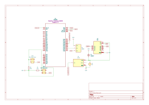
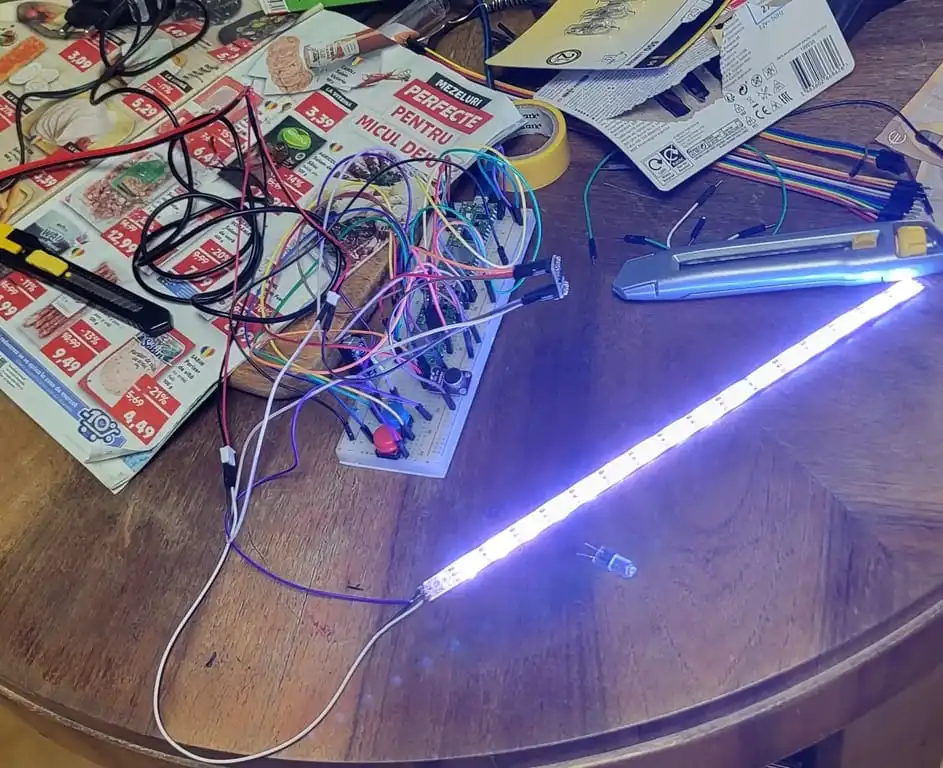
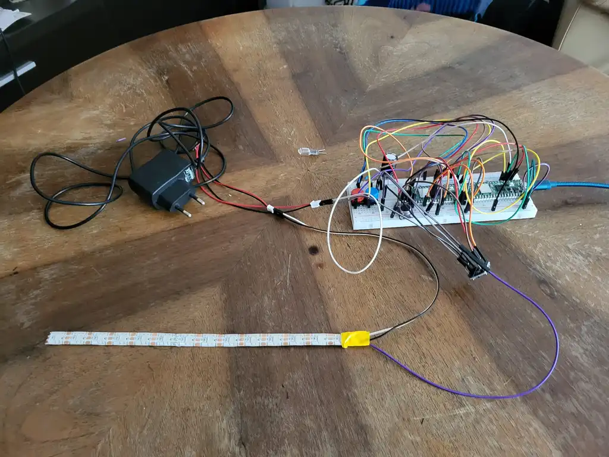
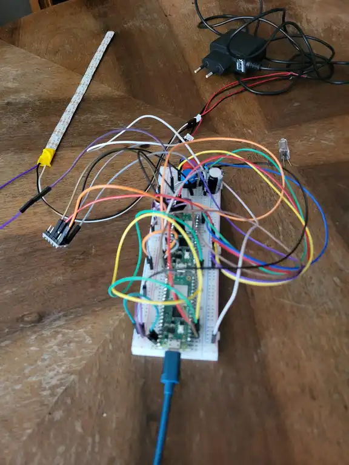
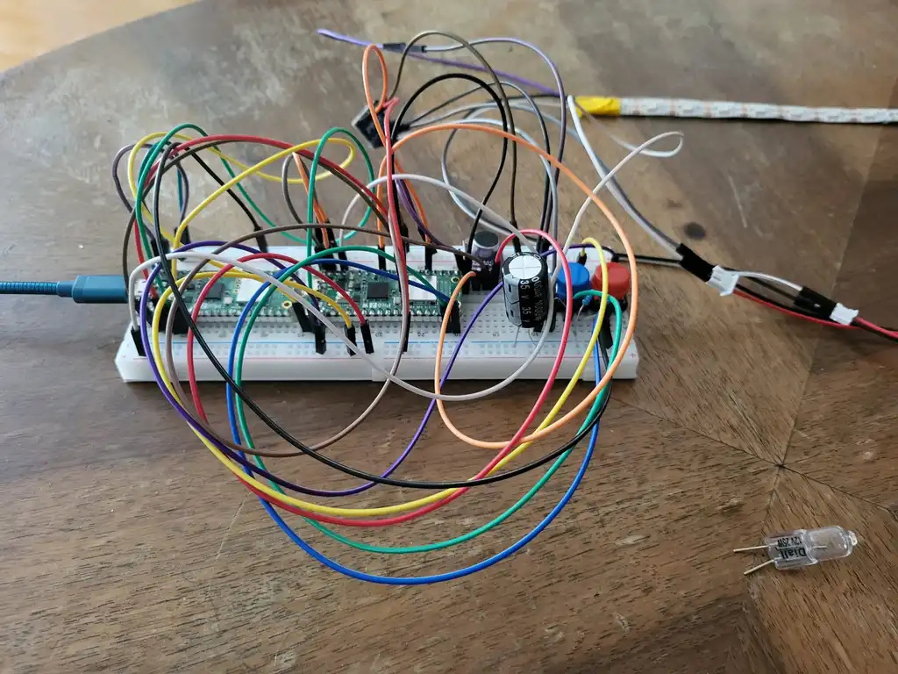
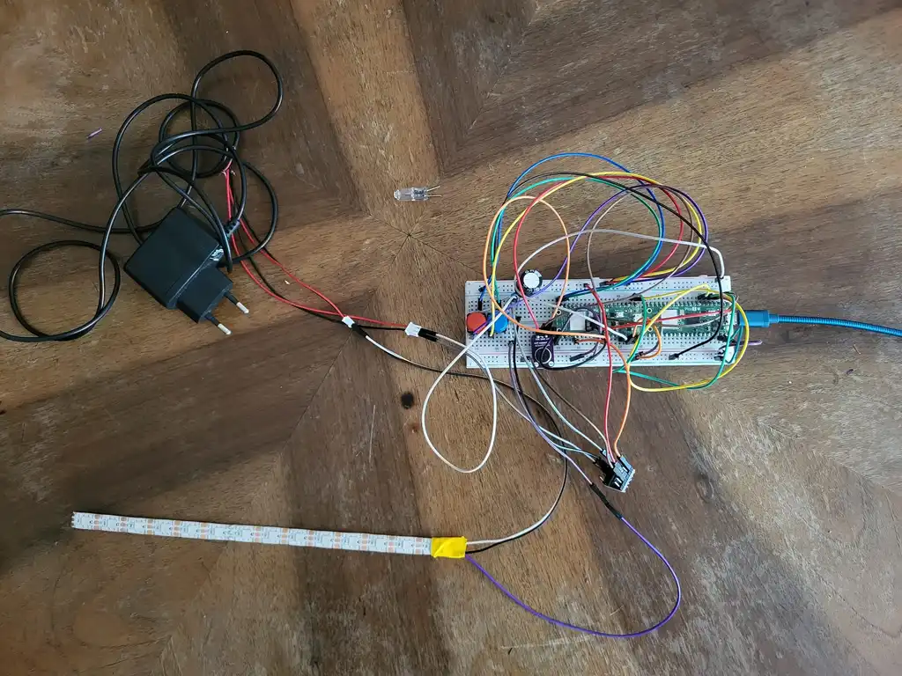

# Music Lights
A Raspberry Pi Pico system that synchronizes LED lighting with music

:::info

**Author:** Antonio-Christian Carazeanu  \
**GitHub Project Link:** [link_to_github](https://github.com/UPB-PMRust-Students/proiect-antocarazeanu)

:::

## Description
Music Lights is a project that uses a Raspberry Pi Pico to control an LED strip based on live music input. A microphone captures ambient audio, and a signal processing algorithm detects the beat and dominant frequencies. The LEDs react in real-time by changing color and brightness, creating an immersive audio-visual experience.

## Motivation
The idea behind this project came from a desire to blend music with dynamic visual effects. I wanted to explore how embedded systems can process audio and produce synchronized lighting, making music more interactive and engaging.

## Architecture

The project is composed of the following main components:
- **Microcontroller**: Raspberry Pi Pico running real-time firmware using Embassy.
- **Audio Input**: MAX4466 Microphone module connected to the Pico's ADC, capturing audio signals.
- **Signal Processing**: Algorithm performing FFT using the `microfft` library to analyze frequencies.
- **LED Control**: LED strip controlled via the RP2040's **PIO unit** using `embassy-rp` and a compatible WS2812 PIO program (like `ws2812-pio` or similar). Requires a **Logic Level Shifter** (3.3V to 5V) for the data signal.
- **Output**: WS2812 LED strip visualizing music dynamically.

Connections:
- Microphone Analog Out → Pico ADC GPIO (e.g., GPIO26)
- Pico GPIO (PIO Output) → Level Shifter (Low Voltage Input)
- Level Shifter (High Voltage Output) → LED Strip Data In (via ~330Ω resistor)
- Buttons → Pico GPIO Inputs (with 10kΩ pull-up/pull-down resistors)
- Pico USB → Power (for Pico) and programming
- **Separate 5V Power Supply → LED Strip (+5V, GND)**
- **Separate 5V Power Supply → Level Shifter (HV Pin)**
- **Common Ground:** Crucial connection between Pico GND, Level Shifter GND, and the Separate 5V Power Supply GND.

## Log
- **Week 5 - 11 May**: Set up the Raspberry Pi Pico and assembled the main hardware components.
- **Week 12 - 18 May**: Completed the full hardware assembly and tested each component with example code.
- **Week 19 - 25 May**:

## Hardware
- Raspberry Pi Pico W (x2 - one for development/debug)
- WS2812 LED Strip (3x 10cm segments = 18 LEDs)
- MAX4466 Microphone Module
- Logic Level Shifter Module
- Jumper wires (M-M, M-F) and Breadboard
- USB cables (for Pico power/programming)

## Schematics

## Project Photos

## Bill of Materials

| Item                                                                                                  | Quantity | Unit Price                                                                                                                                                             | Total Price |
|-------------------------------------------------------------------------------------------------------|----------|------------------------------------------------------------------------------------------------------------------------------------------------------------------------|-------------|
| Jumper Wires for Breadboard                                                                           | 1        | [7.99 RON](https://www.optimusdigital.ro/ro/fire-fire-mufate/12-set-de-cabluri-pentru-breadboard.html?search_query=Set+Fire+pentru+Breadboard&results=37)             | 7.99 RON    |
| Raspberry Pi Pico W                                                                                   | 2        | [39.66 RON](https://www.optimusdigital.ro/ro/placi-raspberry-pi/13327-raspberry-pi-pico-2-w.html?search_query=raspberry+pi+pico+2&results=26)                          | 79.32 RON   |
| Breadboard HQ (830 tie points)                                                                        | 1        | [9.98 RON](https://sigmanortec.ro/Breadboard-830-puncte-MB-102-p125923983)                                                                                            | 9.98 RON    |
| White Pin Header 2.54 mm (40p)                                                                         | 3        | [0.99 RON](https://www.optimusdigital.ro/ro/cautare?controller=search&orderby=position&orderway=desc&search_query=header+pini+alb&submit_search=)                     | 2.97 RON    |
| Colored Jumper Wires Female-Male (40p, 15 cm)                                                          | 1        | [7.99 RON](https://www.optimusdigital.ro/ro/toate-produsele/877-set-fire-mama-tata-40p-15-cm.html)                                                                    | 7.99 RON    |
| Electrolytic Capacitor 1000 µF, 35 V                                                                   | 1        | [2.99 RON](https://www.optimusdigital.ro/ro/componente-electronice-condensatoare/3004-condensator-electrolitic-de-1000-uf-la-35-v.html?search_query=condensator+electrolitic&results=105) | 2.99 RON    |
| Electrolytic Capacitor 470 µF, 50 V                                                                    | 1        | [0.79 RON](https://www.optimusdigital.ro/ro/componente-electronice-condensatoare/3008-condensator-electrolitic-de-470-uf-la-50-v.html?search_query=condensator+electrolitic&results=105) | 0.79 RON    |
| USB Cable                                                                        | 1        | -                                                                                                                                                                      | -           |
| Addressable LED Strip WS2812, 10 cm (60led/m)                                                          | 3        | [2.69 RON](https://sigmanortec.ro/Banda-LED-adresabila-RGB-WS2812-60led-m-IP67-10cm-p166125661)                                                                       | 8.07 RON    |
| Button 12x12x7.3 mm                                                                                    | 2        | [1.10 RON](https://sigmanortec.ro/Buton-12x12x7-3-p160373654)                                                                                                          | 2.20 RON    |
| Button Cap 12x12x7.3 mm, Blue                                                                          | 1        | [0.34 RON](https://sigmanortec.ro/capac-buton-12x12x73-albastru)                                                                                                       | 0.34 RON    |
| Button Cap 12x12x7.3 mm, Red                                                                           | 1        | [0.34 RON](https://sigmanortec.ro/capac-buton-12x12x73-albastru)                                                                                                       | 0.34 RON    |
| MAX4466 Microphone Module with Amplifier                                                               | 1        | [7.18 RON](https://sigmanortec.ro/modul-microfon-max4466-cu-amplificare-castig-reglabil-23-5vdc)                                                                      | 7.18 RON    |
| 4-Channel Logic Level Converter Module                                                                 | 1        | [4.00 RON](https://sigmanortec.ro/Modul-Translator-nivel-logic-I2C-IIC-bidirectional-8-canale-3-3V-5V-TXS0108E-p136254032)                                            | 4.00 RON    |
| 330 Ω Resistor                                                                                         | 2        | 0.12 RON                                                                                                                                                               | 0.24 RON    |
| 10k Ω Resistor                                                                                         | 1        | 0.13 RON                                                                                                                                                               | 0.13 RON    |
| Sursă alimentare 5V                                                                                    | 1        | [23.38 RON](https://sigmanortec.ro/sursa-alimentare-5v-3a-55x21-220vac)                                                                                                | 23.38 RON   |
| Conector DC mamă                                                                                       | 1        | [2.07 RON](https://sigmanortec.ro/conector-dc-mama-55x21-25cm)                                                                                                         | 2.07 RON    |
| Conector JST PH2.0 2P                                                                                  | 2        | [2.00 RON](https://sigmanortec.ro/conector-micro-jst-ph20-2p-tata-cu-cablu-15cm)                                                                                       | 4.00 RON    |
| Jumper Wires Male-Male (40p, 30 cm)                                                                    | 1        | [8.00 RON](https://www.optimusdigital.ro/ro/fire-fire-mufate/890-set-fire-tata-tata-40p-30-cm.html?search_query=0104210000007886&results=1)                           | 8.00 RON    |
| Conector pentru LED                                                                                    | 1        | [2.99 RON](https://www.optimusdigital.ro/ro/conectori/12551-set-conector-pentru-led-10-mm-cu-3-pini.html?search_query=0104110000084446&results=1)           | 2.99 RON    |

**Estimated Total:** ~ 173.27 RON (excluding USB cables)

## Software

This list details the recommended Rust crates for the "Music Lights" project using the Embassy async runtime on the Raspberry Pi Pico.

| Library                                                                                                     | Description                                                           | Usage                                                                     |
| ----------------------------------------------------------------------------------------------------------- | --------------------------------------------------------------------- | ------------------------------------------------------------------------- |
| [`embassy-executor`](https://crates.io/crates/embassy-executor)                                             | Core asynchronous task executor.                                      | Runs all concurrent operations.                                           |
| [`embassy-time`](https://crates.io/crates/embassy-time)                                                     | Async time primitives (Delay, Timer, Instant).                        | Essential for timing and scheduling.                                      |
| [`embassy-sync`](https://crates.io/crates/embassy-sync)                                                     | Async synchronization tools (Mutex, Channel, Signal).                 | Enables safe data sharing between async tasks.                            |
| [`embassy-rp`](https://crates.io/crates/embassy-rp)                                                         | HAL for RP2040 peripherals (ADC, GPIO, DMA, SPI, etc.).               | Async access to hardware on the RP2040.                                   |
| [`embedded-hal`](https://crates.io/crates/embedded-hal)                                                     | Standard HAL traits.                                                  | Used by embedded drivers like `ws2812-spi`. (\[Docs.rs]\[1])              |
| [`embedded-hal-async`](https://crates.io/crates/embedded-hal-async)                                         | Async HAL traits.                                                     | For async control of peripherals like SPI, I2C, etc.                      |
| **[`ws2812-spi`](https://crates.io/crates/ws2812-spi)**                                                     | SPI-based driver for WS2812 & SK6812, implements `SmartLedsWrite`.    | Sends LED data over SPI to WS2812 strips. (\[Crates]\[2], \[Docs.rs]\[1]) |
| **[`smart-leds`](https://crates.io/crates/smart-leds)**                                                     | Utilities and types (RGB8, effects, gamma, brightness).               | Defines LED colors and visual effects. (\[Docs.rs]\[3], \[Crates]\[4])    |
| **[`smart-leds-trait`](https://crates.io/crates/smart-leds-trait)**                                         | Traits for smart LED drivers (`SmartLedsWrite`).                      | Enables calling `write()` on `Ws2812<SPI>`. (\[Crates]\[5])               |
| **[`microfft`](https://crates.io/crates/microfft)**                                                         | `no_std` FFT implementation (Radix-2 in-place).                       | Real-time audio frequency analysis for LED effects. (\[Crates]\[6])       |
| **[`libm`](https://crates.io/crates/libm)**                                                                 | Pure Rust implementations of C math functions (`sqrt`, `powf`, etc.). | Required for FFT math operations and signal processing. (\[Docs.rs]\[7])  |
| [`cortex-m`](https://crates.io/crates/cortex-m)                                                             | Access to ARM Cortex-M core peripherals.                              | Used for low-level embedded operations.                                   |
| [`cortex-m-rt`](https://crates.io/crates/cortex-m-rt)                                                       | Minimal runtime for Cortex-M.                                         | Defines program entry and exception vectors.                              |
| [`panic-probe`](https://crates.io/crates/panic-probe) / [`panic-halt`](https://crates.io/crates/panic-halt) | Panic handlers for embedded targets.                                  | Choose one; `panic-probe` works well with `defmt`.                        |
| [`defmt`](https://crates.io/crates/defmt)                                                                   | Efficient logging for embedded (RTT).                                 | Enables lightweight debugging output.                                     |
| [`defmt-rtt`](https://crates.io/crates/defmt-rtt)                                                           | RTT backend for `defmt`.                                              | Enables real-time logging via debug probe.                                |
| [`embedded-io`](https://crates.io/crates/embedded-io)                                                       | Standard I/O traits.                                                  | Enables cross-crate I/O compatibility.                                    |
| [`embedded-io-async`](https://crates.io/crates/embedded-io-async)                                           | Async I/O traits.                                                     | Used for async communication drivers.                                     |
| [`heapless`](https://crates.io/crates/heapless)                                                             | `no_std` data structures (Vec, String, etc.).                         | Useful for fixed-size buffers without dynamic allocation.                 |

## Links
- [Lab1](https://pmrust.pages.upb.ro/docs/acs_cc/lab/01)
- [Lab2](https://pmrust.pages.upb.ro/docs/acs_cc/lab/02)
- [Lab3](https://pmrust.pages.upb.ro/docs/acs_cc/lab/03)
- [Lab4](https://pmrust.pages.upb.ro/docs/acs_cc/lab/04)
- [Lab5](https://pmrust.pages.upb.ro/docs/acs_cc/lab/05)
- [Lab6](https://pmrust.pages.upb.ro/docs/acs_cc/lab/06)
- [Setup Level Shifter](https://youtu.be/4oA4KKxxBXE?si=5sifG2gcFJKux5GH)
- [Setup Led Strip WS2812](https://www.youtube.com/watch?v=MCBSYVftAWE)
- [Setup Power Source for Led Strip](https://www.youtube.com/watch?v=TqDxBJFcFRQ)
- [Setup Button](https://www.youtube.com/watch?v=q_sXuOMiWjY)
- [Use of MAX4466](https://www.youtube.com/watch?v=dzHZVTsBX7Q)
