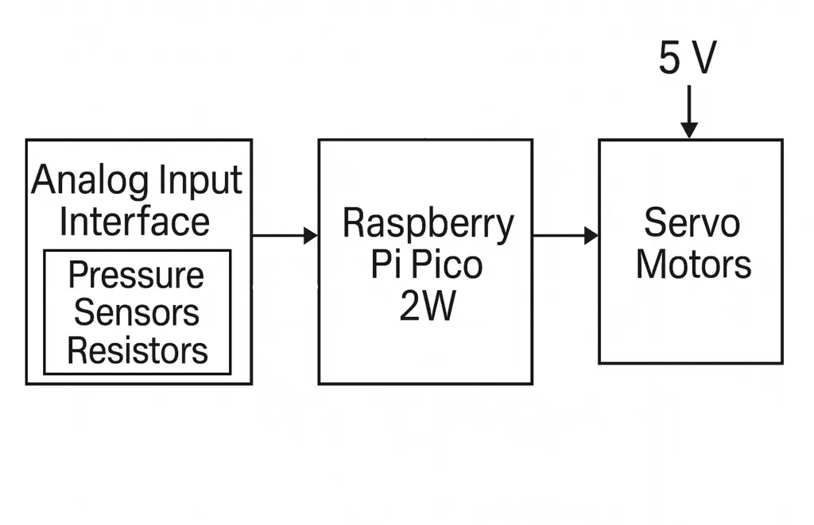
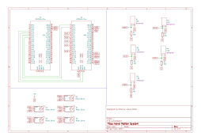
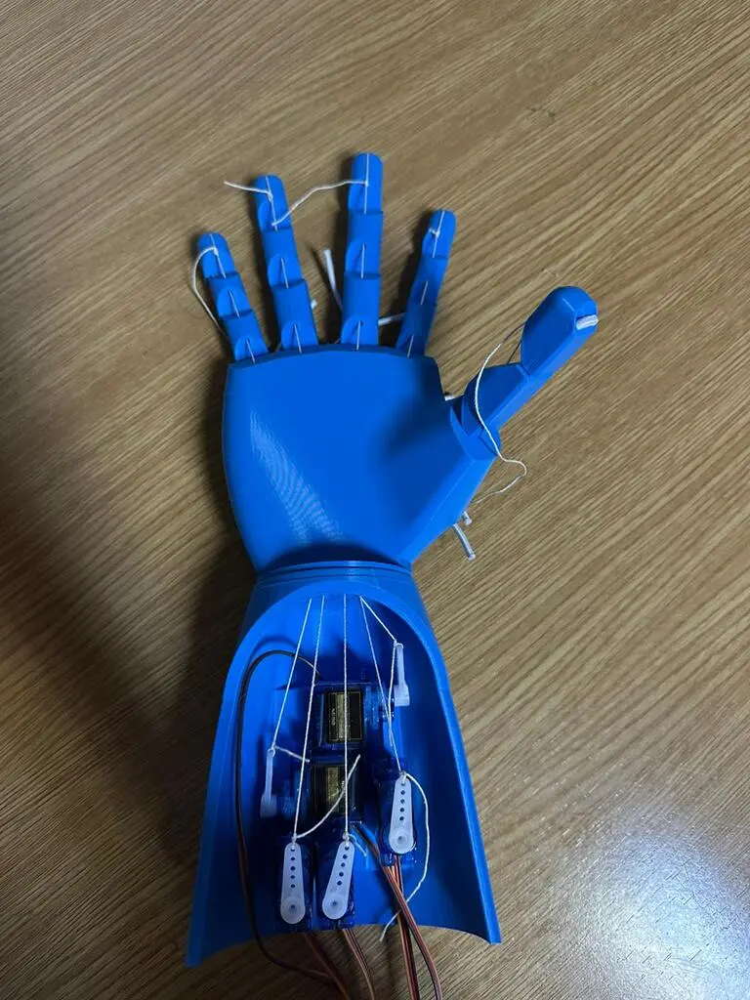
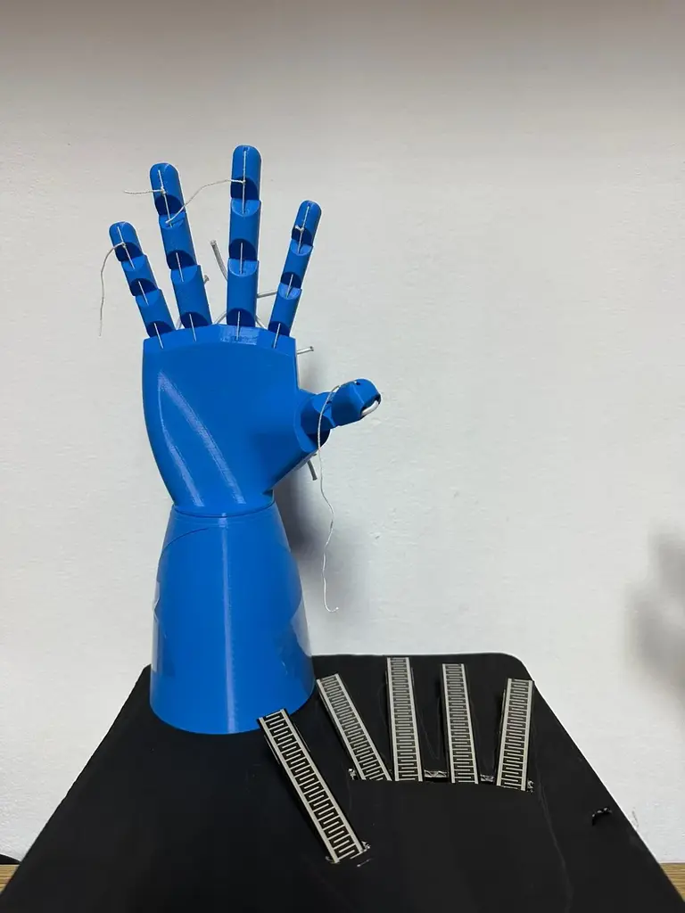

# Hand Motion System
A robotic hand that mimics user hand gestures via pressure sensors.

:::info 

**Author**: Bianca-Ioana Mihai (332CC) \
**GitHub Project Link**: https://github.com/UPB-PMRust-Students/proiect-biancamih

:::

## Description

The project involves building a 3D-printed robotic hand controlled by pressure sensors that detect finger presses. The robotic hand will replicate the movements of the user's hand in real-time, based on input from the sensors. These sensors send signals to a Raspberry Pi Pico 2W microcontroller, which interprets the data and drives individual servomotors for each finger of the robotic hand.

## Motivation

Hand gesture control offers an intuitive and accessible interface for robotic systems. This project aims to explore gesture-based interaction as a method for remote manipulation or accessibility tools for people with disabilities.

## Architecture 

The main architecture components and their interactions:

- **Input Layer**: Pressure sensors detect finger presses.
- **Processing Layer**: Raspberry Pi Pico interprets sensor data using ADC and maps it to servo positions.
- **Actuation Layer**: Servos in the robotic hand mimic the finger positions.


## Log

### Week 5 - 11 May

- Initial hardware procurement
- Defined the project's scope and main functionalities.
- Selected the core hardware components.

### Week 12 - 18 May
- Documented all hardware components.
- Connected each pressure sensor to the Pico's ADC via voltage dividers.
- Assigned PWM outputs to individual GPIO pins.
- Finalized mechanical assembly of robotic hand.
- Tested individual servos with static duty cycles.
- Calibrated analog input readings from pressure sensors.

### Week 19 - 25 May

## Hardware

- **Raspberry Pi Pico 2** – The core microcontroller for signal processing.
- **Pressure Sensors** – Detect user finger presses on a static input model.
- **Servomotors** – Control finger movement on the robotic hand.
- **3D-Printed Robotic Hand** – Physical output mechanism.
- **Resistors, breadboard, jumper wires, USB cable** – Circuit prototyping.

### Schematics

<!--Place your KiCAD schematics here. -->


### Photos



### Bill of Materials

<!-- Fill out this table with all the hardware components that you might need.

The format is 
```
| [Device](link://to/device) | This is used ... | [price](link://to/store) |

```

-->

| Device | Usage | Price |
|--------|--------|-------|
| [2 × Raspberry Pi Pico 2 W](https://www.raspberrypi.com/documentation/microcontrollers/pico-series.html) | Microcontrollers with Wi-Fi and Bluetooth for sensor processing and motor control | [40 RON each](https://www.optimusdigital.ro/ro/placi-raspberry-pi/13327-raspberry-pi-pico-2-w.html) |
| [5 × SG90 Micro Servo Motor](https://www.optimusdigital.ro/ro/motoare-servomotoare/2261-micro-servo-motor-sg90-180.html) | Actuators for robotic hand fingers | [12 RON each](https://www.optimusdigital.ro/ro/motoare-servomotoare/2261-micro-servo-motor-sg90-180.html) |
| [5 x Force Sensitive Resistor](https://www.sensor-test.de/assets/Fairs/2025/ProductNews/PDFs/SF15.pdf) | Detects force from the user's finger | [60 RON each](https://www.amazon.co.uk/Pressure-SF15-130-Resistance-Powerful-Sensitive/dp/B07PM64VN6/ref=sr_1_33?crid=23JOW43F2CRVQ&dib=eyJ2IjoiMSJ9.BsYERna4BQdO90ncctacvHuYw8Y8bmPwzhBNU39iD9Fs0iwHmTxn3dsXa-rzECqzjxf8yLEO-0gqvZCwWujpzSxcftJfuqD-CCeyiZtW59fuMhma60rKqXP6HycSpVhnJzaZSUSdLFk6-JHiZ4we0fXjotAT7qhXvNaReQzX4iG9-Cxa_yDB3en1HgmJJ8MgFnc2CAf0BCtEb8zMyYw8swU4CYHrix-XAQ9VLw9O8AcPStfTcNlkcBBCxzqG5Z0TNUOAknayjPyQWIkGME0S8tmfg0VxfLabDzy4cX-ZXhI.0wjQkt3wNfLhEmPA0whU_Vx8lJCTnHTzXJvrdHnJp-k&dib_tag=se&keywords=pressure+sensor&qid=1747589313&sprefix=pressure+sensor%2Caps%2C326&sr=8-33#) |
| [Jumper Wires](https://www.electronicwings.com/components/male-to-male-jumper-wire/1/datasheet) | This is used for wiring connections between modules and breadboard circuits | [23 RON](https://www.optimusdigital.ro/en/wires-with-connectors/12475-male-to-male-jumper-wires-40-pin-40cm.html) |
| [Breadboard](https://www.optimusdigital.ro/en/breadboards/13244-breadboard-175-x-67-x-9-mm.html) | Rapid prototyping without soldering | [15 RON](https://www.optimusdigital.ro/en/breadboards/13244-breadboard-175-x-67-x-9-mm.html) |
| [Resistors](https://www.plusivo.com/electronics-kit/117-plusivo-resistor-kit-250-pcs.html) | Used in voltage dividers and signal conditioning | [12 RON](https://www.optimusdigital.ro/en/resistors/10928-250-pcs-plusivo-resistor-kit.html) |


## Software

| Library | Description | Usage |
|---------|-------------|-------|
| [embassy-rp](https://github.com/embassy-rs/embassy) | Async runtime for Raspberry Pi Pico | Used to control GPIO, ADC, and timers |
| [embedded-hal](https://github.com/rust-embedded/embedded-hal) | Common hardware interface | Standard traits for pins, ADC, PWM |
| [defmt](https://github.com/knurling-rs/defmt) | Debug logging tool | Shows debug messages through RTT |


## Links

<!-- Add a few links that inspired you and that you think you will use for your project -->

1. [Robotic Hand Controlled by Glove - Flex Sensor + Arduino](https://www.youtube.com/watch?v=Fvg-v8FPcjg) 
2. [DIY Robotic Arm using Flex Sensors and Arduino](https://www.youtube.com/watch?v=7J9GLTyKoxc) 
3. [Wireless Controlled Robotic Hand using Flex Sensors](https://www.youtube.com/watch?v=lWnlJzvybIs) 
4. [Interfacing Flex Sensor with Arduino](https://circuitdigest.com/microcontroller-projects/interfacing-flex-sensor-with-arduino) 