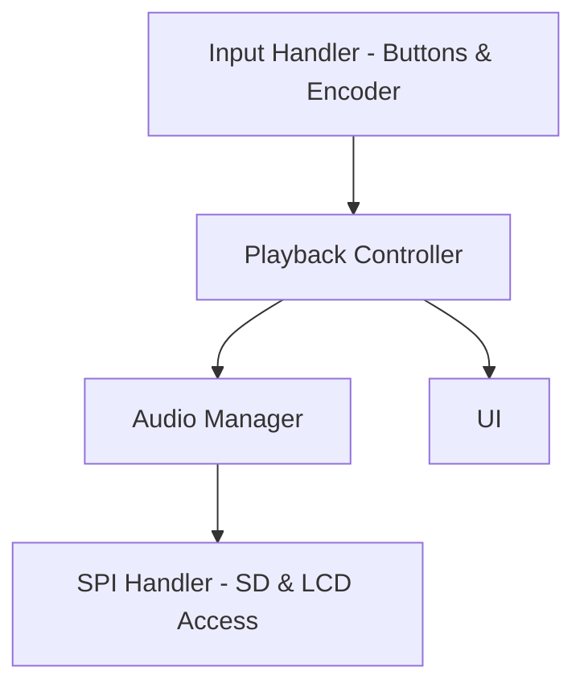
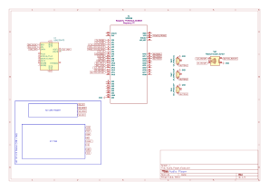
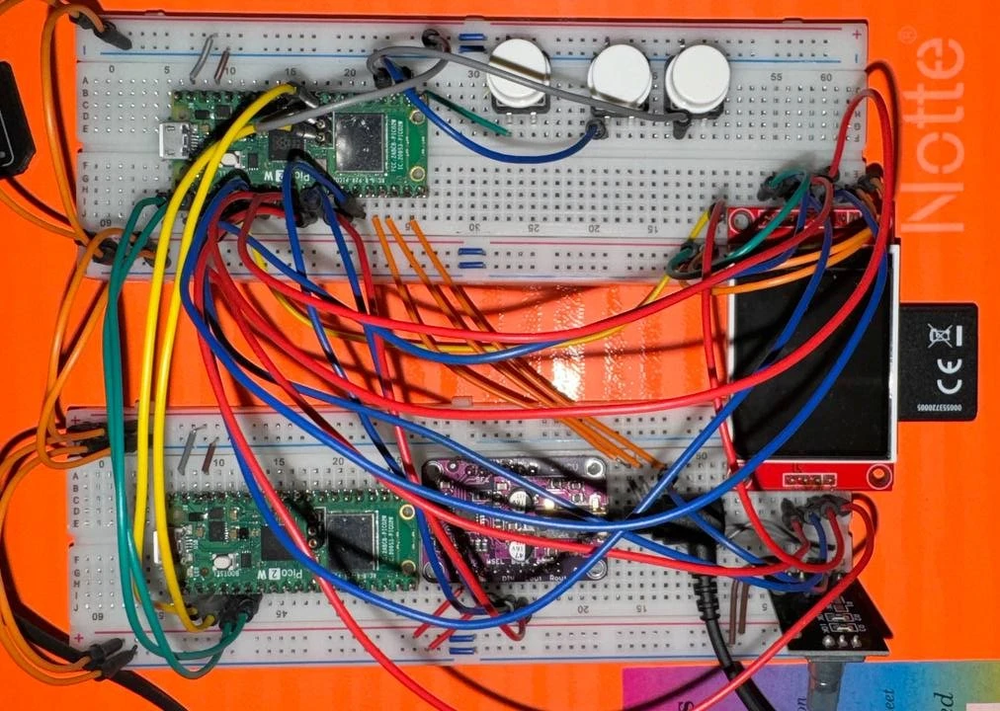

# Audio Player with Raspberry Pi Pico 2W

Audio player for headphones or devices with 3.5 jack.

:::info

**Author**: Rusu Carla-Maria \
**GitHub Project Link**: [link_to_github](https://github.com/UPB-PMRust-Students/proiect-rusucarla)

:::

## Description

This project implements a compact WAV audio player using the Raspberry Pi Pico 2W microcontroller.
The audio files are stored on a microSD card, read via SPI, and played through an I2S DAC (UDA1334A) connected to a 3.5mm headphone jack.
The user can use the push buttons and the rotary encoder to customize the experience.

---

## Motivation

The motivation for choosing this project was to explore embedded audio playback using Rust and Embassy on the Raspberry Pi Pico 2W.
The goal was to build a music player while learning low-level embedded I/O, SPI, I2S, and async execution using Rust.

---

## Architecture

### Components Overview

| Component           | Responsibility                                                 |
|-------------------- |----------------------------------------------------------------|
| Audio Handler       | Reads WAV files and streams audio via I2S to the DAC           |
| SPI Handler         | Interfaces with the SD card to access audio files and with the LCD to display information                                                                            |
| UI                  | Displays UI (e.g., file list, song name, progress)             |
| Input Handler       | Processes rotary encoder and buttons                           |
| Playback Controller | Controls playback state (play/pause, skip, etc.)               |

### Interconnection

- Input Handler dictates the state of the Playback Controller
- Playback Controller coordinates with Audio Manager and SPI Handler to stream audio.
- Audio Handler uses SPI Handler to get WAV file data.
- Playback Controller notifies UI to update the screen.

### Diagram

---

## Log

### Week 5 - 11 May

- Assembled the hardware setup on the breadboard:

  - Connected the Raspberry Pi Pico 2W.
  - Mounted the UDA1334A DAC, SD card module (SPI), LCD display, push buttons, and rotary encoder.
  - Carefully routed all jumper wires to avoid conflicts, ensuring SPI and I2S lines were correctly mapped.

- Wrote individual test functions for each hardware component:

  - Verified SPI communication with the LCD and SD card.
  - Tested I2S output to the DAC using dummy sine wave data.
  - Checked button press detection and rotary encoder rotation.

- Started experiencing SD card reliability issues:

  - Sometimes initialization would fail or return incomplete filesystem data.
  - Logging output revealed intermittent card detection failures.
 
- Started the main function which (should) combines all functionalities

### Week 12 - 18 May

- Implemented dedicated SD card diagnostics:

  - Created test routines to check for card health. And eventually reseting.
  - Integrated logging to display volume and partition status, with detailed error handling.

- Combined individual modules into a single integrated player prototype:

  - Managed concurrent use of SPI bus for both SD card and LCD.
  - Synchronized SD card read with audio playback over I2S.

- Encountered new reliability issues when combining all components:

  - SD card will fail mid-playback or block access after a few operations or just not be initialized with the right size
  - Not sure about the main culprit 

### Week 19 - 25 May

---

## Hardware Design

### Hardware Description

The following hardware was used:

- Raspberry Pi Pico 2W
- UDA1334A I2S DAC with 3.5mm jack socket
- LCD with built-in SD slot (will see if this is the best option)
- Rotary Encoder
- 3 push buttons
- Breadboards and jumper wires

### Schematic

Tried to do something in Kicad (not for dark mode)

### Photos

### Bill of Materials

| Item                                      | Quantity | Unit Price (RON) | Total (RON) | Usage                                    |
|-------------------------------------------|----------|------------------|-------------|------------------------------------------|
| [Raspberry Pi Pico 2W](https://www.optimusdigital.ro/en/raspberry-pi-boards/13327-raspberry-pi-pico-2-w.html?search_query=Raspberry+Pi+Pico+2W+&results=36)                      | 1        | 39.66            | 39.66       | Main controller                          |
| [Raspberry Pi Pico 2W(debug / Picoprobe)](https://www.optimusdigital.ro/en/raspberry-pi-boards/13327-raspberry-pi-pico-2-w.html?search_query=Raspberry+Pi+Pico+2W+&results=36)     | 1        | 39.66            | 39.66       | Used for SWD debugging                   |
| [UDA1334A I2S DAC Module](https://ardushop.ro/en/modules/933-dac-module-1334-uda1334a-i2s-dac-audio-stereo-decoder-module-board-for-arduino-33v-5v-6427854012432.html)                   | 1        | 56.76            | 56.76       | Audio output module                      |
| [LCD SPI Display 1.8" (128x160) with SD slot](https://www.optimusdigital.ro/en/lcds/1311-modul-lcd-spi-de-18-128x160.html?search_query=LCD+SPI+Display+1.8%22+%28128x160%29&results=4) | 1      | 28.99            | 28.99       | Used for UI and SD (via SPI)        |
| [Push Button (white round cap)](https://www.optimusdigital.ro/en/buttons-and-switches/1115-white-button-with-round-cover.html?search_query=push&results=140)             | 3        | 1.99             | 5.97        | Controls            |
| [Rotary Encoder Module](https://www.optimusdigital.ro/en/touch-sensors/7150-rotary-encoder-module.html?search_query=rotary+encoder&results=11)                     | 1        | 4.99             | 4.99        | Controls           |
| [10k Stereo Potentiometer](https://www.optimusdigital.ro/en/potentiometers/1886-10k-stereo-potentiometer.html?search_query=potentiometer&results=225)                  | 1        | 1.99             | 1.99        | Analog Control (ADC input)       |
| [Breadboard HQ (830 points)](https://www.optimusdigital.ro/en/breadboards/8-breadboard-hq-830-points.html?search_query=bread+board&results=420)                | 2        | 9.98             | 19.96       | For main Pico + Picoprobe wiring         |
| [Header pins (2.54 mm, 40p)](https://www.optimusdigital.ro/en/pin-headers/463-colored-40p-254-mm-pitch-male-pin-header-white.html?search_query=Header+pins+%282.54+mm%2C+40p&results=8)                | 2        | 0.99             | 1.98        | For soldering Pico and accessories       |
| [Female Breakable Header (40p)](https://www.optimusdigital.ro/en/pin-headers/1285-header-de-pini-mama-40p-254-mm-separabil.html?search_query=Header+pins+%282.54+mm%2C+40p&results=8)             | 1        | 2.56             | 2.56        | Extra connectivity (LCD/SD)              |
| [Breadboard rigid wires](https://www.optimusdigital.ro/en/wires-without-connectors/899-set-de-fire-pentru-breadboard-rigide.html?search_query=rigid&results=151)                    | 1        | 12.49            | 12.49       | Neat wiring on breadboard                |
| [Breadboard jumper wires](https://www.optimusdigital.ro/en/wires-with-connectors/12-breadboard-jumper-wire-set.html?search_query=jumper&results=237)                   | 1        | 7.99             | 7.99        | General-purpose jumpers                  |

Total Estimated Cost: 229.60 RON (for now)

---

## Software

To-do : complete later when I've finished

### Dependencies Overview

| Library | Description | Usage |
|--------|-------------|-------|
| [embassy](https://github.com/embassy-rs/embassy) | Async embedded framework | Core runtime for async tasks and peripherals |
| [embassy-rp](https://github.com/embassy-rs/embassy) | HAL for Raspberry Pi Pico (RP2040) | Controls GPIOs, SPI, I2S, etc. |
| [embedded-graphics](https://github.com/embedded-graphics/embedded-graphics) | 2D graphics library | Used for drawing text and shapes on LCD |
| [mipidsi](https://github.com/almindor/mipidsi) | Generic MIPI DSI display driver | Driver for ST7735 LCD |
| [display-interface-spi](https://github.com/almindor/display-interface) | SPI display abstraction | Connects the embedded-graphics to SPI-based displays |
| [embedded-sdmmc](https://github.com/rust-embedded-community/embedded-sdmmc-rs) | FAT filesystem over SD card | Used to read `.wav` files from SD card |
| [embedded-hal](https://github.com/rust-embedded/embedded-hal) | Traits for embedded devices | Base for SPI, I2S, ADC, GPIO, etc. |
| [defmt](https://github.com/knurling-rs/defmt) | Logging crate for embedded | For debugging and structured logs |
| [micromath](https://github.com/NeoBirth/micromath) | Lightweight math functions | Used for simulations of sound waves |

---

## Links

- [PIO Programs](https://github.com/embassy-rs/embassy/tree/93ff90db04f06316f0992b65a0319ebdf74ce5c4/embassy-rp/src/pio_programs) : Helped me with drivers for I2S and Rotary Encoder

