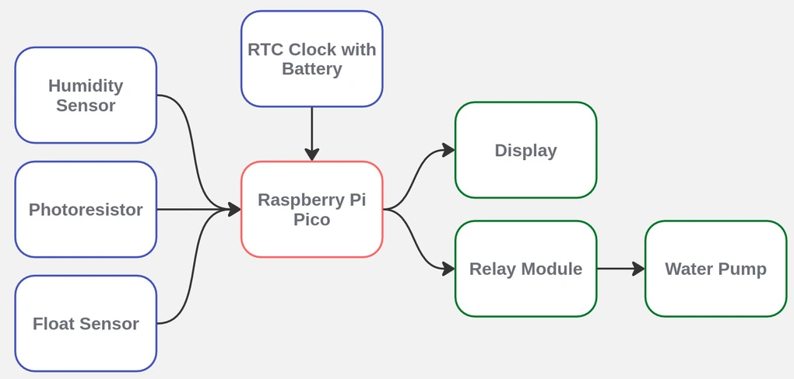
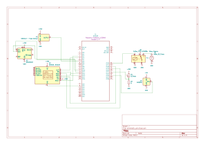
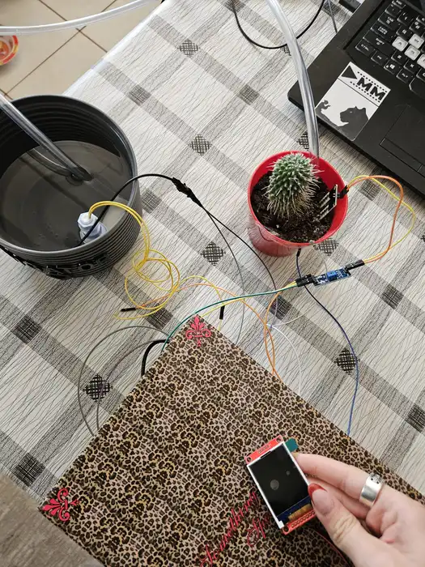
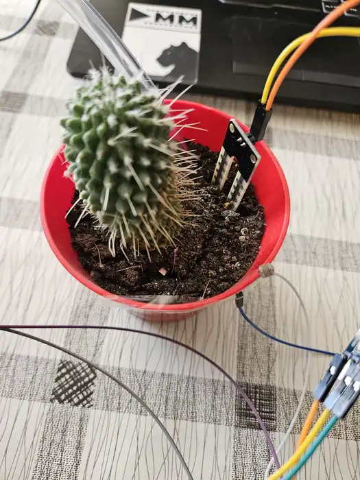
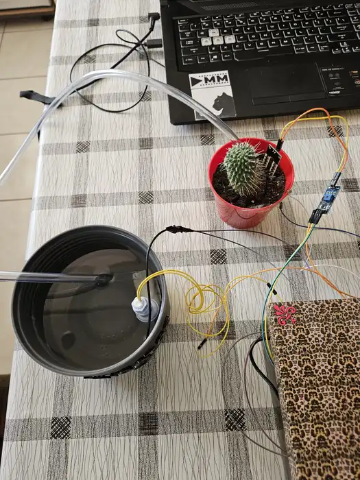
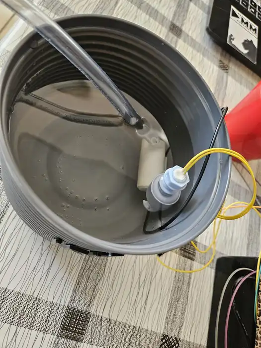

# Automatic Irrigation System
The project consists of an intelligent irrigation system for plants that constantly monitors essential parameters for optimal irrigation.
:::info 

**Author**: Murarescu Carmen-Maria \
**GitHub Project Link**: [https://github.com/UPB-PMRust-Students/proiect-CarmenMaria17](https://github.com/UPB-PMRust-Students/proiect-CarmenMaria17)

:::

## Description

The project consists of an intelligent irrigation system for plants that constantly monitors three essential parameters for optimal irrigation:

**Soil humidity** - determines when plants need water \
**Reservoir level** - checks water availability for irrigation \
**Light intensity** - prevents irrigation during periods of strong light

When soil moisture drops below a preset threshold, the system checks if the reservoir contains enough water and if the light intensity is suitable. If all conditions are met, it automatically activates a mini-pump that irrigates the plants.
The system includes a display to show levels (low, medium, high) for the 3 parameters.

## Motivation

I chose to develop this automatic irrigation system because I wanted to solve a practical problem many plant owners face, that being the inconsistent watering due to busy schedules or forgetfulness. Second, this project allows me to apply embedded systems knowledge in a hands-on way, working with multiple sensors and including a display for easy reading of the parameters.

## Architecture

The main architectural components are:

 - **RTC Clock with Battery** - a clock that keeps the microcontroller sleeping, it wakes it at intervals of 10 minutes and completes 20 measurements for accuracy and then puts it back to sleep

 - **Humidity Sensor & Photoresistor & Float Sensor** - measures the soil humidity and if it is too low, the light is not too strong and there is water in the reservoir then the realy module starts the water pump and it waters the plant

 - **Display** - shows all the parameters and messages for the start of the process etc.

### Architectural Diagram
 

## Log

### Week 5 - 11 May

- Connected the Hardware
- Tested the sensors

### Week 12 - 18 May

- Almost completed the final arangements (I decided I want to put it all in a bigger box, with the display on top of it)
- Updated the Bill Of Materials
- Did the Kicad schematic again with the now used pins of the MCU
- Added photos here of the hardware, that I will probably update again before the fair if something changes

### Week 19 - 25 May

- will do

## Hardware
### Sensors

* **Soil Hygrometer Humidity**: A precision resistive humidity sensor that measures soil moisture.

* **Photoresistor**: A light-dependent resistor that exhibits variable resistance inversely proportional to light intensity, enabling the system to monitor ambient light conditions for optimal plant growth.

* **Float Sensor**: A mechanical sensor triggers when water levels reach predefined thresholds, preventing both reservoir depletion and overflow conditions.

### Control and Timing Components

* **RTC (Real-Time Clock) Module**: Incorporates a DS3231 enabling programmed sleep cycles for the microcontrollers via interrupt-based wakeup, significantly reducing power consumption.

### Actuation

* **Relay Module**: A 5V relay that provides safe switching of the higher-current water pump circuit.

* **Water Pump**: A submersible pump capable of delivering appropriate water volume for plant irrigation.

### Display

* **ST7735 LCD Display**: A 1.8" TFT color display with SPI interface and embedded controller, providing visual representation of system status, sensor readings, and operational modes.

### Schematics

### Bill of Materials

| Device | Usage | Price |
|--------|--------|-------|
| [2x Raspberry Pi Pico W](https://www.raspberrypi.com/documentation/microcontrollers/raspberry-pi-pico.html) | The microcontroller | [35 RON](https://www.optimusdigital.ro/en/raspberry-pi-boards/12394-raspberry-pi-pico-w.html) |
| [Humidity Sensor](https://www.instrumart.com/assets/smr110-Datasheet.pdf?srsltid=AfmBOoqE7vxvck4x35u5bXmu0vDns5q3-ZUyhLd3r_urhq6-RJ-M9RCO) | Soil Humidity Measurement | [15 RON](https://roboromania.ro/produs/senzor-umiditate-sol-soil-hygrometer-humidity-compatibil-arduino/) |
| [Photoresistor](https://www.kth.se/social/files/54ef17dbf27654753f437c56/GL5537.pdf) | Light Measurement | [2 RON](https://www.optimusdigital.ro/ro/componente-electronice-altele/28-fotorezistor10-pcs-set.html?search_query=fotorezistor&results=23) |
| [Float Sensor](https://www.farnell.com/datasheets/1685059.pdf) | Checks Water Level | [20 RON](https://www.optimusdigital.ro/ro/senzori-altele/8179-senzor-de-lichid-flotant.html?gad_source=1&gclid=Cj0KCQjw_dbABhC5ARIsAAh2Z-SCGS8mPsI9e6o-apzGZdgeOpwNHHEVBhS-B3PsUJ8X4ahrL0ajDKUaAsZ4EALw_wcB) |
| [RTC Clock with Battery](https://www.analog.com/media/en/technical-documentation/data-sheets/ds3231.pdf) | Sleep Mode for MCU | [20 RON](https://www.optimusdigital.ro/en/others/1102-ds3231-real-time-clock-module.html?gad_source=1&gclid=Cj0KCQjw_dbABhC5ARIsAAh2Z-R2oyRZxz1s20qk5-7LgGPuBuylV-HcBeum7cOOqiyAfOLIVIgSqWwaArXVEALw_wcB) |
| [Relay Module](https://www.handsontec.com/dataspecs/2Ch-relay.pdf) | Controls the Water Pump | [5 RON](https://www.optimusdigital.ro/en/relay-modules/13084-relay-module-ordered-with-5v.html?gad_source=1&gclid=Cj0KCQjw_dbABhC5ARIsAAh2Z-QWcGMaJVQedCQaanv6ubN5V1UFiwWweAEKJ6ZWeH2KZsUC3ov1st0aAv7IEALw_wcB) |
| [Water Pump](https://5.imimg.com/data5/IQ/GJ/PF/SELLER-1833510/dc-mini-submersible-water-pump.pdf) | Waters the Plant | [24 RON](https://roboromania.ro/produs/mini-pompa-submersibila-520/) |
| [LCD Screen ST7735](https://www.displayfuture.com/Display/datasheet/controller/ST7735.pdf)  | Displays the measurements | [28 RON](https://www.amazon.de/-/en/gp/aw/d/B0CWN27HVB?psc=1&ref=ppx_pop_mob_b_asin_title) |
| [Power Source - 5V](https://docs.rs-online.com/9c50/0900766b8160af8c.pdf)  | Poweres the circuit | [5 RON](https://www.optimusdigital.ro/ro/electronica-de-putere-stabilizatoare-liniare/61-sursa-de-alimentare-pentru-breadboard.html) |
| [Others (wires, breadboards, pins etc)]  | Used for connections | [10 RON](https://www.optimusdigital.ro/ro/kituri/2222-kit-breadboard-hq-830-p.html?search_query=breadboard+kit&results=35) |

### Hardware Photos

## Software

| Library | Description | Usage |
|---------|-------------|-------|
| [embassy-executor](https://github.com/embassy-rs/embassy) | Async/await runtime for embedded systems | Provides the core async runtime for concurrent task execution |
| [embassy-time](https://github.com/embassy-rs/embassy) | Time handling for embedded systems | Manages timers, delays, and time-related operations |
| [embassy-rp](https://docs.embassy.dev/embassy-rp/git/rp2040/index.html) | Raspberry Pi Pico for Embassy | Hardware abstraction layer for RP2040 microcontroller with GPIO, I2C, SPI support |
| [embedded-hal](https://github.com/rust-embedded/embedded-hal) | Hardware abstraction layer traits | Core traits for peripheral access |
| [embassy-rp::adc](https://docs.embassy.dev/embassy-rp/git/rp2040/adc/index.html) | ADC module for Embassy RP | Reads analog values from photoresistor for light measurement |
| [ds323x](https://lib.rs/crates/ds323x) | DS3231 RTC driver | Manages the real-time clock with alarm functionality for sleep mode |
| [st7735-lcd](https://github.com/sajattack/st7735-lcd-rs) | ST7735 display driver | Controls the ST7735 LCD screen |
| [embedded-graphics](https://github.com/embedded-graphics/embedded-graphics) | graphics library | Drawing routines for text and graphics on the display |
| [embassy-rp::gpio](https://docs.embassy.dev/embassy-rp/git/rp2040/gpio/index.html) | GPIO module for Embassy RP | Controls the float sensor, relay, buttons, and other digital I/O |

## Links

1. [Documentatie MCU](https://www.raspberrypi.com/)
2. [Embassy Documentation](https://embassy.dev/book/)
3. [Embassy-RP Crate Docs](https://docs.embassy.dev/embassy-rp/git/rp2040/index.html)
4. [Embassy GitHub Repository](https://github.com/embassy-rs/embassy)