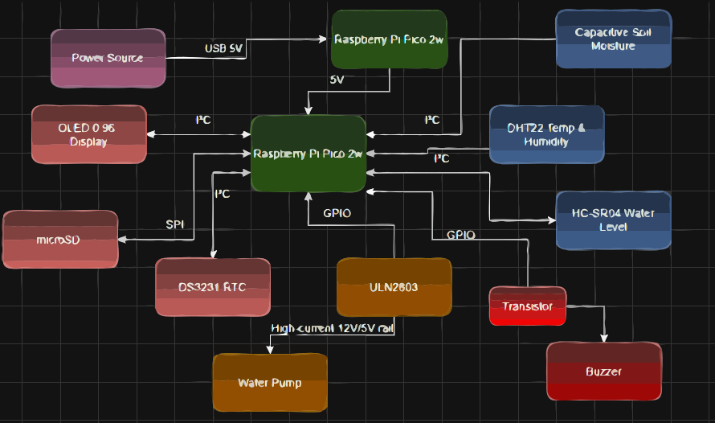
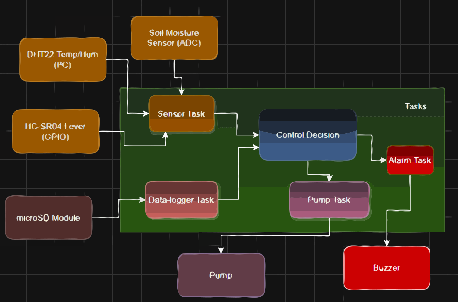
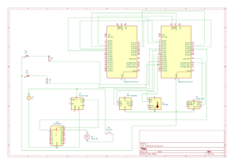
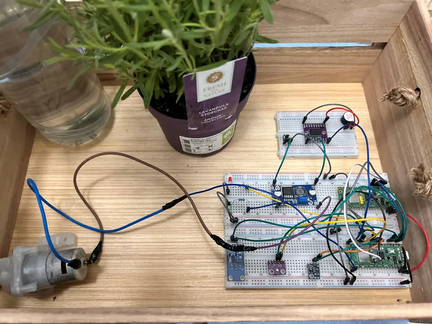
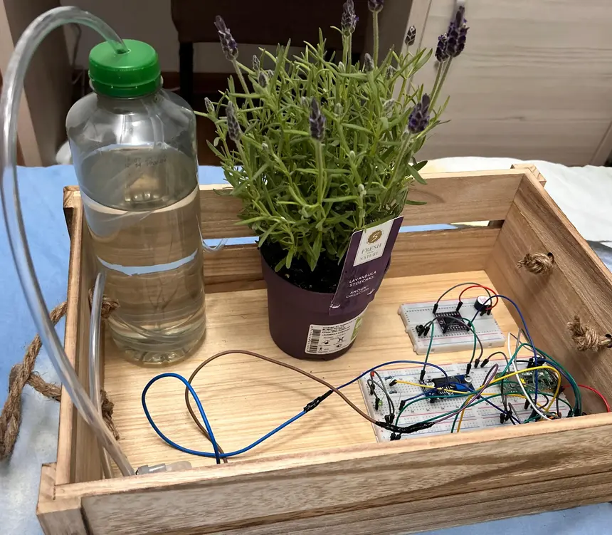
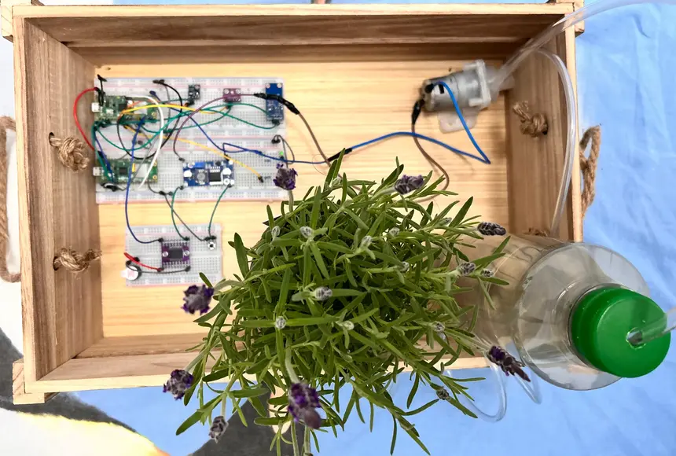
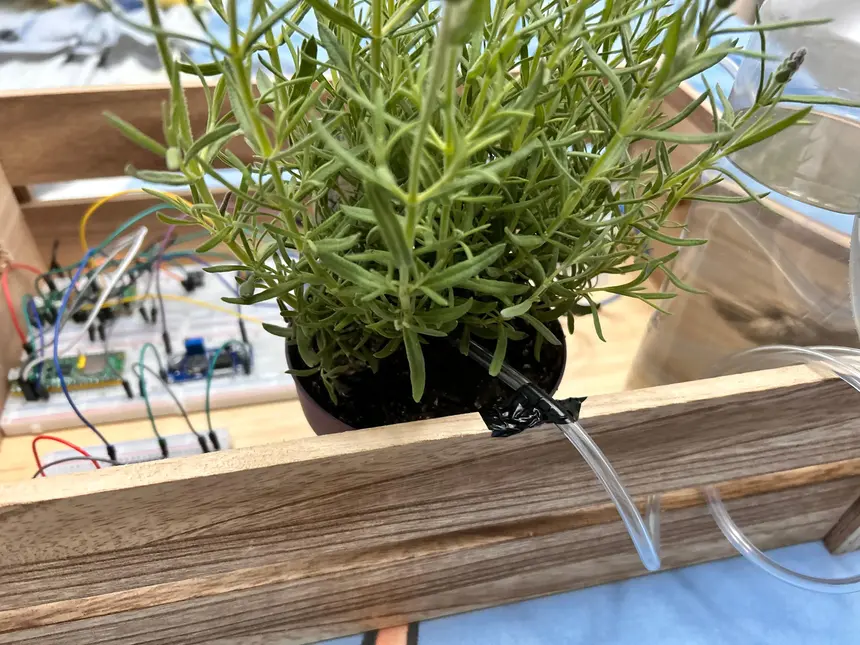

# SIrriS

Smart Irrigation System using Dual Raspberry Pi Pico 2 (Rust Embedded)

**Author**: Dobrinoiu David \
**GitHub Project Link**: [PMRust](https://github.com/UPB-PMRust-Students/proiect-david1203d)

## Description

An automated irrigation system using two Raspberry Pi Pico boards programmed in Rust.
The system measures soil moisture, air temperature and humidity. 
Based on sensor data, it controls water pumps and valves. One Pico manages the sensors
and actuators, while the second Pico handles user interaction, data logging, 
and debugging functionalities.

## Motivation

I was inspired to create this project by a real-world problem I personally observed: 
the inefficiency of manual irrigation systems. My goal is to design a solution that 
brings real added value by automating irrigation based on environmental conditions. 
Using the knowledge and ideas I developed, I aim to build a system that is practical, 
efficient, and can have a positive impact in everyday life.

## Architecture

### Overview

**Pico 1 – Main Node (Controller)**
- Handles real-time sensor data
- Controls irrigation via transistor array (ULN2803A)
- Drives the buzzer and feedback LEDs
- Web interface via Wi-Fi for live monitoring (using smoltcp)

**Pico 2 – Debug Node**
- Used for flashing and debugging via SWD
- Optional UART communication with Pico 1

### Connected Modules

| Component | Interface | Pico Pin Example |
|----------|-----------|------------------|
| HTU21 Sensor | I2C | SDA=GP0, SCL=GP1 |
| BH1750 Light Sensor | I2C | SDA=GP0, SCL=GP1 (shared bus) |
| Soil Moisture (Analog) | ADC | ADC0 = GP26 |
| ULN2803 + Pump | Digital GPIO | IN1 = GP15 |
| Buzzer (via Transistor) | Digital GPIO | GP14 |
| LED Indicators | Digital GPIO | GP16, GP17 |
| Button (manual trigger) | Digital GPIO | GP18 |

### Functional Diagram

---

## Log

### Week 5 - 11 May
- Chosen architecture and basic wiring tested

### Week 12 - 18 May
- Sensor readings integrated, pump logic implemented

### Week 19 - 25 May
- Final integration

---

## Hardware

This project was built with breadboard prototyping and basic soldered connectors. A DC-DC XL6009 boost converter is used to raise 6V (battery) to 12V for driving the water pump. Logic runs at 3.3V. All modules are connected to the main Pico, with power and signal routing handled via jumper wires.

### Schematics

Electrical schematic created in KiCad. For illustration, refer to the image below:

---

### Bill of Materials

| Device | Usage | Price |
|--------|-------|-------|
| [2x Raspberry Pi Pico W](https://www.optimusdigital.ro/en/raspberry-pi-boards/12394-raspberry-pi-pico-w.html) | Dual controller setup | 69 RON |
| [HTU21 Sensor](https://www.optimusdigital.ro/ro/senzori-temperatura/1193-senzor-de-temperatura-si-umiditate-htu21.html) | Measures temperature & humidity | ~15 RON |
| [BH1750 Light Sensor](https://www.optimusdigital.ro/ro/senzori-lumina/3103-senzor-de-lumina-bh1750.html) | Measures ambient light | ~10 RON |
| [Soil Moisture Sensor](https://ardushop.ro/ro/senzori/1286-modul-senzor-umiditate-sol-higrometru-6427854018571.html) | Reads soil humidity | ~8 RON |
| [ULN2803A Module](https://www.optimusdigital.ro/ro/module/6822-modul-uln2803a-8x-transistor-darlington.html) | Drives pump from logic pin | ~20 RON |
| [Mini Water Pump 12V](https://www.optimusdigital.ro/ro/motoare-pompe/360-mini-pompa-de-apa-3-6v-dc.html) | Pumps water | ~16 RON |
| [XL6009 DC-DC Boost](https://www.optimusdigital.ro/ro/alimentare/1379-convertor-xl6009.html) | Boosts voltage to 12V | ~10 RON |
| [1N4007 Diode](https://www.optimusdigital.ro/ro/diode/4713-dioda-redresare-1n4007.html) | Back-EMF protection | ~0.50 RON |
| [RTC DS3231](https://www.optimusdigital.ro/ro/ceasuri-in-timp-real-rtc/2066-modul-rtc-ds3231-i2c.html) | Timekeeping | ~15 RON |
| [Passive Buzzer](https://www.optimusdigital.ro/ro/buzzer/123-buzzer-pasiv-5v.html) | Audible alert | ~1 RON |
| [NPN Transistor 2N2222](https://www.optimusdigital.ro/ro/tranzistoare/2752-tranzistor-npn-2n2222.html) | Controls buzzer | ~1 RON |
| [Resistors (1kΩ, 10kΩ)](https://www.optimusdigital.ro/ro/rezistoare/5885-rezistor-14w-1kω-1-.html) | Pull-downs, base limiter | ~0.30 RON |
| [Breadboard + Jumper Wires](https://www.optimusdigital.ro/ro/accesorii/1995-breadboard-kit-cu-cabluri-jumper.html) | Assembly & wiring | ~10 RON |

---

## Software

| Library/Crate | Description | Usage |
|---------------|-------------|--------|
| [rp-pico](https://github.com/rp-rs/rp-hal) | Rust HAL for Pico | Peripheral control |
| [embedded-hal](https://github.com/rust-embedded/embedded-hal) | Hardware abstraction traits | GPIO, ADC, SPI, I²C |
| [smoltcp](https://github.com/smoltcp-rs/smoltcp) | TCP/IP Stack | HTTP Server on Pico |
| [embassy](https://embassy.dev/) | Async Runtime | Async state machines & timers |

---

## Links

1. [Rust on Raspberry Pi Pico](https://docs.rust-embedded.org/discovery/f3discovery/03-setup/index.html)
2. [Rust Embassy Framework](https://embassy.dev/)
3. [Irrigation DIY Ideas](https://projects.raspberrypi.org/en/projects/plant-watering-system)