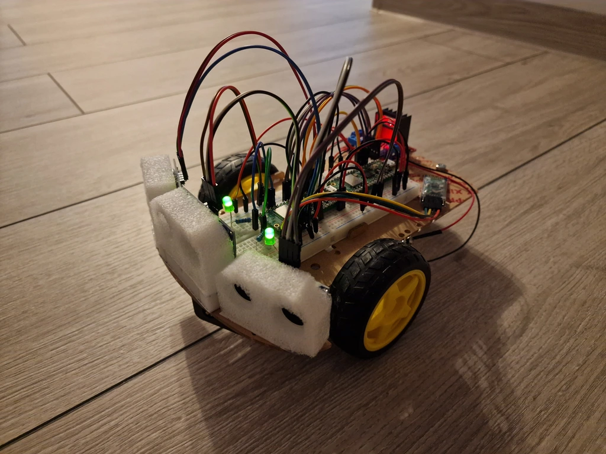
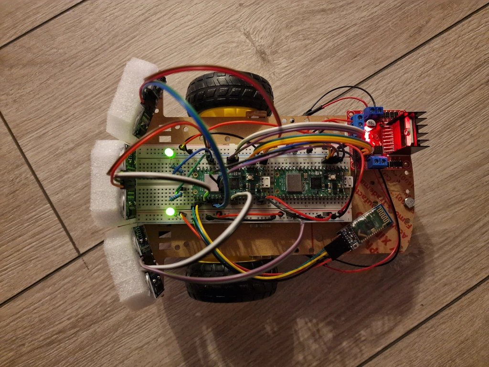

# Bluetooth-Controlled Car
A remote-controlled robotic car using Raspberry Pi Pico 2W, with real-time feedback and obstacle detection.

:::info 

**Author**: Stiuj Emanuel-Ștefan \
**GitHub Project Link**: https://github.com/UPB-PMRust-Students/proiect-emanuelstiuj

:::

## Description

This project is a remotely controlled car that interacts with a multithreaded Ubuntu application. It receives movement commands over Bluetooth or WiFi, based on user preference, and sends real-time feedback. The car is equipped with three ultrasonic sensors to detect obstacles, helping it avoid front collisions. Signal lights clearly indicate the car’s power status and turning direction, ensuring easy monitoring and intuitive operation.

## Motivation

This project was inspired by a strong interest in cars and remote-controlled systems. It provided an opportunity to better understand how various components, such as microcontrollers, motor drivers, sensors, and communication modules, interact in a real-world embedded system. Working on this allowed for both creative and technical exploration, combining hardware and software to build something functional, interactive, and fun.

## Architecture 


#### System Architecture

The system is built around a central microcontroller, the **Raspberry Pi Pico 2W**, which interfaces with multiple peripherals to enable wireless control and feedback:

- **Bluetooth (HC-05 module)**: Connects to the Pico via **UART** for serial communication, receiving commands from an Ubuntu terminal app over the **Bluetooth Serial Port Profile (SPP)**. The HC-05 operates typically as a slave device, allowing the app to initiate and send control data.
- **Motor Driver (L298N)**: Receives **PWM** signals (for speed control) and **GPIO** signals (for direction control) from the Pico to drive DC motors. The L298N provides high-current output to the motors based on the Pico’s low-power signals.
- **Ultrasonic Sensors (3 units)**: Measure distance to obstacles and detect potential collisions in multiple directions, providing digital input to the Pico for real-time obstacle avoidance.
- **LEDs**: Controlled via **GPIO pins** to provide visual feedback on system states (e.g., power status or turning left/right).
- **Power Supply (2x 18650 batteries)**: Supplies power to the L298N motor driver directly (typically at 7.4V) and to the Pico through a voltage regulator (e.g., 5V step-down converter) to ensure stable operation.

#### Flow of Control

1. The Ubuntu terminal app sends commands wirelessly to the car over **Bluetooth SPP** or **WiFi** based on the user's selected mode.
2. For Bluetooth, The **HC-05 module** relays these commands to the Pico over **UART**. For WiFi, commands are sent directly to the Pico's network stack.
3. The Pico processes the commands and generates **PWM** and **GPIO** signals to the L298N, controlling motor speed and direction.
4. The three **ultrasonic sensors** continuously measure distances to nearby objects. If a potential collision is detected, the Pico overrides the received commands to stop the motors.
5. The Pico sends **real-time feedback** (obstacle distances and gear change confirmations) back to the same terminal app.
6. **LEDs** are toggled via GPIO to provide visual feedback on system states (e.g., power status, or turning left/right).

## Log

<!-- write your progress here every week -->

### Week 5 - 11 May
- Purchased all hardware components.
- Created the CAD schematic of the system.
- Partially assembled the components on the chassis.
- Performed initial functionality tests: verified motor operation via the L298N driver and confirmed a stable 5V output from its onboard voltage regulator.
- Finalized the first draft of the project documentation.

### Week 12 - 18 May
- Finalized the complete hardware assembly of the robotic system.
- Created a minimalist Rust app on Ubuntu to send commands via Bluetooth.
- Implemented and successfully tested fundamental movement functions: forward, backward, left, and right — validating motor control logic and responsiveness.





### Week 19 - 25 May
- Completed the software development for both the Raspberry Pi Pico firmware and the Ubuntu terminal app.
- Changed communication design to allow the user to select either Bluetooth or WiFi for both sending commands and receiving feedback, instead of using both simultaneously.
- Found that using Bluetooth for commands and WiFi for feedback at the same time caused interference and connection issues.

## Hardware

- **Raspberry Pi Pico 2W**: Microcontroller responsible for communication, processing, and motor control.
- **HC-05 Bluetooth Module**: Wireless interface for receiving remote control commands.
- **L298N Motor Driver**: Allows control of DC motors and also provides a stable 5V output to power other components.
- **3x Ultrasonic Sensors**: Measure distances to obstacles in multiple directions for collision detection and avoidance.
- **LEDs + Resistors**: Used as visual indicators for system states such as power status and turn signals (left/right).
- **2x DC Motors + Wheels**: Enable movement and directional control of the car.
- **Power Supply (2x 18650 Batteries)**: Supplies sufficient voltage and current to power the motors and the other components.
- **Chassis, Wires, Breadboard**: Provide structural support and electrical connectivity for all components.

### Schematics


### Bill of Materials

<!-- Fill out this table with all the hardware components that you might need.

The format is 
```
| [Device](link://to/device) | This is used ... | [price](link://to/store) |

```

-->

| Device | Usage | Price |
|--------|--------|-------|
| [Raspberry Pi Pico 2W (x2)](https://datasheets.raspberrypi.com/picow/pico-2-w-datasheet.pdf) | Main control + debugging | [80 RON](https://www.optimusdigital.ro/en/raspberry-pi-boards/13327-raspberry-pi-pico-2-w.html) |
| [HC-05 Bluetooth Module](https://components101.com/sites/default/files/component_datasheet/HC-05%20Datasheet.pdf) | Bluetooth remote control | [28 RON](https://www.optimusdigital.ro/en/wireless-bluetooth/153-hc-05-master-slave-bluetooth-module-with-adapter-33v-and-5v-compatible.html) |
| [L298N Motor Driver](https://www.handsontec.com/dataspecs/L298N%20Motor%20Driver.pdf) | Drives motors, powers Pico (5V) | [11 RON](https://www.optimusdigital.ro/en/brushed-motor-drivers/145-l298n-dual-motor-driver.html) |
| [3-6V DC Motor with Wheel (x2)](https://www.moog.com/literature/MCG/moc23series.pdf) | Car movement | [30 RON](https://www.optimusdigital.ro/en/others/139-gearmotor-with-wheel.html) |
| [HC-SR04 Ultrasonic Sensor (x3)](https://www.snapeda.com/parts/HC-SR04/SparkFun%20Electronics/datasheet/) | Distance & collision detection | [20 RON](https://www.optimusdigital.ro/en/ultrasonic-sensors/9-hc-sr04-ultrasonic-sensor.html) |
| [LED Headlights (x2)](https://www.farnell.com/datasheets/1519875.pdf) | Power & turn signals | [1 RON](https://www.optimusdigital.ro/en/leds/38-5-mm-green-led-with-difused-lens.html) |
| [18650 Li-ion Battery (x2)](https://www.ineltro.ch/media/downloads/SAAItem/45/45958/36e3e7f3-2049-4adb-a2a7-79c654d92915.pdf) | Power supply (7.4V) | [40 RON](https://www.optimusdigital.ro/en/li-ion-batteries/1725-samsung-2600-mah-18650-li-ion-battery-icr18650-26f.html) |
| [Battery Holder (2x18650)](https://www.optimusdigital.ro/en/battery-holders/941-2x18650-battery-case.html) | Holds batteries in series | [4 RON](https://www.optimusdigital.ro/en/battery-holders/941-2x18650-battery-case.html) |
| [220Ω Resistors (x2)](https://www.digchip.com/datasheets/parts/datasheet/1838/CFR-25JB-220R-pdf.php) | Current limiting for LEDs | [1 RON](https://www.optimusdigital.ro/en/resistors/1097-025w-220-resistor.html) |
| [Breadboard 830p](https://ro.mouser.com/datasheet/2/58/BPS_DAT__BB830__Datasheet-1842667.pdf) | Circuit prototyping | [11 RON](https://www.emag.ro/breadboard-830-puncte-mb102-cl01/pd/DF0C5JBBM/) |
| [Male–Female Wires (set)](https://www.cedist.com/sites/default/files/associated_files/s-w604_spec.pdf) | Module-to-Pico connections | [5 RON](https://www.optimusdigital.ro/en/all-products/876-15-cm-male-female-wires-10p.html) |
| [Jumper Wires (set)](https://www.cedist.com/sites/default/files/associated_files/s-w604_spec.pdf) | Breadboard wiring | [8 RON](https://www.optimusdigital.ro/en/wires-with-connectors/12-breadboard-jumper-wire-set.html) |
| [Male Header Pins (40x2)](https://www.farnell.com/datasheets/2585485.pdf) | Pico-to-breadboard interface | [2 RON](https://www.optimusdigital.ro/en/pin-headers/463-colored-40p-254-mm-pitch-male-pin-header-white.html) |
| [Chassis](https://roboromania.ro/produs/sasiu-2wd-robot-car-chassis-v1/) | Component mounting base | [25 RON](https://roboromania.ro/produs/sasiu-2wd-robot-car-chassis-v1/) |
| [Ball Caster](https://www.tme.eu/Document/929ded46c512a610389c1a9f00880cac/POLOLU-953.pdf) | Rear balance support | [4 RON](https://www.optimusdigital.ro/en/ball-casters/74-ball-caster.html) |

**Total Estimated Cost**: ~274 RON (excluding shipping).

## Software

| Library | Description | Usage |
|---------|-------------|-------|
| [embassy](https://github.com/embassy-rs/embassy) | Asynchronous embedded framework in Rust | Core framework for async multitasking on the Pico 2W |
| [embassy-rp](https://github.com/embassy-rs/embassy/tree/main/embassy-rp) | RP23450-specific support for Embassy | Enables async support and peripheral access on Raspberry Pi Pico 2W (GPIO, PWM, UART, etc.) |
| [embedded-hal](https://github.com/rust-embedded/embedded-hal) | Hardware Abstraction Layer | Standard traits for embedded peripherals |
| [embassy-net](https://github.com/embassy-rs/embassy/tree/main/embassy-net) | Embedded network stack | UDP communication over Wi-Fi |
| [embassy-time](https://github.com/embassy-rs/embassy/tree/main/embassy-time) | Async timers and delays | Used for non-blocking delays and timeouts |
| [embassy-executor](https://github.com/embassy-rs/embassy/tree/main/embassy-executor) | Task executor for async Embassy  | Runs async tasks in cooperative scheduling |
| [defmt](https://github.com/knurling-rs/defmt) | Logging for embedded Rust | Efficient debug output via probe |
| [panic-probe](https://github.com/knurling-rs/defmt/tree/main/firmware/panic-probe) | Panic handler | Reports panics via probe in development |
| [cyw43](https://github.com/embassy-rs/embassy/tree/main/cyw43) | Wi-Fi driver for Pico 2W | Connects the device to a network |
| [heapless](https://github.com/rust-embedded/heapless) | Fixed-capacity data structures | Used for stack-safe strings |

## Links  

1. [Raspberry Pi Pico 2W Documentation](https://datasheets.raspberrypi.com/picow/pico-2-w-datasheet.pdf)  
2. [HC-05 Bluetooth Module Guide](https://www.instructables.com/How-to-Use-HC-05-Bluetooth-With-Raspberry-Pi-Pico-/)  
3. [L298N Motor Driver Guide](https://microcontrollerslab.com/dc-motor-l298n-driver-raspberry-pi-pico-tutorial/)
4. [Obstacle Sensor Guide](https://randomnerdtutorials.com/complete-guide-for-ultrasonic-sensor-hc-sr04/)
