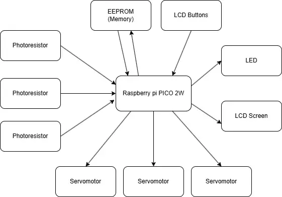
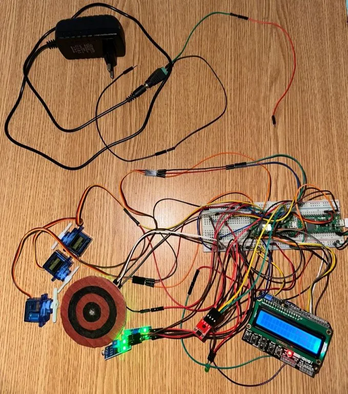

# Hit the Target

Laser tag style game where the player uses a laser pointer to hit targets

:::info

**Author**: Echim Eugen Andrei \
**GitHub Project Link**: [Link to github](https://github.com/UPB-PMRust-Students/proiect-EchimAndrei)

:::

## Description

This project replicates a laser tag style game where the player uses a laser pointer to hit targets. The system consists of three targets that rise using servo motors. Each target is equipped with a photoresistor to detect laser hits. When a hit is registered, the corresponding target drops and a point is added to the player's score.

## Motivation

Laser tag and arcade shooting games are widely popular and engaging. This project merges fun with technical learning, making it ideal for exploring electronics, sensors, microcontrollers, and motor control. It also enables skill development in coding, circuit design, and hardware-software integration.

## Architecture

-   **Raspberry Pi Pico W x2** – One handles sensor input, servo control, and game logic; the other is used for debugging and serial logging.
-   **Photoresistors (LDRs) x3** – Detect laser light intensity. Connected via voltage divider circuits to ADC pins on the Pico.
-   **Servomotors x3** – Physically raise and lower the game targets.
-   **Green LED** – Flashes when a target is hit. Connected to a GPIO pin with a current-limiting resistor.
-   **LCD Display with button shield** – Displays the game menu, current score, and leaderboard. The buttons allow user navigation through the interface.
-   **EEPROM Memory** – Stores the top 5 leaderboard scores persistently, even after power loss.

## Log

### Week 5 - 11 May

-   Created the initial documentation.
-   Researched suitable hardware components for the project and placed the necessary orders.

### Week 12 - 18 May

-   Assembled the hardware setup and started writing the initial part of the code.

### Week 19 - 25 May

## Hardware:

**Raspberry Pi Pico 2W**

-   **Purpose:** Main control units
-   **Function:** One Pico manages all core components: sensors, servomotors, LCD display, EEPROM memory, and the LED. The second is used for debugging and system monitoring.

**Photoresistors (LDRs)**

-   **Purpose:** Laser hit detection
-   **Function:** Measure ambient light intensity to detect when a laser beam hits the target.

**Servomotors**

-   **Purpose:** Target movement
-   **Function:** Raise and lower physical targets based on game logic.

**Push Buttons (on LCD shield)**

-   **Purpose:** User interaction
-   **Function:** Allow the player to navigate menus, input initials for scores, and reset the game.

**Green LED**

-   **Purpose:** Visual feedback
-   **Function:** Flashes to indicate a successful hit.

**LCD Display**

-   **Purpose:** Game interface
-   **Function:** Displays game logic, score, and leaderboard. Buttons provide menu navigation.

**EEPROM Memory**

-   **Purpose:** Persistent score storage
-   **Function:** Saves the top 5 high scores along with player initials, ensuring data is retained across power cycles.

### Schematics

### Photos of the device

### Bill of Materials

| Device                                            | Usage                                       | Price |
| ------------------------------------------------- | ------------------------------------------- | ----- |
| [Raspberry Pi Pico 2W](https://shorturl.at/lTGLQ) | Main microcontrollers for logic and control | 39.66 |
| [Servomotors](https://shorturl.at/g2V5g)          | Physically raise and lower the targets      | 11.99 |
| [LDR](https://shorturl.at/sYUWR)                  | Detect laser light intensity on targets     | 3.20  |
| [LCD Display](https://shorturl.at/TeJtM)          | Display game logic, score, and menu         | 21.69 |
| [EEPROM Memory](https://shorturl.at/uKPkF)        | Store top 5 scores with player initials     | 8.99  |
| [Resistors](https://tinyurl.com/37tb2s9j)         | Used in voltage dividers and LED circuit    | 14.91 |
| [Breadboard](https://tinyurl.com/ec36tzht)        | Prototyping and testing the circuit         | 6.38  |
| [Wires](https://tinyurl.com/3z9e5ndt)             | Connect components on breadboard            | 5.99  |
| [LED Green](https://tinyurl.com/y2wc5zda)         | Blinks on target hit as visual feedback     | 0.39  |

## Software

| Library                                                                  | Description                                     | Usage                                                    |
| ------------------------------------------------------------------------ | ----------------------------------------------- | -------------------------------------------------------- |
| [embassy-rp](https://github.com/embassy-rs/embassy/tree/main/embassy-rp) | Async runtime and drivers for RP2040            | Used to interface with RP2040 peripherals asynchronously |
| [embedded-hal](https://github.com/rust-embedded/embedded-hal)            | Traits for embedded hardware abstraction        | Used to write platform-independent drivers               |
| [embedded-executor](https://github.com/embassy-rs/embassy)               | Async task executor for embedded systems        | Provides async task scheduling in `no_std` environments  |
| [embedded-time](https://github.com/embedded-time/embedded-time)          | Timekeeping and duration types for embedded use | Used for expressing delays and time durations            |
| [fixed](https://github.com/aldanor/fixed)                                | Fixed point arithmetic support                  | Used for precise fractional calculations (if needed)     |
| [hd44780-driver](https://crates.io/crates/hd44780-driver)                | Driver for HD44780 compatible LCDs              | Used to display scores and messages on the LCD           |
| [eeprom24x](https://crates.io/crates/eeprom24x)                          | Driver for 24x-series I2C EEPROM chips          | Used to store and read leaderboard scores persistently   |
| [defmt](https://crates.io/crates/defmt)                                  | Logging framework optimized for embedded        | Used for efficient debug logging                         |
| [defmt-rtt](https://crates.io/crates/defmt-rtt)                          | RTT (Real-Time Transfer) transport for defmt    | Used to output defmt logs via RTT                        |
| [panic-probe](https://crates.io/crates/panic-probe)                      | Panic handler for embedded with defmt support   | Used to display panic messages during development        |
| [itoa](https://crates.io/crates/itoa)                                    | Fast integer to string conversion               | Used to convert integers to strings for display          |
| [core::fmt](https://doc.rust-lang.org/core/fmt/index.html)               | Rust core formatting module                     | Used to format text for display (e.g. score lines)       |
| [heapless](https://crates.io/crates/heapless)                            | Data structures without dynamic allocation      | Used for string buffers and fixed-size arrays            |

## Links

1. [Inspiration](https://projecthub.arduino.cc/ksulamanidze/hit-the-target-shooting-game-5c1638)
