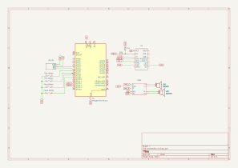
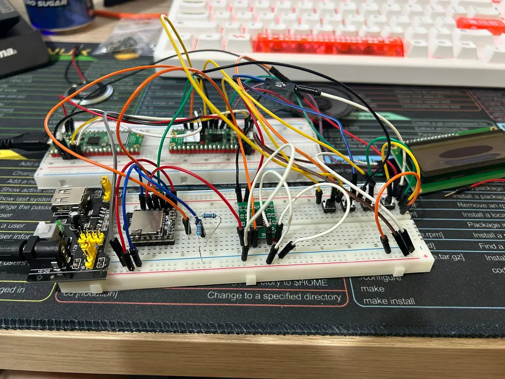

# MP3 Player
Mini music player based on Raspberry Pi Pico 2.

:::info
**Author**: Liță Gabriel-Laurențiu \
**GitHub Project Link**: https://github.com/UPB-PMRust-Students/proiect-gabruellita
:::

---

## Description
The project consists of a **mini music player** built around a **Raspberry Pi Pico 2**, capable of:
- Playing music from a microSD card.
- Displaying song information on a small LCD screen.
- Supporting **play**, **pause**, **next**, and **previous** controls through physical buttons.
- Using **Rust** with **Embassy** for efficient multitasking.

At first, the device will play audio through a **small speaker** connected via a **PAM8403 mini amplifier**.  
**Optionally**, if the basic setup is successful, the player may be expanded with **headphone jack output** and/or **Bluetooth audio** support.

---

## Motivation
I wanted a **simple external device** that can **play and control music independently** without being tied to a laptop.  
Rust and Embassy provide **the necessary performance and multitasking tools** to manage this efficiently on the Raspberry Pi Pico.

---

## Architecture
The **Raspberry Pi Pico 2W** acts as the brain of the system, managing all peripherals:

- **microSD card**: Stores the audio files.
- **DFPlayer Mini**: Handles audio file playback directly from the SD card.
- **Speaker (through PAM8403 amplifier)**: Outputs the audio.
- **LCD 1602 + I2C interface**: Displays the current track information and playback status.
- **Buttons**: Allow control of music playback.

Data flow:
- Pico sends commands to the DFPlayer Mini via UART.
- DFPlayer plays the file and outputs audio to the amplifier and then the speaker.
- Pico updates the LCD and handles button presses asynchronously.

---

## Diagrama Block

---

## Log

### Week 5 – 11 May

- Identified and ordered all required components for the project:
  - Raspberry Pi Pico 2W
  - DFPlayer Mini
  - PAM8403 mini amplifier
  - LCD 1602 with I2C interface
  - microSD card, buttons, speaker, jumper wires, breadboard, etc.

- Completed the first version of the technical documentation:
  - Described the main idea and involved components
  - Analyzed the minimum functionality requirements

- Gained a clear understanding of the overall direction:
  - How to communicate with DFPlayer over UART
  - How `embassy` works and how embedded Rust firmware is structured
  - Defined implementation stages
  - Clarified my learning plan (test-driven and incremental)

---

### Week 12 – 18 May

- Assembled and tested the hardware setup successfully:
  - All components were connected and verified:
    - Raspberry Pi Pico 2W
    - DFPlayer Mini
    - PAM8403 audio amplifier
    - LCD 1602 with I2C interface
    - 4 physical push-buttons for playback control

- Added a voltage divider between the Pico’s TX and the DFPlayer’s RX for input protection:
  - R1 = 1kΩ (between TX and divider node)
  - R2 = 2kΩ (between node and GND)
  - The divider reduces the 3.3V TX signal to approximately 2.2V, which is safe for DFPlayer logic input.

- Encountered difficulties using a 3.5mm audio jack module, due to:
  - Impedance mismatch with the PAM8403 BTL amplifier output
  - Potential short circuits when miswiring stereo channels
  - Lack of a proper line-out signal from the DFPlayer Mini
  - Risk of damaging headphones when using a bridged output amplifier

- As a result, I chose to use a physical speaker (8Ω, 2W) connected directly to the L+ / L− output of the PAM8403, which worked well and provided decent volume.

- Wrote a small test program in Rust using `embassy-rp`:
- Successfully configured UART to send basic commands to the DFPlayer (e.g., reset, set volume, play)

### Week 19 – 25 May

---

## Hardware Overview
- The **Pico** controls the music player by sending commands over UART to the **DFPlayer Mini**.
- **DFPlayer Mini** reads the audio files from the **microSD card**.
- The audio output is amplified by the **PAM8403 amplifier** and played through a **small speaker**.
- The **LCD 1602** displays song and status info via the I2C interface.
- **Buttons** provide direct user interaction for playback controls.

---

## Components

| Component | Purpose | Details |
|-----------|---------|---------|
| **Raspberry Pi Pico 2W** | Main controller | Runs firmware and manages all components |
| **microSD card + adapter** | Storage | Holds audio files |
| **DFPlayer Mini** | MP3 player module | Reads and plays audio from SD |
| **PAM8403 Mini Amplifier** | Audio amplification | Boosts the signal for speaker output |
| **Speaker** | Audio output | Basic sound output |
| **LCD 1602 with I2C Interface** | Display | Shows track info and playback status |
| **Push Buttons** | User control | Play, Pause, Next, Previous actions |

## Optional Features (Future Extensions)

If the basic functionality is successfully implemented, the project could be extended with:

- **Headphone Jack Output**:  
  Using a **3.5mm Audio Jack Module**, allowing headphone connections.

- **Bluetooth Audio Output**:  
  Integrating a **Bluetooth Audio Receiver Module** to allow wireless music playback.

- **High-Power Amplifier Upgrade**:  
  Switching from the **PAM8403** to a more powerful **TPA3118 amplifier** for better speaker output.

**Note**: These features are optional and depend on the success of the core implementation.

---

## Schematics Diagram

---

## Bill of Materials (Hardware)

 Product | Link | Usage | Price |
|---------|------|-------|-------|
| **DFPlayer Mini MP3 Module** | [ardushop.ro](https://ardushop.ro/ro/module/1473-modul-mp3-player-dfplayer-mini-6427854021755.html?gad_source=1&gad_campaignid=22058879462&gclid=Cj0KCQjwiqbBBhCAARIsAJSfZkZucdhL9homJ-m9Vp2Qe_KUgbMVn1pVEx4ssKH51FkBzaGvWMUyFEMaAtP_EALw_wcB) | Audio playback from microSD | 13,99 lei |
| **LCD 1602 + I2C Interface** | [ardushop.ro](https://ardushop.ro/ro/display-uri-si-led-uri/2347-lcd-display-1602-albastru-adaptor-i2c-6427854000989.html?gad_source=1&gad_campaignid=22058879462&gclid=Cj0KCQjwiqbBBhCAARIsAJSfZkZ9HQXsykanitSMpscvzEnyh6hwy48rkQ_eWctd8TLma1CJ2Rbza4kaAhH8EALw_wcB) | Display song info | 16,50 lei |
| **PAM8403 Mini Stereo Amplifier (3W)** | [ardushop.ro](https://ardushop.ro/ro/module/1807-mini-amplificator-audio-stereo-pam8403-5v-6427854027412.html?gad_source=1&gad_campaignid=22058879462&gclid=Cj0KCQjwiqbBBhCAARIsAJSfZkb4EuAz_MGJY3uOCt4lsqedZREh1SPh0x-PbVIYgYpy_CK44yuSQ2kaAg1hEALw_wcB) | Speaker amplification | 5,90 lei |
| **Speaker (8Ω, 0.5W)** × 2 | [ardushop.ro](https://ardushop.ro/ro/componente-discrete/586-difuzor-36mm-05w-8ohm-6427854007025.html) | Audio output | 3,50 lei × 2 = 7,00 lei |
| **Breadboard Power Supply (5V / 3.3V)** | [ardushop.ro](https://ardushop.ro/ro/alimentare/2296-modul-sursa-de-alimentare-5v-33v-breadboard-6427854032867.html?gad_source=1&gad_campaignid=22058879462&gclid=Cj0KCQjwiqbBBhCAARIsAJSfZkYjSflkK524r4uzd_rEDRH-_IzUcyaG1aLfAy1zw2w20dE5XgoGpjQaAqAjEALw_wcB) | Main power module | 7,50 lei |
| **Raspberry Pi Pico 2W** | [optimusdigital.ro](https://www.optimusdigital.ro/ro/raspberry-pi-placi/13327-raspberry-pi-pico-2w.html) | Main controller | ~39,66 lei |

---

### Miscellaneous (Breadboard, Wires, Buttons)

| Product | Description | Estimated Price |
|---------|-------------|-----------------|
| Breadboard + jumper wires + 4 push-buttons | For wiring and input control | ~50 lei |

---

**Note:**  
Some links may become invalid over time if the supplier updates or removes product pages. If a link no longer works, please search the product name on the same website or look for equivalent alternatives from other electronics retailers.

| Setup Type | Components |
|------------|------------|
| **Core Setup** | Pico 2W, DFPlayer Mini, microSD, LCD 1602 I2C, Buttons, PAM8403, Speaker |
| **Optional Setup** | + 3.5mm Audio Jack, + Bluetooth Receiver, + TPA3118 Amplifier |

---

## Software Design
Rust will be used for firmware development, utilizing asynchronous programming with Embassy.

| Library | Purpose | Description |
|---------|---------|-------------|
| [embassy-rp](https://github.com/embassy-rs/embassy/tree/main/embassy-rp) | Raspberry Pi Pico-specific drivers | Accesses and controls RP2040 peripherals (UART, GPIO, I2C, etc.) |
| [embassy](https://embassy.dev/) | Async executor | Manages efficient multitasking |
| [embedded-hal](https://github.com/rust-embedded/embedded-hal) | Hardware abstraction layer | Unified API for embedded peripherals |
| [ssd1306](https://github.com/jamwaffles/ssd1306) | Display driver | Controls the LCD screen through I2C |
| [heapless](https://github.com/japaric/heapless) | Static data structures | Provides memory-safe buffers without dynamic allocation |
| [embedded-sdmmc](https://github.com/rust-embedded-community/embedded-sdmmc-rs) | SD card filesystem | Handles file reading from microSD |
| **DFPlayer Mini UART driver** (to be implemented) | Serial commands | Sends control commands to DFPlayer Mini module |

## Photos

---

## Links

(Links will be added)

