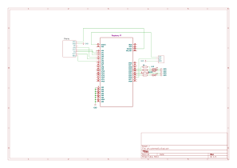
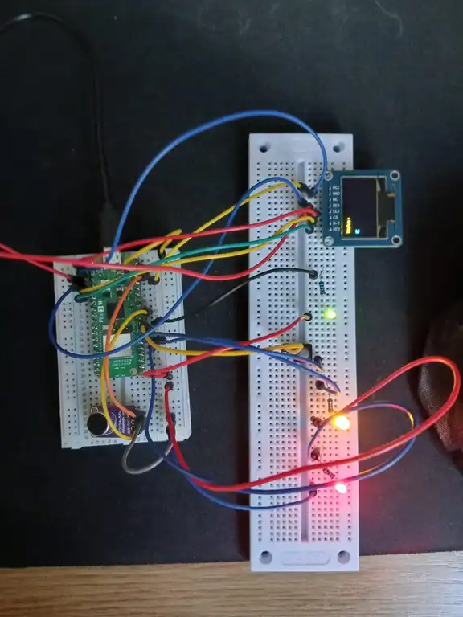
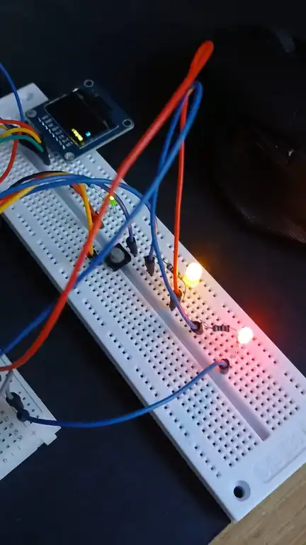
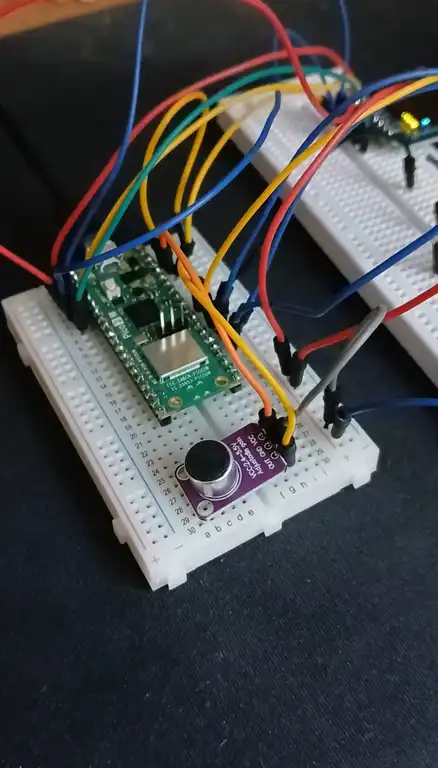

# Guitar Tuner
A tuning device for electric and acoustic guitar

:::info

**Author**: Ianis-Gabriel Armencea

**GitHub Project Link**: [repository](https://github.com/UPB-PMRust-Students/proiect-iamc03)

:::

## Description

This guitar tuner helps you tune your guitar into standard tuning (EADGBe). It uses a microphone (with a built in
amplifier) which listens to the guitar chord being played and identifies if it is too flat or too sharp from the
reference frequency. It displays the current note on the oled display.

## Motivation

Being a guitar player myself i thought it would be a fun idea to integrate a hobby into a school project. Also,
if the project turns out well i will be using the device myself to tune my guitar before playing.

## Architecture
### Diagram

## Log
### Week 5 - 11 May
**Purchased the components**

### Week 12-18 May
**Assembled the project**

### Week 19-25 May

## Hardware

1. **Raspberry Pi Pico 2W**: The microcontroller responsible for computing and processing the data and for communicating with all of the components.
2. **MAX4466**: The microphone used to detect the sound coming from the guitar. Comes with a built-in amplifier so it can detect quieter sounds.
3. **LEDs**: Used to guide the guitar player by indicating whether the note is too sharp, too flat or in perfect pitch.
4. **Button**: Used for switching between the notes in the E-standard tuning.
5. **OLED display**: Displays the current note that is being tuned to.

## Schematics

## Bill of Materials
| Device | Usage | Price |
| ------ | ----- | ----- |
| [Raspberry Pi Pico 2W](https://www.optimusdigital.ro/en/raspberry-pi-boards/13327-raspberry-pi-pico-2-w.html?search_query=pico+2w&results=52) | The microcontroller | 40 RON |
| [MAX4466](https://www.emag.ro/microfon-cu-amplificare-cu-max4466-ajustabil-ai1082/pd/DFLMTFMBM/) | Mic with amplifier built-in | 15 RON |
| [Button](https://www.optimusdigital.ro/en/buttons-and-switches/1119-6x6x6-push-button.html?search_query=button&results=490) | Changing note | 1 RON |
| [OLED Display 0.96"](https://www.optimusdigital.ro/en/others/12657-96inch-oled-b.html?search_query=display+oled&results=72) | Displaying notes | 50 RON |
| [Resistor kit](https://www.optimusdigital.ro/en/resistors/10928-250-pcs-plusivo-resistor-kit.html?search_query=resistor+kit&results=43) | Filtering | 15 RON |
| [Breadboard](https://www.optimusdigital.ro/en/breadboards/44-400p-hq-breadboard.html?search_query=breadboard&results=361) | Component connections | 5 RON |
| [Jumper wires set](https://www.optimusdigital.ro/en/wires-with-connectors/12-breadboard-jumper-wire-set.html?search_query=jumper&results=237) | Connections | 8 RON |
| [Micro-usb cable](https://www.optimusdigital.ro/en/usb-cables/2023-from-usb-am-to-micro-usb-cable-50-cm-black.html?search_query=micro+usb&results=474) | Power | 4 RON |
| [LED](https://www.optimusdigital.ro/en/leds/698-led-galben-de-3-mm-cu-lentile-difuze.html?search_query=led&results=2047) | Note flat, sharp or perfect pitch | 0.39 RON | 

## Software

| Library | Description | Usage |
| ------- | ----------- | ----- |
| embassy | Framework for embedded programming | Writing embedded Rust applications for microcontrollers |
| spectrum_analyzer | An easy to use and fast no_std library (with alloc) to get the frequency spectrum of a digital signal (e.g. audio) using FFT. | Converting audio signal to frequency |
| ssd1306 | Display driver | Display text on screen |

## Links
