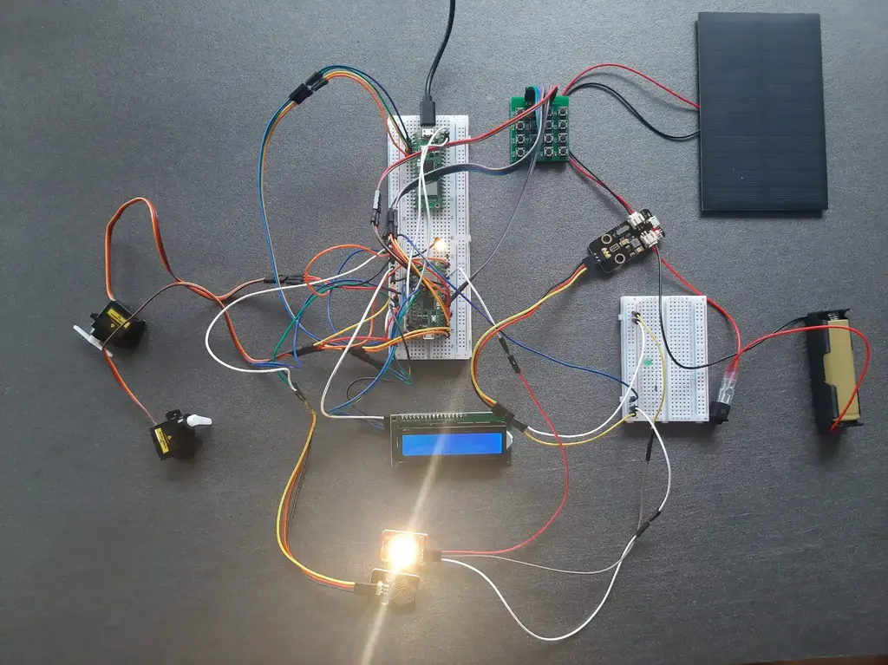
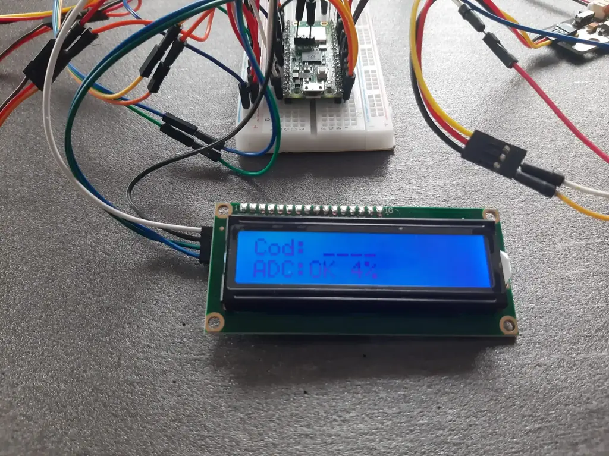

# Mini Smart Home
A tiny Rust-powered smart house that senses, blinks, and moves — just like a real one, but way cooler.😁


:::info

**Author**: Iordache Ioana-Diana \
**GitHub Project Link**: [https://github.com/UPB-PMRust-Students/proiect-ioanaior](https://github.com/UPB-PMRust-Students/proiect-ioanaior)

:::

## Description  
This project simulates a miniature smart home environment focused on energy-efficiency, automation, and comfort. Features include humidity monitoring for rain detection, an automatic window system, secure keypad-controlled door access, and visual feedback via an LCD and a high-power LED.


## Motivation  
I find it fascinating how sensors can interact with the environment and create real-life automation scenarios. I wanted to work on a project that’s both educational and fun, while also touching on concepts related to green homes, security, and interactivity. The idea of a miniature smart home felt like a great fit for demonstrating embedded programming in Rust. That is why I decided to create a small-scale model that could be both a learning experience and a nice gadget.😊

On a more personal note, I have a younger brother who’s been really into robots and home automation ever since we started tinkering with Arduino kits together. He’s always curious about how things work, and this project got him genuinely excited when he found out I was doing something like this in university. It’s been a great way to share the experience with him too; and honestly, seeing that kind of enthusiasm around something I build is extra motivation to make it work.

## Architecture  
The final system will include modules for:

- **Environment sensing**:  
  - Analog humidity sensor (KS0203)
  - Rain detection based on humidity threshold
- **Output feedback**: LCD 1602 with I2C, for showing system status ("RAIN", "SUN", "UNLOCKED")
- **Actuators**: Two servo motors: one for window control, one for door access   
- **Input system**: 4x4 button matrix keypad for entering an unlock code
- **Indicators**: One high-power LED (on/off status display)
- **Optional modules**: motion or gas sensors for enhanced interactivity and safety 


```mermaid
graph TD
  subgraph Sensors
    Humidity["🌫️ Analog Humidity Sensor (KS0203)"]
    Rain["🌧️ Rain Detection (via threshold)"]
    PIR["🚶 PIR Motion Sensor (optional)"]
    Gas["🧪 Gas Sensor (optional)"]
  end

  subgraph Actuators
    ServoDoor["🚪 Servo Motor - Door"]
    ServoWindow["🪟 Servo Motor - Window"]
  end

  subgraph Display
    LCD["🖥️ I2C LCD 1602"]
    LED["💡 High-Power LED"]
  end

  subgraph Input
    Keypad["🔢 4x4 Button Matrix"]
  end

  subgraph Control
    Pico["🧠 Raspberry Pi Pico W"]
  end

  subgraph Optional
    Solar["☀️ Solar Panel"]
    Debug["🐞 RTT Debug Interface"]
  end

  %% Connections
  Humidity --> Pico
  Rain --> Pico
  PIR --> Pico
  Gas --> Pico
  Keypad --> Pico
  Pico --> LCD
  Pico --> LED
  Pico --> ServoDoor
  Pico --> ServoWindow
  Pico --> Debug
  Solar -. optional charging .-> Pico

  classDef optional fill:#f9f,stroke:#333,stroke-dasharray: 5 5;
  class Solar,Gas,PIR optional
  ```


### Log

- **Week 21 – 27 April**  
  Reviewed previously owned components (sensors, display, servo motors) to assess reusability for the project. Placed an order for a Raspberry Pi Pico 2 W as the main controller board. Researched compatibility and pin availability for each part to ensure smooth integration.

- **Week 28 April – 4 May**  
  Drafted the initial project documentation. Defined the scope, motivation, and key goals. Outlined the planned system architecture and reviewed optional extensions. Started organizing the hardware list and validating available Rust crates for each module.

- **Week 5 – 11 May**  
  Placed an order for a second Raspberry Pi Pico 2 W to use it for debugging.  

  Initially tested the DHT sensor but discovered that no compatible crate worked properly with the lab-provided Cargo.toml. As a workaround, I replaced it with a Keyestudio KS0203 Steam Sensor, an analog humidity sensor that turned out to be easier to interface with. I later converted its raw analog output into percentage values for better readability and user-friendliness on the display.

  I also connected a 1602 I2C LCD, which dynamically displays either "RAINY" or "DRY", depending on the humidity threshold. This condition will eventually control the window via a servo motor.

  In parallel, I integrated a 4x4 button matrix which now works as a basic security system: a 4-digit code must be entered correctly. If valid, the LCD shows "UNLOCKED", and this will be used later to activate the door’s servo motor.

- **Week 12 – 18 May**  
  Finalized the control logic for both servos (door and window), linking them to sensor inputs and keypad status.

  Initially, I attempted to use a WS2812 RGB LED module for visual feedback, but due to limitations in Rust crate support and stability issues, I opted for a simpler and more robust solution: a 3W High Power LED module. To manage it, I implemented a lightweight `RgbLed` abstraction that mimics PWM behavior using basic GPIO toggling. While it doesn’t support full-spectrum control, it serves well for status indication and general on/off signaling.

  Additionally, I started researching on how to integrate a solar panel for charging an external battery. I finally managed to power the module using the Battery Power Module with Solar Port, connected to a 4.2V Li-ion battery and a small solar panel. If the battery and panel provide enough power, I’ll also be able to connect other parts of the system to the same power source in the future. It’s a nice step towards making the whole setup more independent and possibly usable outdoors without needing a wired power supply.
  
  I also started building a frame to integrate the hardware - basically a small “house.” I thought about how it could look and began working on the door and window mechanism. However, I consider these more related to the physical design than to the hardware itself, since the functionalities and connections are already in place. I’ll keep improving the appearance and details until the PM fair.😊🏠

- **Week 19 – 25 May**  
  TBD


## Hardware  

| Component                  | Function                                  |
| -------------------------- | ----------------------------------------- |
| Raspberry Pi Pico W        | Main microcontroller with WiFi            |
| KS0203 Humidity Sensor     | Measures humidity to detect rain          |
| 1602 I2C LCD               | Displays environment info & unlock status |
| Servo Motor #1             | Controls automatic door                   |
| Servo Motor #2             | Controls automatic window                 |
| 4x4 Keypad Matrix          | Secure unlock input                       |
| 3W LED Module              | Basic visual status feedback              |
| *Optional: PIR Sensor*     | Motion detection                          |
| *Optional: Gas Sensor*     | Safety detection                          |
| *Optional: Solar Panel*    | Battery charging via sunlight             |





> **Note**: Solar power is planned as an optional future extension, not core requirements.


## Schematics  


## Bill of Materials

| Device                                          | Usage                                    | Price (approx.) | Link                                                                                                                                                                                                                                                                                                   |
| ----------------------------------------------- | ---------------------------------------- | --------------- | ------------------------------------------------------------------------------------------------------------------------------------------------------------------------------------------------------------------------------------------------------------------------------------------------------ |
| 2× Raspberry Pi Pico 2 W                        | Controller with WiFi                     | 39.66 RON each  | [Optimus Digital](https://www.optimusdigital.ro/ro/placi-raspberry-pi/13327-raspberry-pi-pico-2-w.html?search_query=pico+2+w&results=33)                                                                                                                                                               |
| KS0203 Humidity Sensor                          | Rain detection                           | 20 RON          | [Keyestudio](https://www.keyestudio.com/products/keyestudio-vapor-sensor-for-arduino)                                                                                                                                                                                                                  |
| LCD 1602 with I2C interface                     | Display                                  | 16.34 RON       | [Optimus Digital](https://www.optimusdigital.ro/ro/optoelectronice-lcd-uri/2894-lcd-cu-interfata-i2c-si-backlight-albastru.html?search_query=lcd+i2c&results=17)                                                                                                                                       |
| 2× SG90 servomotor                              | Door and window control                  | 13.99 RON each  | [Optimus Digital](https://www.optimusdigital.ro/ro/motoare-servomotoare/26-micro-servomotor-sg90.html?search_query=servo&results=186)                                                                                                                                                                  |
| 4x4 Matrix Keypad                               | Input interface                          | 3.99 RON        | [Optimus Digital](https://www.optimusdigital.ro/ro/senzori-senzori-de-atingere/2441-tastatura-matriceala-4x4-cu-butoane.html?search_query=matrice+butoane&results=8)                                                                                                                                   |
| High power 3W LED module                        | Visual system indicator                  | 10 RON          | [FunduinoShop](https://funduinoshop.com/en/components/active-components/leds-and-lights/high-power-3w-led-module-on-board-comparable-with-keyes-led-module)                                                                                                                                            |
| PIR Motion Sensor (optional)                    | Motion detection                         | 20 RON          | [Keyestudio](https://eckstein-shop.de/KeyestudioPIRMotionSensorModuleforArduino3-4meterEN)                                                                                                                                                                                                             |
| Mini Solar Panel (optional)                     | Solar charging (future)                  | 15 RON          | [Keyestudio](https://www.keyestudio.com/products/keyestudio-mini-pet-solar-panel-connected-to-charging-frosted-surface-high-conversion-rate-with-wires-tech-production-diy-component)                                                                                                                  |
| Battery Power Module with Solar Port (optional) | Battery power supply with solar charging | 20 RON          | [Sigmanortec](https://sigmanortec.ro/modul-incarcare-solara-acumulator-37v-cn3065?SubmitCurrency=1&id_currency=2&gad_source=1&gad_campaignid=22174019478&gbraid=0AAAAAC3W72PBSB9trWS1_CCs8llsimAhN&gclid=CjwKCAjw56DBBhAkEiwAaFsG-td4aXIvnqv01kv9lhIPOvxqi8xEkqTN5fJVQizllL3Fsm1Pfy44VhoCAFUQAvD_BwE) |
| Breadboard HQ                        | Circuit prototyping                      | 4.56 RON         | [Optimus Digital](https://www.optimusdigital.ro/ro/prototipare-breadboard-uri/44-breadboard-400-points.html?search_query=breadboard&results=125)                                                                                                                |

> **Note**: Not all the links point to Romanian websites. Some parts I already had, so I included links where I could find them easily.

## Software  

| Crate | Version | Purpose | Link |
|-------|---------|---------|------|
| [`embassy-rp`](https://crates.io/crates/embassy-rp) | 0.3.0 | Core functionality for Pico | [📦](https://crates.io/crates/embassy-rp) |
| [`embassy-executor`](https://crates.io/crates/embassy-executor) | 0.7.0 | Async/await execution for embedded | [📦](https://crates.io/crates/embassy-executor) |
| [`embassy-time`](https://crates.io/crates/embassy-time) | 0.4.0 | Timekeeping and delays | [📦](https://crates.io/crates/embassy-time) |
| [`lcd1602-diver`](https://crates.io/crates/lcd1602-diver) | 0.1.1 | LCD 16x2 display driver | [📦](https://crates.io/crates/lcd1602-diver) |
| [`pio`](https://crates.io/crates/pio) | 0.2.1 | PIO support for SK6812 LED | [📦](https://crates.io/crates/pio) |
| [`embedded-hal`](https://crates.io/crates/embedded-hal) | 0.2.5 | Hardware abstraction layer | [📦](https://crates.io/crates/embedded-hal) |
| [`defmt`](https://crates.io/crates/defmt) | 0.3 | Debugging framework | [📦](https://crates.io/crates/defmt) |
| [`heapless`](https://crates.io/crates/heapless) | 0.8 | Stack-based collections | [📦](https://crates.io/crates/heapless) |
| [`embassy-sync`](https://crates.io/crates/embassy-sync) | 0.6.2 | Synchronization primitives | [📦](https://crates.io/crates/embassy-sync) |
| [`embassy-futures`](https://crates.io/crates/embassy-futures) | 0.1.0 | Future utilities for no_std | [📦](https://crates.io/crates/embassy-futures) |


## Links  

- [Core Electronics Pico Tutorial](https://www.youtube.com/watch?v=Ic4ExTusoTw&t=334s&ab_channel=CoreElectronics) – super helpful 4h video that explains microcontrollers really well; even if it’s not in Rust, it made a lot of embedded concepts much clearer

- [Raspberry Pi Pico + Servo Motor Tutorial](https://randomnerdtutorials.com/raspberry-pi-pico-servo-motor-micropython/) – helped me understand how to wire and control a servo from the Pico, even though it’s in MicroPython

- [Servo Door Mechanism](https://www.youtube.com/watch?v=LJ1xLmmuTUs&ab_channel=Roboarmy) – quick video that gave me the idea for how to physically move the door using a servo

- [Servo vs Stepper](https://www.youtube.com/shorts/rift8UbrAyQ) – a short but clear explanation of the difference between servo and stepper motors, from the same guy in the long tutorial
