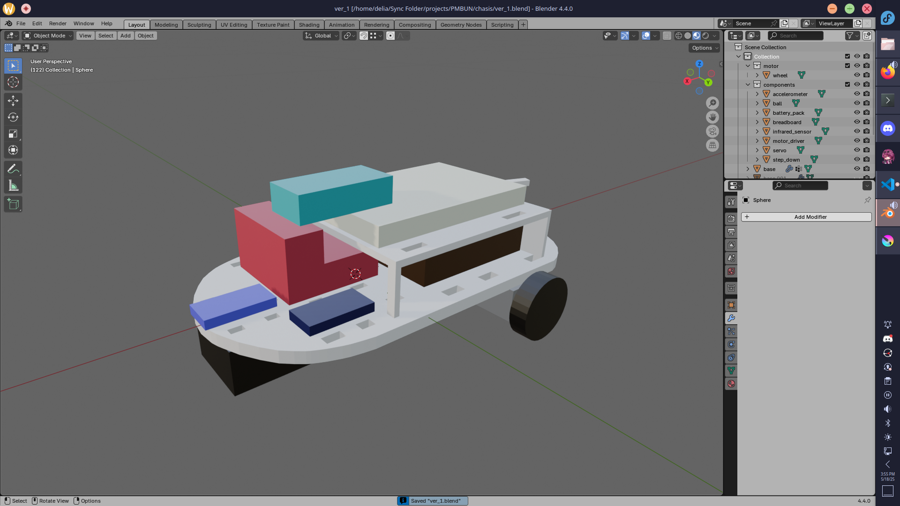
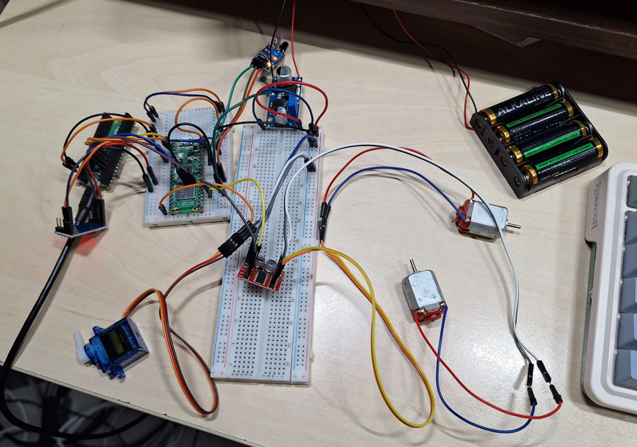
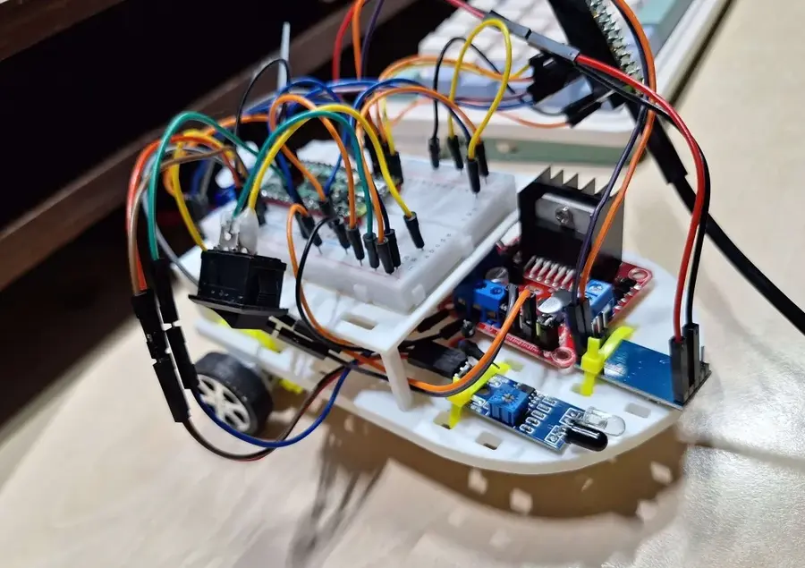

# Spicy the mouse
Interactive chase toy for cats!

:::info 

**Author**: IACOB Ioana-Delia \
**GitHub Project Link**: https://github.com/UPB-PMRust-Students/proiect-iacobDelia

:::

## Description

Spicy the mouse is an interactive cat toy for cats. It wags its tail as it moves around the room and stops once it encounters any obstacles or the cat topples it.

## Motivation

Pets are a significant part of our lives and important members of our families. The interactive cat toys I saw in stores were my inspiration for this project. This way I could learn about microcontroller programming and hardware interaction while building something I enjoy.

## Architecture 


* The microcontroller controls the behaviour of the components
* The DC motors will be controlled to move randomly
* The servomotor will have a continious back and forth movement
* Using the accelerometer or the infrared sensor the robot will stop when the cat topples it or when the robot encounters a wall respectively

## Log

<!-- write your progress here every week -->

### Week 5 - 11 May
This week I connected all the components to the microcontroller. I started with the sensors and successfully read values from the infrared sensor using ADC, and from the accelerometer using I2C.

Connecting the motors was a bit trickier though. For the DC motors, although controlling them through PWM works, the debugger crashes shortly after the program is ran. Besides them, I also tried connecting the servomotor, but it couldn't draw enough current from the pico. As such, I also bought a 4 AA batteries case and a LM2596S Step Down module.
### Week 12 - 18 May
I successfully connected all the components to the microcontroller and wrote code for randomly starting and stopping the motors. For this, I used the feature small_rng from the rand crate to randomly generate numbers in a non std environment. The motors also stop when the infrared sensor detects an obstacle.



I also designed the support on which I'll be putting all the components. To save space, I decided to put the breadboard on top of the battery pack. I also added plenty of holes that will be used for wire management. To make sure everything fits correctly I created placeholder boxes with the exact dimensions of the components.
### Week 19 - 25 May
I reorganized the code to work in tasks, separating the servo and DC motors movement in two different tasks. Now the DC motors move randomly while the servo moves with a set delay. In main, the infrared and accelerometer sensors are checked and when they detect either an obstacle or a change in orientation respectively, they send a signal to both the servo and motors tasks to stop movement.

I also switched from using [this](https://www.optimusdigital.ro/ro/drivere-de-motoare-cu-perii/1514-modul-driver-de-motoare-dual-in-miniatura-10-v-15-a.html?search_query=driver&results=364) motor driver to the [L298N model](https://www.optimusdigital.ro/ro/drivere-de-motoare-cu-perii/145-driver-de-motoare-dual-l298n.html), which removed the need for a dedicated step down module. I also started to use a 9V battery instead of the 4 AA ones, because they weren't delivering enough current for my circuit.

One of the lab assistants also 3D printed my support, which allowed me to assemble all the electrical parts on it.
## Hardware

This is how the parts looked like before being assembled on the support.



And this is how the final product looks like.



* Raspberry pi pico 2w: the microcontroller
* The accelerometer: used for detecting changes in the movement of the robot
* The infrared sensor: used for wall detection
* The servomotor: mimics the movements of a tail
* DC motors: movement
* Dual motor driver L298N: used for controlling the motors and for converting the 9V from the battery to the 5V needed by the components
 
### Schematics


### Bill of Materials

<!-- Fill out this table with all the hardware components that you might need.

The format is 
```
| [Device](link://to/device) | This is used ... | [price](link://to/store) |

```

-->

| Device    | Usage     | Price |
|-----------|-----------|-------|
| [Raspberry Pi Pico 2W](https://datasheets.raspberrypi.com/picow/pico-2-w-datasheet.pdf) | Microcontroller | [39.66 Lei](https://www.optimusdigital.ro/ro/placi-raspberry-pi/13327-raspberry-pi-pico-2-w.html) |
| [Raspberry Pi Pico RP2040](https://datasheets.raspberrypi.com/rp2040/rp2040-datasheet.pdf) | Debugger | [30.00 Lei](https://www.emag.ro/microcontroller-raspberry-pi-rp2040-pico/pd/DKQQWNMBM/) |
| Breadboard kit | Electrical connections | [22 Lei](https://www.optimusdigital.ro/ro/kituri/2222-kit-breadboard-hq-830-p.html?search_query=Kit+Breadboard+HQ830+cu+Fire+%C8%99i+Sursa)|
| Infrared sensor | Obstacle avoidance | [3.49 Lei](https://www.optimusdigital.ro/ro/senzori-senzori-optici/4514-senzor-infrarosu-de-obstacole.html?search_query=+Modul+Senzor+Infrarosu+de+Obstacole+&results=6)|
| [Motor 130-13200](https://5ororwxhiiqojij.leadongcdn.com/LS-FA-130-aidlpBqmKinSRqqniirlki.pdf) | DC motors | [4.99 Lei](https://www.optimusdigital.ro/ro/motoare-motoare-fara-reductor/361-motor-130-13200.html?search_query=motor+dc&results=612) x 2|
| [Dual Motor driver](https://www.st.com/resource/en/datasheet/l298.pdf) | Motor control | [10.99 Lei](https://www.optimusdigital.ro/ro/drivere-de-motoare-cu-perii/145-driver-de-motoare-dual-l298n.html)|
| Ball support | Ease of movement | [3.95 Lei](https://www.optimusdigital.ro/ro/mecanica-suporturi-cu-bila/74-ball-caster.html?search_query=Suport+cu+Bila+&results=118)|
| [Accelerometer](https://www.analog.com/media/en/technical-documentation/data-sheets/adxl345.pdf) | Movement sensor | [12.99 Lei](https://www.optimusdigital.ro/ro/senzori-senzori-inertiali/97-modul-accelerometru-cu-3-axe-adxl345.html?search_query=Modul+Accelerometru+cu+3+axe+ADXL345&results=2)|
| [Micro Servomotor](http://www.ee.ic.ac.uk/pcheung/teaching/DE1_EE/stores/sg90_datasheet.pdf) | Tail movement mechanism | [11.99](https://www.optimusdigital.ro/ro/motoare-servomotoare/2261-micro-servo-motor-sg90-180.html) |
| 9V Battery | Power supply | [17.99 Lei](https://www.auchan.ro/baterie-energizer-alkaline-9v-6lr61/p) |
| Battery support | Power supply | [1.29 Lei](https://www.optimusdigital.ro/ro/suporturi-de-baterii/20-conector-pentru-baterie-de-9-v.html?search_query=suport+baterie&results=56) |


## Software

| Library | Description | Usage |
|---------|-------------|-------|
| [embassy_rp](https://docs.embassy.dev/embassy-rp/git/rp2040/index.html) | HAL for the Raspberry Pi PICO 2W microcontroller | Used to program the Pico |
| [embassy-executor](https://crates.io/crates/embassy-executor) | An async/await executor designed for embedded usage | Used for task execution |
| [rand](https://crates.io/crates/rand) | Random number generators and other randomness functionality | Used the small_rng feature for generating random numbers in a non std environment |

## Links

<!-- Add a few links that inspired you and that you think you will use for your project -->

1. [Inspiration for this project](https://www.youtube.com/watch?v=CJwI9GmFXds)
2. [Two wheeled line follower](https://www.ijert.org/research/pid-controller-based-line-following-and-obstacle-avoidance-two-wheeled-robot-IJERTCONV7IS02026.pdf) - not the same idea but similar execution
