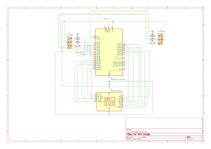

# The Mini Arcade
Pocket-sized arcade action for solo challenges or head-to-head fun.

:::info 

**Author**: Iulian Alexa \
**GitHub Project Link**: https://github.com/UPB-PMRust-Students/proiect-iulianalexa

:::

## Description

This mini-console offers fast-paced numeric challenges designed for quick thinking and competitive play. Featuring dual keypads, it supports intense 1v1 battles across multiple rounds, with scores tallied to crown the ultimate winner. Compete in Speed Calculations, where the fastest correct answer wins the round, or test your reflexes in Reaction Test, available in both solo and multiplayer modes. Whether you're going head-to-head or playing solo to climb the high score leaderboard, every second counts.

## Motivation

I chose this project because it taps into something I enjoy: the simple joy of accessible gaming. The idea of creating a small, portable, and cheap mini-arcade that doesn't need a computer is exciting. It's reminiscent of retro consoles, from a time when fun activities weren't always about intense competition. Focusing on straightforward, engaging numeric mini-games controlled by keypads offers a cool mix of nostalgia and something a bit different, emphasizing quick thinking and friendly rivalry.

I also thought it would be interesting to try and connect a USB keyboard to a microcontroller using Rust (without the TinyUSB C bindings).

## Architecture 

### Hardware Integration

- The Raspberry Pi Pico 2W acts as the central processing unit, running the software.
- The display is driven by the Pico 2W to provide the visual interface for all menus, games, and feedback.
- The SD module integrated in the TFT display module allows for writing and reading leaderboard scores.
- The buzzer, connected to a GPIO pin on the Pico 2W, provides simple audio cues.
- The USB hub allows the Pico 2W to receive input from the two keypads.
- LEDs are used for additional visual feedback.

### Software Flow

## Log

### Week 28 April - 4 May

- ordered hardware components
- soldered headers to the microcontroller
- performed USB tests

### Week 5 - 11 May

- ordered more hardware components
- wrote the HID driver for the cotton\_usb\_host crate
- tested the SD card reader, display, LEDs and buzzer

### Week 12 - 18 May

- ordered the numeric keypads and the USB hub
- created the channel to pass keystrokes from the usb_task to the main task
- started working on minigames
- updated the KiCad schematic (couldn't find common cathode LEDs; updated to common anode)

My plan for the next week is to finish the minigames, and also create a 3D printed enclosure for the device to improve the overall look.

### Week 19 - 25 May

- spent a long time making my LS numpads work through the FS hub (read more about this in the Software chapter)
- implemented all the minigames

## Hardware

- Raspberry Pi Pico 2W - The microcontroller
- 2.2'' LCD TFT SPI 320x240 ILI9341 display - Display and SD module
- 2x A4Tech NumericPad Fstyler FK13 USB Black - User Input
- LOGILINK Hub USB 2.0 4 ports - Join Keyboards to allow connecting to MCU USB
- Passive Buzzer - Audio feedback
- LEDs - Additional visual feedback

Testing the USB input and the display (will update once the keypads arrive):

<iframe width="560" height="315" src="https://www.youtube.com/embed/ZnOTKcUffeg?si=e8z89CIGbP-maL7r" title="YouTube video player" frameborder="0" allow="accelerometer; autoplay; clipboard-write; encrypted-media; gyroscope; picture-in-picture; web-share" referrerpolicy="strict-origin-when-cross-origin" allowfullscreen></iframe>

### Schematics

 

### Bill of Materials

| Device | Usage | Price |
|--------|--------|-------|
| [Raspberry Pi Pico 2W](https://www.raspberrypi.com/documentation/microcontrollers/raspberry-pi-pico.html) | The microcontroller | [40 RON](https://www.optimusdigital.ro/en/raspberry-pi-boards/13327-raspberry-pi-pico-2-w.html) |
| [Raspberry Pi Pico 2W](https://www.raspberrypi.com/documentation/microcontrollers/raspberry-pi-pico.html) | As Debug Probe | [40 RON](https://www.optimusdigital.ro/en/raspberry-pi-boards/13327-raspberry-pi-pico-2-w.html) |
| 2.2'' LCD TFT SPI 320x240 ILI9341 display | Main Game Output and microSD card reading/writing for leaderboard scores | [69 RON](https://electronicgadgets.ro/ecran-display-lcd-tft/200-ecran-22-lcd-tft-spi.html) |
| 2x Trust Xalas USB Keypad | User Input | [2x 50 RON](https://www.emag.ro/tastatura-numerica-trust-xalas-usb-negru-22221/pd/DFHHP9BBM/) |
| Pawlisor 3.0 USB Hub 4 ports | Connect Keyboards | [16 RON](https://www.emag.ro/hub-usb-pawlisorr-multiport-4-in-1-usb-la-usb-3-0-usb-2-0-compatibil-laptop-sistemele-auto-plug-play-argintiu-s0000010/pd/D6Q19CYBM/) |
| Breadboard (830 contacts) | Connect Components | [10 RON](https://www.optimusdigital.ro/ro/prototipare-breadboard-uri/8-breadboard-830-points.html)
| Female USB-A to Male Micro USB Adapter | USB Hub input | [5 RON](https://www.optimusdigital.ro/ro/raspberry-pi-zero/3867-adaptor-usb-mama-la-micro-usb-tata.html) |
| Jumper Wires | Connecting Components | [5 RON](https://www.optimusdigital.ro/ro/fire-fire-mufate/884-set-fire-tata-tata-40p-10-cm.html) |
| Breadboard (300 contacts) | Connect the debug probe | [3 RON](https://www.optimusdigital.ro/ro/prototipare-breadboard-uri/13249-breadboard-300-puncte.html) |
| Resistors | Voltage regulation and signal protection for components | 3 RON |
| RGB LEDs | Visual Feedback | 3 RON |
| 1x Passive Buzzer | Audio Feedback | [1 RON](https://www.optimusdigital.ro/en/buzzers/12247-3-v-or-33v-passive-buzzer.html) |
| **Total** | | 295 RON |

## Software

| Library | Description | Usage |
|---------|-------------|-------|
| [mipidsi](https://github.com/almindor/mipidsi) | Display driver for ILI9341 | Used for the display |
| [embedded-graphics](https://github.com/embedded-graphics/embedded-graphics) | 2D graphics library | Used for drawing to the display |
| [embassy-rp](https://github.com/embassy-rs/embassy) | HAL for RP2350 | |
| [cotton-usb-host](https://github.com/iulianalexa/cotton/tree/main/cotton-usb-host) | USB Host Stack | Used to enable the keyboards |
| [rp235x-pac](https://github.com/iulianalexa/rp235x-pac) | PAC for RP2350 | Used by cotton-usb-host |
| [defmt](https://github.com/knurling-rs/defmt) | Deferred formatting | Logging during testing |
| [embedded-sdmmc](https://github.com/rust-embedded-community/embedded-sdmmc-rs) | SD Card | Log scoreboard on the SD Card |
| [itoa](https://github.com/dtolnay/itoa) | Number to String | Used for displaying numbers on the screen |
| [rand](https://github.com/rust-random/rand) | Random Number Generation | Used for minigames |
| [heapless](https://github.com/rust-embedded/heapless) | Heapless Data Structures | Used to save strings, vecs on the stack |
| [static-cell](https://github.com/embassy-rs/static-cell) | Statically allocated, initialized at runtime cell. | Used to save USB_STATICS in the usb\_task |
| [embedded-hal](https://github.com/rust-embedded/embedded-hal) | Hardware Abstraction Layer (HAL) for Embedded Systems | Interact with other crates |
| [display-interface](https://github.com/therealprof/display-interface) | Interface with Display Driver | Used with the 320x240 ILI9341 display |

Most of my software troubles were, as expected, caused by trying to get the USB to work in host mode, as well as allowing it to support two keyboards at once.

For USB host support, there is [TinyUSB](https://docs.tinyusb.org/en/latest/reference/getting_started.html), a feature complete C library. However, even though I could have created Rust bindings for the TinyUSB C functions, I wanted a pure, Rust-only implementation. After researching for a while, I found [cotton_usb_host](https://docs.rs/cotton-usb-host/latest/cotton_usb_host/), a USB host stack written for the RP2040.

There were a few issues with using this crate, so [I forked it](https://github.com/iulianalexa/cotton/tree/main/cotton-usb-host):
- It only supported the RP2040. I made changes to it to support the RP235x, which also required a [small patch](https://github.com/rp-rs/rp235x-pac/compare/main...iulianalexa:rp235x-pac:main#diff-184e456433339d626c020d55cc0b19873efa34857ca63b08c05b46e843544965) to the rp235x-pac crate.
- It did not support HID devices out of the box. I wrote a [small module](https://github.com/UPB-PMRust-Students/proiect-iulianalexa/blob/main/src/hid.rs) for it
- Most importantly, it did not work with my USB 3.0 hub.
  - After trying many configurations out, I found out that my numpads were Low Speed (LS) devices running through a Full Speed (FS) hub.
    - Previously, LS devices worked as a root device, but connecting them through a FS hub would result in a timeout error.
    - Before this, I did not have much knowledge on the USB spec.
    - After some tests (figured out that it is not a hardware issue, as TinyUSB works fine, and also that it must be a speed issue, because FS devices can be detected through the hub), debugging, and reading through the [RP235x Datasheet](https://datasheets.raspberrypi.com/rp2350/rp2350-datasheet.pdf), I found that in such situations a special preamble must be sent!
      - This preamble is sent automatically by the USB controller when setting the `INTEP_PREAMBLE` bit in the `ADDR_ENDP` register of each relevant interrupt endpoint (see page 1158), as well as the `PREAMBLE_EN` bit in the `SIE_CTRL` register every time communication happens to a relevant device (see page 1160).
        - These bits must be unset in all other scenarios! Therefore, at all times it is necessary to know which devices need a preamble.
        - Also see the TinyUSB implementation: [here](https://github.com/hathach/tinyusb/blob/8f077f9295838d6a7e7a5151cb46605df14a630d/src/portable/raspberrypi/rp2040/hcd_rp2040.c#L361) and [here](https://github.com/hathach/tinyusb/blob/8f077f9295838d6a7e7a5151cb46605df14a630d/src/portable/raspberrypi/rp2040/hcd_rp2040.c#L581).

Everything else went pretty well. I tried my best to write high quality, maintainable code. Because of this, I believe many more minigames can be added with very minimal work. I did not have the time to do this, however, because I spent a long time making USB work.

Here is a YouTube video of the final implementation (Romanian voiceover):

<iframe width="560" height="315" src="https://www.youtube.com/embed/Cy9Rzpi44yI?si=aohvysq7qTxnFg7b" title="YouTube video player" frameborder="0" allow="accelerometer; autoplay; clipboard-write; encrypted-media; gyroscope; picture-in-picture; web-share" referrerpolicy="strict-origin-when-cross-origin" allowfullscreen></iframe>

## Links

1. [PM Rust Lab](https://pmrust.pages.upb.ro/docs/acs_cc/category/lab)
2. [Some thoughts on using a USB keyboard with the Raspberry Pi Pico](https://kevinboone.me/pico_usb_kbd_lcd.html)
3. [TinyUSB](https://docs.tinyusb.org/en/latest/reference/getting_started.html)
4. [cotton_usb_host](https://docs.rs/cotton-usb-host/latest/cotton_usb_host/)
5. [RP2350 Datasheet](https://datasheets.raspberrypi.com/rp2350/rp2350-datasheet.pdf)
6. [USB Human Interface Devices](https://wiki.osdev.org/USB_Human_Interface_Devices)
7. [My fork of cotton_usb_host](https://github.com/iulianalexa/cotton/tree/main/cotton-usb-host)
8. [TinyUSB setting the preamble bit](https://github.com/hathach/tinyusb/blob/8f077f9295838d6a7e7a5151cb46605df14a630d/src/portable/raspberrypi/rp2040/hcd_rp2040.c#L361)
