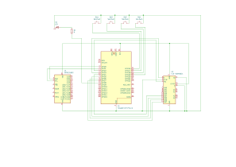
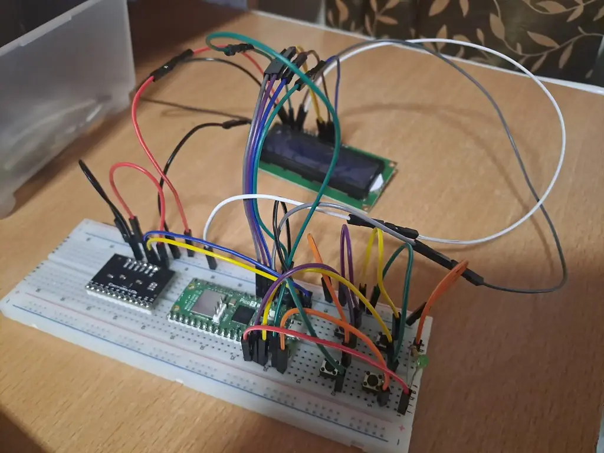

# Digital Touch Piano
A digital touch piano for learning songs and having fun.

:::info 

**Author**: Oprea Mara Claudia \
**GitHub Project Link**: https://github.com/UPB-PMRust-Students/proiect-mara291

:::

## Description

Digital Touch Piano is a "pocket" design for an electric piano which takes input using touch sensors. It includes features such as:
- sensors to play an entire octave
- learning instructions displayed on the screen
- buttons for recording and playing songs

## Motivation

Playing piano is one of my hobbies and I always liked the idea of being able to play even in places where I can't bring my piano. I also want to make learning seem easy for people without a music background, so I integrated in my project instructions teaching how to play popular piano songs. 

## Architecture 

 

## Log

<!-- write your progress here every week -->

### Week 5 - 11 May
This week, I finalized the list of hardware components needed for my project and placed the last order. I made sure all components (including the MPR121 sensor, LCD display, buttons and LED) are compatible with the Raspberry Pi Pico and meet the project's requirements.

### Week 12 - 18 May
All the hardware components have arrived. I have soldered header pins to all the components that required it, including the Raspberry Pi Pico I use for debugging. I completed the physical assembly on a breadboard, connecting the MPR121 capacitive touch sensor, LCD screen, buttons, and LED to the Raspberry Pi Pico.

### Week 19 - 25 May
The full software functionality was completed this week. I integrated all features including note detection via the MPR121 touch sensor, real-time sound output through the buzzer, an LCD for displaying note instructions, and multiple playback modes. I used a sheet of paper to represent piano keys and I used coins for each key to serve as touch conductors. Each coin is connected using wires to the MPR121 sensor, making it possible to play notes just by touching the coins.

## Hardware

- **Raspberry Pi Pico 2W** - the microcontroller, connects all parts together
- **MPR121 Capacitive Touch Sensor** - has 12 sensors which will be used as piano keys
- **Buttons** with the following functions:  
	-> **Mode** - change between learning and playing modes  
	-> **Record** - starts recording song  
	-> **Stop** - stops recording song  
	-> **Play** - play recorded song  
- **LCD screen** - shows intstructions how to play
- **LED** - blinks green when notes are played according to instructions
- **Buzzer** - generates a sound when a key is touched

### Schematics



### Photo



### Bill of Materials

<!-- Fill out this table with all the hardware components that you might need.

The format is 
```
| [Device](link://to/device) | This is used ... | [price](link://to/store) |

```

-->

| Device | Usage | Price |
|--------|--------|-------|
| [Raspberry Pi Pico 2W x2](https://www.raspberrypi.com/documentation/microcontrollers/raspberry-pi-pico.html) | The microcontroller | [39.66 RON x2](https://www.optimusdigital.ro/en/raspberry-pi-boards/12394-raspberry-pi-pico-w.html) |
| [MPR121](https://www.raspberrypi.com/documentation/microcontrollers/raspberry-pi-pico.html) | Capacitive Touch Sensor | [8.99 RON](https://www.optimusdigital.ro/en/raspberry-pi-boards/12394-raspberry-pi-pico-w.html) |
| [Button x4](https://www.raspberrypi.com/documentation/microcontrollers/raspberry-pi-pico.html) | Buttons | [0.36 RON x4](https://www.optimusdigital.ro/en/raspberry-pi-boards/12394-raspberry-pi-pico-w.html) |
| [LCD module](https://www.raspberrypi.com/documentation/microcontrollers/raspberry-pi-pico.html) | Instructions screen | [14.99 RON](https://www.optimusdigital.ro/en/raspberry-pi-boards/12394-raspberry-pi-pico-w.html) |
| [Buzzer](https://www.raspberrypi.com/documentation/microcontrollers/raspberry-pi-pico.html) | Generates sound | [0.99 RON](https://www.optimusdigital.ro/en/raspberry-pi-boards/12394-raspberry-pi-pico-w.html) |
| [Bicolor LED](https://www.optimusdigital.ro/en/leds/1321-red-green-bicolor-led.html) | Learning Feedback | [2.00 RON](https://www.optimusdigital.ro/en/raspberry-pi-boards/12394-raspberry-pi-pico-w.html) |
| [Breadboard](https://www.raspberrypi.com/documentation/microcontrollers/raspberry-pi-pico.html) | Breadboard | [8.99 RON](https://www.optimusdigital.ro/en/raspberry-pi-boards/12394-raspberry-pi-pico-w.html) |
| [Jumper wires](https://www.raspberrypi.com/documentation/microcontrollers/raspberry-pi-pico.html) | Connection between components | [4.99 RON](https://www.optimusdigital.ro/en/raspberry-pi-boards/12394-raspberry-pi-pico-w.html) |


## Software

| Library | Description | Usage |
|--------|-------------|-------|
| [`rp-hal`](https://crates.io/crates/rp-hal) | HAL for Raspberry Pi RP2040 | Control GPIO, PWM, I2C |
| [`embassy`](https://embassy.dev) | Async embedded framework | Used for timing and multitasking |
| [`embedded-hal`](https://crates.io/crates/embedded-hal) | Abstractions for embedded drivers | Interfaces for I2C, GPIO, PWM |
| [`mpr121-hal`](https://crates.io/crates/mpr121) | Driver for MPR121 | Touch input from the piano "keys" |
| [`i2c-character-display`](https://crates.io/crates/i2c-character-display) | LCD driver via I2C | Display notes and messages |
| [`embedded-time`](https://crates.io/crates/embedded-time) | Time handling | Note timing, delays |
| [`heapless`](https://crates.io/crates/heapless) | Fixed-size strings and buffers | Used for dynamic screen updates |
| [`i2c-character-display`](https://crates.io/crates/i2c-character-display) | LCD driver via I2C (PCF8574T) | Displays notes and messages |

## Links

1. [arduino-mpr121-midi-touch-piano](https://diyelectromusic.com/2021/07/04/arduino-mpr121-midi-touch-piano)


