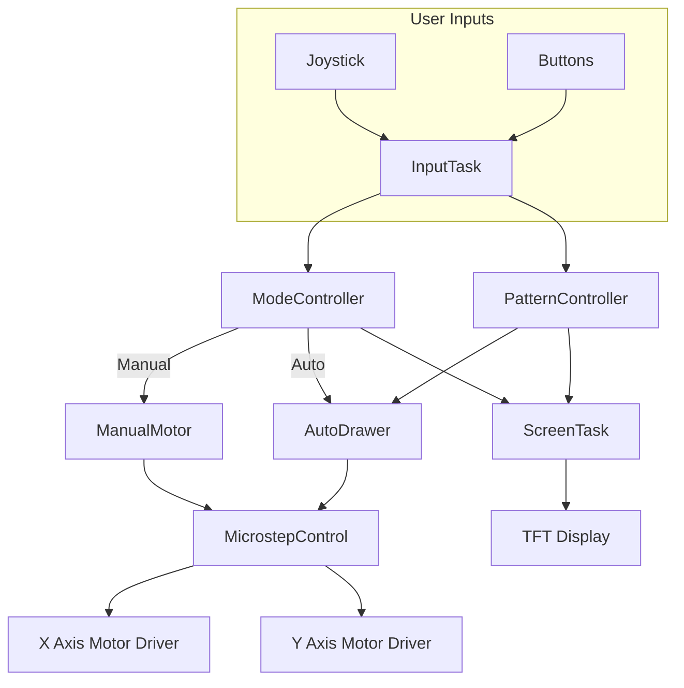
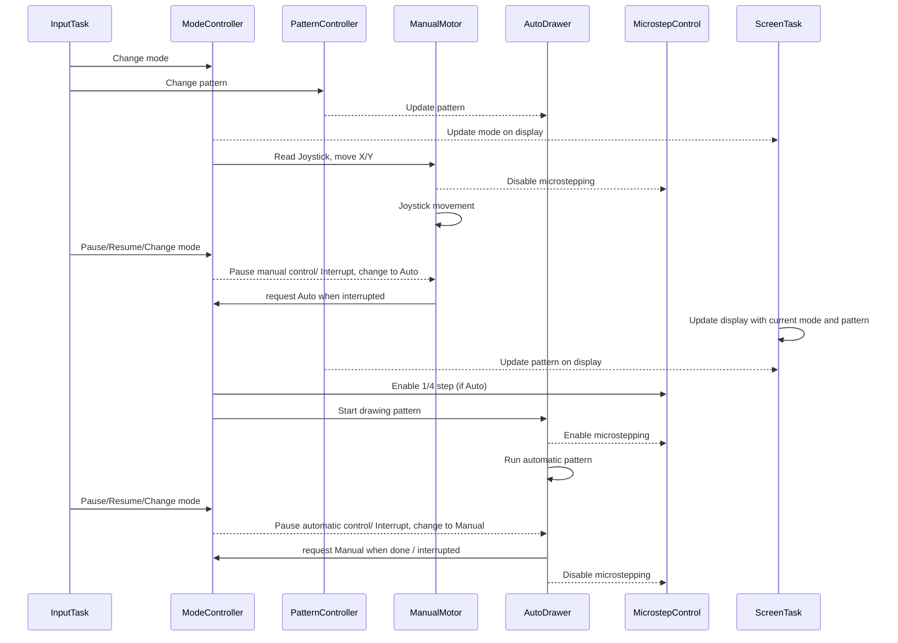
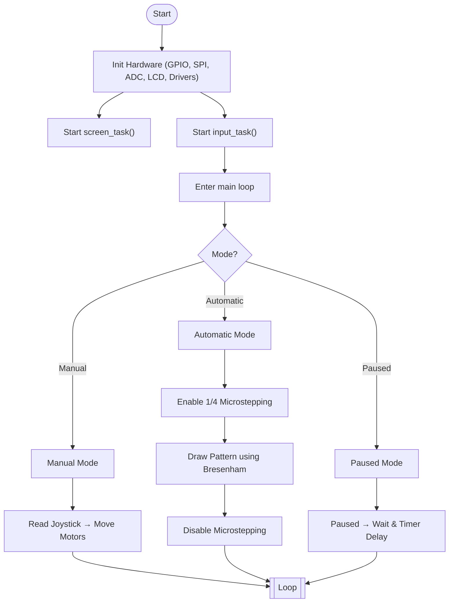

# Drift Drawing Table
A kinetic sand table that draws using a magnet-controlled ball.

:::info

**Author**: Aliu Maria-Denisa \
**GitHub Project Link**: [Drift Drawing Table](https://github.com/UPB-PMRust-Students/proiect-mariaaliu)

:::

## Description

An interactive coffee table that draws patterns in sand using a steel ball moved by a magnet underneath. It features an automatic mode with predefined patterns and a manual mode controlled by a joystick. The user can pause the drawing to admire the current shape or press a reset button and start fresh.

## Motivation

I wanted to create a relaxing and visually engaging project that combines artistic expression with embedded systems. The idea of a kinetic sand table felt like a unique way to explore motion control, user interaction, and creative design. It's a great opportunity to learn more about stepper motor control and real-time input handling, while also building something people can enjoy watching and interacting with.

## Architecture

- **Controller Core**: Raspberry Pi Pico 2 runs the main control loop and manages motor drivers, input handling and display output.
- **Motion Controller**: Two stepper motors control the X and Y position of the magnet beneath the table, based on trajectory data.
- **User Input Manager**: A joystick is used to switch between modes and control the ball in manual mode. Additional buttons allow the user to pause the drawing or clear (stop automatic and switch to manual so the user can clear the sand), etc.
- **Drawing Engine**: In automatic mode, a pattern generator creates coordinate sequences (e.g., heart, star) sent to the motion controller.

These components communicate in an event-driven and partially asynchronous manner using Embassy's async runtime on the microcontroller.


## Log

### Week 5 - 11 May
- Defined the project scope and functionality (manual + automatic drawing modes).
- Designed system architecture and created component diagram.
- Selected core hardware components (RP Pico 2, NEMA 17, A4988).
- Started basic Rust setup for Pico alone using Embassy framework.

### Week 12 - 18 May
- Completed schematic in KiCad with all real hardware components used.
- Created custom component symbols for Joystick and TFT screen.
- Verified all pin mappings against Rust codebase.
- Began testing Embassy-based async control loop for both motors.
- Integrated screen output for mode status (Manual / Auto / Paused).
- First try mapping for automatic drawing patterns.
- Implemented basic joystick input handling for manual mode.
- Created a simple test program for the buttons and joystick to control the motors.
- Implemented a simple way to show on screen the current mode and pattern.

### Week 19 - 25 May

- Finalized and tested **automatic drawing engine**, including shape scaling and centered positioning.
- Improved **Bresenham-style traversal** logic to handle curves and diagonal motion more smoothly.
- Integrated **dynamic microstepping switching** (1/4 step in Auto, full step in Manual) for better motion quality.
- Completed **`input_task`**, handling all button/joystick logic (pause, clear, mode toggle, pattern switch).
- Completed **`screen_task`** with real-time display updates of mode and selected pattern.
- Refactored code into modular, async Embassy tasks for screen, input, motor control, and main loop coordination.
- Added **inter-task communication** using `AtomicU8`, `AtomicBool`, and Embassy sync primitives.
- Finalized **functional flowcharts**, `main()` control structure, and Mermaid diagrams.
- Conducted full system integration test: joystick control, pattern drawing, pause/resume, and display all function correctly.
- Switched from breadboard to perfboard; verified all connections work as expected.
- Documented full hardware/software architecture in `index.md` and prepared video for demonstration.


## Hardware

### Raspberry Pi Pico 2W

- **Purpose**: Central controller
- **Function**: Coordinates the operation of all components, including stepper motors, input buttons, joystick, and optional display. Runs the control logic for both automatic and manual drawing modes.

### Stepper Motors (2x NEMA 17 – 17HS4401)

- **Purpose**: Drives the magnetic drawing mechanism
- **Function**: Moves a strong magnet in X and Y directions underneath the sand surface. The magnet guides a steel ball placed on top, forming visible patterns.

### A4988 Stepper Motor Drivers (2x)

- **Purpose**: Motor control interface
- **Function**: Controls the power and step timing of the stepper motors, based on signals received from the Raspberry Pi Pico.

### Joystick (with X/Y movement and click)

- **Purpose**: User interaction (manual mode + mode switching)
- **Function**: Allows users to directly control the ball's position or switch between automatic and manual drawing modes via button press.

### Push Buttons ("Pause" and "Clear")

- **Purpose**: Additional user input
- **Function**:

    - *Pause Button*: Freezes the drawing to let users admire the current shape.

    - *Clear Button*: Stops and changes mode to manual for user to flatten the sand for a new design.

    - Buttons for selecting the drawing pattern in automatic mode.

### LCD Display (1.8” TFT – ST7735S)

- **Purpose**: Displays system status / user feedback
- **Function**: Shows current mode (Manual / Automatic / Paused), drawing pattern name, and progress. 
LED indicators were considered as a fallback option, but the final system includes an LCD display.

### Metal Bar + Mechanical Structure

- **Purpose**: Physical movement support
- **Function**: Guides the motors and magnet system along defined X and Y axes, ensuring smooth and accurate motion beneath the sand layer.

<details>
<summary> Table Interfaces & Pinout</summary>

### Table Interfaces & Pinout

| Component                | Role                             | Interface            | Microcontroller Pins                        |
|--------------------------|----------------------------------|----------------------|---------------------------------------------|
| **Raspberry Pi Pico 2W** | Main controller                  | -                    | -                                           |
| **Joystick**             | Manual ball control & mode toggle (K button) | ADC + GPIO          | ADC0 (GP26), ADC1 (GP27), K (GP18)          |
| **Pause Button**         | Pauses/resumes current mode      | GPIO Input (Pull-up) | GP19                                        |
| **Clear Button**         | Stops and clears current pattern | GPIO Input (Pull-up) | GP20                                        |
| **Stepper Motor X**      | Moves magnet horizontally        | A4988 (DIR + STEP)   | DIR: GP16, STEP: GP17                       |
| **Stepper Motor Y**      | Moves magnet vertically          | A4988 (DIR + STEP)   | DIR: GP14, STEP: GP15                       |
| **TFT Display (ST7735S)**| Displays status and position     | SPI                  | SPI0 (GP2, GP3, GP4), CS: GP5, DC: GP7, RST: GP6 |
| **A4988 (MS2)**          |  Enables microstepping (1/4) mode in auto | GPIO Output         | GP12 (connected to MS2)                     |

</details>


<details>
<summary> Functional Validation</summary>

### Functional Validation

- Display was initialized and renders text and vector shapes (heart, star).
- Joystick movement is mapped and read through ADC.
- Stepper motor drivers tested with manual and automatic signals.
- Push buttons successfully trigger mode changes and pauses.

Each hardware component has been validated independently and in partial integration.

</details>


### Some reference images  

<details>
<summary> Top Project view</summary>


</details>

<details>
<summary> Whole Project view</summary>


</details>

<details>
<summary> UI perfboard + Screen Display (TFT)</summary>


</details>

<details>
<summary> Pico Perfboard</summary>


</details>

<details>
<summary> Motor system view</summary>


</details>

#### Old prototype images:

<details>
<summary> Screen Display (TFT)</summary>


</details>

<details>
<summary> Breadboard Wiring</summary>


</details>

<details>
<summary> Rod & Rail System</summary>


</details>


### Video

<!-- [](https://youtu.be/zvSr5EOP77k)
[*Play video here*](https://www.youtube.com/watch?v=zvSr5EOP77k) -->

[](https://youtu.be/LOFhDqq5P-w)

[*Play NEW video here*](https://www.youtube.com/watch?v=LOFhDqq5P-w)

[*Play old video here*](https://www.youtube.com/watch?v=zvSr5EOP77k)

---

<details>
<summary> Detailed Hardware Description</summary>

1. **Microcontroller – Raspberry Pi Pico 2W**
Acts as the central controller running asynchronous Rust (via Embassy). Manages all sensors, motors, buttons, and display.

2. **Stepper Motors + A4988 Drivers**
    - Two **NEMA 17HS4401** motors  
    - Controlled using **A4988** driver boards  
    - Connected via 12V power supply (Laptop charger)  
    - GPIOs used for `STEP` and `DIR` signals  
    - Maximum motion range capped via software 

    Power Supply

    - **Purpose**: Provides power to the stepper motors and drivers
    - **Function**: A standard **12V laptop charger** is connected to a **female barrel jack socket** mounted on the base. This jack distributes power to both A4988 motor drivers.

3. **Joystick**
    - 2-axis analog stick with integrated click  
    - Connected to ADC (GP26, GP27)  
    - `K` click is connected to GP18  
    - Used for manual movement and toggling mode  

4. **Push Buttons**
    - **Pause** (GP19): pauses or resumes drawing  
    - **Clear** (GP20): stops current pattern and switches to manual  
    - Pull-up configured on both lines  

5. **TFT LCD (1.8” ST7735S)**
    - Connected via SPI0  
    - Pins: CLK (GP2), MOSI (GP3), MISO (GP4), CS (GP5), DC (GP7), RST (GP6)  
    - Used to display current mode, pattern, and X/Y ball position  
    - Powered at 3.3V and initialized via `mipidsi` + `embedded-graphics`

</details>

---


### Schematics


### Bill of Materials

| Device | Usage | Price |
|--------|--------|-------|
| [Raspberry Pi Pico W](https://www.raspberrypi.com/documentation/microcontrollers/raspberry-pi-pico.html) | The microcontroller | [39 RON](https://www.optimusdigital.ro/ro/placi-raspberry-pi/13327-raspberry-pi-pico-2-w.html?search_query=5056561803975&results=1) |
| 2 x [NEMA 17HS4401 Stepper Motor](https://www.alldatasheet.com/datasheet-pdf/pdf/1245671/NINGBO/17HS4401.html) | The motor that moves the ball | 2 x [34 RON](https://www.optimusdigital.ro/ro/motoare-motoare-pas-cu-pas/5057-motor-pas-cu-pas-17hs4401-17-a-40-ncm.html?search_query=0104110000039231&results=1) |
| 2 x  [A4988 Stepper Motor Driver](https://www.pololu.com/product/1182) | The driver for the stepper motors | 2 x [8 RON](https://www.optimusdigital.ro/ro/drivere-de-motoare-pas-cu-pas/155-driver-pentru-motoare-pas-cu-pas-a4988.html?search_query=0104110000000040&results=1) |
| [Joystick Module](https://handsontec.com/dataspecs/module/Arduino%20Shield/Joystick%20Shield.pdf) | The joystick used to control the ball | [20 RON](https://www.optimusdigital.ro/ro/shield-uri-pentru-arduino/1283-shield-joystick-pentru-arduino.html?search_query=0104110000009807&results=1) |
| [Breadboard + Jumper Wires](https://www.optimusdigital.ro/ro/cautare?controller=search&orderby=position&orderway=desc&search_query=Kit+Breadboard+HQ830+cu+Fire+%C8%99i+Surs%C4%83&submit_search=) | Prototyping connections | [22 RON](https://www.optimusdigital.ro/ro/cautare?controller=search&orderby=position&orderway=desc&search_query=Kit+Breadboard+HQ830+cu+Fire+%C8%99i+Surs%C4%83&submit_search=) |
| [Steel Ball](https://euromagnet.ro/bil-magnetic-neodim-13mm-n40?gad_source=1&gad_campaignid=21662404508&gclid=Cj0KCQjw2tHABhCiARIsANZzDWooYVeVaVG_7j-K9WNkBQOXlxx8pOWa-ywj-nRS9EYUWV7GFKytoYEaAsNHEALw_wcB) | The ball that draws in the sand | 8 RON |
| [Magnet](https://www.optimusdigital.ro/ro/magnei-disc-din-neodim/10300-magnet-disc-din-neodim-33x10-mm-n38.html?search_query=magnet&results=364) | The magnet that moves the ball | 25 RON |
| [Metal bar for Ox and Oy](https://www.temu.com/ul/kuiper/un9.html?subj=coupon-un&_bg_fs=1&_p_jump_id=895&_x_vst_scene=adg&goods_id=601099563639421&sku_id=17592407214716&adg_ctx=a-fbaaccb2~c-e6246f78~f-3ba1efa7&_x_ads_sub_channel=shopping&_p_rfs=1&_x_ns_prz_type=-1&_x_ns_sku_id=17592407214716&_x_ns_gid=601099563639421&mrk_rec=1&_x_ads_channel=google&_x_gmc_account=778689129&_x_login_type=Google&_x_ads_account=5683721747&_x_ads_set=21734348112&_x_ads_id=174678035464&_x_ads_creative_id=714578127546&_x_ns_source=g&_x_ns_gclid=Cj0KCQjw2tHABhCiARIsANZzDWobpE6ql2oJHeZuVbWw8pnxuDFj2E_C2u6mESc5KaPPqVyepC6fjJQaAqZREALw_wcB&_x_ns_placement=&_x_ns_match_type=&_x_ns_ad_position=&_x_ns_product_id=17592407214716&_x_ns_target=&_x_ns_devicemodel=&_x_ns_wbraid=Cj4KCAjwt8zABhBJEi4AaTmnTHH3iKDVlX22EA51ieGmjqgYqNE2bCzUlCSScSaM2LeaHEAK8-IcZiNqGgLrKA&_x_ns_gbraid=0AAAAAo4mICGFkXhamxAuEbvBsmB9P5-8N&_x_ns_targetid=pla-2319869360114&gad_source=1&gad_campaignid=21734348112&gclid=Cj0KCQjw2tHABhCiARIsANZzDWobpE6ql2oJHeZuVbWw8pnxuDFj2E_C2u6mESc5KaPPqVyepC6fjJQaAqZREALw_wcB&refer_page_name=kuiper&refer_page_id=13554_1746174012766_euhucr5b61&refer_page_sn=13554&_x_sessn_id=n9qgybhp2w&is_back=1&no_cache_id=54wi1) | Movement of the ball | 2 x [90 RON](https://www.temu.com/ul/kuiper/un9.html?subj=coupon-un&_bg_fs=1&_p_jump_id=895&_x_vst_scene=adg&goods_id=601099563639421&sku_id=17592407214716&adg_ctx=a-fbaaccb2~c-e6246f78~f-3ba1efa7&_x_ads_sub_channel=shopping&_p_rfs=1&_x_ns_prz_type=-1&_x_ns_sku_id=17592407214716&_x_ns_gid=601099563639421&mrk_rec=1&_x_ads_channel=google&_x_gmc_account=778689129&_x_login_type=Google&_x_ads_account=5683721747&_x_ads_set=21734348112&_x_ads_id=174678035464&_x_ads_creative_id=714578127546&_x_ns_source=g&_x_ns_gclid=Cj0KCQjw2tHABhCiARIsANZzDWobpE6ql2oJHeZuVbWw8pnxuDFj2E_C2u6mESc5KaPPqVyepC6fjJQaAqZREALw_wcB&_x_ns_placement=&_x_ns_match_type=&_x_ns_ad_position=&_x_ns_product_id=17592407214716&_x_ns_target=&_x_ns_devicemodel=&_x_ns_wbraid=Cj4KCAjwt8zABhBJEi4AaTmnTHH3iKDVlX22EA51ieGmjqgYqNE2bCzUlCSScSaM2LeaHEAK8-IcZiNqGgLrKA&_x_ns_gbraid=0AAAAAo4mICGFkXhamxAuEbvBsmB9P5-8N&_x_ns_targetid=pla-2319869360114&gad_source=1&gad_campaignid=21734348112&gclid=Cj0KCQjw2tHABhCiARIsANZzDWobpE6ql2oJHeZuVbWw8pnxuDFj2E_C2u6mESc5KaPPqVyepC6fjJQaAqZREALw_wcB&refer_page_name=kuiper&refer_page_id=13554_1746174012766_euhucr5b61&refer_page_sn=13554&_x_sessn_id=n9qgybhp2w&is_back=1&no_cache_id=54wi1) |
| 12V Power Supply + Barrel Jack | Power supply for the motors | Reused charger + 5 RON socket |
| [LCD Display](https://www.emag.ro/display-tft-lcd-1-8-inch-128x160-spi-st7735s-arduino-emg204/pd/D8RPFSYBM/) | Display for showing the current mode and pattern | [34 RON](https://www.emag.ro/display-tft-lcd-1-8-inch-128x160-spi-st7735s-arduino-emg204/pd/D8RPFSYBM/) |
| Consumables | leds, capacitors, resistors, switches, screws, etc | 50 RON |
| Custom wooden pieces | The table and the structure for the motors | 18 RON |

<details>
<summary> BOM for switching to perfboard</summary>

> These will only replace breadboard and jumper wires, not the main components like motors, drivers, etc. Those are already included in the main BOM above.

| Device | Usage | Price |
|--------|--------|-------|
| 2 x [10x10 cm Perfboard](https://www.optimusdigital.ro/ro/prototipare-altele/12526-placa-pcb-pentru-prototipare-10x10cm-pas-de-254-mm.html?search_query=0104110000084163&results=1) | For soldering components instead of breadboard | 2 x [5 RON](https://www.optimusdigital.ro/ro/prototipare-altele/12526-placa-pcb-pentru-prototipare-10x10cm-pas-de-254-mm.html?search_query=0104110000084163&results=1) |
| 2 x [20-pin ribbon female connectors](https://www.conexelectronic.ro/conectori-cablu-panglica/9912-CONECTOR-PANGLICA-20-P-MAMA.html?_gl=1*16phw4a*_up*MQ..*_ga*MjYyOTM4NTE0LjE3NDgxNzkxNjc.*_ga_VNJZ3KSYZX*czE3NDgxNzkxNjUkbzEkZzEkdDE3NDgxNzkxNzYkajAkbDAkaDE0NTY5Njk4NTMkZFZYSXgwaVdpVHJsWnlTeTVVSGg0UjhndF93YWlpZ0tvOXc.&gclid=CjwKCAjwiezABhBZEiwAEbTPGNja1P9NXb6hhnXBvbCxcVRYztCrVjTWLNT3DhmHi_6UC3oYxPMpFxoCI_AQAvD_BwE) | For connecting/wiring between UI perfboard and main perfboard | 2 x [2.5 RON](https://www.conexelectronic.ro/conectori-cablu-panglica/9912-CONECTOR-PANGLICA-20-P-MAMA.html?_gl=1*16phw4a*_up*MQ..*_ga*MjYyOTM4NTE0LjE3NDgxNzkxNjc.*_ga_VNJZ3KSYZX*czE3NDgxNzkxNjUkbzEkZzEkdDE3NDgxNzkxNzYkajAkbDAkaDE0NTY5Njk4NTMkZFZYSXgwaVdpVHJsWnlTeTVVSGg0UjhndF93YWlpZ0tvOXc.&gclid=CjwKCAjwiezABhBZEiwAEbTPGNja1P9NXb6hhnXBvbCxcVRYztCrVjTWLNT3DhmHi_6UC3oYxPMpFxoCI_AQAvD_BwE) |
| 2 x [10 pin ribbon cable](https://www.optimusdigital.ro/ro/cabluri-alte-cabluri/648-cablu-panglica-gri-10p.html?search_query=cablu+panglica&results=14) | For connecting the perfboards together | 2 x [7 RON](https://www.optimusdigital.ro/ro/cabluri-alte-cabluri/648-cablu-panglica-gri-10p.html?search_query=cablu+panglica&results=14) |
| 2 x [20-pin connector](https://www.conexelectronic.ro/conectori-cablu-panglica/13421-CONECTOR-20-PINI.html) | For connecting the perfboards together | 2 x [3 RON](https://www.conexelectronic.ro/conectori-cablu-panglica/13421-CONECTOR-20-PINI.html) |
| [liniar connectors](https://www.conexelectronic.ro/conectori-cablu-panglica/4852-CONECTOR-LINIAR-1X40.html) | For connecting motor cables to perfboard | [2 RON](https://www.conexelectronic.ro/conectori-cablu-panglica/4852-CONECTOR-LINIAR-1X40.html) |
| 4 x [2x20-pin mother pin header](https://www.optimusdigital.ro/ro/componente-electronice-headere-de-pini/4212-header-de-pini-mama-2x20p-254-mm.html?search_query=0104210000035179&results=1) | For connecting perfboard to Raspberry Pi Pico 2W | 2 x [2 RON](https://www.optimusdigital.ro/ro/componente-electronice-headere-de-pini/4212-header-de-pini-mama-2x20p-254-mm.html?search_query=0104210000035179&results=1) |
| [male conector 2 pins](https://www.conexelectronic.ro/conectori-cablu-panglica/13834-CONECTOR-TATA-2-PINI-90-GRD.html?_gl=1*1vzgiv9*_up*MQ..*_ga*MTc5OTMxMDQzMi4xNzQ4MTc5NjU4*_ga_VNJZ3KSYZX*czE3NDgxNzk2NTckbzEkZzEkdDE3NDgxNzk2NzUkajAkbDAkaDE5NDk0OTAyNzAkZDQ4bE4wVlAydjFQRDJNekRqUFB6MGFwMGhSVWtrLUlDOXc.) | For connecting cable for 12V power supply to perfboard | [1.5 RON](https://www.conexelectronic.ro/conectori-cablu-panglica/13834-CONECTOR-TATA-2-PINI-90-GRD.html?_gl=1*1vzgiv9*_up*MQ..*_ga*MTc5OTMxMDQzMi4xNzQ4MTc5NjU4*_ga_VNJZ3KSYZX*czE3NDgxNzk2NTckbzEkZzEkdDE3NDgxNzk2NzUkajAkbDAkaDE5NDk0OTAyNzAkZDQ4bE4wVlAydjFQRDJNekRqUFB6MGFwMGhSVWtrLUlDOXc.) |
| [mother 2 pin connector](https://www.conexelectronic.ro/bloc-terminal/1681-SISTEM-CLEME-2-POLI-MAMA-PAS-5-08MM.html) | For connecting the 12V power supply to perfboard | [5 RON](https://www.conexelectronic.ro/bloc-terminal/1681-SISTEM-CLEME-2-POLI-MAMA-PAS-5-08MM.html) |
| 4 x [mother pins](https://www.conexelectronic.ro/conectori-cablu-panglica/4628-PIN-HEADER-1X20-PINI-2-54-MM-MAMA.html?_gl=1*15m97h4*_up*MQ..*_ga*MTQ0MDYzNDE3OS4xNzQ4MTc5ODMy*_ga_VNJZ3KSYZX*czE3NDgxNzk4MzEkbzEkZzEkdDE3NDgxNzk4NTMkajAkbDAkaDI0NDYwMzE5JGQtU3haVmh4SmZOekpueVJqc2dMTll5ZFUxTUpWYUF5NmJ3) | That I cut from to connect drivers, joystick and screen to perfboard | 4 x [5 RON](https://www.conexelectronic.ro/conectori-cablu-panglica/4628-PIN-HEADER-1X20-PINI-2-54-MM-MAMA.html?_gl=1*15m97h4*_up*MQ..*_ga*MTQ0MDYzNDE3OS4xNzQ4MTc5ODMy*_ga_VNJZ3KSYZX*czE3NDgxNzk4MzEkbzEkZzEkdDE3NDgxNzk4NTMkajAkbDAkaDI0NDYwMzE5JGQtU3haVmh4SmZOekpueVJqc2dMTll5ZFUxTUpWYUF5NmJ3) |
| [wire](https://www.conexelectronic.ro/cabluri-diverse/13037-FIR-WRAP-VERDE-10-M.html?_gl=1*1imwteu*_up*MQ..*_ga*MjAwMDg2MzIxNC4xNzQ4MTgxMjQ0*_ga_VNJZ3KSYZX*czE3NDgxODEyNDMkbzEkZzEkdDE3NDgxODEyODAkajAkbDAkaDE0NzQxMzQ1OSRkdmc4UUNqQmphZjM5Z0FPdy1GbEdKV29lWVlmaW5qWmtSQQ..) | For connecting components on perfboard | [15 RON](https://www.conexelectronic.ro/cabluri-diverse/13037-FIR-WRAP-VERDE-10-M.html?_gl=1*1imwteu*_up*MQ..*_ga*MjAwMDg2MzIxNC4xNzQ4MTgxMjQ0*_ga_VNJZ3KSYZX*czE3NDgxODEyNDMkbzEkZzEkdDE3NDgxODEyODAkajAkbDAkaDE0NzQxMzQ1OSRkdmc4UUNqQmphZjM5Z0FPdy1GbEdKV29lWVlmaW5qWmtSQQ..)|

</details>


## Software

### Functional Diagram



### General sequence flow:



### Flowchart of the Main Loop


### Libraries Used (Software Dependencies / BOM)
| Library | Description | Usage |
|---------|-------------|-------|
| [embassy](https://github.com/embassy-rs/embassy) | Async embedded framework for Rust | Main framework for handling async tasks like motor control, button input, and joystick |
| [embassy-rp](https://github.com/embassy-rs/embassy/tree/main/embassy-rp) | RP2350 support for Embassy | Provides access to GPIO, SPI, and timers for Raspberry Pi Pico 2 |
| [embedded-hal](https://github.com/rust-embedded/embedded-hal) | Async traits for embedded drivers | Used to write generic and portable async code for GPIO and other devices |
| [display-interface-spi](https://github.com/almindor/display-interface) | SPI abstraction layer for embedded displays | Bridges SPI device and display protocol used by the screen |
| [mipidsi](https://github.com/almindor/mipidsi) | Display driver for ST7735s via SPI | Used for LED display, to show mode, pattern, or pause state |
| [embedded-graphics](https://github.com/embedded-graphics/embedded-graphics) | Draw UI and shapes on screen | Used to create a user interface on the display |
| [defmt](https://github.com/knurling-rs/defmt) | Logging framework for embedded Rust | Debugging tool for monitoring runtime behavior over RTT |
| [panic-probe](https://github.com/knurling-rs/defmt) | Panic handler for embedded debug | Shows where panics happen in embedded targets |
| [heapless](https://github.com/japaric/heapless) | Fixed-size data structures | Used to buffer the X/Y coordinate queue for the ball to follow |

### Software Architecture

The firmware is written in **Rust** using the asynchronous `Embassy` framework, and is structured as a multitasking system. Each component is isolated in a task-like function, coordinated through atomic variables and Embassy signals:

#### Core Modules

- **Main Task** (in `main()` loop): Continuously checks the system’s current `Mode` (Manual, Auto, or Paused) and dispatches motor control accordingly.

  - In **Auto**, it enables `1/4 microstepping` by setting the MS2 pin high.
  - In **Manual**, it disables microstepping (full-step mode) for responsiveness.

- **Input Task** (`input_task()`): Listens to the physical **buttons** and **joystick button**. It updates global atomic state:

  - Toggles between modes
  - Requests clears/resets
  - Switches pattern
  - Triggers pause/resume

- **Screen Task** (`screen_task()`): Renders the current state to the TFT screen, including:

  - Current mode ("Manual", "Auto", or "Paused")
  - The currently selected pattern
  - A scaled vector preview of the shape
  - Joystick input is not shown live, but the selected shape changes are reflected

- **Manual Motion Handler** (`move_motor()`):

  - Interprets joystick analog input via ADC into X/Y motion.
  - Uses deadzones and directional mapping (`map_axis`) to convert input into stepper actions.

- **Automatic Drawing Handler** (`run_automatic_pattern()`):

  - Uses a **scaled & centered** pattern (heart/star/etc.) defined as a list of points.
  - Traverses points with a **Bresenham-style line algorithm** for efficient motor movement.
  - Automatically pauses if instructed or stops on pattern switch or clear request.
  - Supports reconnecting the pattern at the end for closed shapes.

#### Diagonal Stepping & Microstepping

During early tests, the system encountered **uneven motor performance** when drawing lines at arbitrary angles (i.e. not 45 deg). The Bresenham-like traversal caused **one axis to step less frequently**, making motion jagged and noisy due to the **coarse full-step resolution** and the lack of frequency compensation for the slower-moving motor.

To solve this:

- A GPIO pin was connected to the **MS2** input of the A4988 driver.
- In **automatic mode**, the firmware activates **1/4 microstepping** by setting this pin **high**.
- In **manual mode**, it switches back to **full stepping** for speed and responsiveness.

This allows:

- **Smooth, quiet motion** on curves and diagonals
- **Better curve fidelity** on the sand
- **Reduced motor resonance and mechanical wear**

This dynamic stepping mode is handled directly in the `main()` loop with:

```rust
ms2.set_high(); // auto mode: enable 1/4 microstep
...
ms2.set_low();  // manual mode: full step for snappy response
```

#### Inter-Task Coordination

- `AtomicU8` and `AtomicBool` types are used to store:

  - Current mode
  - Selected pattern
  - Pause and clear flags

#### Calibration

Joystick axes are read via ADC0 and ADC1. Calibration is done using `map_axis(val: u16)`, which defines movement only when:
- Left/Down: `val < 500`
- Neutral: `1700 < val < 2800`
- Right/Up: `val > 3000`

---

#### Optimization Points

- Microstepping (MS2 high) used in auto mode for smooth curves.
- Minimal redraw of the screen (avoid flickering).
- Early return in all tasks on mode/pattern change or pause.
- Pattern coordinates are pre-scaled.
- Shared state via atomics.

#### Motivated Lab use
- **ADC** for Joystick 
    - Manual control of the ball position
- **GPIO** for Buttons
    - Control modes and clear functionality
- **SPI** for TFT Display
    - Show current mode, pattern, and position
- **GPIO** for Stepper Drivers
    - Control motor movement in manual and auto modes
- **Async/Await** for non-blocking operations
- **Atomic types** for shared state (mode, pattern, pause) between tasks

## Links

1. [Sisyphus Table](https://sisyphus-industries.com/) – The original kinetic sand table that inspired this project
2. [Embassy (Async Embedded Framework)](https://embassy.dev/) – Used for multitasking, motor control, and async I/O
3. [Rust Embedded Book](https://docs.rust-embedded.org/book/) – Useful for understanding how embedded Rust works
4. [Stepper Motor Basics](https://www.youtube.com/watch?v=09Mpkjcr0bo) – Overview of how stepper motors work
5. [Bresenham’s Line Algorithm](https://digitalbunker.dev/bresenhams-line-algorithm/) – Explains the integer-based line-drawing algorithm used to traverse patterns smoothly using stepper motors.
