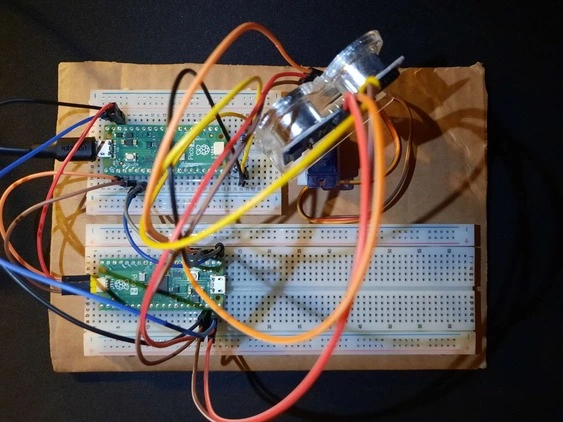
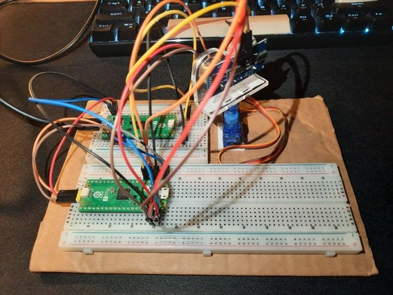
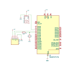

# Radar
An ultrasonic **radar system** that detects objects' positions using sound waves instead of radio signals.

:::info 

**Author**: Zaluceanu Mihaela \
**GitHub Project Link**: https://github.com/UPB-PMRust-Students/proiect-mihaelazaluceanu

:::

## Description

This project is a small-scale ultrasonic RADAR system that detects the presence and relative position of objects in the horizontal plane. It uses the **HC-SR04 ultrasonic sensor** for distance measurements and the **SG90 micro servo motor** to rotate the sensor across a 180° arc, enabling area scanning. The system is controlled by a **Raspberry Pi Pico 2**.
Designed as a modular component, this project can be integrated into larger systems where echolocation improves spatial awareness and obstacle detection.

## Motivation

This project is modular and can be integrated into larger robotics or IoT projects later.

## Architecture 


## Log

<!-- write your progress here every week -->

### Week 5 - 11 May
Starting writing project's documentation.

### Week 12 - 18 May
I assembled the hardware components and wrote a demo code to ensure everything was working correctly.
I also started working on the GUI code for the radar interface.

### Week 19 - 25 May
I implemented the main logic of the project (reading sensor data and sending it to the GUI).
Additionally, I integrated a BMP180 sensor to measure the actual room temperature, and added a passive buzzer that emits different frequencies depending on the distance to the detected object.

## Hardware

- x2 Raspberry Pi Pico 2W;
- SG90 micro-servomotor with 180° rotation range;
- HC-SR04 ultrasonic distance sensor;
- 3k3 Resistor;
- 6k8 Resistor;
- BMP180 sensor;
- passive buzzer;

[](https://youtu.be/XF7xbb9hKgY)

              |  
:-------------------------:|:-------------------------:

### Schematics



### Bill of Materials

<!-- Fill out this table with all the hardware components that you might need.

The format is 
```
| [Device](link://to/device) | This is used ... | [price](link://to/store) |

```

-->

| Device | Usage | Price |
|--------|--------|-------|
| [Raspberry Pi Pico 2](https://www.raspberrypi.com/documentation/microcontrollers/raspberry-pi-pico.html) | The microcontroller | [35 RON](https://www.tme.eu/ro/details/sc1632/raspberry-pi-sisteme-incorporate/raspberry-pi/raspberry-pi-pico-2-with-header/) |
| [Raspberry Pi Pico 2](https://www.raspberrypi.com/documentation/microcontrollers/raspberry-pi-pico.html) | The debugger | [35 RON](https://www.tme.eu/ro/details/sc1632/raspberry-pi-sisteme-incorporate/raspberry-pi/raspberry-pi-pico-2-with-header/) |
| Breadboard | Breadboard | [16.52 RON](https://www.emag.ro/breadboard-placa-test-400-puncte-oky0005/pd/DSBXR1MBM/?ref=history-shopping_422378681_2895_1) |
| [LM7805](https://www.ti.com/lit/ds/symlink/lm7800.pdf) | The stabilizer | [7.33 RON](https://www.emag.ro/circuit-integrat-stabilizator-de-tensiune-to220-3-cdil-lm7805-t157585/pd/DH365KYBM/?ref=history-shopping_422378681_7083_1) |
| Wires | Wires | [20.53 RON](https://www.emag.ro/10-x-fire-dupont-tata-tata-20cm-cl55/pd/DV8M9WBBM/?ref=history-shopping_422378681_12161_1) |
| [USB to Micro-USB Cable](https://www.mouser.com/pdfdocs/HiroseZX62Datasheet24200011.pdf) | USB | [8.79 RON](https://www.emag.ro/cablu-alimentare-si-date-ugreen-fast-charging-usb-la-micro-usb-nickel-plating-pvc-1m-negru-6957303861361/pd/DC7CCBYBM/?ref=history-shopping_422378681_64468_1) |
| [HC-SR04 Sensor](https://cdn.sparkfun.com/datasheets/Sensors/Proximity/HCSR04.pdf) | The Ultrasonic Sensor | [12.54 RON](https://www.emag.ro/senzor-ultrasonic-hc-sr04-3/pd/D3NL48YBM/) |
| [SG90 Servo-Motor](http://www.ee.ic.ac.uk/pcheung/teaching/DE1_EE/stores/sg90_datasheet.pdf) | The Servomotor | [19.64 RON](https://www.emag.ro/set-servomotor-sg90-unghi-de-lucru-180-grade-23-mm-9-g-3874783591829/pd/DXVZ3MYBM/) |
| HC-SR04 Sensor Holder Support Bracket | Sensor Holder Support Bracket | [3.94 RON](https://www.optimusdigital.ro/ro/mecanica-accesorii-de-prindere/12246-suport-pentru-senzor-ultrasonic-hc-sr04.html?search_query=modul&results=1815) |
| [BMP180 Sensor](https://www.mouser.com/datasheet/2/783/BST-BMP180-DS000-1509579.pdf) | The Temperature Sensor | [6.98 RON](https://www.optimusdigital.ro/en/pressure-sensors/149-bmp180-temperature-and-pressure-sensor.html) |
| [Passive Buzzer](https://components101.com/misc/buzzer-pinout-working-datasheet) | The Buzzer | [0.99 RON](https://www.optimusdigital.ro/en/buzzers/12247-3-v-or-33v-passive-buzzer.html?search_query=buzzer&results=86) |

**Total**  220.72


## Software

| Library | Description | Usage |
|---------|-------------|-------|
| [embassy](https://embassy.dev/) | Asynchronous embedded framework for Rust | Core framework for running async tasks on the Raspberry Pi Pico 2 |
| [embassy-rp](https://embassy.dev/) | For the Raspberry Pi RP2040 microcontroller | Hardware abstraction layer for Raspberry Pi Pico 2 |
| [embassy-hal](https://embassy.dev/) | Hardware abstraction layer for embedded devices | Standard interface for GPIO, SPI, I2C, PWM, etc. |
| [panic-probe](https://docs.rs/panic-probe/latest/panic_probe/) | Minimal panic handler with defmt logging support | Used for debugging embedded apps with logging via RTT |
| defmt | Logging framework optimized for embedded systems | Logs debug information with minimal resource usage |
| [hcsr04-async](https://crates.io/crates/hcsr04-async) | Async driver for HC-SR04 ultrasonic sensor | Measures distance via async API and GPIO pins |
| [bmp180-embedded-hal](https://crates.io/crates/bmp180-embedded-hal) | Driver for BMP180 pressure/temperature sensor | Reads environmental data over I2C using embedded-hal traits |
| [embassy-usb](https://crates.io/crates/embassy-usb) | Async USB device stack for embedded devices | Sends serial data over USB via CDC-ACM class |
| [fixed](https://docs.rs/fixed/latest/fixed/) | Fixed-point arithmetic types | Used for converting float to fixed point for better performance or precision |
| [eframe/egui](https://crates.io/crates/eframe) | GUI framework for Rust apps | Used in host-side GUI for rendering radar visualizations (not running on embedded device) |

## Links

<!-- Add a few links that inspired you and that you think you will use for your project -->

1. [Lab03 - PWM & ADC](https://pmrust.pages.upb.ro/docs/acs_cc/lab/03)
2. [Lab06 - I2C](https://pmrust.pages.upb.ro/docs/acs_cc/lab/06)
3. [Radar 2016](https://ocw.cs.pub.ro/courses/pm/prj2016/anitu/bogdan.folea)
