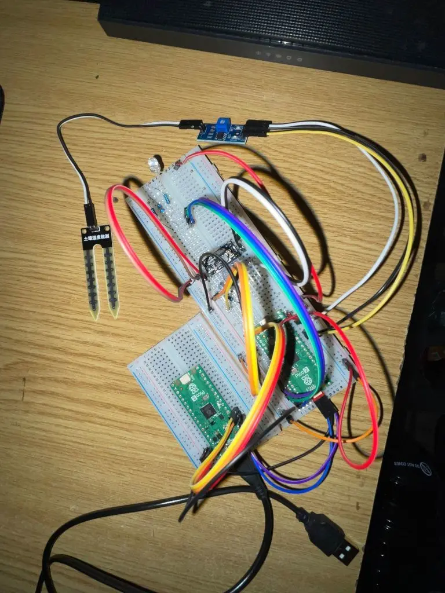
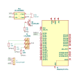

# Plant watering alarm
When your plant is thirsty it can't tell you that, but I can help with it.

:::info

**Author**: Pacuraru Mihai-Dorin \
**GitHub Project Link**: https://github.com/UPB-PMRust-Students/proiect-dmihai03

:::

## Description

The "Plant Watering Alarm" is a smart monitoring system that detects when your plants need water and alerts you before they become dehydrated. The system uses a soil moisture sensor inserted into the plant's soil to continuously measure moisture levels. When the soil becomes too dry (falling below a configurable threshold), the system triggers an audio and visual alarm to notify you that your plant needs attention.

The core components include a Raspberry Pi Pico 2 microcontroller, soil moisture and air temperature sensors, a buzzer for audible alerts, a LCD Display for informations feedback and a RGB LED that shows the watering level:
- green (normal)
- yellow (prepare for watering)
- red (urgent watering)


## Motivation

I had a plant that i've forgot to water and died.

## Architecture 


## Log

<!-- write your progress here every week -->

### Week 5 - 11 May

Write documentation.

### Week 12 - 18 May

Assemble hardware components and write demo source code.

### Week 19 - 25 May

Add LCD Display and BMP180 temperature sensor. Finish writing code.

## Hardware

- 2x Raspberry Pi Pico 2W
    - one for flashing the program to the other
    - one for controlling input from senzor and sending output signals to buzzer and LED
- buzzer
    - alert when plant is thirsty
- RGB LED
    - feedback of watering level
- voltage converter source
    - convert from 3V given out by GPIO to 12V required by buzzer
- soil humidity sensor
    - read soil humidity
- temperature and pressure sensor
    - read air temperature and pressure
- 16x2 LCD display
    - display data given by sensors

<!-- [](https://youtu.be/EuqZ8Y21hg4) -->

<iframe width="560" height="315" src="https://www.youtube.com/embed/jeCahVfEJn8?si=uWEYXxEnHdD4ovef" title="YouTube video player" frameborder="0" allow="accelerometer; autoplay; clipboard-write; encrypted-media; gyroscope; picture-in-picture; web-share" referrerpolicy="strict-origin-when-cross-origin" allowfullscreen></iframe>



### Schematic


### Bill of Materials

<!-- Fill out this table with all the hardware components that you might need.

The format is 
```
| [Device](link://to/device) | This is used ... | [price](link://to/store) |

```

-->

| Device | Usage | Price |
|--------|--------|-------|
| [2x Raspberry Pi Pico 2](https://www.tme.eu/ro/details/sc1632/raspberry-pi-sisteme-incorporate/raspberry-pi/raspberry-pi-pico-2-with-header/) | The microcontroller | 70 RON |
| [DC DC Voltage Converter](https://www.emag.ro/tranzistor-2n2222am-npn-se2312151536/pd/DKHH5TYBM/) | The transistor for buzzer | 3 RON |
| [Buzzer](https://www.emag.ro/buzzer-activ-12v-compatibil-arduino-raspberry-oky0151-oky0151-1/pd/D2KJNNMBM/?ref=embedding_similar_model_1_1&provider=rec&recid=rec_102_2799c2c87a26676847d5aa996bad6a8432c1cbf753de8447ade35beed1e6cfe5_1746002555&scenario_ID=102) | The buzzer | 2 RON |
| [2x Transistor](https://www.emag.ro/tranzistor-2n2222am-npn-se2312151536/pd/DKHH5TYBM/) | The transistors | 6 RON |
| [RGB LED](https://sigmanortec.ro/led-rgb-10mm-catod-comun?SubmitCurrency=1&id_currency=2) | The LED for feedback | 2 RON |
| [Rezistors](https://www.optimusdigital.ro/ro/componente-electronice-rezistoare/10928-plusivo-kit-250-buc-rezistoare.html?search_query=rezistor&results=110) | The resistors kit | 15 RON |
| [Soil Humidity Sensor](https://sigmanortec.ro/Senzor-umiditate-sol-higrometru-p125814620?SubmitCurrency=1&id_currency=2&gQT=1) | The sensor for soil humidity | 4 RON |
| [Temperature and Pressure Sensor](https://www.optimusdigital.ro/ro/senzori-senzori-de-presiune/149-modul-senzor-de-temperatura-si-presiune-bmp180.html?search_query=bmp&results=21) | The sensor for air temperature and pressure | 7 RON |
| [LCD Display](https://www.optimusdigital.ro/ro/optoelectronice-lcd-uri/62-lcd-1602-cu-interfata-i2c-si-backlight-galben-verde.html?search_query=lcd+i2c&results=17) | The LCD display | 15 RON |
| [Breadboard](https://www.emag.ro/breadboard-400-puncte-ai059-s69/pd/DRJ66JBBM/?ref=sponsored_products_search_r_1_1&recid=recads_1_3f8bcd3d0d1fce50ce875c811f44c8b37341887cf1698acd0193b6f39e905ded_1746374198&aid=d0eeaed2-9c23-11ef-9ec5-023c6ef0a87b_eyJicGQiOjAuMTN9-64d0f1bc2be845562de29773259d5d2f4c3408ca51e59b1cb3a0201b8d7c9467&oid=50658364&scenario_ID=1#reviews-section) | The Breadboard | 17 RON |
| [Wires](https://www.emag.ro/10-x-fire-dupont-tata-tata-20cm-cl55/pd/DV8M9WBBM/?ref=history-shopping_422378681_12161_1) | The Wires | 10 RON |
| Total | 151 |

## Software

| Library | Description | Usage |
|---------|-------------|-------|
| [embassy-rp](https://github.com/almindor/st7789) | Async embedded peripherals | Peripherals access |
| [embassy-executor](https://crates.io/crates/embassy-executor) | Async embedded tasks | Tasks manager |
| [embassy-time](https://docs.rs/embassy-time/latest/embassy_time/) | Async embedded time | Delay time manager |
| [lcd_lcm1602_i2c](https://docs.rs/lcd-lcm1602-i2c/latest/lcd_lcm1602_i2c/index.html) | LCD 16x2 i2c driver | Control LCD Display |
| [bmp180_embedded_hal](https://docs.rs/bmp180-embedded-hal/latest/bmp180_embedded_hal/) | BMP180 driver | Control BMP180 sensor |
| [core](https://doc.rust-lang.org/stable/std/index.html) | Rust stdlib | Format string for printing |

## Links

<!-- Add a few links that inspired you and that you think you will use for your project -->

1. [Async dev lab](https://pmrust.pages.upb.ro/docs/acs_cc/lab/04)
2. [Serial Peripheral Interface](https://pmrust.pages.upb.ro/docs/acs_cc/lab/05)
3. [Inter-Integrated Circuit](https://pmrust.pages.upb.ro/docs/acs_cc/lab/06)
4. [Plants Care Guide](https://plnts.com/en/care/doctor/temperature-and-humidity)
