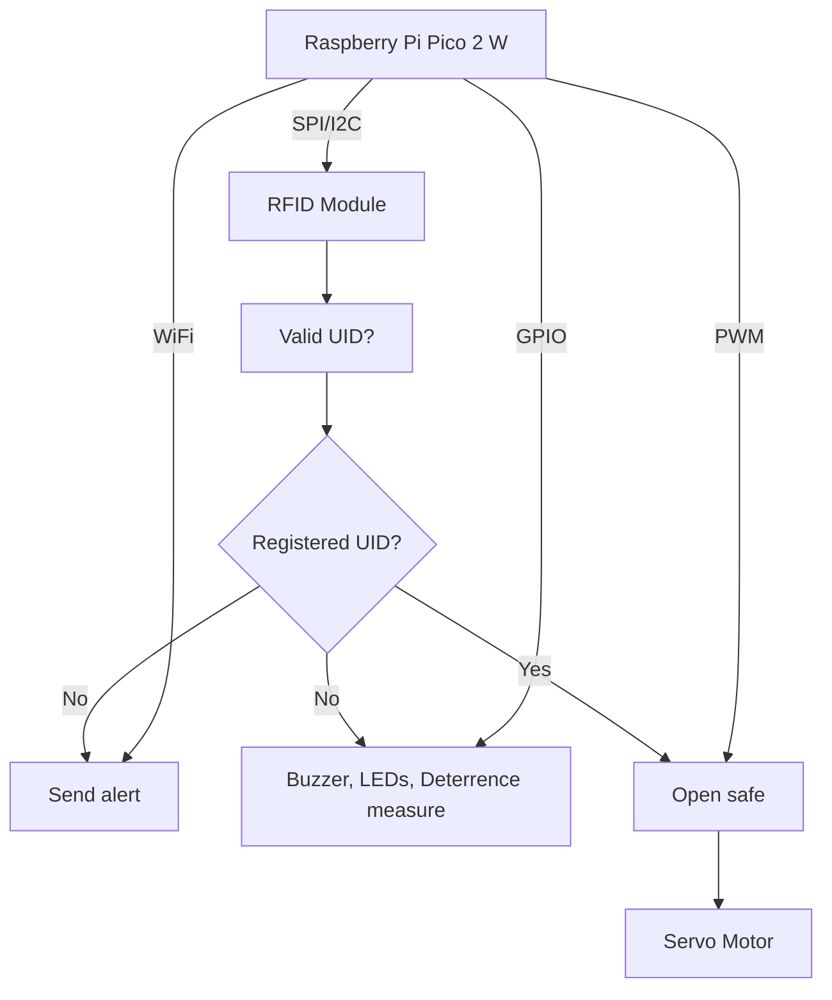

# SafePi
A smart and secure mini-safe that unlocks with RFID and fights back against intruders.

:::info 

**Author**: Nămoianu Petre \
**GitHub Project Link**: https://github.com/UPB-PMRust-Students/proiect-PetreNamo

:::

## Description

SafePi is a compact, smart security safe controlled via RFID authentication.
It is designed to be unlocked using authorized RFID cards or a smartphone.
When an unauthorized access attempt is detected, the system triggers a loud audible alarm,
sends a notification to the user's smartphone, and activates a physical deterrent mechanism
that launches small projectiles to discourage tampering.

## Motivation

The motivation behind SafePi is to enhance personal security with an accessible and affordable system.
It not only alerts you instantly via phone notification, but also discourages and delays access through physical deterrents.

## Architecture

- **Main Controller (Raspberry Pi Pico 2W):**  
  Acts as the central unit managing all inputs and outputs
  and sends notifications to your phone.

- **RFID Module:**  
  Reads the tag of the person attempting to open the safe.

- **Servo Motors:**  
  One opens the door when told by the controller,
  the others launch small objects if an intruder is trying to open the safe.

- **LEDs, Buzzer:**  
  Used as a visible and audible alarm.



## Log

<!-- write your progress here every week -->

### Week 5 - 11 May
  Started gathering the required components, checked to see what voltage some parts work at. Started writing the documentation and researching how to make a safe shoot "projectiles".
### Week 12 - 18 May
  During this week I acquired all the remaining parts, decided to switch from 4x1.5V batteries to a single 9V battery in case my DC motor needed more voltage to spin faster. I put all my hardware in the safe for the first time and came up with a rough idea for the launching mechanism for the "projectiles". 
### Week 19 - 25 May

## Hardware
  For my safe, I used a Raspberry Pi Pico 2W as my MCU. With the help of a PN532 module I am able to scan any access keys with NFC/RFID. My locking mechanism is a SG90 servomotor. I have also installed two LEDs, one blue and one red, and an active buzzer, meant to resemble an alarm. The "projectiles" are fired with the help of a DC motor that is spinning a wheel. Below is a photo with the hardware outside the box:


### Schematics


### Bill of Materials

<!-- Fill out this table with all the hardware components that you might need.

The format is 
```
| [Device](link://to/device) | This is used ... | [price](link://to/store) |

```

-->

| Device | Usage | Price |
|--------|--------|-------|
| [Raspberry Pi Pico 2W](https://www.raspberrypi.com/documentation/microcontrollers/raspberry-pi-pico.html) | The microcontroller | [40 RON](https://www.optimusdigital.ro/en/raspberry-pi-boards/13327-raspberry-pi-pico-2-w.html) |
| Red LED | Blinking when the alarm goes off | [0.39 RON](https://www.optimusdigital.ro/ro/optoelectronice-led-uri/696-led-rou-de-3-mm-cu-lentile-difuze.html) |
| Blue LED | Blinking when the alarm goes off | [0.29 RON](https://www.optimusdigital.ro/ro/optoelectronice-led-uri/12237-led-albastru-de-5-mm.html) |
| Buzzer | Used when the alarm goes off | [1 RON](https://www.optimusdigital.ro/ro/audio-buzzere/635-buzzer-activ-de-3-v.html) |
| [PN532 RFID Module](https://www.nxp.com/docs/en/nxp/data-sheets/PN532_C1.pdf) | Used for  opening the safe | 30 RON |
| 9V Battery | Used for powering the motors and the RFID Module | 10 RON |
| Battery Support | Connecting the battery to the breadboard | [1.29 RON](https://www.optimusdigital.ro/ro/suporturi-de-baterii/20-conector-pentru-baterie-de-9-v.html) |
| Breadboard | Connecting all the components | [4.56 RON](https://www.optimusdigital.ro/ro/prototipare-breadboard-uri/44-breadboard-400-points.html) |
| [Step-Down module](https://www.monolithicpower.com/en/documentview/productdocument/index/version/2/document_type/Datasheet/lang/en/sku/MP1584EN-LF-Z/document_id/204/?srsltid=AfmBOorbWpoH9ILvxrVysau20kQVKT-H9PYR5KDHIYSkhpZNmCMDHyRe) | Used to limit the voltage to 5V | [6.49 RON](https://www.optimusdigital.ro/ro/surse-coboratoare-reglabile/166-modul-dc-dc-step-down-mp1584en.html) |
| [Servomotor](http://www.ee.ic.ac.uk/pcheung/teaching/DE1_EE/stores/sg90_datasheet.pdf) | Safe locking mechanism | [11.99 RON](https://www.optimusdigital.ro/ro/motoare-servomotoare/2261-micro-servo-motor-sg90-180.html) |
| [DC Motor](https://www.handsontec.com/dataspecs/GA12-N20.pdf) | Used for throwing small balls | 33 RON | 
| Transistor | Used for commanding the DC motor | 2 RON |


## Software

| Library | Description | Usage |
|---------|-------------|-------|
| [embassy](https://github.com/embassy-rs/embassy) | Async embedded framework for Rust | Main framework for handling async tasks |
| [embassy-rp](https://github.com/embassy-rs/embassy) | RP2350 support for Embassy | Provides access to GPIO, I2C, and timers for Raspberry Pi Pico 2 |
| [defmt](https://github.com/knurling-rs/defmt) | Logging framework for embedded Rust | Debugging tool |

\*Not Final


## Links

<!-- Add a few links that inspired you and that you think you will use for your project -->

