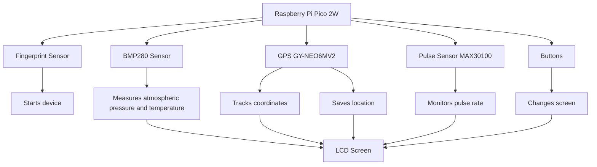
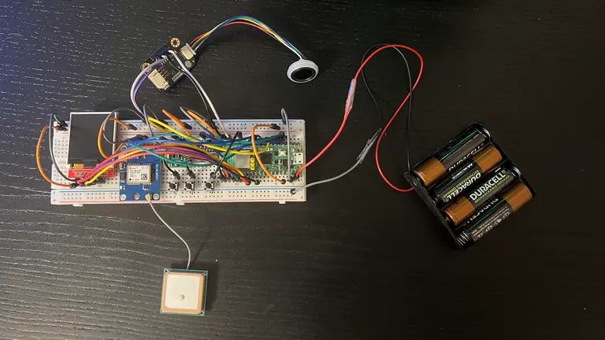
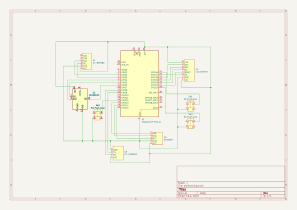

# Pip-Boy 2000

Wrist-mounted device that displays various info on a screen.

:::info

**Author**: Matei Rareș-Andrei \
**GitHub Project Link**: [Pip-Boy 2000](https://github.com/UPB-PMRust-Students/proiect-raresmatei2003)

:::

## Description

Pip-Boy 2000 is a device that is mounted on someone's wrist and contains various sensors and modules
in order to track the wearer's well being and the surrounding environment. The recorded data is displayed
on a LCD screen and the wearer can cycle through it by pressing buttons on the device. To ensure
the device's safety, to be used it needs to scan the wearer's fingerprint when mounted.

## Motivation

I always wanted to try tech from games I played or that fascinated me and the Fallout universe is
one of the most interesting worlds in gaming fiction, so I thought that I should try to
build something from it and the Pip-Boy 2000 seemed the obvious choice.

## Architecture

## Log

*Week 5 - 11 May*

Docs week

*Week 12 - 18 May*

Hardware week

I changed the fingerprint sensor with a capacitive one that requires 3.3V and is using I2C.

I was unsure if I needed a step-down and a logic level translator for the pulse sensor
but I found out that the component I bought already has LDO to lower the voltage to
1.8V, so the module works with the 3.3V from the pico.

I did the sum of all currents used by the modules to see if the pico can power them.

| Module | Current |
|--------|---------|
| GY-BMP280 | 4.2 * 10^-3 mA |
| GPS GY-NEO6MV2 | 10 mA |
| MAX30100 | 1.2 mA |
| SKU SEN0359 | 60 mA |
| LCD Screen | 3 + 20 mA |
| Total | ~100 mA |

From pico [datasheet](https://datasheets.raspberrypi.com/picow/pico-2-w-datasheet.pdf#page=10):
"3V3 is the main 3.3V supply to RP2350 and its I/O, generated by the on-board SMPS. This pin can be used to power
external circuitry (maximum output current will depend on RP2350 load and VSYS voltage; it is recommended to keep
the load on this pin under 300mA)."

This table from the rp2350 [datasheet](https://datasheets.raspberrypi.com/rp2350/rp2350-datasheet.pdf#page=1341) also indicates this.

I also uploaded a KiCad schematic of the circuit.

For the wiring I tried to match the wires:

Orange - VCC

Gray - GND

Green - SCL / SCK / TX

Blue - SDA / RX

Red - CS and RESET from the LCD screen

Yellow - A0 from the LDC screen / INT from MAX30100

Black - Button pins

*Week 19 - 25 May*

Software week

## Hardware

1. **Raspberry Pi Pico 2W**
- Processes the data recieved from the sensors and sends it to the screen
- Stores GPS coordinates that the wearer wants saved
2. **Barometric Pressure Sensor GY-BMP280**
- Measures atmosferic pressure and temperature
3. **GPS GY-NEO6MV2 with antenna**
- Uses radio waves and satelite navigation to determine coordinates
4. **Pulse Sensor MAX30100**
- Measures the wearers pulse
5. **Gravity Capacitive Fingerprint Sensor SKU SEN0359**
- Used to start the device, only reacts to wearer's fingerprint
6. **LCD Screen 1.44 inch diag (128x128 px)**
- Displays data from the sensors, can cycle through multiple screens
7. **Other stuff**
- Batteries, wires, breadboard, buttons

This is the device's circuit. I need to make a small case to hide the wires and the components, except the screen, fingerprint sensor, pulse sensor and the buttons.

## Schematics

## Bill of Materials

| Device | Usage | Price |
|--------|-------|-------|
| [Raspberry Pi Pico 2W](https://www.raspberrypi.com/documentation/microcontrollers/pico-series.html) | Processing power | [39.66 RON](https://www.optimusdigital.ro/ro/placi-raspberry-pi/13327-raspberry-pi-pico-2-w.html) |
| [Barometric Pressure Sensor GY-BMP280](https://www.bosch-sensortec.com/media/boschsensortec/downloads/datasheets/bst-bmp280-ds001.pdf) | Pressure and temperature sensor | [8.49 RON](https://www.optimusdigital.ro/ro/senzori-senzori-de-presiune/1666-modul-senzor-de-presiune-barometric-bmp280.html) |
| [GPS GY-NEO6MV2 with antenna](https://content.u-blox.com/sites/default/files/products/documents/NEO-6_DataSheet_%28GPS.G6-HW-09005%29.pdf) | Tracks GPS coordinates | [44.95 RON](https://www.optimusdigital.ro/ro/gps/105-modul-gps-gy-neo6mv2.html) |
| [Pulse Sensor MAX30100](https://www.analog.com/media/en/technical-documentation/data-sheets/max30100.pdf) | Monitors wearer's pulse | [24.99 RON](https://www.optimusdigital.ro/ro/senzori-altele/2166-modul-senzor-puls-max30100-rcwl-0530.html) |
| [Gravity Capacitive Fingerprint Sensor SKU SEN0359](https://wiki.dfrobot.com/Gravity_Capacitive_Fingerprint_Sensor_SKU_SEN0359) | Scans wearer's fingerprint to start the device | [184.79 RON](https://www.optimusdigital.ro/ro/senzori/12748-gravity-senzor-de-amprenta-capacitiv.html) |
| [1.44'' LCD Screen](http://www.lcdwiki.com/res/MSP1443/1.44inch_SPI_Module_MSP1443_User_Manual_EN.pdf) | Displays data from the sensors | [27.99 RON](https://www.optimusdigital.ro/ro/optoelectronice-lcd-uri/870-modul-lcd-144.html) |
| Other stuff (breadboard, wires, battery, buttons) | Used to assemble the device | 60 RON |
| Total | - | 390.87 RON |

## Software
| Library | Description | Usage |
|---------|-------------|-------|
| [embassy-rp](https://crates.io/crates/embassy-rp) | HAL implementation to not use registers directly | Gives access to GPIO, I2C, SPI ports |
| [bmp280](https://crates.io/crates/bme280) | Driver for the Bosch BMP280 temperature and atmospheric pressure sensor | Tracks temperature and atmospheric pressure |
| [ublox](https://crates.io/crates/ublox) | Library for uBlox GPS devices | Tracks GPS coordinates |
| [max3010x](https://docs.rs/max3010x/latest/max3010x/) | Driver for the MAX3010x sensor based on embedded-hal traits | Tracks wearer's pulse |
| [st7735-lcd](https://crates.io/crates/st7735-lcd) | Library for displays using ST7735 driver with embedded_graphics and embedded_hal support | Displays data on screen |

## Links
1. [PM Labs](https://pmrust.pages.upb.ro/docs/acs_cc/category/lab)
2. [Ideea](https://fallout.fandom.com/wiki/Pip-Boy_2000)
3. [Another product](https://www.thewandcompany.com/pip-boy-kit/)
4. [Ebay Product](https://www.ebay.com/p/20037191863)