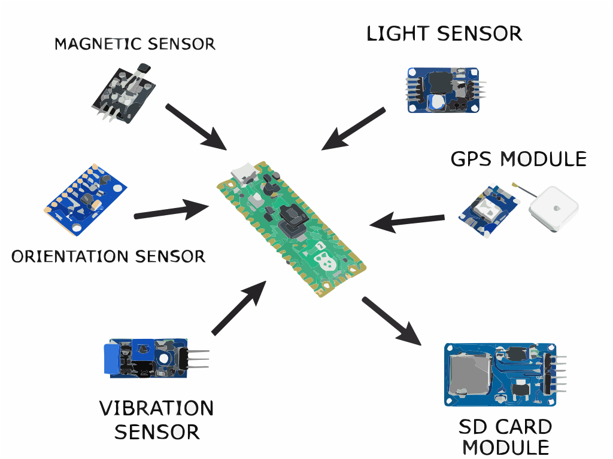
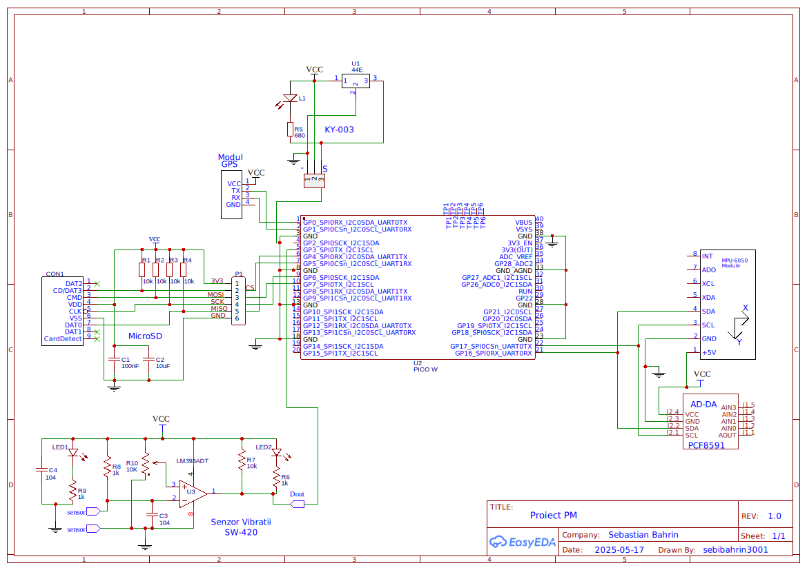
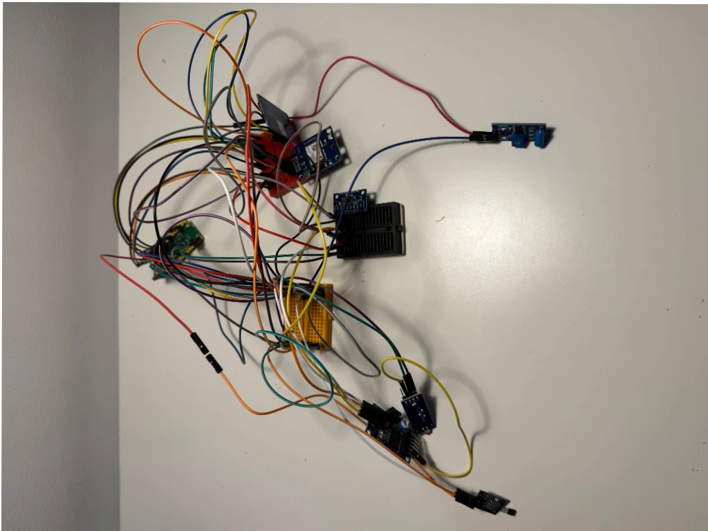
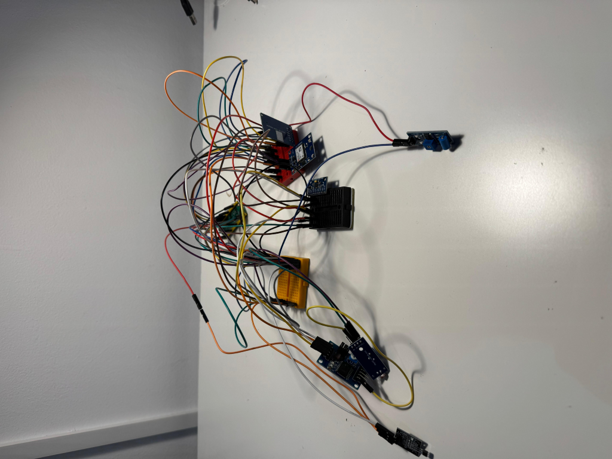
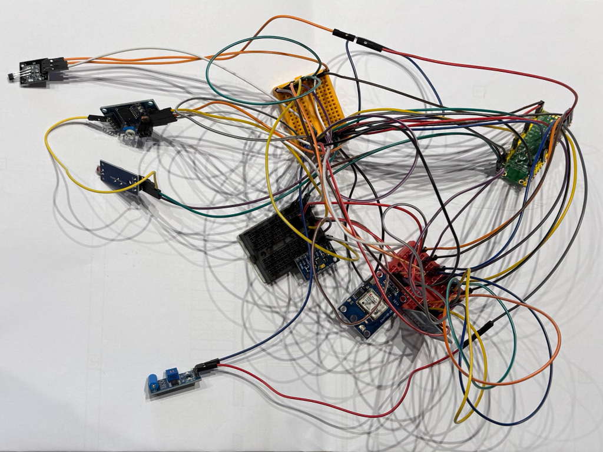

# SafeDelivery

A smart package security system to monitor and verify package integrity during transport

:::info

**Author**: Sebastian Stefan Bahrin  

**GitHub Project Link**: [\[link_to_github\]](https://github.com/UPB-PMRust-Students/proiect-SebiBahrin)

:::

## **Description**

SafeDelivery is an intelligent system for securing package transport, built with Raspberry Pi Pico 2W. The device monitors the physical conditions of a package during transport and detects opening attempts, rough handling, or abnormal positioning. The system logs all these events to a microSD card, allowing recipients to verify if the package was properly handled throughout delivery.

## **Motivation**

The inspiration for this project came from my personal experiences with damaged deliveries and the frustrating uncertainty of not knowing whether valuable items were mishandled before they reached me. By creating an affordable, reliable monitoring system, SafeDelivery empowers both senders and recipients with irrefutable evidence of a package's treatment during transit.

Beyond individual consumers, this technology has significant implications for industries shipping sensitive, fragile, or high-value items such as medical supplies, electronics, or artwork. SafeDelivery represents not just a technical solution but a step toward greater accountability in global logistics chains.

## **Architecture**

### Main Components:

1. **Sensor Array** - Multiple sensors that monitor different aspects of package integrity:
   - Light sensor (LDR) for detecting package opening
   - Vibration sensor (SW-420) for detecting rough handling
   - Reed switch with magnets for detecting seal breakage
   - IMU sensor (MPU6050) for detecting orientation and position changes

2. **Processing Unit** - Raspberry Pi Pico 2W processes all sensor inputs and makes decisions

3. **Storage System** - microSD card with SPI adapter for logging all events with timestamps

### Connection Diagram:
## System Diagram
 

## **Hardware**

### Microcontroller - Raspberry Pi Pico 2W
Raspberry Pi Pico 2W is the center of the system, based on the RP2040 dual-core Cortex M0+ processor operating at 133MHz. It has Wi-Fi and Bluetooth, although in this project we use the GSM module for communications. The microcontroller coordinates all sensors, processes the data, and stores it on the microSD card.

**Key specifications:**
- Dual-core ARM Cortex M0+ processor
- 264KB SRAM
- Wi-Fi and Bluetooth 
- 26 multi-function GPIO pins
- I2C, SPI, UART interfaces
- Operating voltage: 3.3V

### GPS NEO-8M Module
The GPS module allows tracking the position of the package during transport. It is equipped with an integrated ceramic antenna and can communicate coordinates with an accuracy of up to 2.5 meters.

**Specifications:**
- Operating voltage: 3.0V-5.0V
- Positioning accuracy: 2.5m CEP
- Communication via UART (TX/RX)
- Update rate: 10Hz
- Consumption: ~30mA in normal operation

**Interface:** UART at 9600 baud

### Accelerometer/Gyroscope MPU-6500 Sensor
Detects sudden movements, falls, or incorrect orientation of the package. It is a 6 degrees of freedom sensor (3-axis accelerometer + 3-axis gyroscope).

**Specifications:**
- Operating voltage: 3.3V
- Communication via I2C
- Accelerometer sensitivity: ±2g, ±4g, ±8g, ±16g
- Gyroscope sensitivity: ±250, ±500, ±1000, ±2000°/s
- Consumption: ~3.8mA in normal mode

**Interface:** I2C at address 0x68 (or 0x69 if AD0 pin is HIGH)

### MicroSD Module
Allows recording all data collected by sensors, including timestamp, GPS position, acceleration levels, improper handling events, and opening attempts.

**Specifications:**
- Operating voltage: 3.3V
- Communication via SPI
- Support for microSD cards up to 32GB
- Consumption: ~100mA when writing, ~25mA in idle mode

**Interface:** SPI at 25MHz

### AD/DA Converter Module PCF8591
This analog-to-digital converter is used to read values from the light sensor (photoresistor), allowing monitoring of light intensity (for detecting package opening).

**Specifications:**
- Operating voltage: 2.5V-6V
- Communication via I2C
- 4 analog inputs, 1 analog output
- Resolution: 8 bit
- Consumption: ~5mA in active mode

**Interface:** I2C at address 0x48

### Digital and Analog Sensors
- **Hall Magnetic Sensor KY-003:** Detects package opening through separation of the magnet from the sensor
- **Vibration/Movement Sensor:** Detects sudden handling or dropping of the package
- **Photoresistor:** Detects the presence of light (a sign that the package has been opened)

### Power System
The system is designed to operate with an external battery (power bank) that provides 5V.

**Power consumption calculations:**
- Raspberry Pi Pico 2W: ~0.5W (100mA at 5V)
- GPS NEO-8M: ~0.15W (30mA at 5V)
- Sensors and other modules: ~0.25W
- **Total estimated:** ~ 0.75W

With a 20,000mAh (5V) external battery, the system could theoretically operate for approximately 133 hours (20Ah × 5V ÷ 0.75W), but in practice, the duration will be reduced due to conversion efficiency and GPS NEO-8M consumption peaks.

## Detailed Description of Pins Used

### Raspberry Pi Pico 2W

#### Power pins:
- **VSYS (pin 39)**: Connected to the output of the AMS1117 5V module
- **GND (multiple)**: Connected to the common GND of all components

#### I2C pins:
- **GP16 (pin 21)**: I2C0 SDA function - Data for MPU-6500 and PCF8591
  *   It is one of the dedicated I2C0 pins and allows communication with multiple I2C devices on the same bus
- **GP17 (pin 22)**: I2C0 SCL function - Clock for MPU-6500 and PCF8591
  *   It is the SDA pin pair for I2C0

#### SPI pins for MicroSD:
- **GP5 (pin 7)**: SPI0 CS function - Chip Select for the MicroSD module
  *   Individual control of the MicroSD module
- **GP6 (pin 9)**: SPI0 SCK function - Clock for the MicroSD module
  *   It is the dedicated pin for SPI0 clock
- **GP7 (pin 10)**: SPI0 MOSI function - Master Out Slave In for the MicroSD module
  *   Data transmission to the MicroSD card
- **GP4 (pin 6)**: SPI0 MISO function - Master In Slave Out for the MicroSD module
  *   Data reception from the MicroSD card

#### UART pins for GPS:
- **GP0 (pin 1)**: UART0 TX function - Data transmission to the GPS module
  *   It is part of the UART0 pair, dedicated to serial communications
- **GP1 (pin 2)**: UART0 RX function - Data reception from the GPS module
  *   It is the TX pair for UART0

#### GPIO pins for digital sensors:
- **GP2 (pin 4)**: Digital input for the Hall KY-003 sensor
  *   Pin configured as a digital input with internal pull-up for detecting state changes
- **GP3 (pin 5)**: Digital input for the vibration sensor
  *   Pin configured as a digital input for detecting vibrations

### PCF8591 Module (AD/DA Converter)
- **AIN0**: Connected to the light sensor (photoresistor)
  *   Reading analog values from the photoresistor for light detection

## **Schematics**
 

## **Project Photos**
 
 
 

## **Bill of Materials**

| **Device** | **Usage** | **Price** |
|------------|-----------|-----------|
| [Raspberry Pi Pico 2W](https://www.optimusdigital.ro/ro/placi-raspberry-pi/13327-raspberry-pi-pico-2-w.html?search_query=raspberry+pi+pico&results=26) | The main microcontroller that manages all sensors and logs events | 40 RON |
| [Light Sensor (LDR)](https://sigmanortec.ro/modul-convertor-adda-fotorezistor-termistor-pcf8591-i2c) | Detects if the package has been opened (light exposure) | 15 RON |
| [Vibration Sensor (SW-420)](https://www.bitmi.ro/electronica/senzor-vibratie-sw-420-11516.html) | Detects shocks, movements, or violent handling of the package | 5 RON |
| [Magnetic Sensor + Magnets](https://sigmanortec.ro/senzor-hall-analog-magnetic-ky-035-5v) | Detects if the package lid has been opened (magnetic seal broken) | 20 RON |
| [IMU Sensor (MPU6500)](https://sigmanortec.ro/Modul-Accelerometru-Giroscop-I2C-MPU-6500-6-axe-p136248782) | Monitors orientation, detects abnormal tilting or positioning | 13 RON |
| [GPS Module](https://sigmanortec.ro/modul-gps-neo-8m-3-5v-cu-antena) | Provides real-time location tracking of the package, allowing you to monitor its journey and verify if it has deviated from the intended route | 75 RON |
| [SD Card Reader](https://sigmanortec.ro/Modul-MicroSD-p126079625) | Stores data about the package | 5 RON |
| [Battery](https://www.flax.ro/baterie-portabila-samsung-eb-p4520xuegeu-20000mah-3-x-usb-c-beige?gad_campaignid=21254661053)  | Provides autonomous power during transport | Already had |
| Case / Box | Simulates the sealed package in which sensors are mounted | Found at home |

## **Software**

| **Library** | **Description** | **Usage** |
|-------------|-----------------|-----------|
| [embassy](https://embassy.dev/) | Asynchronous embedded framework for Rust | Core framework for running async tasks on the Raspberry Pi Pico 2W |
| [embassy-rp](https://embassy.dev/) | Embassy HAL for RP2040 | Hardware abstraction layer for the Raspberry Pi Pico 2W |
| [embedded-hal](https://github.com/rust-embedded/embedded-hal) | Hardware Abstraction Layer (HAL) traits | Provides unified interfaces for hardware drivers |
| [embedded-graphics](https://github.com/embedded-graphics/embedded-graphics) | 2D graphics library | Used for drawing to the OLED display |
| [ssd1306](https://github.com/jamwaffles/ssd1306) | Rust driver for SSD1306 OLED displays | Controls the 0.96" OLED display |
| [mpu6050](https://github.com/juliangaal/mpu6050) | Rust driver for MPU6050 | Interfacing with the IMU sensor |
| [shared-bus](https://github.com/Rahix/shared-bus) | Bus sharing for embedded Rust | Sharing I2C/SPI buses between multiple devices |
| [embedded-sdmmc](https://github.com/rust-embedded-community/embedded-sdmmc-rs) | SD/MMC card access | Managing log files on the microSD card |
| [defmt](https://github.com/knurling-rs/defmt) | Logging framework for embedded devices | Debugging and development logging |
| [chrono](https://github.com/chronotope/chrono) | Date and time library | Creating timestamps for event logging |

## **Log**

### **Week 5 - 11 May**
Focused on documentation and planning for the SafeDelivery project. Researched all hardware components (Raspberry Pi Pico 2W, sensors, modules) to understand their specifications, pin requirements, and power needs. Created detailed connection diagrams, calculated power budget for battery life, and developed a comprehensive project plan.

### **Week 12 - 18 May**
Identified necessary Rust libraries and outlined the software architecture to ensure all components would work together effectively. Began hardware assembly and software implementation. Set up the development environment with Embassy framework for Rust. Connected and tested components individually on a breadboard: configured I2C for the MPU6500 IMU sensor, set up SPI for the microSD module, implemented interrupt detection for the Hall magnetic sensor, and started integrating the light sensor via PCF8591. Developed initial code for each sensor and verified basic functionality

### **Week 19 - 25 May**
TBA

## **Links**`

1. [I2C](https://pmrust.pages.upb.ro/docs/acs_cc/lab/06)
2. [WIFI](https://pmrust.pages.upb.ro/docs/acs_cc/lab/07)

