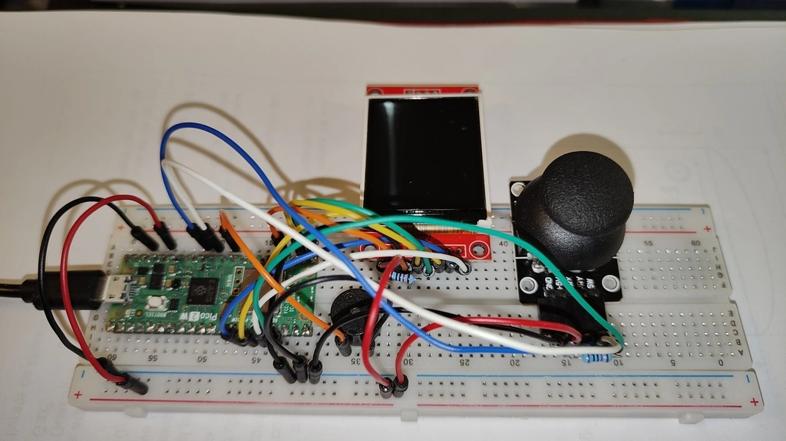
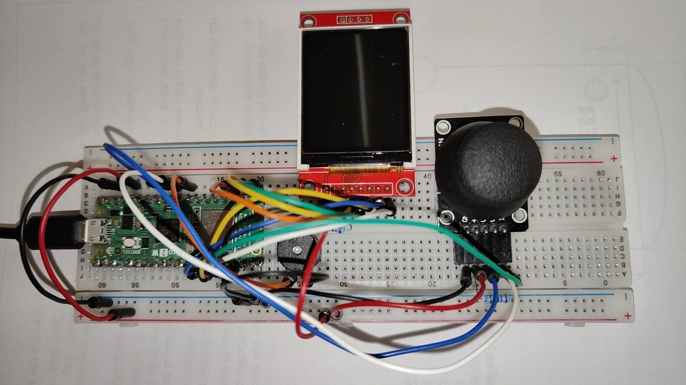
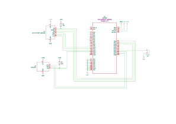

# Atari Breakout
A clone of the classic video game

:::info 

**Author**: Dumitru Silvia-Alexandra \
**GitHub Project Link**: [https://github.com/UPB-PMRust-Students/proiect-silviaalex](https://github.com/UPB-PMRust-Students/proiect-silviaalex)

:::

## Description

The project implements the arcade video game Breakout developed by Atari and released in 1976. This game consists of a sideways-moving paddle used to control the direction of a bouncing ball in order to eliminate all the bricks in the level and avoid missing to hit the ball when it comes back to the paddle. In this project, the video game is displayed on an LCD, played with a joystick and having responsive sound coming from a buzzer.

## Motivation

I have a deep passion for retro video games and wanted to build one for the project.

## Architecture

The main components are:
- the input, for controlling the paddle and other types of movement outside of gameplay
- the video output, for showing the state of the game, main menu, and maybe a leaderboard
- the audio output, for the SFX and, potentially, the music

These components are connected to the microcontroller, which is processing the inputs and updating the outputs.

## Log

<!-- write your progress here every week -->

### Week 5 - 11 May

### Week 12 - 18 May

### Week 19 - 25 May

## Hardware




Hardware used:
- Raspberry Pi Pico 2 W, the microcontroller
- TFT LCD with ST7735R driver, the display
- Biaxial Joystick, the joystick with 2 analog outputs for movement and 1 digital output for pressing it down
- Buzzer, for sound
- Breadboard, for placing all the components on
- Pin headers, soldered to the microcontroller
- Jumper wires, for interconnecting components
- Resistors, for pull up

### Schematics



### Bill of Materials

<!-- Fill out this table with all the hardware components that you might need.

The format is 
```
| [Device](link://to/device) | This is used ... | [price](link://to/store) |

```

-->

| Device | Usage | Price |
|--------|--------|-------|
| Raspberry Pi Pico 2 W | The microcontroller | [39.66 lei](https://www.optimusdigital.ro/en/raspberry-pi-boards/13327-raspberry-pi-pico-2-w.html) |
| Pin Header | For connecting the microcontroller to the breadboard | [0,99 lei](https://www.optimusdigital.ro/en/pin-headers/85-40p-254-mm-pin-header-200-pcs.html) |
| TFT LCD with ST7735R driver | The display | [28,99 lei](https://www.optimusdigital.ro/en/lcds/1311-modul-lcd-spi-de-18-128x160.html) |
| Biaxial Joystick | The input | [5,35 lei](https://www.optimusdigital.ro/en/touch-sensors/742-ps2-joystick-breakout.html) |
| Female Header | For connecting the joystick to the breadboard | [0,49 lei](https://www.optimusdigital.ro/en/pin-headers/797-header-de-pini-6p.html) |
| Plusivo Wireless Kit | For the buzzer, the breadboard, the jumper wires and the resistors included in the kit | [79,99 lei](https://www.optimusdigital.ro/en/optimus-digital-kits/7356-kit-wireless-super-starter-cu-esp8266.html) |

## Software

| Library | Description | Usage |
|---------|-------------|-------|
| [embassy-rp](https://github.com/embassy-rs/embassy) | RP2350 HAL | Used for embedded programming |
| [embedded-graphics](https://github.com/embedded-graphics/embedded-graphics) | Graphics crate | Used for drawing |
| [embedded-graphics-framebuf](https://github.com/bernii/embedded-graphics-framebuf) | Framebuffer with DMA support | Used to eliminate the flickering of the display |
| [mipidsi](https://github.com/almindor/mipidsi) | Generic display driver to connect to TFT displays | Used for the display |
| [heapless](https://github.com/rust-embedded/heapless) | Heapless allocator | Used for creating formatted text |

## Links

<!-- Add a few links that inspired you and that you think you will use for your project -->

1. [Breakout (Video Game)](https://en.wikipedia.org/wiki/Breakout_(video_game))
1. [Godot port of Breakout](https://rinest.itch.io/breakout-1976)
1. [Tutorial to be able to program the microcontroller in WSL](https://www.youtube.com/watch?v=iyBfQXmyH4o)
1. [Finding out that the current version of elf2uf2-rs doesn't work with pico2w and eventually deciding to install picotool](https://github.com/JoNil/elf2uf2-rs/issues/38)
1. [Tutorial about installing picotool to finally be able to upload valid uf2 to the microcontroller](https://piers.rocks/2023/09/05/installing-pico-sdk-and-picotool.html)
