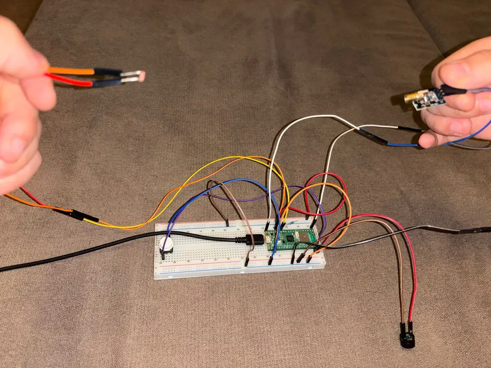
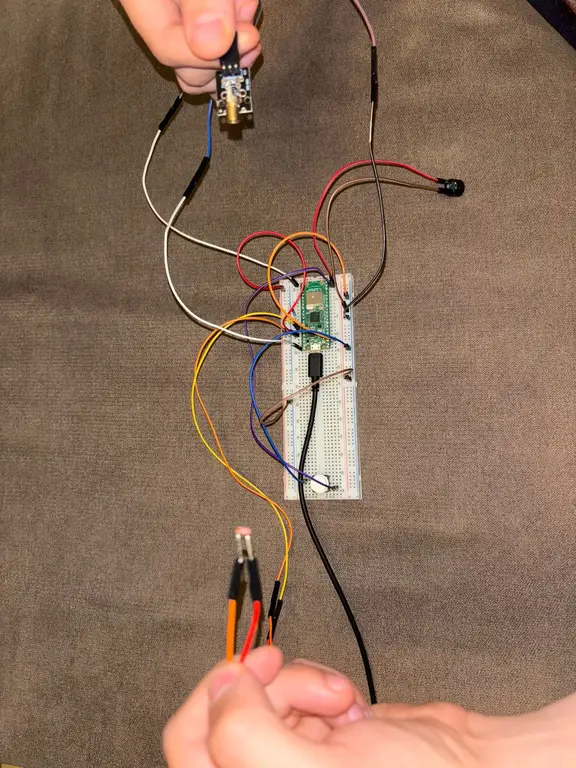
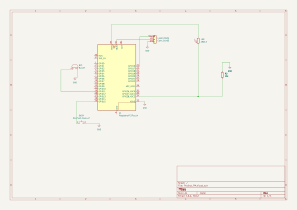

# Laser Alarm System
Check out for intruders. Or your noisy kids. Or both. 

:::info 

**Author:** Ștefan Adrian Brai \
**GitHub Project Link:** https://github.com/UPB-PMRust-Students/proiect-StefanBrai

:::

## Description

This project implements a security system where a continuous laser beam is emitted toward a photo-sensor. If the beam is interrupted, the system sounds an alarm and pushes a notification to the user’s phone via the Pico W’s Wi-Fi module. A manual button allows arming and disarming the system. The most recent intrusions will be stored in a database with their timestamps

## Motivation

The goal of the project is to develop an affordable and easy-to-implement security solution using low-cost components and the Raspberry Pi Pico W platform, which provides integrated Wi‑Fi connectivity for real-time notifications.

## Architecture

The system is divided into four logical modules:

1. **Laser Module** (emitter + sensor)  
2. **Control Unit** (Raspberry Pi Pico W firmware)  
3. **User Interface** (buzzer + push-button)  
4. **Network Service** (cloud notification endpoint)

```text
+----------------+          +----------------+
|   Laser        |          | Notification   |
| emitter+sensor |          | Service (Wi-Fi)|
+----------------+          +----------------+
        ^                       ^
        v                       |
+----------------+             |
| Raspberry Pi   |-------------+
| Pico W         |
+----------------+
  |            ^
  v            |
+--------+  +--------+
| Buzzer |  | Button |
+--------+  +--------+
```


## Log

### Week 5 - 11 May

I got started with the Pico setup and became accustomed to wiring the components to the board itself. I ran into difficulties connecting the debugger Pico, so I activated USB logging for my development needs. 

I started writing the main logic of the program. I tested each component individually through code and then built a broader program that encapsulates the LDR reading and buzzer trigger.

### Week 12 - 18 May

I assembled most of the pieces and further developed the logic for the laser–LDR calibration period. I also began developing the Wi-Fi setup and email-sending feature.

## Hardware

We use off-the-shelf components mounted on a breadboard and powered by a 5 V supply. The main utilities are the button, the passive buzzer which will be configured to emit a custom tune, the laser which will just be controlled by the button and the photoresistor which checks the laser output.





### Schematics



### Bill of Materials
| Device                    | Usage                                 | Price (RON) |
| ------------------------- | ------------------------------------- | ----------: |
| [Raspberry Pi Pico W](https://3dstar.ro/raspberry-pi-pico-wh)       | Microcontroller with integrated Wi-Fi |          35 |
| [5 V Laser Diode](https://www.emag.ro/modul-dioda-laser-650nm-5v-12x35-mm-5904162804269/pd/DVM5KLMBM/)           | Laser beam emitter                    |          14 |
| [LDR / Photoresistor](https://www.optimusdigital.ro/)          | Laser-beam interruption sensor        |           1.90 |
| [Passive Buzzer](https://www.optimusdigital.ro/en/buzzers/634-5v-passive-buzzer.html?search_query=buzzer&results=87)            | Audible alarm output                  |           1 |
| [Push-Button](https://www.optimusdigital.ro/en/search?controller=search&orderby=position&orderway=desc&search_query=Buton&submit_search=)               | Manual arm/disarm control             |           2 |
| [Breadboard & Jumper Wires](https://www.optimusdigital.ro/en/kits/2222-breadboard-kit-hq-830-p.html?search_query=Breadboard&results=362) | Prototyping                           |          22 |
| 5 V /3.3 V Power Supply          | System power                          |          0(came with breadboard) |

## Software

| Library                                                  | Description                                         | Usage                                                                                                                                                                                                                                                                                       |
|-------------------------------------------------------------------|-----------------------------------------------------|---------------------------------------------------------------------------------------------------------------------------------------------------------------------------------------------------------------------------------------------------------------------------------------------|
| [cyw43](https://crates.io/crates/cyw43)                           | Wi-Fi driver for the CYW43 chipset                  | `NetDriver`, `PowerManagementMode` for network I/O and power modes                                                                                                                                                                                                                          |
| [embassy-executor](https://crates.io/crates/embassy-executor)     | Asynchronous executor for Embassy                   | `Spawner`, `#[task]` for spawning and running tasks                                                                                                                                                                                                                                         |
| [embassy-rp](https://crates.io/crates/embassy-rp)                 | RP2040 peripheral abstractions and utilities        | • **ADC**: `Adc`, `Channel`, `InterruptHandler` (analog reads & IRQs)<br />• **GPIO**: `gpio::{Input, Output, Level, Pull}`<br />• **PWM**: `pwm::Pwm`, `pwm::Config as PwmConfig`<br />• **PIO**: `pio::Pio`<br />• **Interrupts**: `bind_interrupts!`, `Handler` trait<br />• **Peripherals**: `peripherals::{USB, DMA_CH2, PIO0}`, `usb` module |
| [embassy-time](https://crates.io/crates/embassy-time)             | Timing utilities                                    | `Duration`, `Timer` for delays and time-based scheduling                                                                                                                                                                                                                                     |
| [embassy-usb-logger](https://crates.io/crates/embassy-usb-logger) | USB‐based logging over the Embassy framework        | Capture and transmit debug logs over the USB interface                                                                                                                                                                                                                                      |
| [panic-probe](https://crates.io/crates/panic-probe)               | Panic handler         | Backtraces and panic logs over SWD                                                                                                                                                                                                                                                          |
| [log](https://crates.io/crates/log)                               | Standard Rust logging facade                        | `info!` macro for structured runtime logging                                                                                                                                                                                                                                                |
| [cyw43-pio](https://crates.io/crates/cyw43-pio)                   | PIO-based SPI front-end for CYW43 Wi-Fi module      | `PioSpi`, `RM2_CLOCK_DIVIDER` for bit-banged SPI over PIO                                                                                                                                                                                                                                   |
| [static-cell](https://crates.io/crates/static-cell)               | Zero-overhead static allocation utility             | `StaticCell` for safe, statically allocated variables                                                                                                                                                                                                                                        |
| [embassy-net](https://crates.io/crates/embassy-net)               | Embedded-ready network stack                        | `Config as NetConfig`, `Stack`, `StackResources` for IP-stack setup and resource allocation                                                                                                                                                                                                  |

## Links

-  https://how2electronics.com/laser-light-security-system-with-raspberry-pi-pico-ldr/
(found this after i got the idea)
- https://www.instructables.com/Controlling-a-5V-Laser-Diode-With-Raspberry-Pi-Pic/
