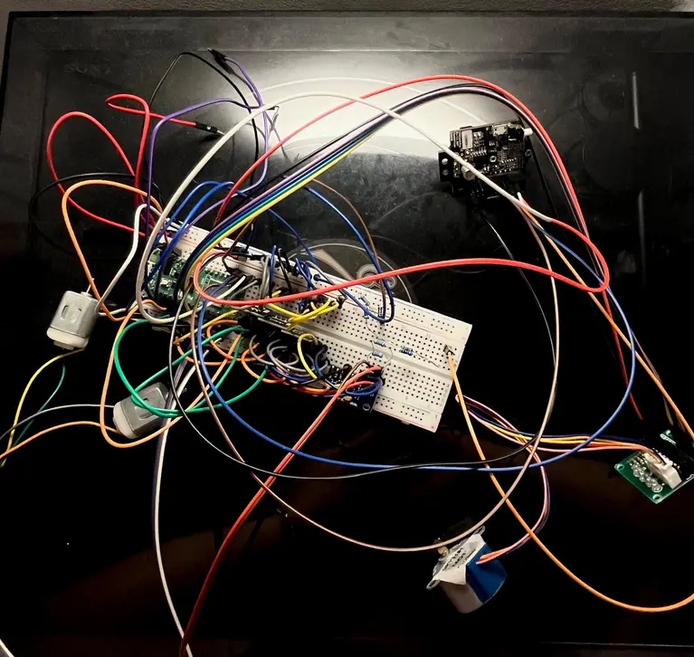

# Formula 1 Miniature Car 

A Bluetooth-controlled Formula 1 miniature car with onboard camera and real-time sensor monitoring via a web server.

:::info INFO
**Author:** Stefania Tudor \
**GitHub Project Link:** 
[https://github.com/UPB-PMRust-Students/proiect-stefaniatudor](https://github.com/UPB-PMRust-Students/proiect-stefaniatudor)
:::

## Description

The Formula 1 Miniature Car project involves the development of a scaled-down Formula 1 car model, remotely controlled via Bluetooth using a gaming controller. The car is equipped with an onboard camera for video transmission and a web server that displays real-time statistics such as speed and wheel temperature.

Key features include:

- **Bluetooth Control:** Enables remote operation of the car using a gaming controller.
- **Onboard Camera:** Provides live video feed from the car's perspective.
- **Sensor Integration:** Monitors speed and wheel temperature in real-time.
- **Web Server:** Displays sensor data through a user-friendly interface.

## Motivation

This project was undertaken to bridge the gap between theoretical knowledge and practical application. It integrates various aspects of embedded systems, including sensor data acquisition, motor control, wireless communication, and real-time data visualization. The goal was to create a comprehensive system that demonstrates the capabilities of embedded Rust programming in a real-world scenario.

## Architecture

The system architecture comprises the following components:

- **Microcontroller:** Raspberry Pi Pico 2 serves as the central processing unit, managing all operations.
- **Sensors:**
  - *LM75B Temperature Sensors (x4):* Monitor the temperature of each wheel.
  - *MPU6050 Accelerometer and Gyroscope:* Track the car's orientation and movement.
- **Actuators:**
  - *DC Motors (x4):* Provide propulsion for the car.
  - *Stepper Motor:* Controls the Drag Reduction System (DRS) mechanism.
- **Drivers:**
  - *L9110S Motor Drivers (x2):* Interface between the microcontroller and DC motors.
  - *ULN2003 Stepper Motor Driver:* Controls the stepper motor for DRS.
- **Camera:** Captures live video feed for real-time monitoring.
- **Web Server:** Hosts the interface displaying sensor data and live video.

## Hardware

The hardware setup includes:

- **Microcontroller:** Raspberry Pi Pico 2
- **Sensors:**
  - LM75B Temperature Sensors (x4)
  - MPU6050 Accelerometer and Gyroscope
- **Actuators:**
  - DC Motors (x4)
  - Stepper Motor
- **Drivers:**
  - L9110S Motor Drivers (x2)
  - ULN2003 Stepper Motor Driver
- **Camera:** Raspberry Pi Camera Module
- **Power Supply:** 9V Batteries (x2)

## Schematic

At the moment, the temperature sensors used in the prototype are OKY3066-2 (LM35-based). However, they have shown inconsistent or unstable readings during testing. As a result, they will be replaced with LM75B digital temperature sensors, as indicated in the schematic, to improve reliability and I2C-based integration.

## Pictures

## Bill of Materials 

| Item                                                                                              | Quantity | Estimated Price (RON) | Total (RON) | Usage                                           |
|---------------------------------------------------------------------------------------------------|----------|------------------------|-------------|------------------------------------------------|
| [GY-6500 (Gyro + Magnetometer)](https://contactelectric.ro/module-diverse-arduino/1577-gy-6500-modul-magnetometru-giroscop) | 1        | 24.90                 | 24.90       | Motion sensing (gyro + mag)                   |
| [L9110S Motor Driver](https://contactelectric.ro/drivere-motor/2779-oky3199-3-driver-motor-cu-l9110s-h-bridge-dc)           | 1        | 8.50                  | 8.50        | Dual DC motor driver                           |
| [28BYJ-48 Stepper Motor](https://contactelectric.ro/motoare-arduino/478-motor-pas-cu-pas-28ybj-48-cu-4-faze-5-fire-5vdc)    | 1        | 11.50                 | 11.50       | DRS mechanism (stepper)                        |
| [Miniature DC Motor 3–6V](https://contactelectric.ro/motoare-arduino/7803-motor-miniatura-dc-3-6v-oky5022-3)                | 2        | 5.00                  | 10.00       | Main propulsion motors                         |
| [LM35 Temperature Sensor](https://contactelectric.ro/senzori-arduino/2386-senzor-de-temperatura-cu-lm35-4-30v-oky3066-2)    | 4        | 4.90                  | 19.60       | Ambient/motor temperature sensing              |
| [ULN2003 Stepper Driver](https://contactelectric.ro/drivere-motor/2073-driver-motor-stepper-cu-uln2003-oky3192-10107101)    | 1        | 6.50                  | 6.50        | Drives stepper motor (DRS)                     |
| [9V Battery Holder with Wires](https://contactelectric.ro/module-diverse-arduino/8399-suport-cu-fire-pentru-baterii-9v-oky0252-1) | 2   | 2.50                  | 5.00        | Power supply (motor + peripherals)             |
| [Raspberry Pi Pico 2W (Optimus)](https://www.optimusdigital.ro/ro/raspberry-pi/21133-raspberry-pi-pico-w-wireless.html)     | 2        | 39.66                  | 79.32       | Main controller & wireless communication       |
| PixyCam 2                                                                                          | 1        | 299.00                | 299.00      | Visual tracking and object detection           |

## Software

The software is developed entirely in Rust, utilizing the `embassy-rs` asynchronous framework for efficient task management. Key functionalities include:

- **Motor Control:** PWM signals generated for precise motor operation.
- **Sensor Data Acquisition:** I2C communication with temperature and motion sensors.
- **Web Server:** Hosts a real-time dashboard displaying sensor data and live video feed.

## Links

- [PixyCam Setup Guide](https://pixycam.com/start) – Used to successfully connect and configure the PixyCam 2 with the Raspberry Pi Pico 2W

