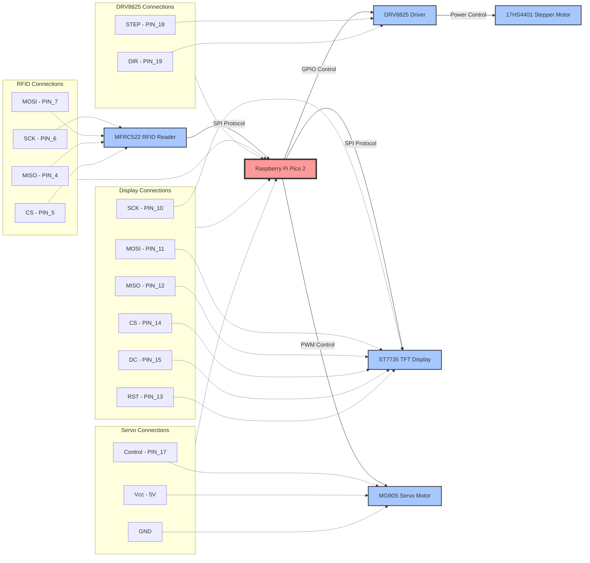
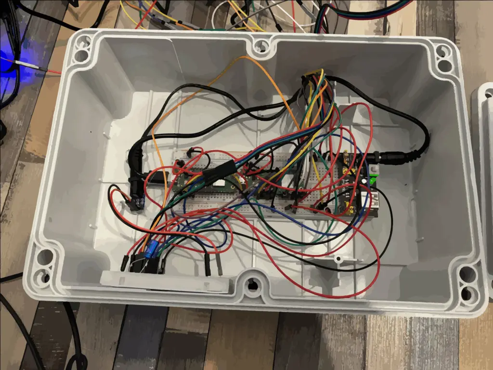
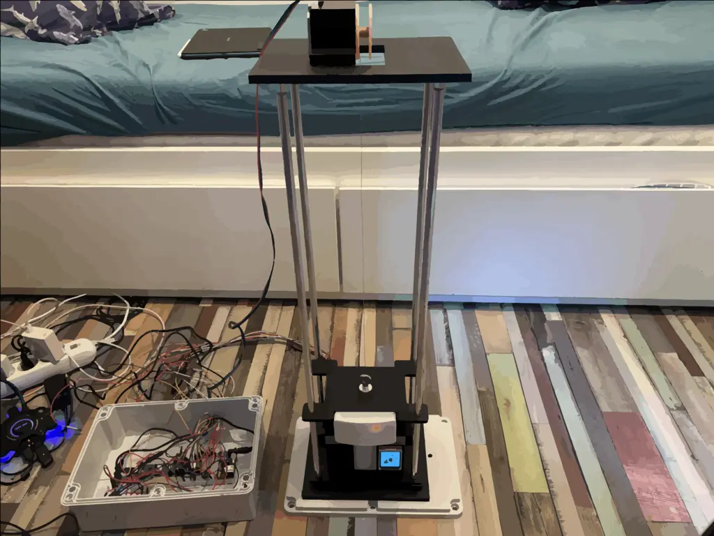

# RFID-Controlled Corporate Elevator System
A corporate elevator system that uses RFID cards for floor access control, built with Raspberry Pi Pico 2 and stepper motor technology.

:::info 

**Author**: Vicentiu-Alecsandru Duta \
**GitHub Project Link**: https://github.com/UPB-PMRust-Students/proiect-VicentiuDuta

:::

## Description

This project implements a miniature elevator system featuring access control through RFID technology. The system operates on a Raspberry Pi Pico 2 microcontroller and utilizes stepper motor control for precise vertical movement. The core functionality allows users to present specific RFID cards, which automatically direct the elevator to the associated floor. 

The system employs a NEMA 17 stepper motor (17HS4401) with a DRV8825 driver for powerful and precise movement between floors. The RFID reader, based on the MFRC522 module, communicates via SPI protocol to identify and authenticate access cards. 

For visual feedback, the system features an ST7735 color TFT display that provides real-time information about the elevator's current floor position, status, and operation mode. This visual indicator ensures users can easily monitor the elevator's location and verify their access status.

The system also includes an MG90S servo motor that controls the elevator door, automatically opening when arriving at a destination floor and closing before departure, enhancing the realism and functionality of the miniature elevator.

This design showcases practical integration of embedded systems programming in Rust with mechanical control systems to create an automated, access-controlled transportation system.

## Motivation

This project was chosen to explore the practical implementation of access control systems in automated environments. Building an RFID-controlled elevator system provides an opportunity to work with multiple interconnected technologies: digital identification systems, motor control, and embedded programming. The motivation behind this project stems from:

1. **Real-world Application**: Access control is fundamental in modern buildings, and implementing a miniature version offers insights into security systems used in corporate environments.

2. **Learning Rust in Embedded Systems**: This project provides hands-on experience with Rust programming in embedded contexts, allowing exploration of low-level hardware control while maintaining code safety.

3. **System Integration**: The project demands understanding of multiple protocols (SPI for RFID communication and display) and hardware components working in harmony, developing valuable skills in embedded systems design.

4. **User Experience Enhancement**: The implementation of an ST7735 color display adds a crucial user interface element that provides rich visual feedback. This feature improves the user experience by showing current floor position, operation status, and system messages, making the system more professional and user-friendly.

The miniature nature of the project makes it manageable for implementation while still showcasing the essential concepts of automated access control systems.

## Architecture 

    

### Component Connections:
The Authentication Module receives RFID data via SPI and outputs authorized floor commands to the Motor Controller. The Motor Controller generates step and direction signals through GPIO to drive the DRV8825 stepper driver, which in turn powers the NEMA 17 stepper motor. The microstepping feature of the DRV8825 allows for smooth and precise movement control. The Door Controller manages the servo motor using PWM signals for precise door movement. The Display Controller communicates with the ST7735 via SPI to show real-time system status. The Microcontroller orchestrates all modules, ensuring sequential operation and proper state transitions between floor movement and door operations.

## Log

<!-- write your progress here every week -->

### Week 5 - 11 May
Initial hardware setup and testing. Configured the basic circuit elements on breadboard and performed preliminary testing of the RFID reader , servo and stepper motor components. Verified that all hardware components were functioning correctly before proceeding with integration.
### Week 12 - 18 May
Completed the assembly of the main circuit and began integration testing. During initial load tests, discovered that the 28BYJ-48 stepper motor lacked sufficient torque for reliable elevator operation. Made the decision to upgrade to a NEMA 17 (17HS4401) motor with DRV8825 driver for improved power and precision. 
### Week 19 - 25 May
TODO

## Hardware

The system consists of a Raspberry Pi Pico 2 microcontroller serving as the central control unit, interfacing with several key components:

* **MFRC522 RFID Reader**: Provides contactless card authentication via SPI protocol, identifying authorized users and their floor access permissions
* **NEMA 17 Stepper Motor (17HS4401)**: Delivers torque for powerful and precise vertical movement of the elevator cabin
* **DRV8825 Driver**: Controls the stepper motor with microstepping capability, providing smooth motion and precise positioning
* **ST7735 Color TFT Display**: Offers real-time visual feedback showing elevator position, status, and operation mode
* **MG90S Servo Motor**: Controls the elevator door mechanism, automatically opening and closing at floor stops

These components are integrated through different communication protocols:
* SPI for the RFID reader and display
* GPIO with step/direction signaling for the stepper motor driver
* PWM for servo motor control

### Schematics

### Hardware Images

### Bill of Materials

| Device | Usage | Price |
|--------|--------|-------|
| [2x Raspberry Pi Pico 2W](https://www.raspberrypi.com/documentation/microcontrollers/pico-series.html) | The microcontroller | [39,66 RON x 2](https://www.optimusdigital.ro/en/raspberry-pi-boards/13327-raspberry-pi-pico-2-w.html?search_query=raspberry+pi+pico+2&results=36) |
| [MFRC522 RFID Module](https://www.nxp.com/docs/en/data-sheet/MFRC522.pdf) | RFID authentication | [9,99 RON](https://www.optimusdigital.ro/en/wireless-rfid/67-mfrc522-rfid-module.html?search_query=rfid&results=30) |
| [17HS4401 Stepper Motor](https://www.google.com/url?sa=t&source=web&rct=j&opi=89978449&url=https://www.handsontec.com/dataspecs/17HS4401S.pdf&ved=2ahUKEwi3sJLJiKuNAxX4g_0HHUyPDREQFnoECBoQAQ&usg=AOvVaw3dfePNN7ASbXSAev7nEJhS) | Elevator vertical movement control | [34 RON](https://www.optimusdigital.ro/ro/motoare-motoare-pas-cu-pas/5057-motor-pas-cu-pas-17hs4401-17-a-40-ncm.html?search_query=Motor+Pas+cu+Pas+17HS4401+%281.7+A%2C+40+N%E2%8B%85cm%29+&results=1) |
| [DRV8825](https://www.ti.com/lit/ds/symlink/drv8825.pdf) | Control the stepper motor | [14,5 RON](https://www.optimusdigital.ro/ro/drivere-de-motoare-pas-cu-pas/154-driver-pentru-motoare-pas-cu-pas-drv8825.html?search_query=drv8825&results=6) |
| [ST7735 TFT Display](https://www.displayfuture.com/Display/datasheet/controller/ST7735.pdf) | Status and floor indicator display | [32 RON](https://www.amazon.com/DIYmalls-Display-128x128-ST7735S-Mega2560/dp/B0BFDJMQM8/ref=sr_1_3?dib=eyJ2IjoiMSJ9.EeYa777KcRStkuBrCG7ZoA4Qswze1zyaz9SUJ-htHek6MLb6p7q7AEIr9PImOKK3s3f-nZ50G1BSc8lcHvlno17H2JqNwkhXqHtunI_xYhxy4cTnKMiLvJnUHGNdmF8qJ3q8ex8N89xWIOOfTLoRUpqRjtJN9mrVL-BSs02BPKQ08dedLiYgbwf58F0dcBqLPN85GdprJWB45lnnUulraeJC5_g_pCYE7-Fd560KLJc.NOxibtaIJxCokZy8lKJxEuQfFbjHEtmhivlNHRxABns&dib_tag=se&keywords=st7735&qid=1747210396&sr=8-3&th=1) |
| [MG90S Servo](https://components101.com/motors/mg90s-metal-gear-servo-motor) | Elevator door control | [19,33 RON](https://www.optimusdigital.ro/ro/motoare-servomotoare/271-servomotor-mg90s.html?search_query=mg90s&results=1) |
| 12V Power Supply | Power the stepper motor and the rest of the circuit | [24,99 RON x 2](https://www.optimusdigital.ro/ro/electronica-de-putere-alimentatoare-priza/2888-alimentator-stabilizat-12v-2000ma.html?search_query=12V+2A&results=297) |
| Consumables | Jumper wires, breadboard, pins, 3d printing, etc. | 150 RON |

## Software

| Library | Description | Usage |
|---------|-------------|-------|
| [embassy-executor](https://docs.rs/embassy-executor/latest/embassy_executor/) | Async execution framework | Task management and main entry point |
| [embassy-rp](https://docs.rs/embassy-rp/latest/embassy_rp/) | RP2040 HAL | GPIO, SPI, and PWM control |
| [embassy-time](https://docs.rs/embassy-time/latest/embassy_time/) | Time handling | Delays and timing control |
| [embassy-sync](https://docs.rs/embassy-sync/latest/embassy_sync/) | Synchronization primitives | Mutex for shared SPI |
| [embassy-embedded-hal](https://docs.rs/embassy-embedded-hal/latest/embassy_embedded_hal/) | HAL adapters | Shared bus management |
| [mfrc522](https://docs.rs/mfrc522/latest/mfrc522/) | RFID module driver | Card detection and authentication |
| [embedded-hal](https://docs.rs/embedded-hal/latest/embedded_hal/) | Hardware abstraction | Base interfacing traits |
| [embedded-hal-bus](https://docs.rs/embedded-hal-bus/latest/embedded_hal_bus/) | Bus management | SPI device abstraction |
| [mipidsi](https://docs.rs/mipidsi/latest/mipidsi/) | Display controller | ST7735 TFT display driver |
| [display-interface-spi](https://docs.rs/display-interface-spi/latest/display_interface_spi/) | Display SPI interface | Communication with ST7735 |
| [embedded-graphics](https://docs.rs/embedded-graphics/latest/embedded_graphics/) | Graphics library | Text and graphics rendering |
| [heapless](https://docs.rs/heapless/latest/heapless/) | No-allocator data structures | Fixed-capacity strings |
| [defmt](https://defmt.ferrous-systems.com/) | Debug formatting | Logging and diagnostics |
| [defmt-rtt](https://docs.rs/defmt-rtt/latest/defmt_rtt/) | RTT transport | Debug output channel |
| [panic-probe](https://docs.rs/panic-probe/latest/panic_probe/) | Panic handler | Error reporting to debug probe |
<!--## Links -->

<!-- Add a few links that inspired you and that you think you will use for your project -->

