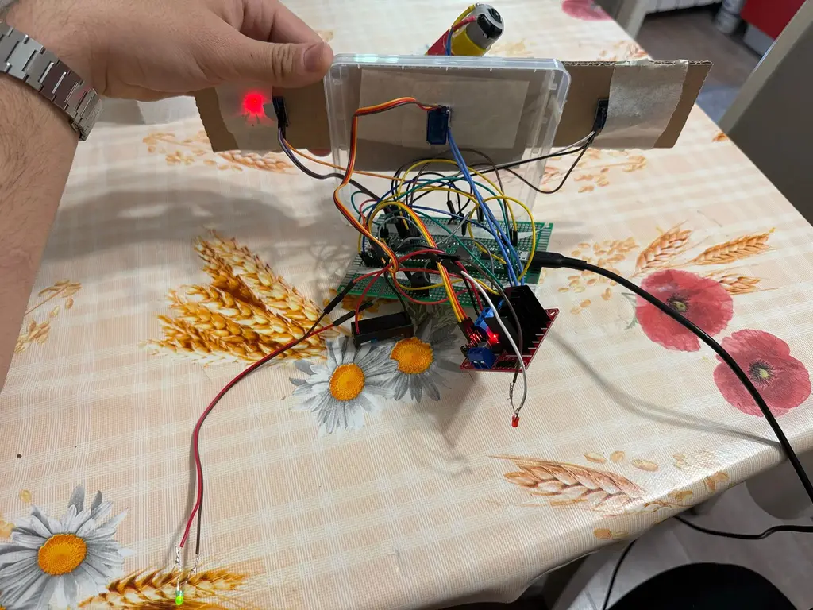

# AeroGuard 180

A smart gas-detection and evacuation system with a 180 ° pivoting fan

:::info

**Author**: Victor Sandu
**GitHub Project Link**: https://github.com/UPB-PMRust-Students/proiect-Victor270104

:::

## Description

AeroGuard 180 continuously monitors the concentration of smoke and automatically evacuates contaminated air through a blower fan that can be rotated up to 180 °. The system sends Wi‑Fi alerts and provides local visual (LED) and audible (buzzer) feedback.

- Dual MQ‑2 gas sensors detect smoke, LPG, and CO in real‑time.

- An SG90 micro‑servo sweeps a 3 – 6 V DC blower fan up to 180 °, directing the airflow toward the gas source.

- Raspberry Pi Pico 2 W runs async Rust firmware, processes sensor data, and publishes MQTT/HTTP alerts.

- Status LEDs (green = safe, red = alert) and a passive buzzer offer immediate on‑site feedback.

## Motivation

**This project**  lets me dive deeper into embedded development with Rust while addressing a real‑world safety issue: preventing smoke or fires in homes and small labs by automating ventilation and issuing rapid notifications.

## Architecture

MQ‑2 gas sensors – supply analog voltage proportional to smoke/gas concentration. The Pico’s ADC samples these signals continuously for threshold analysis.

SG90 micro‑servo – receives PWM commands from the Pico and rotates the blower fan up to 180 °, so contaminated air is pushed away from the danger zone.

L298N dual H‑bridge – drives the 3 – 6 V DC blower fan under Pico control (start/stop and optional speed modulation).

Status LEDs & passive buzzer – connected to GPIO pins; green LED indicates safe air, red LED and buzzer indicate dangerous concentrations and trigger ventilation.

**LED indicators**:

- **Green LED**: Air concentration is safe.
- **Red LED**: Air concentration is dangerous.

Power source – a single USB‑C cable from the laptop delivers 5 V. The Pico distributes logic power, while the L298N shares the same 5 V rail for the fan. No external batteries are required.

---

## **Log**

### **Week 5 - 11 May**
Completed the hardware wiring on a breadboard, connecting the Raspberry Pi Pico 2W with the MQ-2 gas sensor, L298N motor driver, DC motor, passive buzzer, SG90 servo, and status LEDs. Each component was individually tested to ensure functionality and correct pin connections.

### **Week 12 - 18 May**
Transferred all components from the breadboard to a prototyping PCB. Soldered the connections and tested circuit continuity to avoid shorts or loose connections. Power delivery was stabilized, and the system was verified to operate correctly on the permanent board.

### **Week 19 - 25 May**
Developed the software using Rust and the Embassy framework. Implemented the gas detection logic, motor control via L298N, servo positioning, and buzzer signaling. Successfully integrated hardware and software components, achieving full system functionality.

---

## Hardware

1. **Raspberry Pi Pico 2 W**:
   - **Purpose**: Central control unit.
   - **Function**: Runs Rust code to control sensors, fan, and LEDs.

2. **MQ‑2 Gas Sensor Module**:
   - **Purpose**: Detect flammable gases, CO, and smoke.
   - **Function**: Provide analog voltage proportional to gas concentration—read by the Pico ADC to trigger ventilation and alarms.

3. **Micro‑servo SG90 180 °**:
   - **Purpose**:  Mechanically orient the blower fan.
   - **Function**: Receives PWM from the Pico to sweep up to 180 °, directing the airflow toward the contamination source.

4. **DC Blower Fan 3 V – 6 V**:
   - **Purpose**: Evacuate contaminated air from the monitored space.
   - **Function**: Powered through an H‑bridge; speed and on/off state controlled by the Pico.

5. **L298N Dual H‑Bridge Driver**:
   - **Purpose**: Safely switch and drive the DC blower motor (with one spare channel for future actuators).
   - **Function**: Translates Pico logic‑level signals into motor currents up to 2 A.

6. **LEDs (Red, Green)**:
   - **Purpose**: Visual indicator.
   - **Function**: Green = safe, Red = alert; driven by Pico GPIO lines via current‑limiting resistors.

7. **Passive Buzzer 3 V - 3.3 V**:
   - **Purpose**: Audible warning when gas thresholds are exceeded.
   - **Function**: Generates a tone when toggled by a Pico GPIO pin.

---

### Hardware Overview

- The **Pico 2 W** reads air concentration.
- Based on air conditions, it controls the **ventilator** and the **motors**.
- LEDs give real-time feedback on air concentration.

---

### Schematics

---

## Bill of Materials

| Device | Usage | Price |
|--------|-------|-------|
| [Raspberry Pi Pico 2W](https://www.optimusdigital.ro/ro/placi-raspberry-pi/13327-raspberry-pi-pico-2-w.html?search_query=Raspberry+Pi+Pico+2W&results=26) | Main microcontroller | ~40 RON |
| [Senzor Module Gas MQ-2](https://www.optimusdigital.ro/ro/senzori-de-gaze/107-modul-senzor-gas-mq-2.html?search_query=Senzor+gaz&results=34) | Air concentration sensing | ~11 RON |
| [Micro Servomotor SG90 180°](https://www.optimusdigital.ro/ro/motoare-servomotoare/2261-micro-servo-motor-sg90-180.html?search_query=SG90&results=11) | Pivot for fan | ~12 RON |
| [Driver module Dual L298N](https://www.optimusdigital.ro/ro/drivere-de-motoare-cu-perii/145-driver-de-motoare-dual-l298n.html?search_query=L298N&results=4) | Driver for motor | ~11 RON |
| [Motor DC 3V-6V](https://ardushop.ro/ro/electronica/752-motor-dc-3v-6v-cu-reductor-1-48-6427854009609.html?gad_campaignid=22058879462) | Motor | ~11 RON |
| [3V Passive Buzzer](https://www.optimusdigital.ro/ro/audio-buzzere/12247-buzzer-pasiv-de-33v-sau-3v.html?search_query=Buzzer+Pasiv+de+3.3V+sau+3V&results=1) | Buzzer | ~1 RON |
| [LED Verde 3mm Difuz](https://www.optimusdigital.ro/ro/optoelectronice-led-uri/697-led-verde-de-3-mm-cu-lentile-difuze.html?search_query=0104210000006209&results=1) | Status indicator (safe) | ~0.50 RON |
| [LED Roșu 3mm Difuz](https://www.optimusdigital.ro/ro/optoelectronice-led-uri/697-led-verde-de-3-mm-cu-lentile-difuze.html?search_query=0104210000006209&results=1) | Status indicator (alert) | ~0.50 RON |

---

## Software

| Library                                                                      | Description                        | Usage                                   |
| ---------------------------------------------------------------------------- | ---------------------------------- | --------------------------------------- |
| [embassy-rp](https://github.com/embassy-rs/embassy/tree/main/embassy-rp)     | Suport async pentru RP2040         | GPIO, PWM, ADC, inițializare periferice |
| [embedded-hal](https://crates.io/crates/embedded-hal)                        | Abstracție hardware standard       | GPIO, PWM, ADC, SPI/I2C                 |
| [embassy-time](https://github.com/embassy-rs/embassy/tree/main/embassy-time) | Timeri asincron și delay-uri       | `Timer::after` pentru întârzieri        |
| [fixed](https://docs.rs/fixed/latest/fixed/)                                 | Numere fixe cu virgulă mobilă      | Configurare divizor PWM (frecvență)     |
| [defmt](https://github.com/knurling-rs/defmt)                                | Logging eficient embedded          | Mesaje `info!` pentru debugging         |
| [panic-probe](https://crates.io/crates/panic-probe)                          | Gestionare panică embedded         | Debug prin probe-run RTT                |
| [cortex-m-rt](https://crates.io/crates/cortex-m-rt)                          | Suport runtime pentru ARM Cortex-M | Start-up și vectori de întrerupere      |

---

## Links

1. [Rust Embedded Book](https://docs.rust-embedded.org/book/) – Ghid complet pentru dezvoltare embedded în Rust.
2. [Embassy Rust Project](https://github.com/embassy-rs/embassy) – Framework async pentru microcontrolere în Rust.
3. [Raspberry Pi Pico SDK Documentation](https://datasheets.raspberrypi.com/pico/raspberry-pi-pico-c-sdk.pdf) – Documentație oficială C SDK pentru RP2040.
4. [RP2040 Datasheet](https://datasheets.raspberrypi.com/rp2040/rp2040-datasheet.pdf) – Specificații hardware detaliate pentru RP2040.
5. [embedded-hal crate](https://docs.rs/embedded-hal/latest/embedded_hal/) – Interfață standard pentru periferice embedded (GPIO, ADC, PWM etc).
6. [defmt (embedded logging)](https://github.com/knurling-rs/defmt) – Sistem de logare eficient pentru debugging embedded.
7. [fixed crate](https://docs.rs/fixed/latest/fixed/) – Tipuri de date cu virgulă fixă folosite pentru divizoare PWM.
8. [probe-rs](https://probe.rs/) - Toolchain pentru debugging, flashing și RTT log în Rust embedded.
9. [embassy-examples](https://github.com/embassy-rs/embassy/tree/main/examples/rp) – Exemple oficiale Embassy pentru RP2040.
