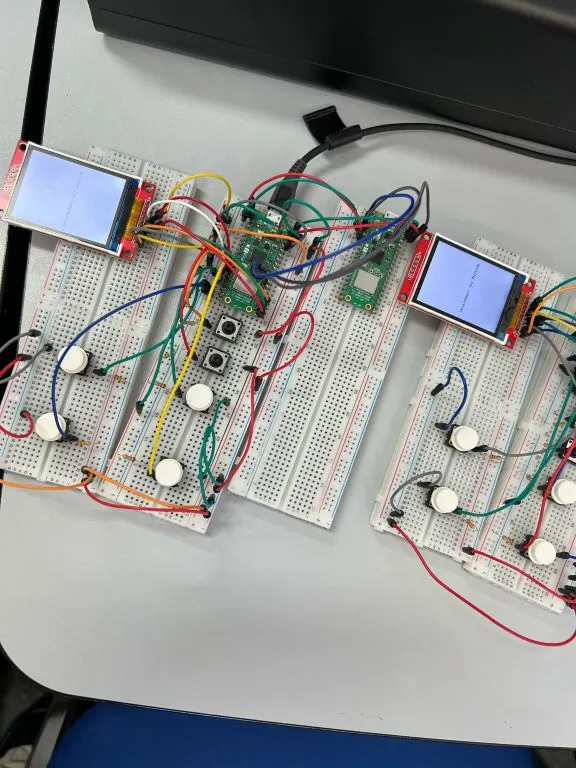
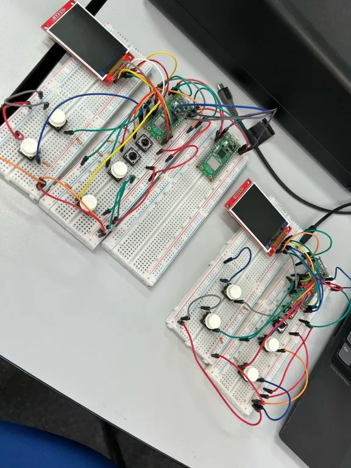
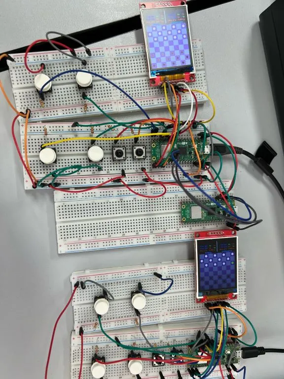
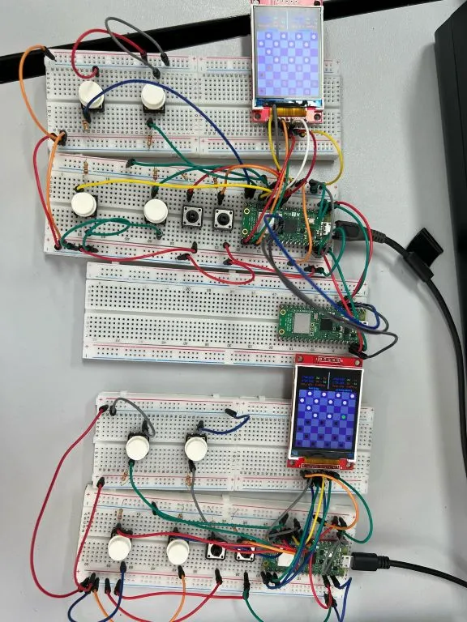
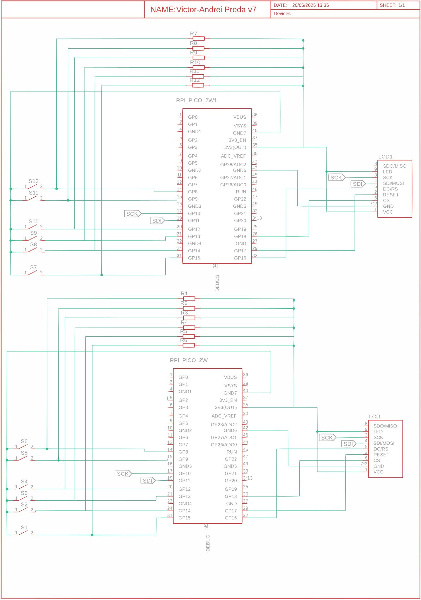

# Pico-checkers
A game in rust that resembles the classic Checkers Game.

:::info 

**Author**: Preda Victor-Andrei \
**GitHub Project Link**: [link_to_github](https://github.com/UPB-PMRust-Students/proiect-victorandrei03)

:::

##  Project Description  
This project resembles the traditional game of checkers, implemented as an online multiplayer experience. Players can move their pieces freely in all four diagonal directions (up-right, up-left, down-right, down-left) from the very first turn, adding strategic depth to every match.
- **6-button control system** per player:  
  - 4 directional buttons for movement  
  - 2 selection buttons to highlight valid pieces  
- **Dedicated LCD displays** showing the real-time game board  
- **Online multiplayer** support for competitive play 

## Motivation
As a fan of old-school strategy games, I’ve always loved the elegance of checkers—its simple rules hiding deep tactical possibilities. This project merges nostalgic gameplay with modern technology, which motivated my development approach.

## Architecture

1. **Raspberry Pi Pico 2W** (x2)  
   - Interconnected  with all components 

2. **Buttons** (x6 per player)  
   - Connected to each Pico, acting as input (move piece/selection) 

3. **2.2" 240x320 px SPI LCD** (x1 per player)  
   - Connected through embedded-graphics at the microcontroller

4. **Wi-Fi**
   - Microcontrollers communicate with each other through it
   - Player 0 acts as the server; Player 1 acts as a client

5. **Embedded-Graphics**
   - Library that a microcontroller is using in order to display the game
   - Connects the microcontroller with the LCD

## Log

### Week 5 - 11 May
1. **Upload first state of documentation**
2. **Bought all components**

### Week 12 - 18 May
1. **I refer to the components' datasheets to understand how they should be connected and what voltage levels they require. Additionally, after conducting some research online, I find how certain components should be properly connected.**
2. **Hardware part done for both client and server**
3. **Add images in documentation**
4. **Update documentation**
5. **I draw the game board and pieces, and implement the button logic using asynchronous execution (with select statements) to handle piece selection and movement.**
6. **I develop the Wi-Fi functionality by configuring one Pico to act as an access point. Then, using my laptop connected to the same local network, I transmit packets to verify that the moves are being correctly executed.**

### Week 19 - 25 May
1. **I implement the client-side logic and update the packet structure to include two types: one for moves, one for game state. The game state packet is sent by the server to the client to provide the allocated play time and the winner’s total number of moves. It is also sent by the client to the server to indicate that the client has lost the game.**
2. **I build the leaderboard and history tables in flash memory. Using four data blocks (defined by a Data struct), I write to flash at the end of each game in the same reserved location — the last 64 KB of flash memory. At the beginning of a game, I read from the predefined block offsets to load the saved data.**
3. **Finished Software part**
4. **Update documentation**
5. **Finished whole project**

### Week 12 - 18 May
1. **Done making the hardware**
2. **Add images in documentation**
3. **Update documentation**

## Hardware

1. **Raspberry Pi Pico 2W** (x2)  
   - Acts as the main controller for each player's unit  
   - Connects all components and handles Wi-Fi communication  

2. **Buttons** (x6 per player)  
   - Connected to GPIO pins:  
     - GP8   
     - GP9 
     - GP12  
     - GP13  
     - GP14  
     - GP15
    - Used as input for selection/move piece 

3. **2.2" 240x320 px SPI LCD** (x1 per player)  
   - Connections:  
     - VCC → 3.3V  
     - GND → GND  
     - CS → GP18  
     - RESET → GP17  
     - DC/RS → GP16  
     - SDI/MOSI → GP11  
     - SCK → GP10  
     - LED → 3.3V  
     - SDO/MISO → N/C
   - Display table and pieces for each player 

4. **Resistors** (22kΩ, x6 per player)  
   - Connected between buttons and GPIO pins to ensure clean digital input signals

### Schematics

### Bill of materials

| Product                          | Quantity | Unit Price |
|----------------------------------|----------|------------|
| [Raspberry Pi Pico 2W](https://www.raspberrypi.com/documentation/microcontrollers/pico-series.html)              | 2        | [39.66 RON](https://www.optimusdigital.ro/en/raspberry-pi-boards/13327-raspberry-pi-pico-2-w.html?search_query=Raspberry+Pi+Pico+2W&results=36)  |
| [LCD SPI 2.2" 240x320px](http://www.lcdwiki.com/2.2inch_SPI_Module_ILI9341_SKU:MSP2202)           | 2        | [59.99 RON](https://www.optimusdigital.ro/en/lcds/1260-lcd-spi-22-240x320-px.html?search_query=LCD+SPI+2.2%27%27+240x320+px&results=8)  |
| 40-pin Header (2.54mm)           | 2        | [0.99 RON](https://www.optimusdigital.ro/en/pin-headers/464-colored-40p-254-mm-pitch-male-pin-header-red.html)   |
| Breadboard Jumper Wire Set        | 1        | [7.99 RON](https://www.optimusdigital.ro/en/wires-with-connectors/12-breadboard-jumper-wire-set.html?search_query=0104210000001532&results=1)   |
| Large Breadboard (830 points)     | 4        | 9.98 RON   |
| Large Breadboard (830 points)     | 2        | 9.98 RON   |
| Male-to-Female Jumper Wires (40p) | 1        | [7.99 RON](https://www.optimusdigital.ro/en/wires-with-connectors/92-female-male-wire40p-20-cm.html?search_query=0104210000001792&results=1)   |
| Round Tactile Buttons             | 12       | [1.99 RON](https://www.optimusdigital.ro/en/buttons-and-switches/1115-white-button-with-round-cover.html?search_query=0104210000009590&results=1)   |
| Resistors 22kΩ            | 12       | [0.1 RON](https://www.optimusdigital.ro/en/resistors/848-025w-22k-resistor.html?search_query=Resistor+22k&results=7)   |

## Software

| Library                                                                                      | Usage                                     | Usage in Project                                         |
|----------------------------------------------------------------------------------------------|-------------------------------------------|----------------------------------------------------------|
| [**embedded-graphics**](https://github.com/embedded-graphics/embedded-graphics)             | 2D drawing framework                      | Renders checkers board, pieces, and UI on LCD displays   |
| [**display-interface-spi**](https://github.com/almindor/display-interface)             | SPI display abstraction                      | Connects the embedded-graphics to SPI-based displays   |
| [**embassy**](https://github.com/embassy-rs/embassy)                                        | Async embedded runtime                    | Drives async tasks and hardware interaction (e.g., Wi-Fi)|
| [**embassy-rp**](https://github.com/embassy-rs/embassy)                                            | HAL for Raspberry Pi Pico (RP2040)        | Manages GPIO buttons and SPI LCD control       |
| [**rp2040-hal**](https://github.com/rp-rs/rp-hal)                                            | Raspberry Pi Pico hardware support        | Manages GPIO buttons and SPI LCD control       |
| [**embassy**](https://github.com/embassy-rs/embassy)                                        | Async embedded runtime                    | Drives async tasks and hardware interaction (e.g., Wi-Fi)|
| [**cyw43**](https://github.com/embassy-rs/embassy/tree/main/embassy-net-driver/src/cyw43)   | Wi-Fi driver for Pico W (CYW43 chipset)   | Enables wireless multiplayer over Wi-Fi                  |
| [**embedded-hal**](https://github.com/rust-embedded/embedded-hal)                           | Hardware abstraction layer                | Standardizes hardware interactions                       |
| [**embedded-time**](https://github.com/FluenTech/embedded-time)                             | Timing utilities                          | Controls game loop and move timing                       |
| [**defmt**](https://github.com/knurling-rs/defmt)                                            | Deferred logging                          | Logging for the plotter during testing                   |
| [**heapless**](https://github.com/japaric/heapless)                                         | Statically allocated containers           | Allocates fixed-size data structures        |
| [**mipidsi**](https://github.com/almindor/mipidsi)                                           | Display driver for ILI9341                 | Used for display          |
| [**embassy-net**](https://github.com/embassy-rs/embassy/tree/main/embassy-net)              | Embedded TCP/IP networking stack          | Used alongside `cyw43` to handle Wi-Fi communication     |
| [**core**](https://doc.rust-lang.org/core/)              | Rust core library for no_std environments          | Provides string formatting utilities (e.g., core::fmt) for logging and display     |

## Links

1. [Checkers](https://sites.harding.edu/dsteil/440/documents/giveaway%20checkers%20rules.htm)
2. [LCD connection](https://www.youtube.com/watch?v=RtQqXMeYpqI&t=90s&ab_channel=educ8s.tv)
3. [Buttons](https://www.youtube.com/shorts/0zvgtS90LEk)
4. [Lab02](https://pmrust.pages.upb.ro/docs/acs_cc/lab/02)
5. [Lab04](https://pmrust.pages.upb.ro/docs/acs_cc/lab/04)
6. [Lab05](https://pmrust.pages.upb.ro/docs/acs_cc/lab/05)
7. [Lab07](https://pmrust.pages.upb.ro/docs/acs_cc/lab/07)
8. [Flash](https://docs.rs/embassy-rp/latest/embassy_rp/flash/struct.Flash.html)
