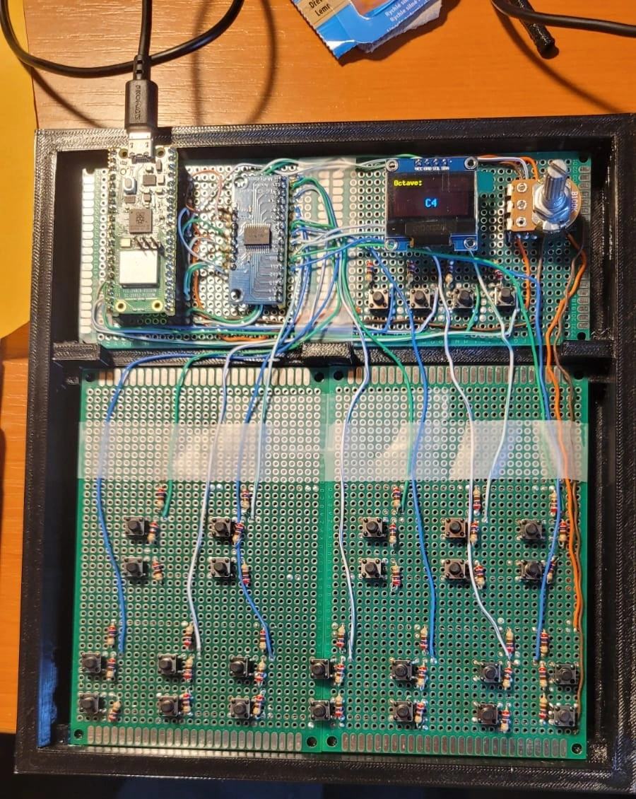
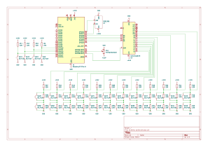

# MIDI Controller
DIY USB MIDI Controller

:::info

**Author**: Gheorghita Vlad-Gabriel \
**GitHub Project Link**: [link](https://github.com/UPB-PMRust-Students/proiect-GheorghitaVlad-G)

:::

## Description

A custom USB MIDI controller built using a Raspberry Pi Pico 2W and tactile switches to detect and transmit MIDI signals (Note On/Off + Velocity) to a DAW using the USB MIDI protocol.

## Motivation

As someone passionate about composing music and making beats, I've always been curious about how physical MIDI instruments work under the hood. Instead of buying an off-the-shelf MIDI controller, I decided to build one myself to combine my love for music with my skills in electronics and programming. This project allows me to deepen my understanding of how musical interfaces communicate with digital audio workstations and explore creative, cost-effective solutions for real-world problems.

## Architecture 

## Log

### Week 5 - 11 May
- Studied all the components to make them work
- Done draft documentation
- First order of hardware
- Done key logic and hardware prototype on breadboard
- Made measurements for 3D printed case, caps and keys

### Week 12 - 18 May
- Finished hardware:
    - Soldered wires and components on Final PCB
    - Connected components on pre-planned pins (check schematic)
    - Done final schematic
    - 3D printed main case
- Start implementing software:
    - Done logic for multiplexing of keys
    - Done logic for filter knob (potentiometer)
    - Done logic for display
    - Done MIDI communication between device and controller

### Week 19 - 25 May
- TBD

## Hardware

The DIY MIDI controller is built around the Raspberry Pi Pico 2W.

Each of the 12 keys uses 2 tactile switches (one per elevation), totaling 24 inputs. To reduce GPIO usage, I used a 16-channel analog multiplexer (12 channels used). Switches connect to the multiplexer inputs; its selector pins go to the Pico’s GPIOs, and the SIG pin connects to an ADC.

Each switch uses a voltage divider to produce distinct ADC levels for button states:
- more than 2650: no press (send Note OFF)
- between 2000–2500: one pressed (start timer)
- less than 1000: both pressed (stop timer, compute velocity, send Note ON)

The controller also includes a potentiometer for filter control and a button to control octave switching and filter selection through a carousel-like menu. This menu is displayed on an integrated screen, allowing users to navigate settings with short and long presses.

### Schematics

### Bill of Materials

| Device | Usage | Price |
|--------|-------|-------|
| [Raspberry Pi Pico 2W](https://www.raspberrypi.com/documentation/microcontrollers/raspberry-pi-pico.html) | Main and debug microcontroller | [79.32 RON](https://www.optimusdigital.ro/en/raspberry-pi-boards/12394-raspberry-pi-pico-w.html) |
| Breadboard Kit HQ 830p | Prototyping and testing | [22.00 RON](https://www.optimusdigital.ro) |
| [6 x 6 x 6 Push Button](https://www.optimusdigital.ro/ro/butoane-tactile/1708-butone-tactile.html) | Dual-switch per key for velocity detection | [10.80 RON](https://www.optimusdigital.ro/ro/butoane-tactile/1708-butone-tactile.html) |
| [CD74HC4067 16 Channel Analog Multiplexer](https://www.optimusdigital.ro/en/power-multiplexers/1378-modul-multiplexor-analogic-cu-16-canale-cd74hc4067.html?search_query=CD74HC4067&results=1) | Multiplexing of keys | [5.77 RON](https://www.optimusdigital.ro/en/power-multiplexers/1378-modul-multiplexor-analogic-cu-16-canale-cd74hc4067.html?search_query=CD74HC4067&results=1) |
| [100k Mono Potentiometer](https://www.optimusdigital.ro/ro/potentiometre/10862-potentiometru-mono-100k.html) | Optional control knob for filter adjustments | [1.49 RON](https://www.optimusdigital.ro/ro/potentiometre/10862-potentiometru-mono-100k.html) |
| [Universal PCB Prototype Board 8x12cm](https://www.optimusdigital.ro/ro/placi-prototip/84118-placa-prototip-universala-8x12cm.html) | Soldering base for final PCB | [7.98 RON](https://www.optimusdigital.ro/ro/placi-prototip/84118-placa-prototip-universala-8x12cm.html) |
| [Universal PCB Prototype Board 6x8cm](https://www.optimusdigital.ro/en/others/12538-6x8cm-universal-pcb-prototype-board-single-sided-254mm-hole-pitch.html?search_query=6x8cm+Universal+PCB+Prototype+Board+Single-Sided+2.54mm+Hole+Pitch&results=1) | Soldering base for final PCB | [4.98 RON](https://www.optimusdigital.ro/en/others/12538-6x8cm-universal-pcb-prototype-board-single-sided-254mm-hole-pitch.html?search_query=6x8cm+Universal+PCB+Prototype+Board+Single-Sided+2.54mm+Hole+Pitch&results=1) |
| [Colored 40p 2.54 mm Pitch Male Pin Header](https://www.optimusdigital.ro/ro/headeri/2966-header-barbati-40p.html) | Wiring headers for connections | [2.97 RON](https://www.optimusdigital.ro/ro/headeri/2966-header-barbati-40p.html) |
| [20p Female Pin Header 2.54 mm](https://www.optimusdigital.ro/ro/headeri/35094-header-femei-20p.html) | Wiring headers for connections | [12.27 RON](https://www.optimusdigital.ro/ro/headeri/35094-header-femei-20p.html) |
| [4p Female Pin Header 2.54 mm](https://www.optimusdigital.ro/ro/headeri/35018-header-femei-4p.html) | Wiring headers for connections | [0.98 RON](https://www.optimusdigital.ro/ro/headeri/35018-header-femei-4p.html) |
| [SSD1306 0.96" OLED DISPLAY](https://www.emag.ro/ecran-oled-0-96-ai409-s322-323-324/pd/D69S02MBM/?utm_campaign=share%20product&utm_medium=ios&utm_source=mobile%20app) | For showing filter and octave menu | [27.37](https://www.emag.ro/ecran-oled-0-96-ai409-s322-323-324/pd/D69S02MBM/?utm_campaign=share%20product&utm_medium=ios&utm_source=mobile%20app) |
| 3D Printer materials | Case and keys | TBD |
| Total | - | 175.93 RON + materials |

## Software

| Library                                                  | Description                                      | Usage                                                                                |
| -------------------------------------------------------- | ------------------------------------------------ | ------------------------------------------------------------------------------------ |
| [embassy-rp](https://embassy.dev/)                       | Rust + async embedded                            | Framework for embedded applications using async features on the Raspberry Pi Pico 2W |
| [ssd1306](https://crates.io/crates/lcd1602-rs)        | Driver for SSD1306 display             | Display menu for filter and octave selection                                         |
| [embedded-graphics](https://docs.rs/embedded-graphics/latest/embedded_graphics/)          | 2D graphics library                 | Drawing primitives and text rendering for embedded displays                       |
| [static-cell](https://crates.io/crates/static_cell)            | Allows defining static, lazily initialized values safely | Store USB Config information |
| [embassy-usb](https://docs.rs/embassy-usb/latest/embassy_usb/)                  | USB device stack for async embedded Rust | Configure USB connection to device |
| [defmt](https://docs.rs/defmt/latest/defmt/) | Logging framework for embedded development (formatted debug output)| Debugging Software and Hardware |

## Links

1. [USB MIDI Specification](https://www.usb.org/sites/default/files/midi10.pdf)
2. [embassy-rp: Rust + async for embedded](https://embassy.dev/)
3. [ssd1306](https://docs.rs/ssd1306/latest/ssd1306/) 
4. [ADC lab](https://pmrust.pages.upb.ro/docs/acs_cc/lab/03)
5. [Async lab](https://pmrust.pages.upb.ro/docs/acs_cc/lab/04)
6. [I2C lab](https://pmrust.pages.upb.ro/docs/acs_cc/lab/06)
7. [embassy-usb](https://docs.rs/embassy-usb/0.4.0/embassy_usb/)
8. [MIDI Protocol Reference](https://www.midi.org/specifications-old/item/table-1-summary-of-midi-message)
9. [RP2040 Datasheet](https://datasheets.raspberrypi.com/rp2040/rp2040-datasheet.pdf/)
10. [Example project 1](https://www.youtube.com/watch?v=wY1SRehZ9hM)
11. [Example project 2](https://www.youtube.com/watch?v=tmxgmR8Rzr4)