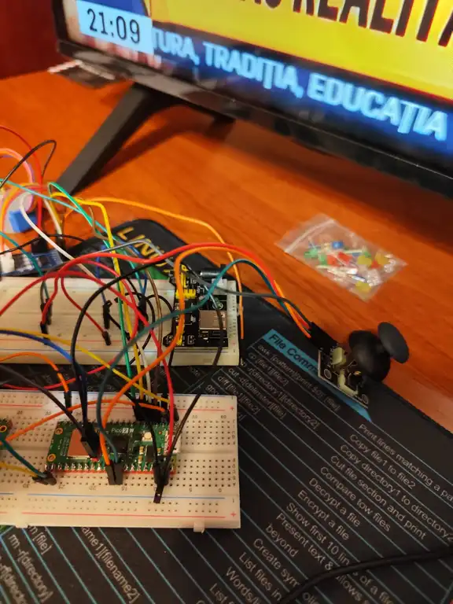
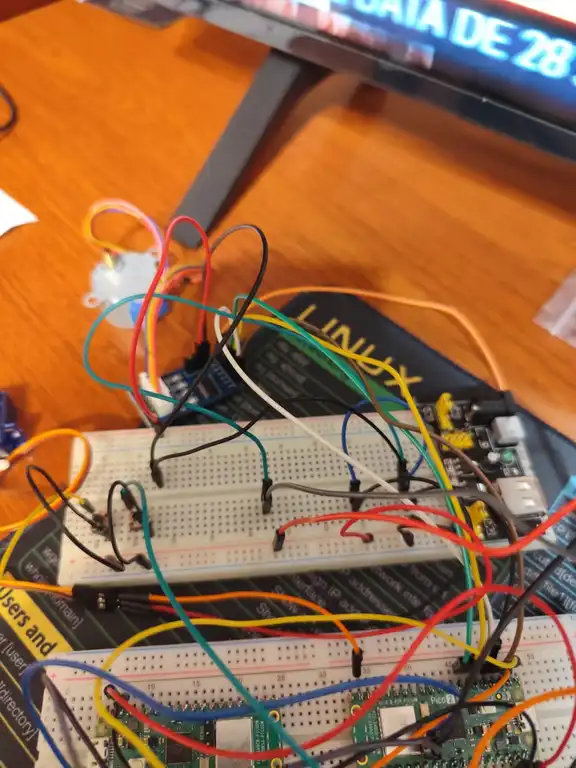
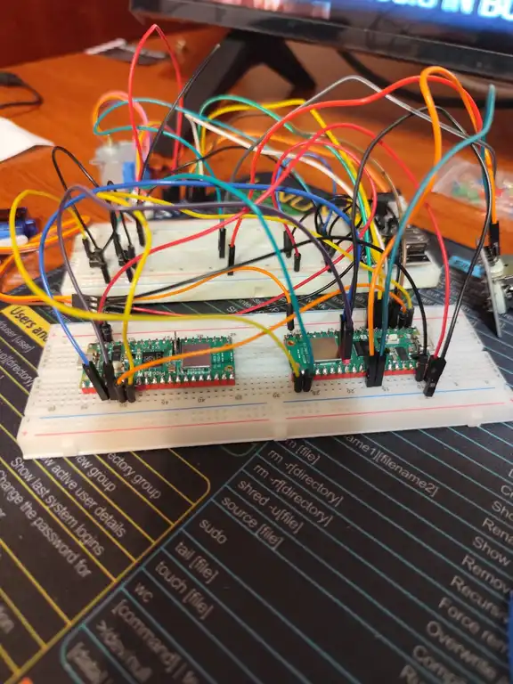
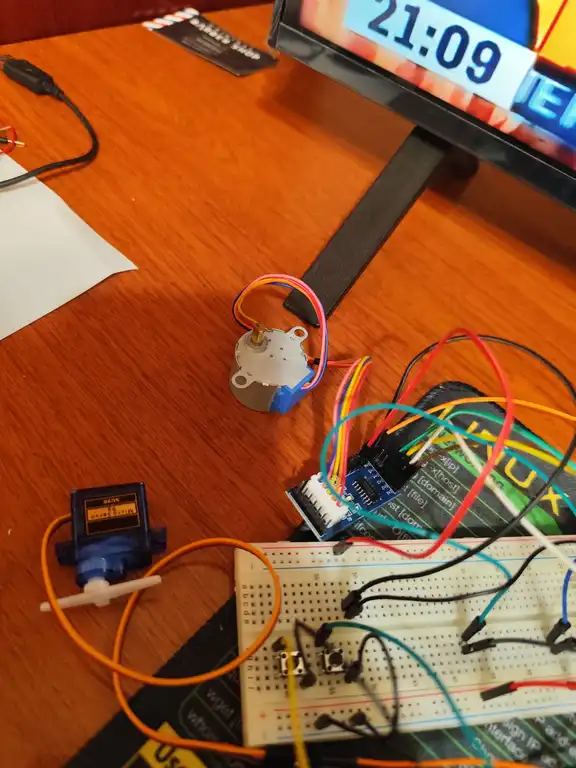
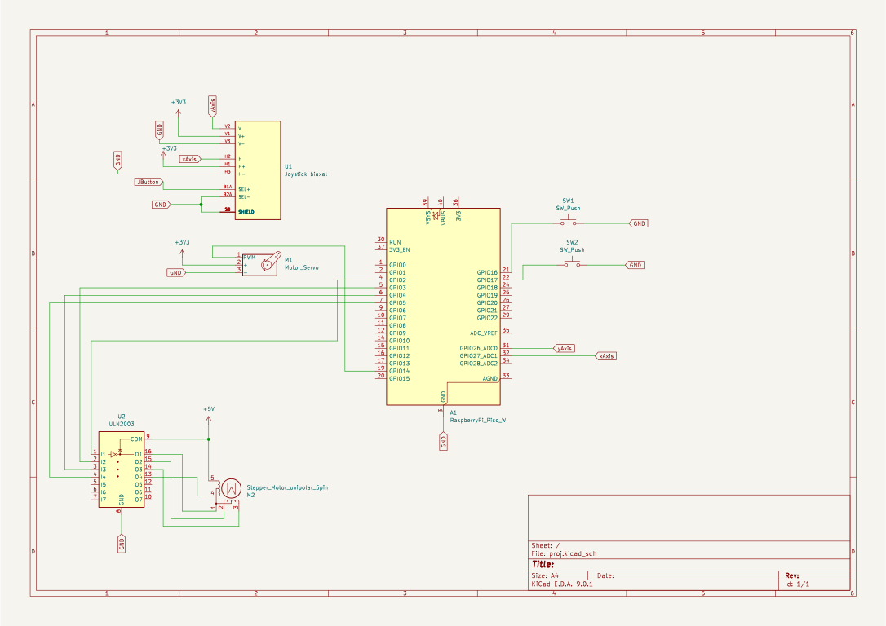

# Crane Controller

Mini crane system using Raspberry Pi Pico 2W.
:::info

**Author**: Stanciu Vlad-Mihai \
**GitHub Project Link**: https://github.com/UPB-PMRust-Students/proiect-StanciuVlad1

:::

---

## Description

The project consists of a **mini crane** built using a **Raspberry Pi Pico 2W**, capable of:

- Rotating the crane arm **left and right** using a **servo motor (SG90)** controlled by a **joystick**.
- Raising and lowering the load using a **stepper motor (28BYJ-48 + ULN2003 driver)**.
- Managing multiple motors **asynchronously** using **Rust** and **Embassy**.
- Controlling the **servo motor** via a **biaxial joystick** for precise horizontal and vertical movements.
- Being powered independently by **external 9V batteries** to avoid overloading the controller.

This setup simulates the mechanical behavior of a real crane, combining both rotation and lifting functionalities.

---

## Motivation

I wanted to build a mechanical system that combines precise motion control and hardware interaction through an embedded controller.  
The project allows practice with PWM signals, motor driving, and simple automation using Rust on the Raspberry Pi Pico.

---

## Architecture

The **Raspberry Pi Pico 2W** acts as the brain of the system:

- **Joystick**: Sends analog signals to control the **SG90 servo motor**, rotating the crane arm horizontally (left/right).
- **SG90 Servo Motor**: Moves the crane arm based on joystick input, using PWM on GPIO 14.
- **28BYJ-48 Stepper Motor + ULN2003 Driver**: Raises or lowers the load using a wound cable or string.
- **Push Buttons (GPIO 16 & 17)**: Used to command the stepper motor to rotate clockwise or counter-clockwise.
- **Stabilized 12V Power Supply**: Provides external power to the motors, protecting the Pico from overload.
- **Header Pins and Breadboard**: Simplify prototyping and electrical connections.
- **Common Ground**: Ensures reliable signal references across all components.

Data flow:

- The joystick's **VRx** and **VRy** outputs are read via GPIO 27 and GPIO 26.
- Movement of the joystick determines whether the servo should rotate left or right.
- PWM is used to set the servo's position accordingly.
- Pressing either of the two buttons controls the direction of the stepper motor rotation via the ULN2003 driver board.

---

### Block Scheme

## Log

### Week 5 – 11 May

Wired all components to the Raspberry Pi Pico and wrote individual mock-up test code for each component to verify functionality (joystick, servo motor, stepper motor with driver, and push buttons).

### Week 12 – 18 May

Integrated the joystick with the servo motor through custom control code, allowing directional rotation of the crane arm. Also started basic physical construction of the crane using cardboard to create a preliminary structure.

### Week 19 – 25 May

TO DO

## Components

| Component                                   | Purpose              | Details                                                       |
| ------------------------------------------- | -------------------- | ------------------------------------------------------------- |
| **Raspberry Pi Pico 2W**                    | Main controller      | Runs firmware and manages motor control logic                 |
| **Joystick XY Module**                      | Input device         | Sends analog signals to control servo direction (GPIO 27 & GPIO 26)               |
| **Micro Servomotor SG90**                   | Arm rotation         | Rotates the crane arm left/right via PWM (GPIO 14)            |
| **28BYJ-48 Stepper Motor + ULN2003 Driver** | Load lifting         | Raises or lowers the crane's load with button input           |
| **Push Buttons (×2)**                       | Stepper control      | One button per rotation direction (GPIO 16 and 17)            |
| **12V Stabilized Power Adapter**            | External motor power | Provides stable supply to servo and stepper motors            |
| **Header Pins (2x40p)**                     | Wiring               | Enables clean prototyping and secure connections              |

---

## Hardware Overview

- The **joystick** is powered by an **external 5V source** and shares a **common ground** with the rest of the components.
- Its analog outputs, **VRx** and **VRy**, are connected to **GPIO 27** and **GPIO 26** on the **Raspberry Pi Pico**.
- The direction in which the joystick is moved is determined by reading these analog values.
- Based on the joystick input, the **Pico** adjusts the position of the **SG90 servo motor** via **PWM output on GPIO 14**.
- The **stepper motor** receives its control signals from the Pico through a **ULN2003 driver board**.
- Its rotation direction is selected using **two push buttons**, connected to **GPIO 16** and **GPIO 17**, both tied to a **common ground**.
- All motors (servo and stepper) are powered by an **external 5V supply** to ensure stability and avoid overloading the Pico.
- A **shared ground connection** is used across all components to maintain proper signal reference.
- **Breadboards** and **male header pins** facilitate organized prototyping and signal routing.

### Photos

  
  
  

---

## Schematics

## Bill of Materials

| Product Code     | Device                                                                                                                                                     | Usage                                 | Price                   |
| ---------------- | ---------------------------------------------------------------------------------------------------------------------------------------------------------- | ------------------------------------- | ----------------------- |
| 5056561803975    | [Raspberry Pi Pico 2W](https://www.optimusdigital.ro/ro/raspberry-pi-placi/13327-raspberry-pi-pico-2w.html)                                                | Main controller                       | 39,66 lei               |
| -                | [Joystick XY Module](https://www.ardumarket.ro/ro/product/modul-arduino-xy-joystick?gad_source=1&gad_campaignid=22143406947&gbraid=0AAAAA-sic2TXGO4ckq7TMNGct-V4kJetp&gclid=Cj0KCQjwiqbBBhCAARIsAJSfZkbmcdvbndtY8V4cN8bssjhwYeATPo96KHRt2tGn088sG_zf64IX6i4aAuGgEALw_wcB) | Joystick directional control          | 8,00 lei (aprox.)       |
| -                | [Micro Servomotor SG90 180°](https://www.ardumarket.ro/ro/product/sg90-rc-mini-servo-motor?search=servo+motor+sg90)                                        | Arm rotation (controlled by joystick) | 14,00 lei               |
| -                | [Stepper Motor 28BYJ-48 + Driver ULN2003](https://ardushop.ro/ro/electronica/656-stepper-motor-pas-cu-pas-5v-dc-28byj-48-cu-reductie-driver-6427854008176.html?gad_source=1&gad_campaignid=22058879462&gbraid=0AAAAADlKU-6Mwhj2CaAa-5jV0Ic3VkQvP&gclid=Cj0KCQjwiqbBBhCAARIsAJSfZkYgGtaoFkhDAPYvw6sTrXxd51G-U9_Q8K28k4bR8H2DWxqsIo7h6RcaAn2dEALw_wcB) | Load lift system                      | 18,00 lei (aprox.)      |
| 6426462002635    | [12V 1A Power Supply Adapter](https://www.optimusdigital.ro/ro/electronica-de-putere-alimentatoare-priza/2885-alimentator-stabilizat-12v-1000ma.html?search_query=Alimentator+Stabilizat+12+V+1000+mA&results=12) | Motor power supply                    | 18,99 lei               |
| -                | [Push Button ×2](https://ardushop.ro/ro/butoane--switch-uri/713-buton-mic-push-button-trough-hole-6427854009050.html)                                     | Stepper motor control                 | 1,00 lei × 2 = 2,00 lei |

## Software

| Library                                                                                           | Description          | Usage                                                        |
| ------------------------------------------------------------------------------------------------- | -------------------- | ------------------------------------------------------------ |
| [embassy-rp](https://github.com/embassy-rs/embassy)                                               | RP2040 HAL           | Async GPIO, PWM (servo), timers                              |
| [embedded-hal-async](https://github.com/rust-embedded/embedded-hal)                               | HAL Traits (async)   | Abstracție pentru GPIO, PWM, input polling                   |
| [embedded-hal](https://github.com/rust-embedded/embedded-hal)                                     | HAL Traits (sync)    | Control basic devices like stepper, joystick, buttons        |
| [stepper](https://crates.io/crates/stepper)                                                       | Stepper motor driver | Control of stepper motor movement                            |
| [servo-pwm](https://crates.io/crates/servo-pwm) _(sau direct PWM din embassy)_                    | Servo motor control  | Generare semnal PWM pentru controlul poziției servomotorului |
| [defmt](https://github.com/knurling-rs/defmt) + [defmt-rtt](https://github.com/knurling-rs/defmt) | Logging Framework    | Real-time embedded debugging over RTT                        |
| [panic-probe](https://github.com/knurling-rs/panic-probe)                                         | Panic Handler        | Diagnostic panic messages compatibile cu `defmt`             |

