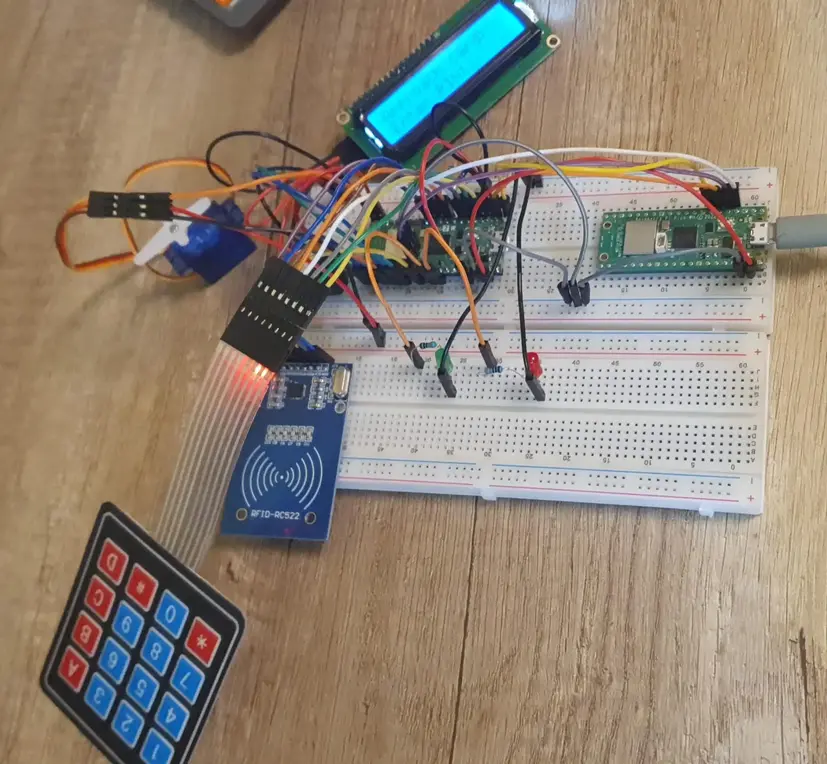
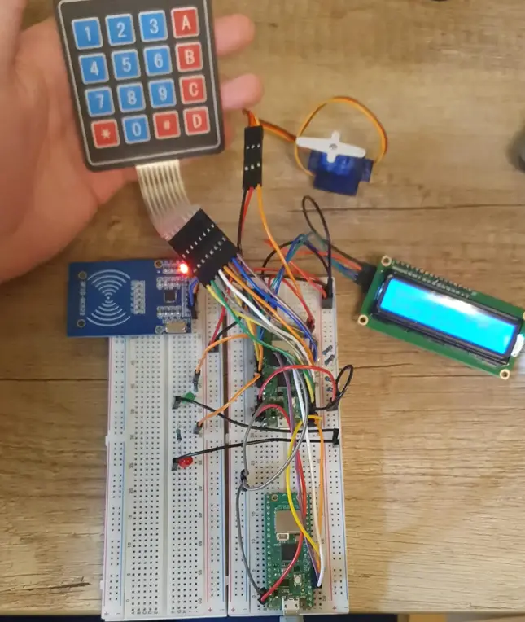
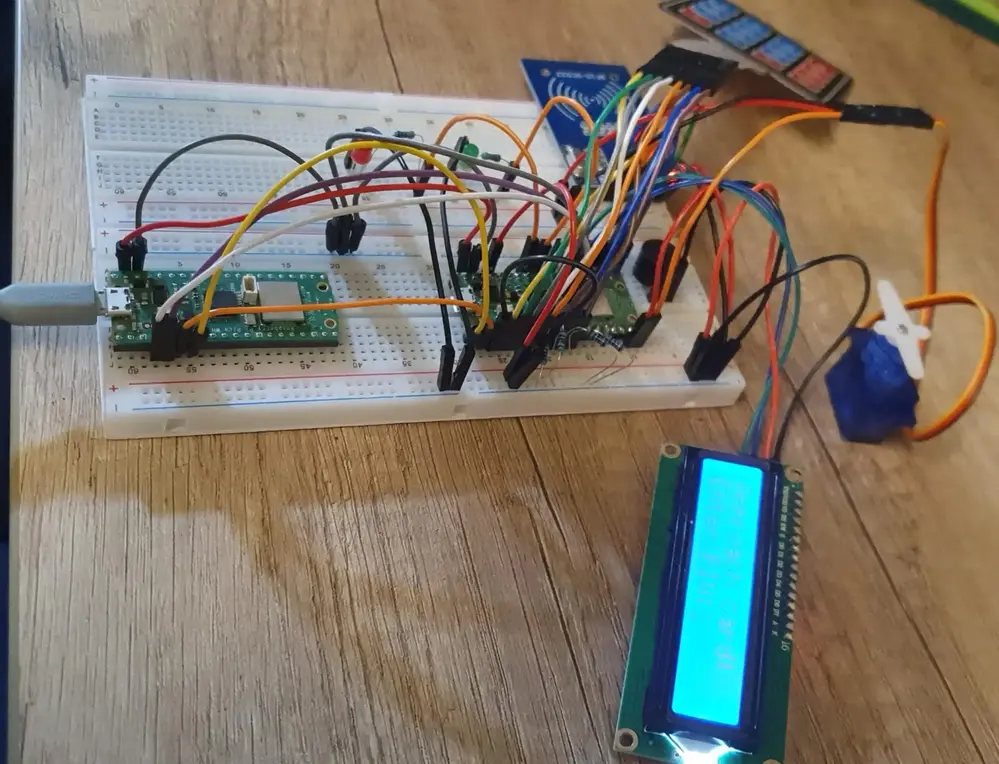
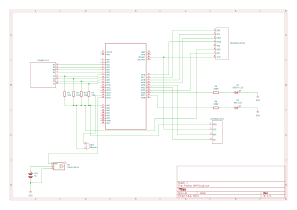

# Dual-Mode Access Control System

Dual-Mode Access Control System with RFID and Keypad using Raspberry Pi Pico 2W

:::info 

**Author**: BÎTLAN Adrian-Gabriel \
**GitHub Project Link**:  https://github.com/UPB-PMRust-Students/project-Bitlee1407

:::

## Description

This project implements a smart, dual-mode access control system using the Raspberry Pi Pico 2W. It allows entry through either RFID authentication or a PIN code entered via a keypad. A successful authentication unlocks a servo motor simulating door access, lights up a green LED, and plays a confirmation beep. Unsuccessful attempts trigger a red LED and a warning tone. The system is built entirely in Rust using the Embassy asynchronous framework, ensuring efficient multitasking and responsive hardware control.

## Motivation

In an increasingly connected world, secure and flexible access control solutions are essential. Traditional keys are inconvenient and often insecure. RFID and PIN-based systems offer better control, and combining both in one embedded system offers even greater flexibility and security. By using the Rust programming language and the Embassy async framework, this project demonstrates modern embedded development with safe concurrency, targeting real-world problems. The use of both keypad and RFID readers adds redundancy and versatility, making the system ideal for shared workspaces, maker labs, or educational facilities.


## Architecture 

**Raspberry Pi Pico 2W**  
  • **Role:** Acts as the "brain" of the system — it controls all components: handles input from the RFID reader and keypad, updates the LCD display, drives the LEDs and buzzer, and sends signals to the servo 	  motor.  
  • **Connections:**  
    • I2C (GP20 = SDA, GP21 = SCL) to LCD  
    • SPI (GP16 = MISO, GP17 = CS, GP18 = SCK, GP19 = MOSI) to RFID  
    • GPIO (GP2–GP9) to keypad  
    • PWM (GP15) to servo  
    • GPIO (GP14) to buzzer  
    • GPIO (GP26 = Green LED, GP27 = Red LED)

**LCD1602 Display (I2C)**  
  • **Interface:** I2C  
  • **Role:** Displays prompts, user greetings, and access status messages.  
  • **Connections:**  
    • SDA to GP20  
    • SCL to GP21  
    • VCC to 3.3V  
    • GND to GND

**4x4 Matrix Keypad**  
  • **Interface:** GPIO  
  • **Role:** Accepts numeric PIN input from the user for access control.  
  • **Connections:**  
    • Rows to GP2, GP3, GP4, GP5  
    • Columns to GP6, GP7, GP8, GP9  
    • Powered from 3.3V and GND

**RFID Reader (MFRC522)**  
  • **Interface:** SPI  
  • **Role:** Reads the UID from RFID cards or tags for identity verification.  
  • **Connections:**  
    • SDA/CS to GP17  
    • SCK to GP18  
    • MOSI to GP19  
    • MISO to GP16  
    • RST to GP22  
    • VCC to 3.3V  
    • GND to GND

**Green & Red LEDs**  
  • **Interface:** GPIO  
  • **Role:** Visual feedback — green for access granted, red for access denied.  
  • **Connections:**  
    • Green LED to GP26 (with 330Ω resistor to GND)  
    • Red LED to GP27 (with 330Ω resistor to GND)

**Passive Buzzer**  
  • **Interface:** GPIO  
  • **Role:** Emits a tone as sound feedback when access is granted or denied.  
  • **Connections:**  
    • Signal to GP14  
    • VCC to 3.3V  
    • GND to GND

**Servo Motor**  
  • **Interface:** PWM  
  • **Role:** Simulates door movement when access is granted.  
  • **Connections:**  
    • Signal to GP15  
    • VCC to External 5V battery  
    • GND to Shared GND with Pico

**External 5V Battery**  
  • **Role:** Powers the servo motor which requires more current than the Pico’s 3.3V rail can provide.  
  • **Connections:**  
    • +5V to Servo VCC  
    • GND to Pico GND (shared ground reference)

## Log


### Week 5 - 11 May

In the first week, I bought all my components for the project, including the Raspberry Pi Pico 2W, MFRC522 RFID reader, LCD1602 I2C display, 4x4 keypad, LEDs, passive buzzer, servo motor, and jumper wires. I organized and connected them on a breadboard, preparing for testing and prototyping.

### Week 12 - 18 May

In the second week, I connected the MFRC522 RFID reader and the LCD1602 I2C display to the Raspberry Pi Pico 2W and successfully displayed messages on the screen after scanning RFID cards. I also tested the green and red LEDs — they turn on based on access permission status from RFID scanning.

### Week 19 - 25 May

## Hardware

• **Raspberry Pi Pico 2W** → Acts as the central controller, coordinating all inputs and outputs for access control.  
• **LCD1602 Display (I2C)** → Displays access prompts, user greetings, and authentication status.  
• **4x4 Matrix Keypad** → Captures user-entered PIN codes for authentication.  
• **RFID Reader (MFRC522)** → Reads RFID card UIDs to identify authorized users.  
• **Green LED** → Lights up to indicate access has been granted.  
• **Red LED** → Lights up to signal that access has been denied.  
• **Passive Buzzer** → Emits an alert sound based on access result (granted or denied).  
• **Servo Motor** → Simulates a door unlocking mechanism when access is granted.  
• **External 5V Battery** → Provides sufficient power for high-draw components like the servo motor.  








### Schematics



### Bill of Materials

<!-- Fill out this table with all the hardware components that you might need.

The format is 
```
| [Device](link://to/device) | This is used ... | [price](link://to/store) |

```

-->

| Device | Usage | Price |
|--------|--------|-------|
| [Raspberry Pi Pico 2 W](https://www.raspberrypi.com/documentation/microcontrollers/pico-series.html#pico-2-family) | The main board | [40 LEI](https://www.optimusdigital.ro/ro/placi-raspberry-pi/13327-raspberry-pi-pico-2-w.html) |
| [Raspberry Pi Pico W](https://www.raspberrypi.com/documentation/microcontrollers/pico-series.html#pico-1-family) | Used as debug probe | [40 LEI](https://www.optimusdigital.ro/ro/placi-raspberry-pi/12395-raspberry-pi-pico-wh.html?search_query=pi+pico+w&results=33) |
| [MFRC522 RFID Reader](https://www.handsontec.com/dataspecs/RC522.pdf) | Reads RFID tags | [10 LEI](https://www.optimusdigital.ro/ro/wireless-rfid/67-modul-cititor-rfid-mfrc522.html?search_query=Modul+RFID+RC522+%28similar+cu+MFRC522%29&results=1) |
| [LCD1602 with I2C](https://www.handsontec.com/dataspecs/module/I2C_1602_LCD.pdf) | Displays prompts and status | [17 LEI](https://www.optimusdigital.ro/ro/optoelectronice-lcd-uri/2894-lcd-cu-interfata-i2c-si-backlight-albastru.html?search_query=0104110000003584&results=1) |
| [4x4 Matrix Keypad](https://cdn.sparkfun.com/assets/f/f/a/5/0/DS-16038.pdf) | PIN input method | [7 LEI](https://www.optimusdigital.ro/ro/senzori-senzori-de-atingere/470-tastatura-matriceala-4x4-cu-conector-pin-de-tip-mama.html?search_query=0104110000002747&results=1) |
| [SG90 Servo Motor](http://www.ee.ic.ac.uk/pcheung/teaching/DE1_EE/stores/sg90_datasheet.pdf) | Used to move the barrier | [12 LEI](https://www.optimusdigital.ro/ro/motoare-servomotoare/2261-micro-servo-motor-sg90-180.html) |
| [Buzzer Pasiv](https://www.handsontec.com/dataspecs/module/passive%20buzzer.pdf) | Emits sound feedback | [2 LEI](https://www.optimusdigital.ro/ro/audio-buzzere/634-buzzer-pasiv-de-5-v.html?search_query=0104210000007343&results=1) |
| [GREEN Led](https://www.farnell.com/datasheets/1498852.pdf) | Indicates "Access Permitted." | [0.40 LEI](https://www.optimusdigital.ro/en/leds/38-5-mm-green-led-with-difused-lens.html?search_query=led&results=2049) |
| [RED Led](https://www.farnell.com/datasheets/1498852.pdf) | Indicates "Access Denied." | [0.40 LEI](https://www.optimusdigital.ro/en/leds/29-5-mm-red-led-with-difused-lens.html?search_query=led&results=2179)   |
| [Breadboard](https://www.optimusdigital.ro/ro/prototipare-breadboard-uri/8-breadboard-830-points.html) | Put components on it | [30 LEI](https://www.optimusdigital.ro/ro/prototipare-breadboard-uri/8-breadboard-830-points.html) |
| [Female-to-Male Wires](https://www.optimusdigital.ro/ro/fire-fire-mufate/650-fire-colorate-mama-tata-10p.html?search_query=0104210000003871&results=1) | For wiring | [3 LEI](https://www.optimusdigital.ro/ro/fire-fire-mufate/650-fire-colorate-mama-tata-10p.html?search_query=0104210000003871&results=1) |
| [Male-to-Male Wires](https://www.optimusdigital.ro/ro/fire-fire-mufate/885-set-fire-tata-tata-10p-10-cm.html?search_query=0104210000009040&results=1) | For wiring | [30 LEI](https://www.optimusdigital.ro/ro/fire-fire-mufate/885-set-fire-tata-tata-10p-10-cm.html?search_query=0104210000009040&results=1) |

## Software

| Library | Description | Usage |
|---------|-------------|-------|
| [embassy-executor](https://docs.embassy.dev/embassy-executor/git/cortex-m/index.html) | Async task executor for embedded systems | Runs concurrent tasks like keypad scanning, RFID polling, and feedback control |
| [embassy-rp](https://docs.embassy.dev/embassy-rp/git/rp235xb/index.html) | Hardware abstraction layer for the RP2040 | Interfaces with peripherals like SPI (RFID), I2C (LCD), GPIO (LEDs), and PWM (Servo) |
| [embassy-time](https://docs.embassy.dev/embassy-time/git/default/index.html) | Timers and delays for async code | Implements non-blocking delays and timeout logic |
| [embassy-sync](https://docs.embassy.dev/embassy-sync/git/default/index.html) | Async synchronization primitives | Coordinates shared access to peripherals across tasks |
| [embedded-hal](https://docs.rs/embedded-hal/latest/embedded_hal/) | Unified hardware interface traits | Defines abstract traits for embedded drivers |
| [embedded-hal-async](https://docs.rs/embedded-hal-async/latest/embedded_hal_async/) | Async traits for embedded-hal | Enables async I2C, SPI, and GPIO interfaces for peripheral drivers |
| [defmt](https://docs.rs/defmt/latest/defmt/) | Lightweight logging for embedded systems | Used to debug the system without printing over serial |
| [defmt-rtt](https://docs.rs/defmt-rtt/latest/defmt_rtt/) | Logging backend via RTT | 	Sends logs through debug probes to the host for analysis |

## Links

<!-- Add a few links that inspired you and that you think you will use for your project -->

1. [link](https://example.com)
2. [link](https://example3.com)
...
