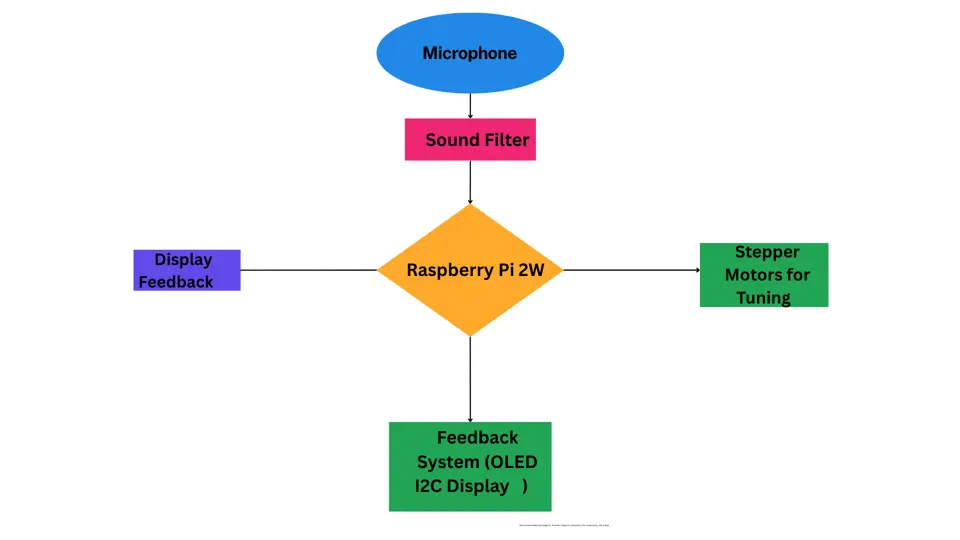
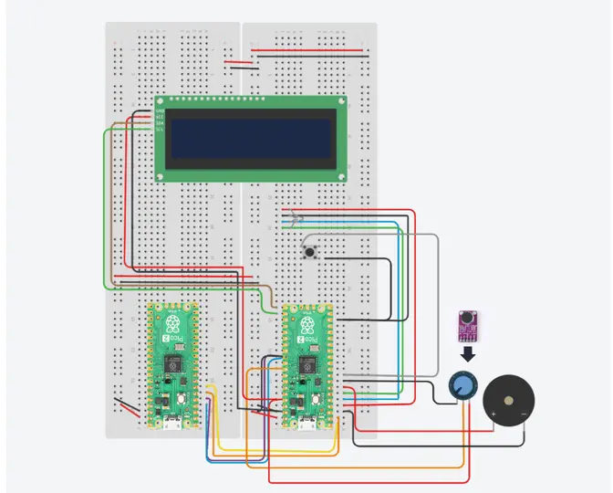
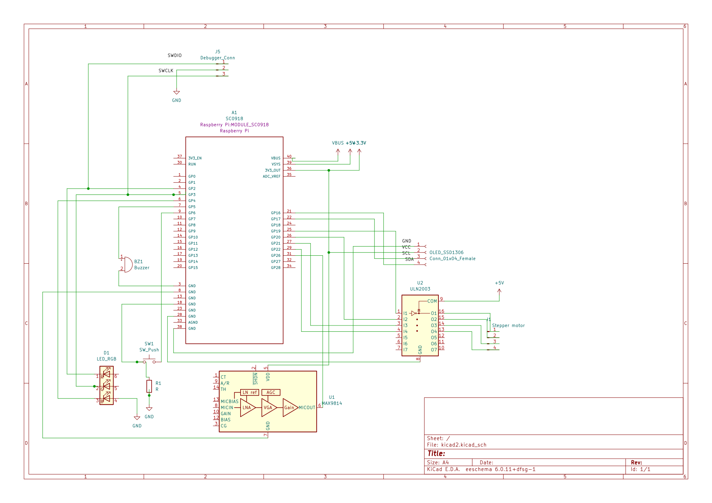
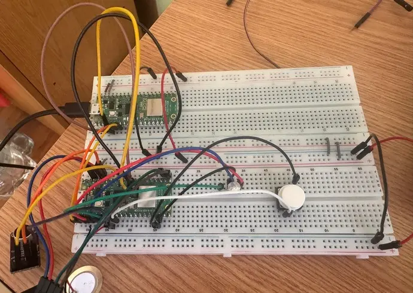
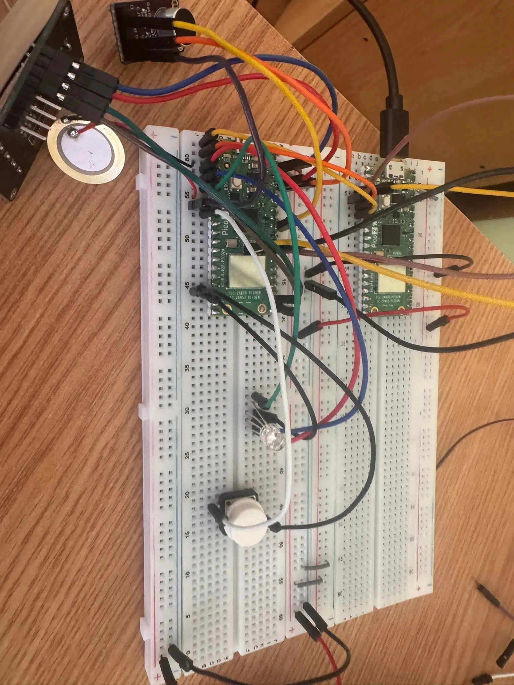
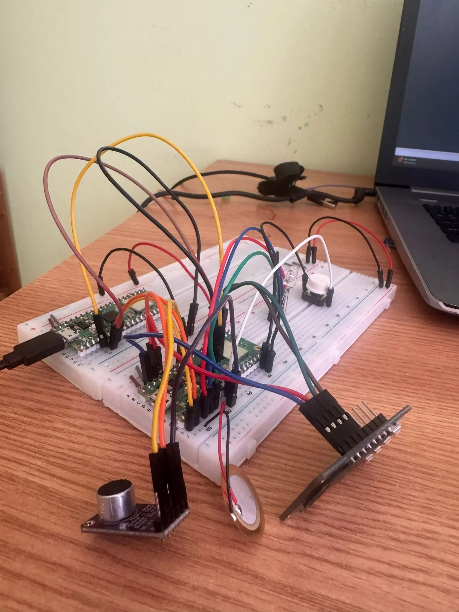
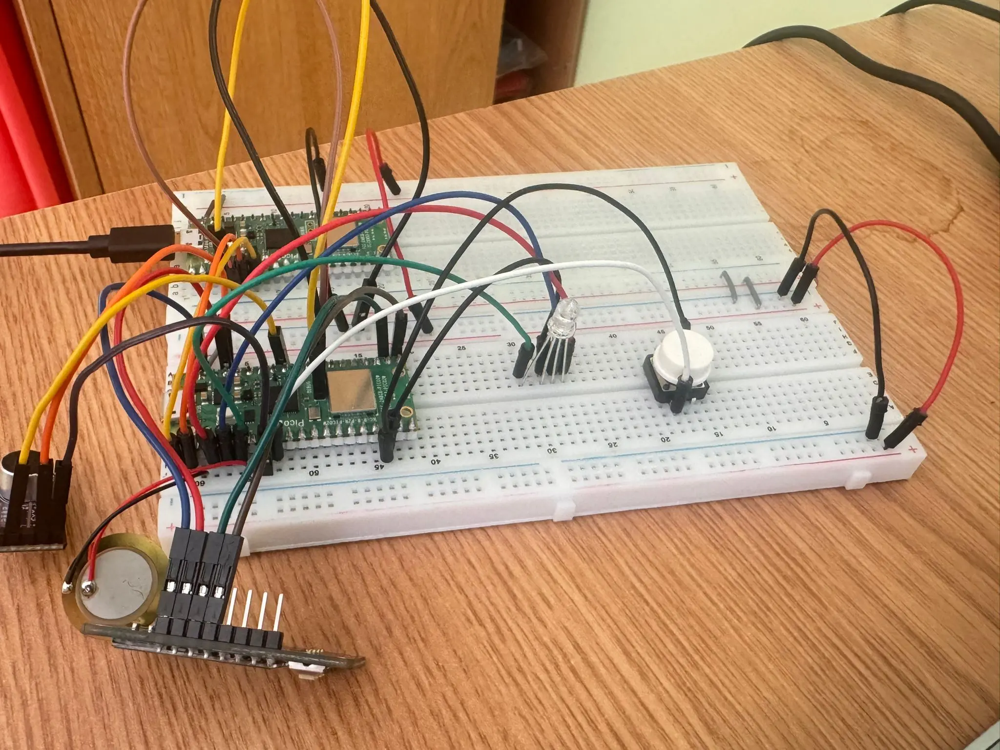

Guitar Tuner

:::info 

**Author**: Alexandra Rus \
**GitHub Project Link**: https://github.com/UPB-PMRust-Students/project-Aleczx23

:::

## Description

    Tuning a guitar can often be a tedious task, especially when relying on manual methods or a clip-on tuner. For this project, the goal is to create an automatic guitar tuner that simplifies the process, making it more accurate and efsficient. . Using a microphone, the system captures the sound of the guitar strings and analyzes their frequencies. It then compares them to the correct pitch and provides feedback to the player, indicating whether the string is in tune or needs adjustment. An additional improvement that I would hope to achieve is to make it adjust the tension automatically using an attached stepper motor for tuning pegs. 
        This project blends the tactile experience of traditional guitar playing with modern technology, offering a faster and more precise way to tune your guitar.

## Motivation

 Ever since I was a kid I had this deep love and passion for music, any type of it and I've always wanted a guitar. Soit felt natural that during highschool my top choices were rock, blues and folk music. My parents didn't really encourage this passion of mine, so I started taking lessons only this year, after I spent some time convincing myself that it is better late than never, so, when I thought about this project it felt just right to combine these to passions of mine. Especially that, as a beginner. it felt impossibile to understand how can I tune my guitar without any help. There was a really quick way to solve it, using one of the many apps you can find online. But that, like every question I have regarding technology, it made me think, "How does it work?". So, this is my opportunity to find out how can I do my own guitar tuner, using a raspberry pi, and what is the preocess behind it, I am really eager to achieve it, and maybe even improve it to make it tune my guitar by itself. 
## Architecture 
The Automatic Guitar Tuner combines several key components to create a system that captures sound from the guitar, processes it, and provides feedback to the user. The system is designed to automatically detect the pitch of each string, allowing the user to tune the guitar quickly and accurately. The following are the key components of the system:
Main Components:

    Microphone:

        The microphone is used for capturing the sound of the guitar strings. It serves as the primary input device, detecting the frequency of the string vibrations.

        The microphone sends the audio signal to the filter stage for noise reduction before being processed.

    Sound Filter :

        To improve accuracy, abfilter can be applied to remove unwanted background noise or harmonics from the captured sound.

        The filter could either be implemented in hardware (using operational amplifiers) or in software (via a Rust-based signal processing library).

    Microcontroller (Raspberry Pi 2W with Wi-Fi):

        The Raspberry Pi 2W is the heart of the system. It receives the audio signal from the microphone and applies the FFT (Fast Fourier Transform) algorithm to analyze the frequencies of the guitar strings.

        The Raspberry Pi runs the necessary Rust code to process the signal, determine the pitch, and provide feedback. Additionally, the Wi-Fi capability of the Raspberry Pi allows for potential remote control or integration with an app in the future.

    Signal Processing (FFT):

        The Raspberry Pi performs FFT on the signal from the microphone to extract the fundamental frequency of the string vibrations.

        The system compares the detected frequency with the expected frequency for each string (e.g., E4, A4, etc.) and determines whether the string is in tune or needs adjustment.

    Feedback System:

        The feedback system provides feedback to the user based on the frequency comparison:

            OLED Display: Displays messages such as "In Tune" or "Adjust" to indicate the tuning status of each string.

            Buzzer: Beeps to give auditory feedback (short beep for "In Tune," longer beep for "Adjust").

            RGB LED: (optional) Changes color to indicate the tuning status—green for in tune, red for out of tune.

    Stepper Motors:

        As a future improvement, the system could incorporate stepper motors to automatically adjust the tension of the guitar strings. The microcontroller would control the motors to fine-tune the strings, allowing the system to automatically bring them into perfect tune.

        This feature would be added once the basic functionality is working, providing a fully automated tuning experience.

How the Components Connect:

    Microphone to Filter:

        The microphone captures the audio signal from the guitar strings. This signal is sent to the sound filter (if implemented) to clean up any unwanted noise before it reaches the microcontroller.

    Filter to Raspberry Pi:

        The filtered signal is then sent to the Raspberry Pi, where it is processed. The Raspberry Pi runs the FFT algorithm to analyze the frequencies of the guitar strings.

    Raspberry Pi to Feedback System:

        After processing the signal, the Raspberry Pi compares the detected frequency with the target frequency for each string.

        The Raspberry Pi sends feedback to the OLED display, buzzer, or RGB LED to indicate whether the string is in tune or needs adjustment.

    Stepper Motors:

        If stepper motors are added later, the Raspberry Pi would control them to adjust the string tension automatically based on the detected frequency.
       
       
        

## Log

<!-- write your progress here every week -->

### Week 5 - 11 May

This week, I soldered the hardware components in the lab to improve stability and reduce noise. I also placed the final order for the stepper motor, which I plan to use later for automatic tuning. Meanwhile, I focused on debugging using probe-rs, and successfully tested the OLED display, buzzer, LEDs, and microphone input. Sampling works correctly, and I’m now able to capture real-time sound data. I also wrote code to test each component individually, to check that they were working properly and I integrated them in the project. 
### Week 12 - 18 May
I drew the first version of my Tinkercad schematics, and made some modifications afterwards, while performing tests on my components. Afterwards, I draw the Kicad schematics. This week I completed the hardware connections for the project, with the exception of the stepper motor, which I am still waiting to arrive. Once everything is stable and functional, I will integrate the motor into the system for automatic tuning. I also created the schematic in Tinkercad and adjusted it as needed while testing different components and wiring configurations.

On the software side, I started developing the signal acquisition system. I successfully tested the microphone and began capturing sound input through the ADC. To make sense of the audio data, I implemented a basic signal processing stage where the sampled waveform is passed through a Fast Fourier Transform (FFT) in order to extract the frequency components.

During this process, I encountered several issues with the OLED display — sometimes it showed static noise (“white noise” pixels), other times it worked normally. After multiple attempts to debug the wiring and refresh timings, I decided to order a new display and plan to replace the current one for better reliability.

Overall, this week was focused on finalizing the core of the hardware setup and initiating the software logic for sound analysis.

### Week 19 - 25 May

## Hardware

Raspberry Pi Pico 2W
Purpose: Acts as the main microcontroller.
Function: Reads analog audio data from the microphone, processes the signal, controls the OLED display, buzzer, LEDs, and handles button input.

MAX9814 Microphone Module with AGC (Automatic Gain Control)
Purpose: Captures audio input, particularly guitar string vibrations.
Function: Outputs an amplified analog signal with stable gain, ideal for detecting pitch variations.

SSD1306 128x64 OLED Display (I2C)
Purpose: Provides visual feedback to the user.
Function: Displays the detected note, tuning status, or frequency values.

Piezo Buzzer (20mm)
Purpose: Provides auditory feedback.
Function: Emits beeps when a string is correctly tuned or when specific actions are triggered.

RGB LED (or 3 separate LEDs: red, green, blue)
Purpose: Visual tuning indicator.
Function:

    Red: String is out of tune (flat or sharp)

    Green: String is correctly tuned

    Blue: Tuning in progress

Push Button
Purpose: User interaction.
Function: Can be used to cycle between strings, confirm actions, or reset tuning.

Breadboard and Jumper Wires
Purpose: Prototyping.
Function: Connects components without soldering.

Debug Probe (CMSIS-DAP, via probe-rs)
Purpose: Firmware flashing and real-time debugging.
Function: Enables direct code deployment and logging using defmt and probe-rs.

[Planned] Stepper Motor (optional, not yet integrated)
Purpose: Enable automatic guitar tuning.
Function: Will be connected in the future to physically turn the tuning pegs based on detected frequency deviations. The motor is currently on order and will be added once core functionality is stable.

Hardware Summary
The central component of my project is the Raspberry Pi Pico 2W, to which I connected all other modules. The MAX9814 microphone captures the sound of the guitar and sends it to the Pico's ADC for analysis. An SSD1306 OLED display connected via I2C shows tuning information, while an RGB LED indicates tuning status: red for flat, blue for sharp, and green for correct.

A piezo buzzer provides audio feedback, and a push button will later allow user interaction. I used a CMSIS-DAP debugger for flashing and real-time monitoring. All components were soldered during the lab, and I plan to add a stepper motor for automatic tuning as soon as it arrives.

### Schematics

 

 

 Here are some pictures of the project in current state. I am going to use a 3D printer to make it a case for the design part and also a peg clip for the stepper motor.
 
  
   
    

### Bill of Materials

| Device                                    | Usage                                            | Price                                                                            | Total   |
|-------------------------------------------|--------------------------------------------------|----------------------------------------------------------------------------------|---------|
| [Raspberry Pi Pico 2W](https://www.optimusdigital.ro/en/raspberry-pi-boards/12394-raspberry-pi-pico-2w.html) | The microcontroller                             | [39,66 RON](https://www.optimusdigital.ro/en/raspberry-pi-boards/12394-raspberry-pi-pico-2w.html) | 39,66 RON |
| [Modul microfon High Sensitivity Sound Detection](https://www.ardushop.ro/modul-microfon-high-sensitivity-sound-detection.html) | Captures sound from the guitar strings          | [5,41 RON](https://www.ardushop.ro/modul-microfon-high-sensitivity-sound-detection.html) | 5,41 RON |
| [Modul Amplificator Microfon cu AGC MAX9814](https://www.optimusdigital.ro/en/microphone-amplifiers/10411-modul-amplificator-microfon-cu-agc-max9814.html) | Amplifies microphone signal                     | [24,90 RON](https://www.optimusdigital.ro/en/microphone-amplifiers/10411-modul-amplificator-microfon-cu-agc-max9814.html) | 24,90 RON |
| [Modul OLED SPI de 0.96''](https://www.optimusdigital.ro/en/oled-displays/10010-oled-display-096-inch-128x64-i2c.html) | For displaying tuning information (optional)     | [23,79 RON](https://www.optimusdigital.ro/en/oled-displays/10010-oled-display-096-inch-128x64-i2c.html) | 23,79 RON |
| [Buzzer Piezo 20mm](https://www.optimusdigital.ro/en/buzzers/10411-buzzer-piezo-20mm.html) | Provides auditory feedback                      | [1,49 RON](https://www.optimusdigital.ro/en/buzzers/10411-buzzer-piezo-20mm.html) | 1,49 RON |
| [Buton 6x6x6](https://www.optimusdigital.ro/en/switches/10421-push-button-66x6x6mm.html) | Used for user input (optional)                   | [0,36 RON](https://www.optimusdigital.ro/en/switches/10421-push-button-66x6x6mm.html) | 0,36 RON |
| [Buton cu Capac Rotund Alb](https://www.optimusdigital.ro/en/switches/10421-push-button-rotund-alb.html) | Used for user input (optional)                   | [1,99 RON](https://www.optimusdigital.ro/en/switches/10421-push-button-rotund-alb.html) | 3,98 RON |
| [Motor Pas cu Pas 42HB34F08AB](https://www.optimusdigital.ro/en/stepper-motors/10411-motor-pas-cu-pas-42hb34f08ab.html) | For future motorized tuning (optional)           | [48,99 RON](https://www.optimusdigital.ro/en/stepper-motors/10411-motor-pas-cu-pas-42hb34f08ab.html) | 48,99 RON |
| [Kit Breadboard HQ830 cu Fire si Sursa](https://www.optimusdigital.ro/en/breadboards/10411-kit-breadboard-hq830-cu-fire-si-sursa.html) | For prototyping the circuit                     | [22,00 RON](https://www.optimusdigital.ro/en/breadboards/10411-kit-breadboard-hq830-cu-fire-si-sursa.html) | 22,00 RON |
| [Set de LED-uri Asortate de 5 mm si 3 mm (310 buc)](https://www.optimusdigital.ro/en/leds/0104110000045102-set-de-led-uri-asortate-de-5-mm-si-3-mm-310-buc-cu-rezistoare-bonus.html) | For visual feedback and debugging (optional)     | [25,00 RON](https://www.optimusdigital.ro/en/leds/0104110000045102-set-de-led-uri-asortate-de-5-mm-si-3-mm-310-buc-cu-rezistoare-bonus.html) | 25,00 RON |
| [Kit GPIO compatibil Raspberry Pi OKY1201](https://www.emag.ro/kit-gpio-pentru-raspberry-pi-10107500-oky1201/pd/D946KDMBM/) | To connect Raspberry Pi to various components    | [12,00 RON](https://www.emag.ro/kit-gpio-pentru-raspberry-pi-10107500-oky1201/pd/D946KDMBM/) | 12,00 RON |
| **Total**                                  |                                                  |                                                                                  | **183,25 RON** |

## Software

| Library                                      | Description                                    | Usage                                                                      |
|----------------------------------------------|------------------------------------------------|----------------------------------------------------------------------------|
| [st7789](https://github.com/almindor/st7789)  | Display driver for ST7789                      | Used to control the OLED display for visual feedback (e.g., tuning status) |
| [embedded-graphics](https://github.com/embedded-graphics/embedded-graphics) | 2D graphics library                           | Used for rendering graphics, drawing text or visual elements on the display |
| [rustfft](https://github.com/rustfft/rustfft) | FFT library for frequency analysis             | Used for processing the sound signal and analyzing frequencies of guitar strings |
| [embassy](https://github.com/embassy-rs/embassy) | Async runtime for embedded systems             | Used for async handling of tasks, like microphone data processing and feedback updates |
| [embedded-hal](https://github.com/embedded-hal/embedded-hal) | Hardware Abstraction Layer                     | Provides generic traits for controlling hardware like GPIO, I2C, SPI, etc. |
| [defmt](https://github.com/knurling-rs/defmt) | Debugging framework for embedded systems       | Used to add debugging capabilities and monitor the system during development |
| [rust-dsp](https://github.com/mbegan/rust-dsp) | Digital signal processing library              | Used for applying filters (e.g., low-pass or band-pass) to the microphone signal before FFT |
| [biquad](https://github.com/delfick/rust-biquad) | Biquad filter library                         | Used for filtering audio signals, such as low-pass or band-pass filtering |

## Links

<!-- Add a few links that inspired you and that you think you will use for your project -->

1. [link](https://www.instructables.com/Raspberry-Pi-Guitar-Tuner/)
2. [link](https://www.reddit.com/r/raspberry_pi/comments/pn7z7y/automatic_guitar_tuner_with_the_pico_sound_on/?rdt=52573)

