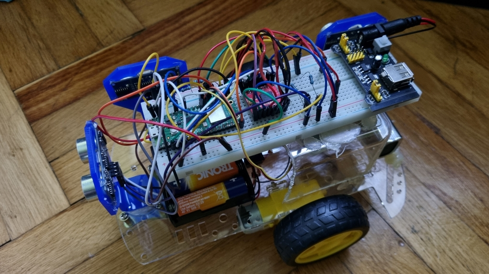
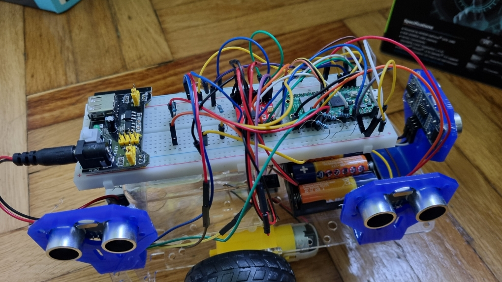
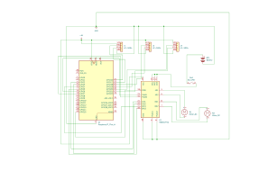

# Autonomous Parking Car
A simple autonomous parking prototype using Raspberry Pi Pico 2W, Rust and Embassy.

:::info 

**Author**: Ghita Alexandru-Catalin
**GitHub Project Link**: https://github.com/UPB-PMRust-Students/project-GhitaAlexandruCatalin

:::

## Description

This project builds a small autonomous parking car, using Raspberry Pi Pico 2W programmed in Rust with Embassy. The car uses three ultrasonic sensors to detect a parking space and automatically perform a parking maneuver using tank steering. A simple web interface on the Pico 2W shows the parking status and allows the user to confirm the parking if needed.

## Motivation

I chose this project because I wanted to understand how automated parking systems work, like the one in my Renault 2024. I noticed the real system sometimes struggles, so I decided to create a basic prototype to see how parking detection and control could be implemented with simple sensors and motors. I also wanted to practice using Rust in embedded systems.

## Architecture 

The system is made up of a Raspberry Pi Pico 2W that runs all the logic. It reads data from three ultrasonic sensors:

one at the front-center (to detect obstacles ahead),

one at the right-front (to detect the start of a parking space),

one at the right-rear (to detect the end of the parking space).

The Pico 2W also controls the two motors (using tank steering) through a TB6612FNG driver. It hosts a simple web interface that shows if a parking space was found and allows the user to press a button to start parking.

When a space is detected, the car either starts parking automatically or waits for confirmation through the web interface. The parking maneuver is done by reversing with tank steering.


## Log

<!-- write your progress here every week -->

### Week 5 - 11 May
Built the car and developed stable automatic parking algorithm with PWM motor control and sensor-based logic.
### Week 12 - 18 May
Calibrated the parking stages duration (to make sure the car parks as good as possible), integrated Wi-Fi support and added web interface plan with special parking maneuver detection.
### Week 19 - 25 May

## Hardware

The car is built on a 2-wheel drive chassis from a robot kit. It uses two DC motors controlled by a TB6612FNG motor driver. Three ultrasonic sensors (2x HC-SR04 and 1x HC-SR04+) are used to detect obstacles and parking space. A Raspberry Pi Pico 2W runs the control program. Power is provided by 4x AA batteries in a holder with a switch.



### Schematics



This is the kicad schematic.

### Bill of Materials

<!-- Fill out this table with all the hardware components that you might need.

The format is 
```
| [Device](link://to/device) | This is used ... | [price](link://to/store) |

```

-->

| Device | Usage | Price |
|--------|--------|-------|
| [Raspberry Pi Pico 2W](https://www.raspberrypi.com/documentation/microcontrollers/pico-series.html) | The microcontroller | [39 RON](https://www.optimusdigital.ro/ro/placi-raspberry-pi/13327-raspberry-pi-pico-2-w.html?gad_source=1&gbraid=0AAAAADv-p3BYbmtR0U4AB0vh3IzVtnhct&gclid=Cj0KCQjw2tHABhCiARIsANZzDWpC5jvEeQu1M-4aPsGLz0h_VUH-1oeoOhxuRTAuJpaxGS73j50IQKQaAkviEALw_wcB) |
| [Raspberry Pi Pico Debug probe](https://www.raspberrypi.com/documentation/microcontrollers/debug-probe.html) | Pico Debug Probe | [66 RON](https://www.optimusdigital.ro/en/accesories/12777-raspberry-pi-debug-probe.html?srsltid=AfmBOoriZm_41cmeLX01a0sdURol6ev5VejcC2lXUkNHwUqBqNHQ_65P) |
| TB6612FNG Motor Driver | Controls the 2 DC motors | [25 RON](https://www.optimusdigital.ro/en/brushed-motor-drivers/134-tb6612fng-dual-motor-driver-1-a.html?srsltid=AfmBOopWC9QhXQGhkdyAoanCFfS1Ff9P7OcWpEeUpdFsgRCiG0OFlHFi) |
| 2 DC Motors + 3 wheels chassis + 4 AA battery holder + battery switch | The motors that power the car | [50 RON](https://www.optimusdigital.ro/en/robot-kits/140-robot-chasis-2-motors.html?search_query=Robot+Kit+%282+Motors%29%09&results=67) |
| Breadboard+Wires+Resistors+Power supply | Used to connect the devices together | [~25 RON (included in a kit)](https://www.optimusdigital.ro/en/optimus-digital-kits/7356-kit-wireless-super-starter-cu-esp8266.html?search_query=kit&results=456) |
| 2x HC-SR04 Distance sensors | Used to measure the distance from the car to the wall | [6 RON](https://www.optimusdigital.ro/en/ultrasonic-sensors/9-hc-sr04-ultrasonic-sensor.html?search_query=sr04&results=20) |
| HC-SR04+ Distance sensor | Used to measure the distance from the car to the wall | [15 RON](https://www.optimusdigital.ro/en/ultrasonic-sensors/2328-senzor-ultrasonic-de-distana-hc-sr04-compatibil-33-v-i-5-v.html?search_query=sr04&results=20) |
| Holding brackets for the distance sensors | Used to keep the sensors in a good position for the parking manoeuvre | [2RON](https://www.optimusdigital.ro/en/holders-and-mounting-accessories/7102-mounting-bracked-for-hc-sr04-ultrasonic-sensor-blue.html?search_query=sr04&results=20) |

## Software

| Library | Description | Usage |
|---------|-------------|-------|
| [`embassy`](https://crates.io/crates/embassy) | Asynchronous embedded framework | Base for writing async embedded code |
| [`embassy-executor`](https://crates.io/crates/embassy-executor) | Async task executor | Runs async tasks like motor control and sensor reading |
| [`embassy-rp`](https://crates.io/crates/embassy-rp) | Embassy HAL for RP2040 | Access to GPIO, PWM, timers and peripherals on Pico 2W |
| [`embassy-time`](https://crates.io/crates/embassy-time) | Asynchronous time management | Provides delays and timers for task synchronization |
| [`embassy-net`](https://crates.io/crates/embassy-net) | Embedded networking stack | Enables Wi-Fi and TCP/Web server on the Pico W |
| [`smoltcp`](https://crates.io/crates/smoltcp) | Lightweight TCP/IP stack | Manages TCP connections for the web server |
| [`static_cell`](https://crates.io/crates/static_cell) | Static memory allocator | Safe global resource allocation (e.g., networking stack) |
| [`embedded-hal`](https://crates.io/crates/embedded-hal) | Hardware Abstraction Layer | Abstract interface for motors, sensors and peripherals |
| [`defmt`](https://crates.io/crates/defmt), [`defmt-rtt`](https://crates.io/crates/defmt-rtt) | Efficient embedded logging | Low-overhead logging for debugging |
| [`panic-probe`](https://crates.io/crates/panic-probe) | Panic handler for no_std | Lightweight handler for crash diagnostics |
| [`heapless`](https://crates.io/crates/heapless) | Heap-free data structures | Useful for HTTP handler and message queues |

## Links

<!-- Add a few links that inspired you and that you think you will use for your project -->

1. [Real life inspiration](https://newatlas.com/how-self-parking-works/46684/)
2. [Arduino model](https://youtu.be/IpaVJD0ne1I?si=TsgtYaTl4377ByxE)

