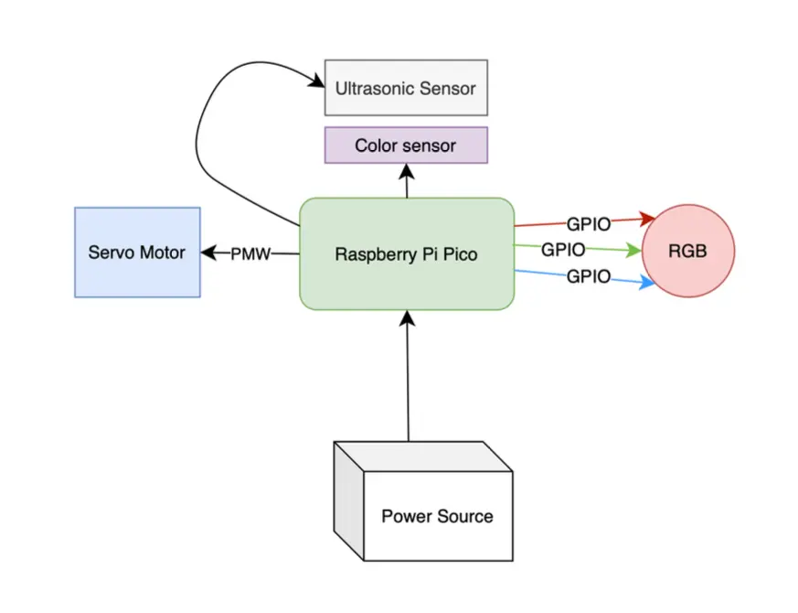
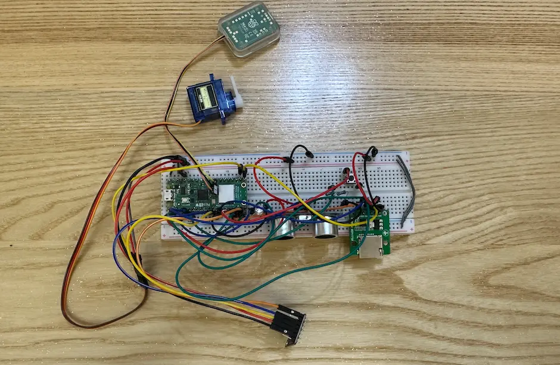
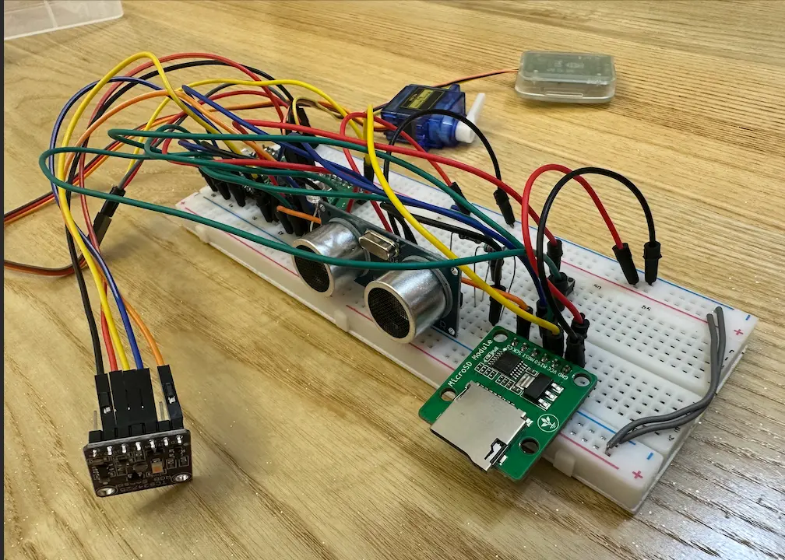
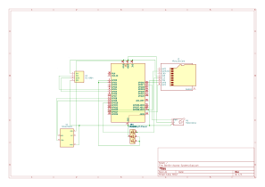

# Barrier Access System
A simple barrier access system that lifts the barrier when a registered license plate is recognized.

:::info

**Author**: Logoviceanu Ana Lorena \
**GitHub Project Link**: https://github.com/UPB-PMRust-Students/project-Ana0420

:::

## Description

An automated system for controlling access to an office building parking lot, using color-based license plate recognition. When a car approaches, its presence is detected using an ultrasonic sensor. If the license plate (represented by a specific color pattern) matches a registered entry stored on an SD card, the barrier lifts and a stoplight turns green. Otherwise, access is denied and the light remains red. The system only activates when a car is near.

## Motivation

This project was chosen to combine embedded system knowledge, sensor integration, and Rust programming in a practical and realistic scenario. Automating a gate entrance simulates a real-world problem with simple yet scalable components. Using color instead of OCR keeps it simple and hardware-focused.

## Architecture 

Main Components:
Proximity Detection: Ultrasonic sensor detects when a car is near.
License Plate Identification: TCS34725 color sensor checks color blocks on the license plate.
Access Control: List of accepted license plates stored on an SD card.
Control Unit: Raspberry Pi Pico W running Rust, interpreting sensor input and sending commands.
Output Mechanisms: Servo motor to raise/lower the barrier; RGB LED to show red/green light.
Connections:
Car detected by HC-SR04 → triggers the system.
Color sensor (TCS34725) reads the plate colors.
Pico W matches the color pattern against the list stored on the SD card.
If matched:
Servo motor (SG90) opens the barrier.
RGB LED turns green.
If not:
Barrier stays closed.
LED turns red.
Idle: LED remains off unless a car is nearby.

## Log

### Week 5 - 11 May
During this week, I focused on the planning and preparation phase of the project. I created an initial, orientative KiCad schematic to visualize the overall hardware architecture and validate component compatibility. I also finalized the list of required components and purchased all the necessary modules and accessories. Additionally, I planned the functional flow of the project — outlining how each component will interact, how the license plate recognition logic will work using color patterns, and how the system will control the barrier and stoplight based on sensor input and SD card validation.

### Week 12 - 18 May
This week, I completed the main hardware setup for the project. I placed and connected all required components on a breadboard based on their datasheets, ensuring correct wiring and functionality for each module. I also finalized the full KiCad schematic to reflect the actual hardware configuration. With this, the hardware part of the project is essentially finished, except for the physical model, which will be added later.

### Week 19 - 25 May

## Hardware

Raspberry Pi Pico W – Central microcontroller that runs the entire system
TCS34725 Color Sensor – Detects and reads the color-based license plates
HC-SR04 Ultrasonic Sensor – Detects incoming vehicles to trigger the system
SG90 Servo Motor – Controls the barrier arm to allow or block entry
RGB LED – Acts as a traffic light (green for entry, red for stop)
SD Card Module – Stores the list of registered license plates (color codes)
220Ω Resistors – Current limiting for the RGB LED
Breadboard & Jumper Wires – For building and connecting the circuit
Voltage Divider (2 resistors) – Protects Pico from 5V echo signal of the ultrasonic sensor
Optional Logic Level Shifter – Safely connects 5V devices to 3.3V Pico (if needed)
External 5V Power Supply (optional) – For powering servo and 5V devices

### Schematics

### Bill of Materials

| Device | Usage | Price |
|--------|--------|-------|
| [Raspberry Pi Pico W](https://www.raspberrypi.com/documentation/microcontrollers/pico-series.html) | The main microcontroller that controls the system | [40 RON](https://www.optimusdigital.ro/ro/placi-raspberry-pi/13327-raspberry-pi-pico-2-w.html?search_query=pico&results=33) |
| [TCS34725 Color Sensor](https://www.alldatasheet.com/datasheet-pdf/view/894928/AMSCO/TCS34725.html) | Used to detect color-coded license plates | [22,05 RON](https://ardushop.ro/ro/senzori/1454-modul-senzor-de-culoare-tcs34725-6427854021342.html) |
| [HC-SR04 Ultrasonic Sensor](https://cdn.sparkfun.com/datasheets/Sensors/Proximity/HCSR04.pdf) | Detects the presence of a vehicle | [5,56 RON](https://ardushop.ro/ro/electronica/2289-modul-senzor-ultrasonic-detector-distanta-hc-sr04-6427854030726.html) |
| [SG90 Servo Motor](http://www.ee.ic.ac.uk/pcheung/teaching/DE1_EE/stores/sg90_datasheet.pdf) | Raises and lowers the barrier | [11,12 RON](https://ardushop.ro/ro/electronica/1874-servomotor-sg90-6427854028365.html) |
| [SD Card Module](https://static.chipdip.ru/lib/395/DOC050395146.pdf) | Stores the list of registered license plates | [7,14 RON](https://ardushop.ro/ro/module/1553-groundstudio-microsd-module-6427854023056.html) |
| Micro SD Card (≥1 GB) | Storage medium for the license data | [0]|
| Breadboard | Prototyping the circuit, Jumper Wires, Voltage Divider, 220Ω Resistors, RGB LED, USB cable | [60 RON](https://www.emag.ro/set-componente-electronice-breadboard-830-puncte-led-uri-compatibil-arduino-si-raspberry-pi-zz00044/pd/DRXG4XYBM/?utm_medium=ios&utm_source=mobile%20app&utm_campaign=share%20product)|

## Software

| Library | Description | Usage |
|---------|-------------|-------|
| [embassy](https://github.com/embassy-rs/embassy) | Asynchronous embedded framework for Rust | Main framework for async embedded control |
| [embedded-hal](https://crates.io/crates/embedded-hal) | Hardware abstraction layer for embedded systems | Interface standard for communicating with peripherals |
| [tcs3472](https://crates.io/crates/tcs3472) | Driver for the TCS3472 color sensor | Reads the color-based license plates |
| [hc-sr04](https://crates.io/crates/hc-sr04) | Driver for the HC-SR04 ultrasonic sensor | Detects vehicle presence to trigger system |
| [servo](https://crates.io/crates/servo) | Servo motor control | Moves the barrier up/down |
| [embedded-sdmmc](https://crates.io/crates/embedded-sdmmc) | FAT filesystem access on SD cards | Reads license plate data stored on SD card |

## Links

1. [raspberrypi](https://www.raspberrypi.com/documentation/microcontrollers/pico-series.html)
2. [embedded-hal](https://docs.rs/embedded-hal/latest/embedded_hal/)
3. [ultrasonic sensor tutorial](https://pico.implrust.com/ultrasonic/index.html)
