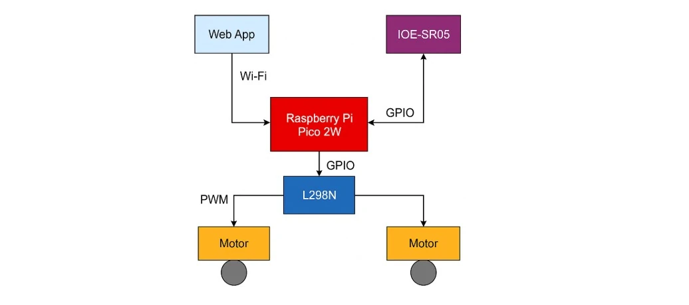
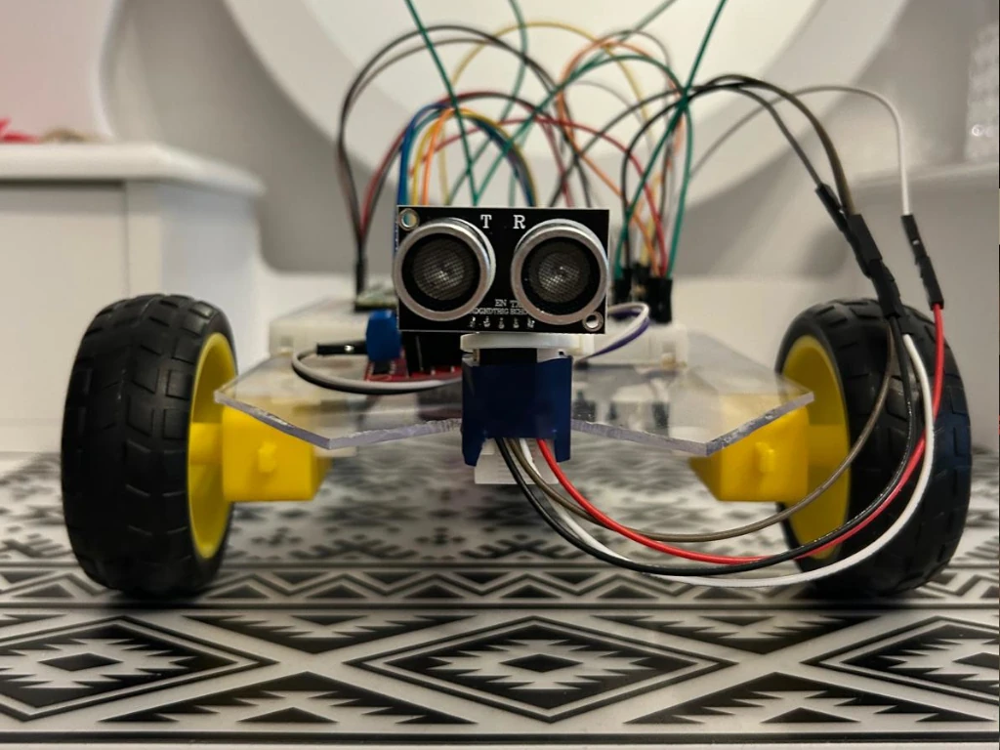
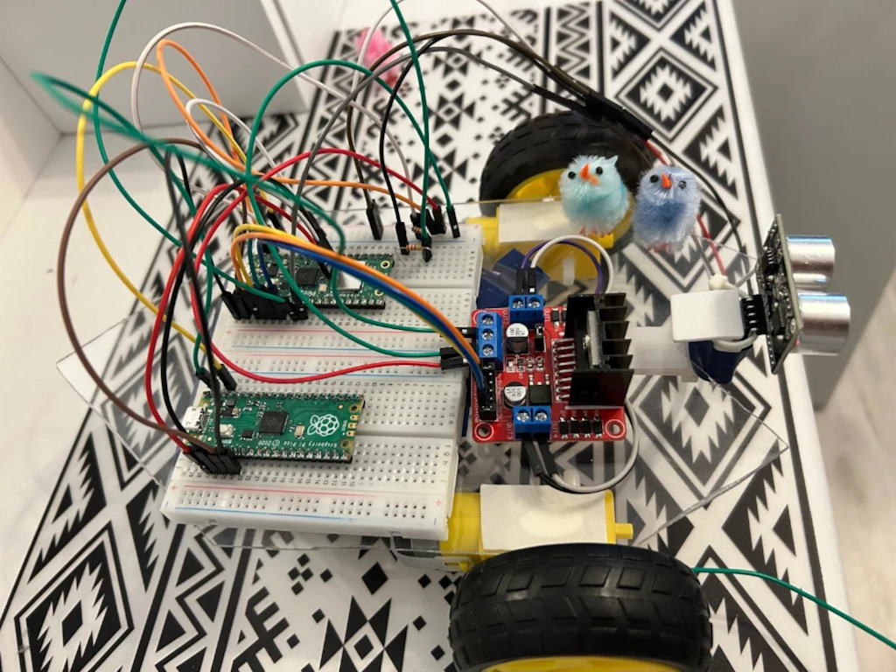
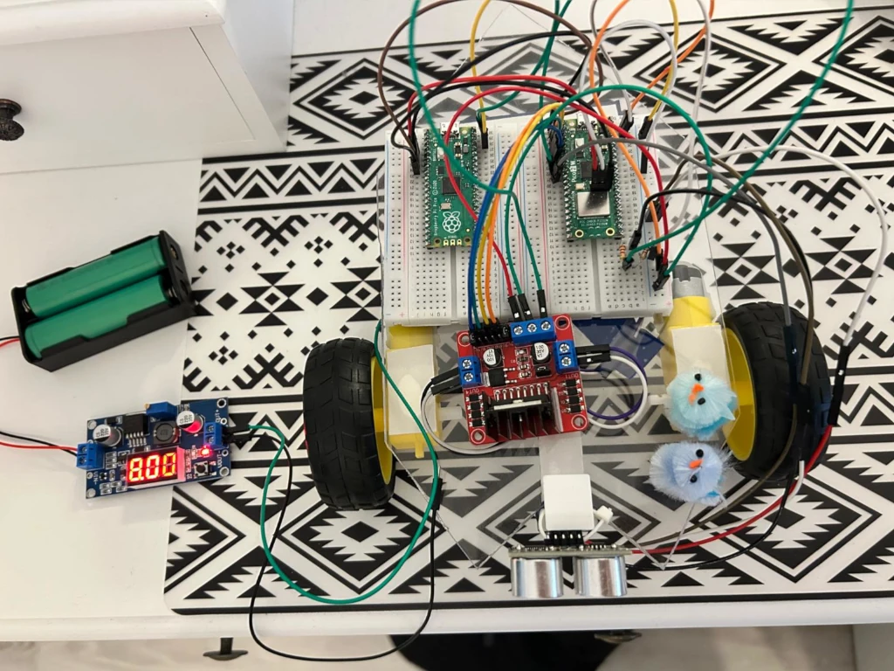
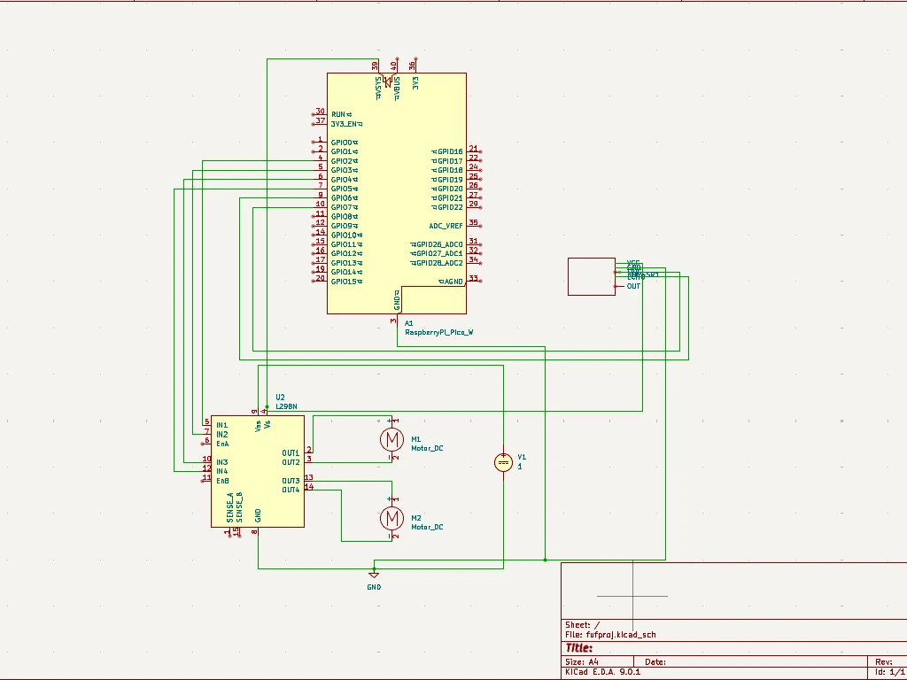

# Smart Ride

Our favourite childhood toys meet modern technology! Smart Ride is an improved remote-controlled car that uses an ultrasonic sensor to map the room!

:::info 

**Author**: Popovici Andra-Raluca

**GitHub Project Link**: https://github.com/UPB-PMRust-Students/project-andra-raluca-pop

:::

## Description
The car is controlled by means of a virtual remote control simulated in a web app. It uses an IOE-SR05 Ultrasonic Sensor to display the distance between the car and obstacles and aims to create a virtual map inside the web app. 

## Motivation

Since I was in primary school, my favourite toys were remote-controlled cars, which I've collected for several years. This project combines my childhood passion with modern technology and aims to make a more interesting, cooler remote control car suitable for all ages!

## Architecture 

1. **Web App**
   - Hosted by the Raspberry Pi Pico 2W using its onboard Wi-Fi.
   - Allows the user to control the car from a browser.
   - Sends control commands over Wi-Fi.

2. **Web Server (on Raspberry Pi Pico 2W)**
   - Receives user commands from the web app.
   - Runs Rust firmware to handle routing and control logic.
   - Acts as the central coordinator of the system.

3. **Motor Control Module**
   - Processes movement commands (forward, backward, turn).
   - Sends PWM and direction signals to the L298N motor driver.

4. **DC Motors with Gearbox and Wheels**
   - Receive power and control signals from the L298N module.
   - Convert electronic commands into physical motion.
   - Enable the robot to move.

5. **IOE-SR05 Ultrasonic Sensor (Sensor Module)**
   - Measures the distance to nearby objects.
   - Sends distance data to the Pico 2W via GPIO.
   - Used for basic room mapping.

###  Communication between components:

- The **web app** is hosted by the **Pico 2W** and accessed via Wi-Fi from a user’s browser.
- The **web server** interprets commands and forwards them to the **motor control module**.
- The **motor control module** sends PWM and direction signals to the **L298N driver**.
- The **L298N driver** powers two **DC motors with gearboxes and wheels** to drive the vehicle.
- The **sensor module** sends distance readings to the Pico W to enable obstacle detection or mapping.

## Log

### Week 5 - 11 May

After establishing the final form of the project, I started my documentation by gathering information about the required hardware parts and necessary libraries. I configured the setup: I connected the Raspberry Pi Pico 1 for debugging to the target (Raspberry Pi Pico 2W) and used the provided lab repository. I also started working on the hardware pieces by cutting the base structure on which all the components will be glued. Then I connected the 2 DC motors to the L298N module and added their required functions to the code.

### Week 12 - 18 May

This week, I finished the code and functions for the DC motors (final adjustments), created the basic function for the IOE-SR05 sensor and created the web app for the remote control, including the TCP server and http converter. In terms of harware, I finished the setup (wiring, fixing the ball caster that replaces the wheels in the back, fixing the sensor onto the acrylic plate).

### Week 19 - 25 May

## Hardware

The car uses a Raspberry Pi Pico 2W microcontroller that manages motor control and sensor input. I included 2 motors with gearbox and attached wheels that allow movement in 4 directions (left, right, forward, backward) as well as stopping the movement when the user presses the " stop" button. The 2 DC motors are controlled through PWM signal via a L298N module. The module recieves enable / direction signals from the Pico.
An IOE-SR05 Ultrasonic sensor is attached in the front and used for distance measurement and mapping. It provides feedback for the user to help avoid obstacles. Finally, for debugging, a Raspberry Pi Pico 1 was as it helped in testing the hardware components and developing the source code.

### Schematics

### Bill of Materials

| Device | Usage | Price |
|--------|--------|-------|
| [Raspberry Pi Pico W](https://www.emag.ro/placa-de-dezvoltare-raspberry-pi-pico-w-cu-wi-fi-rpi-pico-w/pd/DT8H69MBM/) | Main microcontroller with Wi-Fi, runs Rust firmware | 35 RON |
| [Raspberry Pi Pico](https://www.emag.ro/placa-de-dezvoltare-raspberry-pi-pico-raspberrypico/pd/DGSNJ0MBM/) | Used for debugging during development | 25 RON |
| [DC Motor with Gearbox and Wheel](https://www.optimusdigital.ro/en/motors-wheels-and-accessories/2058-dc-motor-cu-reductor-si-roata-65mm.html) x2 | Motion and propulsion | 11.90 RON x2 = 23.80 RON |
| [IOE-SR05 Ultrasonic Sensor](https://www.optimusdigital.ro/en/distance-sensors/1043-ultrasonic-sensor-module-sr04.html) | Room mapping / obstacle detection | 8.90 RON |
| [L298N Motor Driver Module](https://www.optimusdigital.ro/en/motor-drivers/2061-l298n-dual-h-bridge-motor-driver.html) | Controls the motors with PWM and direction signals | 13.90 RON |
| [Breadboard 400 pins](https://www.optimusdigital.ro/en/breadboards/207-breadboard-400-pini.html) x2 | Prototyping and wiring | 7.90 RON x2 = 15.80 RON |
| [Male-to-Male Jumper Wires](https://www.optimusdigital.ro/en/jumpers-and-cables/255-jumper-wire-male-to-male-40pcs.html) | Wiring connections between modules | 4.90 RON |
| [Female-to-Female Jumper Wires](https://www.optimusdigital.ro/en/jumpers-and-cables/254-jumper-wire-female-to-female-40pcs.html) | Wiring connections between modules | 4.90 RON |
| [3.7V Li-ion Rechargeable Battery](https://www.emag.ro/mini-acumulator-li-ion-3-7v-18650-3800mah-skywolfeye-skywolfeye18650/pd/DZZYMYMBM/) x2 | Powers the system (motors and/or controller) | 19.99 RON x2 = 39.98 RON |
| [Transparent Plexiglass Plate](https://www.optimusdigital.ro/en/robotic-accessories/973-plexiglass-board-for-diy-chassis.html) | Chassis base for mounting electronics and wheels | 10.90 RON |

| **Total** |  | **182.98 RON** |

## Software

| Library | Description | Usage |
|---------|-------------|-------|
| [embassy-rp](https://github.com/embassy-rs/embassy) | RP2040 peripheral access | Initializes and interacts with Pico W hardware peripherals |
| [embassy-executor](https://github.com/embassy-rs/embassy) | Async runtime | Runs asynchronous tasks like timers, Wi-Fi, and server logic |
| [embassy-time](https://github.com/embassy-rs/embassy) | Time utilities | Used for delays, timers, and scheduling |
| [embassy-net](https://github.com/embassy-rs/embassy) | Networking stack | Manages TCP/IP over Wi-Fi; serves the web interface |
| [embassy-lab-utils](https://github.com/embassy-rs/embassy-lab) | Pico W Wi-Fi macros and helpers | Used for quickly initializing Wi-Fi and networking on the Pico W |
| [defmt](https://github.com/knurling-rs/defmt) | Logging framework | Lightweight debug logging over RTT |
| [panic-probe](https://docs.rs/panic-probe) | Panic handler | Provides minimal panic handling for embedded Rust |
| [static_cell](https://docs.rs/static_cell) | Static memory allocation | Used to safely manage network stack resources statically |
| [gpio](https://docs.rs/embassy-rp/latest/embassy_rp/gpio/) | GPIO module | Used to control motors and interact with the ultrasonic sensor |
| [pwm](https://docs.rs/embassy-rp/latest/embassy_rp/pwm/) | PWM module | Controls the speed of the DC motors via L298N |

## Links

[Masina Bluetooth - Exemplu Proiect PM](https://ocw.cs.pub.ro/courses/pm/prj2022/fstancu/masinabluetooth)

