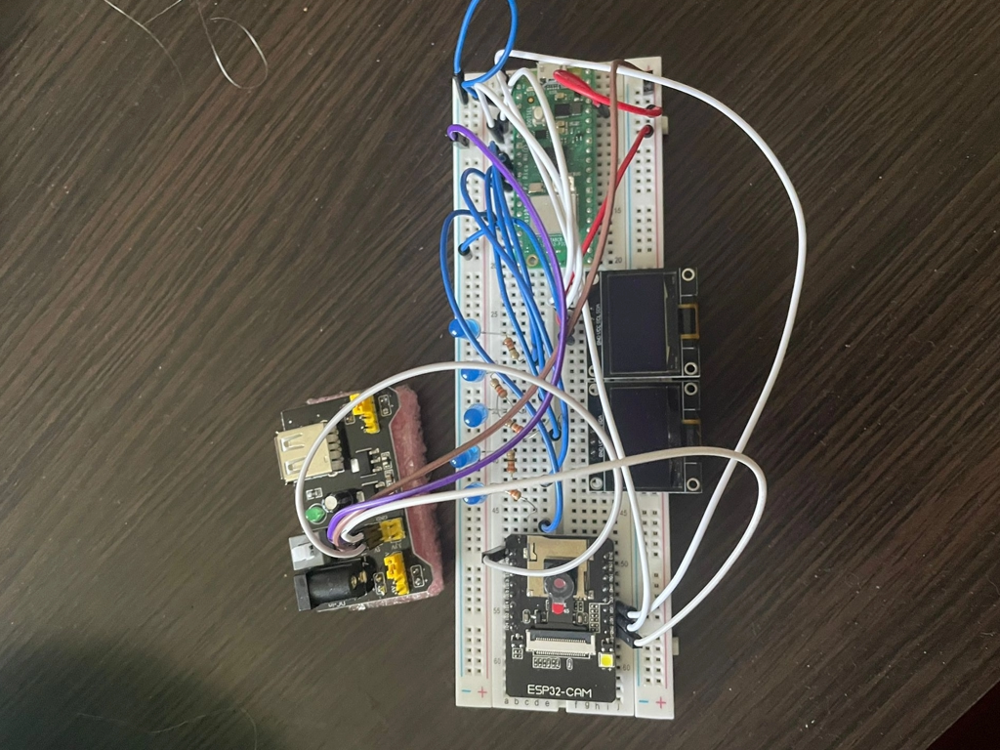
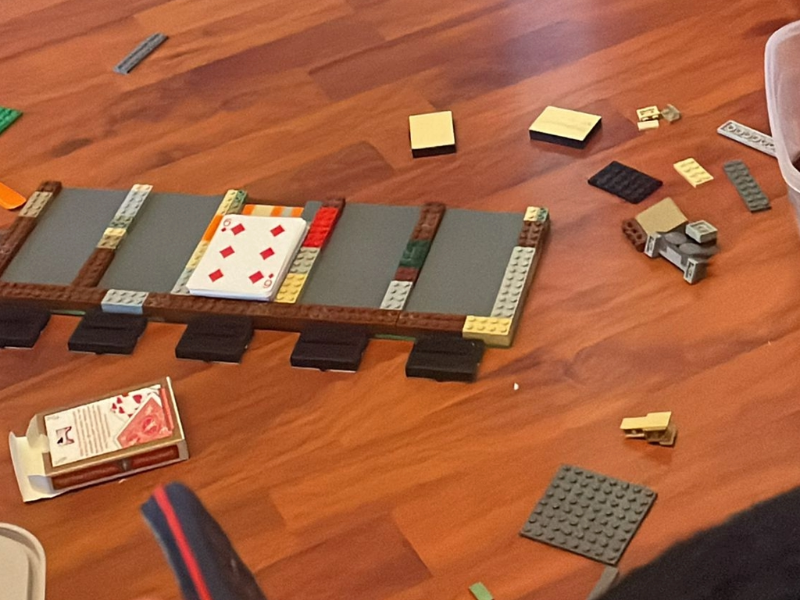
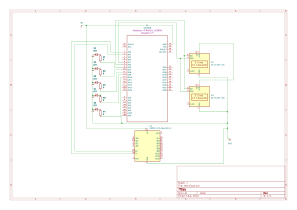
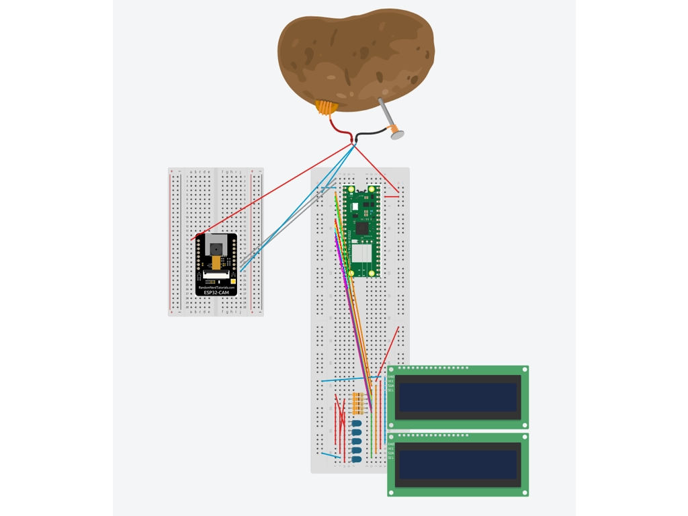

# Poker Hand Identifier
A device that identifies a Poker Hand and computes a score

:::info 

**Author**: Andrei Profir \
**GitHub Project Link**: https://github.com/UPB-PMRust-Students/project-Razapriest

:::

## Description

This device uses a camera to look at a Poker Hand and determine what type of hand it is (Flush, Two Pair, etc.). It also computes a score for the user, based on my criteria. How it works is that a camera will be mounted somehow in a higher position, so it sees a 5-card poker hand, and it uses a pattern-matching algorithm to determine the rank and suit of cards, then sends that information to be computed by the hand detecting logic and for the score to be calculated. Additionally, cards that are considered scoring (so for example, in a Flush, all of them, but in a Pair, only 2 of them) will have asmall Blue LED light up above them and a ding sound be made when their rank is added to the score. I also thought of the scenario where 2 or more hands are detected, so for example, a Full House will always contain a Two Pair, so the algorithm will only take into account the highest scoring hand.

## Motivation

Over the past few weeks, I have been playing a lot of Balatro. It's a video game where you make poker hands and get a score (I know it sounds lame but trust me it won game of the year for a reason). As I was playing it to procrastinate for this project, a brilliant idea came to mind, why don't I build this game in real life? This will be just a prototype, but it will work for a regular deck of cards and will be able to compute a score. To be completely honest, this project isn't really something "useful" in day-to-day life, but it is a very fun concept for me and I'm looking forward to building it, I'm sure people will find it cool.

If I manage to finish what I want to do and I have more time left, I will also add "secret" poker hands that require more than one deck, and maybe I will add something that increases the score if a banana is present near the cards, because that would be really funny.

## Architecture 

The pico is connected to the 5 LEDs and the 2 LCDs (in the picture only 1 LCD is connected) and to the power source. The pico's TX and RX pins io0 and io1 are connected to the esp32-cam's TX and RX pins respectively. Everything is then connected to the power source.


this is what it looks like now


Because my family and I are moving, I did some cleaning up and found old legos, which I decided I can repurpose for this project so I don't 3D print. Turns out the setup I build is the perfect size for playing cards so I was very lucky.

## Log

<!-- write your progress here every week -->

### Week 28 April - 4 May

This week I did research on my idea and made preparations for starting the project. The first thing I did, since components didn't arrive yet, was to try and do the hand and score computation logic. I wrote the code initially in C++, because I am more familiar with that language and I can work on it comfortably, so later on I can translate it to rust and fix any problems that may arise. In the meantime, the components arrived. I made sure I had everything and I looked into how they must be connected and what they can and can't exactly do.

### Week 5 - 11 May

In this week I started work on the hardware. I connected my components, the LEDs, the OLED displays and the camera to test them, as they will be later rearranged on multiple separate breadboards. Pictures of the testing setup will be uploaded, the final setup for the components is yet to be designed because I have to take measurements of the playing cards and determine the height of the camera. Funnily enough, because I don't want to spend money on 3d printing, the project may or may not be built out of legos.

### Week 12 - 18 May

Sadly, I wasn't able to get much work done this week. Because my family and I are moving (very unfortunate timing), and I also had 2 exams, it was very hard to find time to work, but I did manage to build what I had to build out of legos so I saved money on 3d printing. Additionally, I tested all of the hardware components and made sure they all work. Every component is set in stone and is connected correctly, except for the camera, because its position depends on how the software part will go, I have to determine the correct height and position for it to function so that's why it isn't set up yet.

### Week 19 - 25 May

## Hardware

For the hardware, I use a Raspberry Pi Pico WH for convenience-sake, a breadboard, a power source, a couple of wires and adaptors, a buzzer, 5 LEDs with their according resistors, and of course, a camera with a module that gives it the needed compatibility. I will expand on this part of the documentation as I start working on the project and I get more familiar with the hardware.

### Schematics






### Bill of Materials

<!-- Fill out this table with all the hardware components that you might need.

The format is 
```
| [Device](link://to/device) | This is used ... | [price](link://to/store) |

```

-->

| Device | Usage | Price |
|--------|--------|-------|
| [Raspberry Pi Pico WH] | The microcontroller | [56.23 RON] |
| [ESP32 Module with camera] | The camera | [65.93 RON] |
| [Breadboard + Wires + Power Source kit] | The base of the project | [42.23 RON] |
| [USB-TTL UART converter] | Needed for sending data | [6.64 RON] |
| [2x OLED Displays] | The displays | [41.98 RON] |
| [5x LEDs + 5x Resistors] | The LEDs | [2.85 RON] |
| [Piezo Active Buzzer] | Hopefully for a "ding" sound | [4.02 RON] |
| [Extra stuff like wires, adaptors, buttons] | The extras | [18.71 RON] |

All products ordered from ArduShop: https://ardushop.ro/ro/


## Software

| Library | Description | Usage |
|---------|-------------|-------|
| [st7789](https://github.com/almindor/st7789) | Display driver for ST7789 | Used for the display for the Pico Explorer Base |
| [embedded-graphics](https://github.com/embedded-graphics/embedded-graphics) | 2D graphics library | Used for drawing to the display |

Leaving this as default for now, will add when I start working.

## Links

<!-- Add a few links that inspired you and that you think you will use for your project -->

1. [link](https://example.com)
2. [link](https://example3.com)
...
