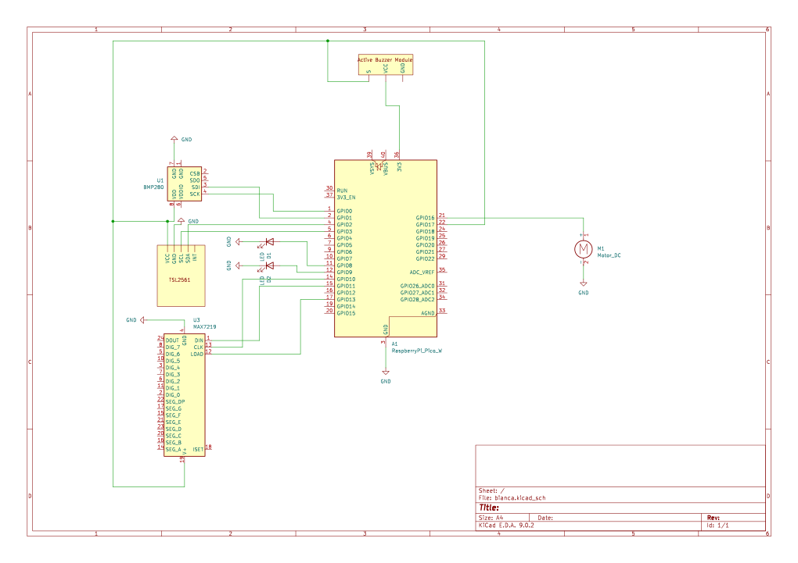
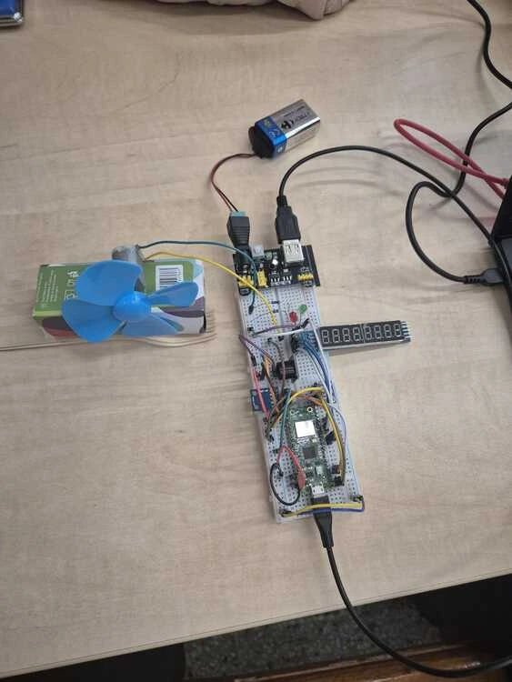
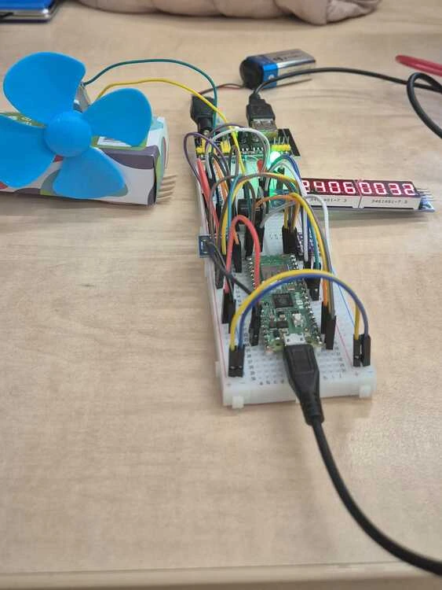
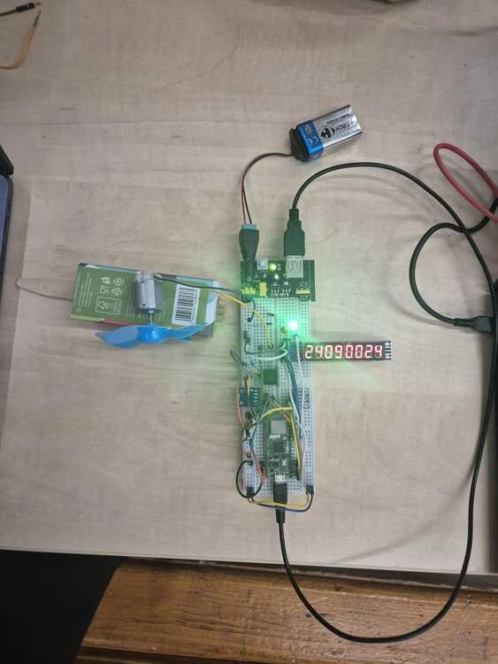

# ClimaControl
Monitors sensors,displays temperature, and controls motor and buzzer based on threshold logic.

:::info

**Author**:Tudor Bianca Elena \
**GitHub Project Link**:https://github.com/UPB-PMRust-Students/project-biancatudor1234

:::

## Description

This smart system keeps track of temperature, light, and a button input, and uses that information to control things like a fan, buzzer, and LEDs, while also showing the temperature and pressure on an LCD screen. It reads data from temperature and light sensors and lets you control some features manually with a button. The 8-segment Display shows the current temperature in real time. The fan can turn on by itself when it gets too hot or when there is too much luminosity . If the temperature gets too high, a buzzer goes off as a warning. There are two LEDs to show what’s going on: green means everything’s okay, and green and red alternating means there’s an alert or problem. The system checks sensors all the time and changes the outputs as they are needed to help keep the environment comfortable.

## Motivation

The motivation behind this project is to create a smart system that makes the environment more comfortable by automatically monitoring and adjusting things like temperature and lighting. I chose this project because having a system that reacts to changes in temperature or light without needing constant input is practical  and efficient. The display is helpful for showing the real-time temperature and pressure, and the fan and buzzer make sure the environment stays just right. It’s designed to make your space adapt to you effortlessly and keep things comfortable.


## Architecture 


 The Raspberry Pi Pico 2W acts as the central controller for all functions. It collects data from sensors and controls all connected components based on programmed logic.

The temperature and light sensors constantly check the surroundings and send updated values to the Raspberry Pi Pico, which then reacts accordingly.

The 8-segment Display is used to display the current temperature and pressure in real time, helping users monitor the environment .

The fan, which runs on a DC motor, is starts automatically once the temperature or luminosity goes above a certain level.

The buzzer works as a warning system and makes a sound when the temperature gets too high, letting users know it’s getting too hot.

There are two LEDs that show what’s going on: the green one lights up when everything is working fine, and the red and green alternating if there is the temperature or luminosity go above the preset level .
## Log

<!-- write every week your progress here -->

### Week 6 - 12 May
 I bought the components needed for the project to make sure I had everything ready to start. Then, I worked on the initial documentation and architecture. I also drew the first version of the KiCad schematic, connecting the components based on my design. After that, I started coding and testing the sensors, buzzer, and LEDs to check that they were working properly and i integrated them in the project.


### Week 7 - 19 May
This week I bought the rest of the components for the project. I finished the circuit design using KICad and completed the architecture of the project. I also built a stand for the DC motor. In addition, I worked on the code for the project, specifically for the screen to display the temperature and pressure.

### Week 20 - 26 May

## Hardware

**Raspberry Pi Pico:**

- Function: It is the main control unit. It manages and controls all connected components, such as sensors, the fan, buzzer, LEDs, and the 8-segment display based on the data it receives.
- Connection:
**For 8-segment display :**

- **SPI1:**
   - **CLK**: Connected to PIN_10
   - **MOSI**: Connected to PIN_11
   - **MISO**: Connected to PIN_12
   - **CS**: Connected to PIN_13

   **For TSL2561 Sensor:**
- **I2C1:** 
    - **SDA**: Connected to PIN_2
    - **SCL**: Connected to PIN_3

**For BMP280 Sensor:**
- **I2C0:** 
    - **SDA**: Connected to PIN_0.
    - **SCL**: Connected to PIN_1.

- **GPIO:**

**For Buzzer**: Connected to PIN_17

**Green LED**: Connected to PIN_9 

**Red LED**: Connected to PIN_8 

**DC Motor Control**: Connected to PIN_16 

**Light Sensor:**

- Function: To detect ambient light levels. Sends light readings to the Pico, which can use this data to influence system behavior (like adjusting LED indicators).
- Connection:
    - VCC: is connect to the 3.3V pin on the Raspberry Pi Pico W.
    - GND: is connect to a GND on the Raspberry Pi Pico W.
    - SCL: is connect to PIN_3 .
    - SDA: is connect to PIN_2 .

**Temperature Sensor:**

- Function: It masures the surrounding temperature. Continuously sends temperature data to the Raspberry Pi Pico, which uses the information to decide when to activate other components.
- Connection:
    - VCC: is connected to the 3.3V pin on the Raspberry Pi Pico W.
    - GND: is connected to GND on the Raspberry Pi Pico W.
    - SCL: is connected to PIN_1 .
    - SDA: is connected to PIN_0 .

**DC Motor with Fan:**

- Function: It cools the system when it's too hot. Turns on automatically when the temperature passes a certain threshold or manually through the button.
- Connection: The DC motor itself is powered by an external power supply. The motor's power leads are connected to the output of the transistor or motor driver, which is switched on or off based on the signal received from PIN_16.

**Active Buzzer:**

- Function: It provides a sound alert. Beeps when the temperature is too high to warn the user of overheating.
- Connection: The control signal comes from PIN_17 of the Raspberry Pi Pico W. The other pin is connected to Ground.

**Green and Red LEDs:**

- Function: It shows system status. The green LED lights up during normal operation, while the red and green alternating LEDs turn on when there’s an alert or issue.
- Connection:
    - The anodes of the Red LED connect to PIN_8 through a resistor.
    - The anodes  of the Green LED connect to PIN_9 through a resistor.
    - The cathodes of both LEDs connect to Ground.

**8-Segment Display:**

- Function: It displays sensor data. Shows the current temperature and pressure in real time so the user can easily monitor the environment.
- Connection:
    - CLK: Connect PIN_10 of the Raspberry Pi Pico W .
    - MOSI: Connect PIN_11 of the Raspberry Pi Pico W .
    - MISO: Connect PIN_12 of the Raspberry Pi Pico W .
    - CS: Connect PIN_13 of the Raspberry Pi Pico W .

### Schematics








### Bill of Materials

<!-- Fill out this table with all the hardware components that you might need.

The format is 
```
| [Device](link://to/device) | This is used ... | [price](link://to/store) |

```

-->

| Device | Usage | Price |
|--------|--------|-------|
| [Raspberry Pi Pico W](https://www.raspberrypi.com/documentation/microcontrollers/raspberry-pi-pico.html) | The microcontroller | [35 RON](https://www.optimusdigital.ro/en/raspberry-pi-boards/12394-raspberry-pi-pico-w.html) |
| [Breadboard Power Supply](https://www.petervis.com/Raspberry_PI/Breadboard_Power_Supply/YwRobot_Breadboard_Power_Supply.html#google_vignette) | The Power Supply | [4,69 RON](https://www.optimusdigital.ro/en/linear-regulators/61-breadboard-source-power.html?search_query=0104110000002679&results=1&srsltid=AfmBOor9VtBXCyWJevIqgevPbgVKbiAlpTl7tL3UWr57rohbJQh2xnxr) |
| [Modul cu Driver de Motoare Dual L298N Rosu](https://www.optimusdigital.ro/ro/index.php?controller=attachment&id_attachment=152) | Motor Driver | [10,99 RON](https://www.optimusdigital.ro/ro/drivere-de-motoare-cu-perii/145-driver-de-motoare-dual-l298n.html?srsltid=AfmBOoqmT8gGRo4iluTbxuk4dE3rM2PnIkjKcga6MsK_L60B8pugYWo2) |
| [BMP280 Sensor](https://www.bosch-sensortec.com/media/boschsensortec/downloads/datasheets/bst-bmp280-ds001.pdf) |The Temperature and Humidity Sensor DHT11 | [7,99 RON](https://www.optimusdigital.ro/ro/senzori-senzori-de-temperatura/99-senzor-de-temperatura-si-si-umiditate-dht11.html) |
| [TSL2561 Sensor](https://www.optimusdigital.ro/ro/index.php?controller=attachment&id_attachment=153) | The Light Intensity Sensor| [22,99 RON](https://www.optimusdigital.ro/ro/senzori-senzori-optici/137-senzor-de-intensitate-a-luminii.html?srsltid=AfmBOopz1MuPQmPbwi9C5XZOeea1_XHs8g2dri5P-N6eX71JzQnJSa-L) |
| [MAX7219 8-Digit LED Display](https://www.plusivo.ph/index.php?controller=attachment&id_attachment=236) | Display | [9,99 RON](https://www.optimusdigital.ro/en/led-displays/1287-display-led-cu-8-cifre-max7219.html?srsltid=AfmBOoqY8gCNAsJnaFbp30I2PDShnUiALcMPw_PGNOiijFUtsAILSLwJ) |
| [400p HQ Breadboard](https://www.optimusdigital.ro/en/index.php?controller=attachment&id_attachment=154) | Breadboard HQ | [4,56 RON](https://www.optimusdigital.ro/en/breadboards/44-400p-hq-breadboard.html?srsltid=AfmBOoqg3MDMrpWxcCCuHwvpYrM0l0cTP6qW6kChtPMGm7a3Gbx9EXgJ) |
| PCB-Mounted Active Buzzer | The Buzzer | [4,98 RON](https://www.optimusdigital.ro/ro/audio-buzzere/12513-pcb-mounted-active-buzzer-module.html?srsltid=AfmBOoo31dmi9iEmQ4DyndxsAMQYga40tSci0xJM77xUFB6wqa5n562n) |
| Blue Propeller 80 mm | Propeller | [1,99 RON](https://www.optimusdigital.ro/ro/mecanica-elice/421-elice-albastra-de-80-mm.html?srsltid=AfmBOorN0X5Y28Xs4CQ-jALFwjbKnHUxQdZL_mrtM3JGe-6CbaXlbfmN) |
| 15000 RPM Motor | DC Motor | [4,99 RON](https://www.optimusdigital.ro/en/others/1197-motor-15000-rpm.html?srsltid=AfmBOoqIcBKaKZM5kzDnI1e9sZKvjME4cJQHlL_58H2s0VZI7rB5ku_C) |
| LEDS | LED with Diffused Lens | [0,80 RON](https://www.optimusdigital.ro/ro/optoelectronice-led-uri/697-led-verde-de-3-mm-cu-lentile-difuze.html?search_query=led&results=778) |
| DC Power Male Connector with Locking 2.1/5.5 mm | Male Power Plug | [0,99 RON](https://www.optimusdigital.ro/ro/conectori/7440-mufa-alimentare-tata-cu-prindere-2155.html?srsltid=AfmBOorepA92CUVsLJR854RhBATtMPYxpU4r0XOHojXvRoX9DjkniWCd) |
| 9V Battery Holder | Bttery Holder | [1,29 RON](https://www.optimusdigital.ro/ro/suporturi-de-baterii/20-conector-pentru-baterie-de-9-v.html?srsltid=AfmBOooABPmH-X0hZnJXKllkOcd9ttBL2RUlQMMSRqhOjPZ4M9-qFL5P) |


## Software

| Library | Description | Usage |
|---------|-------------|-------|
| [embassy-rp](https://github.com/embassy-rs/embassy/tree/main/embassy-rp) | RP2040 Peripherals | Used for accessing the peripherals|
| [embedded-graphics](https://github.com/embedded-graphics/embedded-graphics) | 2D graphics library | Used for drawing to the display |

## Links

<!-- Add a few links that inspired you and that you think you will use for your project -->

1. [Connect BMP280 to Raspberry Pi Pico/Pico W - Measure Temperature and Atmospheric Pressure](https://www.youtube.com/watch?v=XSfjpErsxfs)
2. [Raspberry Pi Pico Temperature Controlled](https://www.youtube.com/watch?v=8kfROSQYDWI)
...
