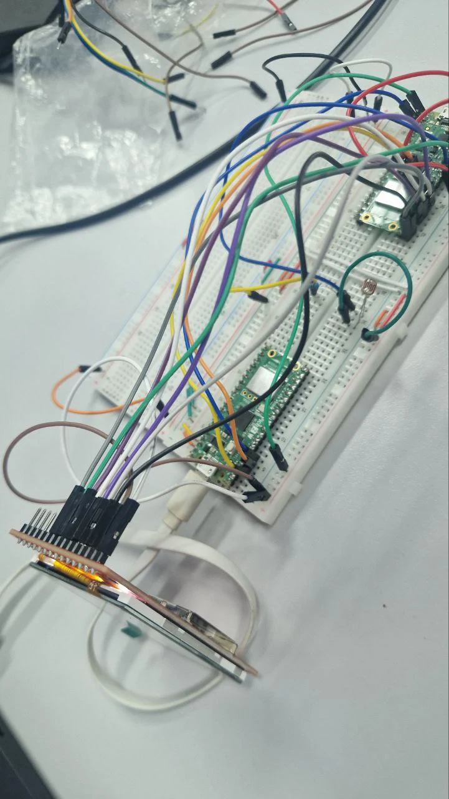
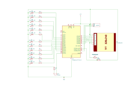

# Smart Station
An ambient-aware music controller built on Raspberry Pi Pico W using embedded Rust. 

:::info

**Author**: Daria Gladkykh \
**GitHub Project Link**: [Smart Station on GitHub](https://github.com/UPB-PMRust-Students/project-YrHoup)

:::

## Description

Smart Station is an IoT music controller that adjusts playback based on ambient light, includes alarm features.

## Motivation

This project was chosen to explore embedded Rust for IoT applications, combining sensor-driven automation with an interactive user interface to create a practical, engaging device.

# Architecture

The Smart Station consists of the following main components:
- **Sensor Processing**:  
  Handles input from the light sensor (LDR) to detect ambient brightness and trigger actions.
- **User Interface**:  
  Integrates an OLED screen configured as an Equalizer display for visual feedback. It also includes a joystick and buttons for music playback control.
- **Playback Control**:  
  Coordinates music playback from a connected PC, integrating sensor data and user inputs for volume and track control.
- **Visual Feedback**:  
  Drives an RGB LED to indicate system status and provides music-synced visuals on the OLED Equalizer screen.
- **Time Management**:  
  Uses LEDs to display time in binary format, utilizing an RTC module for accurate timekeeping.  
  Additionally, includes a buzzer for periodic alarms (e.g., every 45 minutes) to remind users to take breaks.

**Connections**:
- The Sensor Processing component feeds brightness data to the Playback Control.
- The User Interface sends user commands (play, pause, etc.) to the Playback Control and queries the Time Management for clock/alarm data.
- The Playback Control updates the Visual Feedback component to reflect playback status.
- The Time Management component triggers the Playback Control for scheduled alarms.

## Log

### Week 5 - 11 May
What was already done:

- Set up Raspberry Pi Pico W with Rust toolchain.
- Configured GPIO for light sensor and RGB LED.
- Initial testing of LDR sensor for ambient light detection.

### Week 12 - 18 May
Initially, I planned to use the OLED screen as a standalone control station for the Smart Station. However, I encountered persistent issues with the screen's firmware—specifically, it continuously mirrored all output. Due to these limitations, I decided to repurpose the OLED solely as a visual equalizer display.

To achieve this, I used pre-processed audio data (converted into frequency slices using Rust) and mapped it to graphical bars on the OLED screen. I utilized the minifb crate for initial testing and the SSD1306 driver for actual rendering on the screen.

I now plan to incorporate binary clocks (using LEDs), a buzzer for periodic reminders, and a joystick with buttons to reintroduce the interactivity that the screen was initially intended to provide.

The equalizer has been tested with one audio track and is currently displaying frequency bands accurately. I aim to expand this to support around five compositions, broadening the use case of my Smart Station prototype and enhancing the user experience.

### Week 19 - 25 May
What I have done:
- Changed the display configuration with .command(Command::MemoryAccessControl, &[0x64]) to fix the mirroring issue.

- Finalized playback interaction logic using joystick and buttons.

- Added buzzer functionality with RTC-based scheduling (e.g., every 60 minutes as a reminder).

- Implemented binary clock using LEDs.

- Optimized OLED equalizer display and added the digital and numerical translation for the binary clocks from board.

- Integrated and tested joystick/button controls for volume and track navigation.

- Completed the website's simple logic and stored all MP3 files there.

- Unified all separate tasks into a single main.rs file, managing asynchronous work in Rust.

- Created the final look of the Smart Station prototype, ready for real-life testing.

## Hardware

The Smart Station uses a Raspberry Pi Pico W, OLED , light sensor, RGB LED, and RTC module for a responsive music control system.

### Schematics

### Bill of Materials

| Device                        | Quantity | Price (RON) |
|------------------------------|----------|-------------|
| [Raspberry Pi Pico W](https://www.optimusdigital.ro/ro/placi-raspberry-pi/13327-raspberry-pi-pico-2-w.html?search_query=pico+2w&results=33) | 3        | 120         |
| [TFT SPI Display ST7789V](https://www.emag.ro/display-tft-spi-2-4-inch-240x320-lcd-cu-touchscreen-driver-st7789v-arduino-emg178/pd/DXZMBSYBM/?ref=history-shopping_420684583_221614_1)      | 1        | 70          |
| [Light sensor (LDR)](https://www.sparkfun.com/products/9088)           | 1        | 10          |
| [Kit with LEDs, buttons, etc.](https://www.emag.ro/set-componente-electronice-breadboard-830-puncte-led-uri-compatibil-arduino-si-raspberry-pi-zz00044/pd/DRXG4XYBM/?ref=history-shopping_416665605_197770_1) | 1        | 60          |
| [RGB LED](https://www.adafruit.com/product/159)                      | 1        | 5           |
| [Jumper wires (various sets)](https://www.adafruit.com/product/1956)  | 1        | 40          |
| [Breadboards](https://www.optimusdigital.ro/)                 | 3        | 35          |
| **Total**                    |          | **340 RON** |

## Software

| Library | Description | Usage |
|---------|-------------|-------|
| [embedded-hal](https://github.com/rust-embedded/embedded-hal) | Hardware abstraction layer | Interfaces for GPIO, ADC, I2C, SPI |
| [rp2040-hal](https://github.com/rp-rs/rp2040-hal) | RP2040-specific HAL | Low-level Pico W peripheral access |
| [ssd1306](https://github.com/jamwaffles/ssd1306) | OLED display driver | Renders UI on SSD1306 OLED |
| [ds3231](https://crates.io/crates/ds3231) | RTC module driver | Timekeeping and alarm functionality |
| [fugit](https://github.com/rust-embedded/fugit) | Time-keeping utility | Precise timing for RTC and alarms |
| [embedded-graphics](https://github.com/embedded-graphics/embedded-graphics) | 2D graphics library | Draws UI elements on OLED |
| [rppal](https://github.com/golemparts/rppal) | Raspberry Pi Peripheral Access | GPIO and sensor communication |
| [cortex-m-rt](https://github.com/rust-embedded/cortex-m-rt) | ARM Cortex-M runtime | Interrupt handling and scheduling |
| [embassy-lab-utils](https://github.com/embassy-rs/embassy) | Custom utility library | Project-specific utilities |
| [embassy-embedded-hal](https://github.com/embassy-rs/embassy) | Embedded HAL for Embassy | Async interfaces for peripherals |
| [embassy-sync](https://github.com/embassy-rs/embassy) | Synchronization primitives | Async task coordination |
| [embassy-executor](https://github.com/embassy-rs/embassy) | Async executor for Embassy | Task scheduling and execution |
| [embassy-futures](https://github.com/embassy-rs/embassy) | Future utilities for Embassy | Async operation support |
| [embassy-time](https://github.com/embassy-rs/embassy) | Time management for Embassy | Precise timing for async tasks |
| [embassy-rp](https://github.com/embassy-rs/embassy) | RP2350-specific HAL | Low-level RP2350 peripheral access |
| [embassy-usb](https://github.com/embassy-rs/embassy) | USB device support | USB communication for playback |
| [embassy-net](https://github.com/embassy-rs/embassy) | Network stack | Network connectivity for WiFi |
| [embassy-net-wiznet](https://github.com/embassy-rs/embassy) | Wiznet network driver | Ethernet support for networking |
| [embassy-usb-logger](https://github.com/embassy-rs/embassy) | USB logging utility | Debugging over USB |
| [log](https://crates.io/crates/log) | Logging facade | General logging support |
| [cyw43](https://github.com/embassy-rs/embassy) | WiFi chip driver | WiFi functionality for Pico W |
| [cyw43-pio](https://github.com/embassy-rs/embassy) | PIO-based WiFi driver | Low-level WiFi communication |
| [defmt](https://github.com/knurling-rs/defmt) | Efficient logging for embedded | Lightweight debug logging |
| [defmt-rtt](https://github.com/knurling-rs/defmt) | RTT backend for defmt | Real-time debug output |
| [fixed](https://crates.io/crates/fixed) | Fixed-point arithmetic | Precise calculations |
| [fixed-macro](https://crates.io/crates/fixed-macro) | Macros for fixed-point | Simplified fixed-point operations |
| [serde](https://serde.rs/) | Serialization/deserialization | Data handling for configuration |
| [serde-json-core](https://crates.io/crates/serde-json-core) | JSON serialization | Compact JSON processing |
| [panic-probe](https://crates.io/crates/panic-probe) | Panic handler for probe-run | Error handling for debugging |
| [display-interface](https://crates.io/crates/display-interface) | Display interface abstraction | Generic display communication |
| [display-interface-spi](https://crates.io/crates/display-interface-spi) | SPI display interface | SPI-based display communication |
| [mipidsi](https://crates.io/crates/mipidsi) | Generic TFT display driver | TFT display support |
| [heapless](https://crates.io/crates/heapless) | Heapless allocator | Static memory allocation |
| [embedded-hal-1](https://crates.io/crates/embedded-hal-1) | Blocking embedded HAL | Blocking peripheral interfaces |
| [embedded-hal-async](https://crates.io/crates/embedded-hal-async) | Async embedded HAL | Async peripheral interfaces |
| [embedded-hal-bus](https://crates.io/crates/embedded-hal-bus) | Bus sharing utilities | SPI/I2C bus sharing |
| [embedded-io-async](https://crates.io/crates/embedded-io-async) | Async IO traits | Async IO operations |
| [static_cell](https://crates.io/crates/static_cell) | Static cell for runtime init | Safe static initialization |
| [embedded-storage](https://crates.io/crates/embedded-storage) | Non-volatile storage traits | Storage access |
| [rand](https://crates.io/crates/rand) | Random number generators | Random number generation |
| [embedded-sdmmc](https://crates.io/crates/embedded-sdmmc) | FAT filesystem for SD cards | SD card file access |
| [byte-slice-cast](https://crates.io/crates/byte-slice-cast) | Safe byte slice casting | Type conversions |
| [itoa](https://crates.io/crates/itoa) | Integer to string conversion | String formatting |
| [micromath](https://crates.io/crates/micromath) | Lightweight math utilities | Math operations |
| [ili9341](https://crates.io/crates/ili9341) | ILI9341 display driver | TFT display rendering |

## Links

1. [Rust Embedded Book](https://docs.rust-embedded.org/book/) - Guide for embedded Rust development.
2. [Raspberry Pi Pico W Documentation](https://www.raspberrypi.com/documentation/microcontrollers/) - Official Pico W reference.
3. [Embedded Graphics Documentation](https://docs.rs/embedded-graphics/) - Resource for UI rendering.
4. [Probe-rs](https://probe.rs/) - Tooling for flashing and debugging Rust firmware.
5. [Embassy-rs](https://github.com/embassy-rs/embassy) - Async runtime and drivers for embedded Rust.
6. [Defmt](https://github.com/knurling-rs/defmt) - Efficient logging framework for embedded systems.
7. [ILI9341-rs](https://crates.io/crates/ili9341) - Custom ILI9341 display driver.
8. [Serde](https://serde.rs/) - Serialization/deserialization framework.
9. [Rand](https://crates.io/crates/rand) - Random number generation library.
10. [Embedded HAL](https://github.com/rust-embedded/embedded-hal) - Hardware abstraction layer for embedded systems.
11. [Embedded Storage](https://github.com/rust-embedded/embedded-storage) - Non-volatile storage traits.